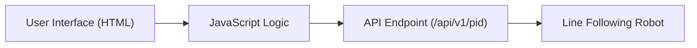
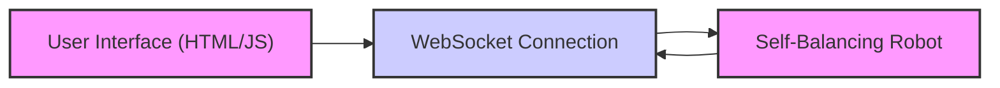
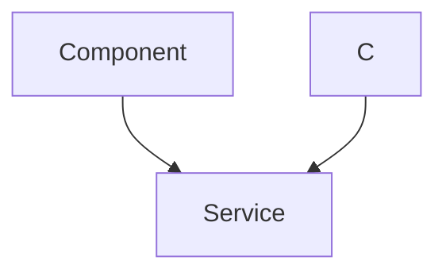

# Web Interface

This document details the web interfaces used for tuning the line following and self-balancing robots within the Wall-E project. These interfaces provide a user-friendly way to adjust PID parameters and monitor sensor data in real-time, facilitating optimal performance tuning.

## Line Following Web Interface

The line following robot's web interface is located in `6_line_following/frontend/index.html`. It offers a straightforward interface for adjusting the proportional (Kp), integral (Ki), and derivative (Kd) gains of the PID controller.

### Key Features

*   **Real-time PID Tuning:** Adjust Kp, Ki, and Kd values via input fields and increment/decrement buttons.
*   **Dynamic Updates:** Changes are immediately sent to the robot, allowing for iterative tuning.
*   **Simple HTML Structure:** Easy to understand and modify.

### Code Snippets

**1. HTML Structure for PID Parameter Input:**

```html
<div class="button-group">
  <h3>Kp</h3>
  <button>&lt;</button>
  <input type="number" value="0.000" id="kp" />
  <button>&gt;</button>
</div>
```

This snippet demonstrates the HTML structure for a single PID parameter (Kp). It includes a label, decrement and increment buttons, and an input field for entering the value. [View on GitHub](https://github.com/SRA-VJTI/Wall-E/blob/master/6_line_following/frontend/index.html)

**2. JavaScript for Sending PID Values:**

```javascript
function submitVals() {
  const data = {};
  data["kp"] = parseFloat(document.getElementById("kp").value);
  data["ki"] = parseFloat(document.getElementById("ki").value);
  data["kd"] = parseFloat(document.getElementById("kd").value);
  let finaldata = JSON.stringify(data);
  console.log(finaldata);

  let xhr = new XMLHttpRequest();
  let url = "/api/v1/pid";
  xhr.open("POST", url, true);
  xhr.setRequestHeader("Content-Type", "application/json");

  xhr.onreadystatechange = function () {
    if (xhr.readyState === 4) {
      if (xhr.status == 400) {
        console.log("Success!");
      } else {
        console.log(xhr.status);
      }
    }
  };

  xhr.send(finaldata);
}
```

This JavaScript function collects the Kp, Ki, and Kd values from the input fields, packages them into a JSON object, and sends them to the robot's API endpoint using an XMLHttpRequest. [View on GitHub](https://github.com/SRA-VJTI/Wall-E/blob/master/6_line_following/frontend/index.html)

**3. Event Listeners for Input Fields:**

```javascript
let inpArray = document.querySelectorAll("input[type='number']");
for (let i = 0; i < inpArray.length; i++) {
  inpArray[i].addEventListener("change", submitVals);
}
```

This code adds an event listener to each input field, triggering the `submitVals` function whenever the value is changed. [View on GitHub](https://github.com/SRA-VJTI/Wall-E/blob/master/6_line_following/frontend/index.html)

**4. Increment/Decrement Button Logic:**

```javascript
function decrementVal(e) {
  let test = e.target.parentNode.children[2].value;
  if (!isNaN(Number(test))) {
    e.target.parentNode.children[2].value = String(
      (Number(test) - 0.01).toFixed(3)
    );
    submitVals();
  } else {
    e.target.parentNode.children[2].value = "0.000";
  }
}
```

This function handles the decrement button's functionality. It retrieves the current value from the input field, decrements it by 0.01, updates the input field, and calls `submitVals` to send the updated value to the robot. [View on GitHub](https://github.com/SRA-VJTI/Wall-E/blob/master/6_line_following/frontend/index.html)

### Frontend Architecture





This diagram illustrates the flow of data from the user interface to the line following robot.

## Self-Balancing Web Interface

The self-balancing robot's web interface, found in `7_self_balancing/frontend/index.html`, provides a more comprehensive set of tools for tuning the robot. It includes real-time graphing of sensor data and input fields for adjusting PID parameters and offsets.

### Key Features

*   **Real-time Data Visualization:** Charts display X, Y, and Z acceleration, as well as roll, and pitch.
*   **WebSocket Communication:**  Uses WebSockets for efficient, real-time data transfer between the robot and the web interface.
*   **Comprehensive PID Control:**  Allows for adjustment of Kp, Ki, Kd, Setpoint, and Offset.

### Code Snippets

**1. WebSocket Initialization:**

```javascript
 var websocket = new WebSocket("ws://" + location.hostname + "/");
```

This JavaScript code initializes a WebSocket connection to the robot.  The `location.hostname` ensures that the connection is made to the same host serving the web page. [View on GitHub](https://github.com/SRA-VJTI/Wall-E/blob/master/7_self_balancing/frontend/index.html)

**2. Functions for Sending Data via WebSocket:**

```javascript
function send_Text_kp(text) {
  websocket.send("P" + text);
}
function send_Text_kd(text) {
  websocket.send("D" + text);
}
function send_Text_ki(text) {
  websocket.send("I" + text);
}
```

These functions are used to send PID parameters to the robot via the WebSocket connection. Each function prepends a character ('P', 'D', 'I') to the value to identify the parameter being sent. [View on GitHub](https://github.com/SRA-VJTI/Wall-E/blob/master/7_self_balancing/frontend/index.html)

**3. Chart Configuration (Example for X Acceleration):**

```javascript
 var xAccelChartInstance = new Chart(xAccelChart, {
        type: "line",
        data: {
          datasets: [
            {
              label: "X Acceleration",
              fill: false,
              borderColor: "#FFF",
              borderWidth: 2,
              fontColor: "#FFF",
            },
          ],
        },
        options: Object.assign({}, commonOptions, {
          title: {
            display: true,
            text: "P-TERM",
            fontSize: 18,
            fontFamily: "Oswald",
            fontColor: "#FFF",
          },
          elements: {
            point: {
              radius: 0,
            },
          },
        }),
        scales: {
          xAxes: [
            {
              type: "time",
              time: {
                displayFormats: {
                  millisecond: "S",
                },
              },
              gridLines: { color: "#FFF" },
            },
          ],
          yAxes: [
            {
              ticks: {
                suggestedMin: -50, // minimum will be 0, unless there is a lower value.
                suggestedMax: 50, // maximum will be
              },
              gridLines: { color: "#FFF" },
            },
          ],
        },
        legend: { display: false },
        tooltips: {
          enabled: false,
        },
      });
```

This code configures a Chart.js line chart to display X acceleration data. It sets the chart type, data, options (including scales, title, and point styles), and updates the chart with new data as it arrives via WebSocket. [View on GitHub](https://github.com/SRA-VJTI/Wall-E/blob/master/7_self_balancing/frontend/index.html)

**4. Adding Data to the Charts:**

```javascript
function addData(data) {
        console.log(data);
        var new_data = data
          .split(",")
          .filter((x) => x.trim().length && !isNaN(x))
          .map(Number);
        var new_data_1 = data.split(",");
        var temp = new_data_1[4];
        temp = temp.replace(/\D/g, "");
        temp = parseInt(temp, 10);
        data = new_data.concat(temp);
        console.log(data[0]);
        console.log(data[1]);
        console.log(data[2]);
        console.log(data[3]);
        console.log(data[4]);

        if (data) {
          xAccelChartInstance.data.labels.push(new Date());
          xAccelChartInstance.data.datasets.forEach((dataset) => {
            dataset.data.push(data[0]);
          });
          yAccelChartInstance.data.labels.push(new Date());
          yAccelChartInstance.data.datasets.forEach((dataset) => {
            dataset.data.push(data[1]);
          });
          zAccelChartInstance.data.labels.push(new Date());
          zAccelChartInstance.data.datasets.forEach((dataset) => {
            dataset.data.push(data[2]);
          });
          rollChartInstance.data.labels.push(new Date());
          rollChartInstance.data.datasets.forEach((dataset) => {
            dataset.data.push(data[3]);
          });
          pitchChartInstance.data.labels.push(new Date());
          pitchChartInstance.data.datasets.forEach((dataset) => {
            dataset.data.push(data[4]);
          });

          if (updateCount > numberElements) {
            xAccelChartInstance.data.labels.shift();
            xAccelChartInstance.data.datasets[0].data.shift();
            yAccelChartInstance.data.labels.shift();
            yAccelChartInstance.data.datasets[0].data.shift();
            zAccelChartInstance.data.labels.shift();
            zAccelChartInstance.data.datasets[0].data.shift();
            rollChartInstance.data.labels.shift();
            rollChartInstance.data.datasets[0].data.shift();
            pitchChartInstance.data.labels.shift();
            pitchChartInstance.data.datasets[0].data.shift();
          } else updateCount++;
          xAccelChartInstance.update();
          yAccelChartInstance.update();
          zAccelChartInstance.update();
          rollChartInstance.update();
          pitchChartInstance.update();
        }
      }
```

This function parses the data received from the WebSocket, extracts the X, Y, and Z acceleration, roll, and pitch values, and adds them to the corresponding charts. It also manages the chart's data length to maintain a rolling window of data. [View on GitHub](https://github.com/SRA-VJTI/Wall-E/blob/master/7_self_balancing/frontend/index.html)

### Frontend Architecture





This diagram shows the architecture of the self-balancing robot's web interface, highlighting the use of WebSockets for two-way communication.

### User Input Flow





This sequence diagram illustrates the user interaction flow, from entering PID values to visualizing sensor data.

## Key Integration Points

*   **API Endpoints:**  The line following robot uses a REST API (`/api/v1/pid`) to receive PID parameters. This endpoint should be well-documented and handle data validation.
*   **WebSocket Handling:** The self-balancing robot uses WebSockets for real-time communication. The robot's firmware needs to handle WebSocket connections and data parsing efficiently.
*   **Data Parsing:** Both interfaces require careful data parsing and validation to ensure that the robot receives correct and safe parameter values.
*   **Error Handling:** Implement robust error handling to gracefully manage invalid inputs or communication failures.

## Best Practices

*   **Input Validation:** Always validate user inputs on both the client-side (web interface) and server-side (robot firmware) to prevent errors and security vulnerabilities.
*   **Rate Limiting:** Implement rate limiting on API endpoints and WebSocket connections to prevent abuse and ensure system stability.
*   **Clear Documentation:** Provide clear documentation for all API endpoints and communication protocols.
*   **User-Friendly Interface:** Design the web interface to be intuitive and easy to use, with clear labels and helpful feedback.
```