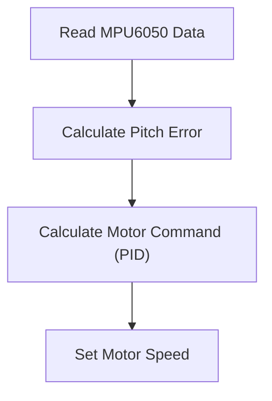

 # Self Balancing - Embedded Code

This section details the embedded C code responsible for achieving self-balancing on the robot. It covers the main balancing task, PID control implementation, and the necessary communication setup via Wi-Fi for real-time tuning.

## Components Overview

The core of the self-balancing logic resides within `self_balancing.c`. This file handles sensor data acquisition, PID calculations, and motor control. Supporting functionalities, such as Wi-Fi communication and websocket handling for parameter tuning, are implemented in `wifi_handler.c` and `tuning_websocket_server.c`, respectively.

### `self_balancing.c`
This file contains the main balancing task (`balance_task`), which is responsible for reading sensor data from the MPU6050, calculating the necessary motor commands based on the PID algorithm, and controlling the motors to maintain balance.

### `wifi_handler.c`
This file contains functions for connecting to a Wi-Fi network. It uses the ESP-IDF Wi-Fi libraries to establish a connection to the specified SSID and password.

### `tuning_websocket_server.c`
This file handles the websocket server that allows for real-time tuning of the PID constants. It receives data from a client, updates the PID constants, and sends data back to the client for plotting graphs.

## Core Balancing Logic

The `calculate_motor_command` function is central to the balancing algorithm. It takes the pitch error as input and calculates the necessary motor commands to correct the robot's orientation. This function implements a PID controller to achieve stable balancing.

```c
// File: 7_self_balancing/main/self_balancing.c
void calculate_motor_command(const float pitch_error, float *motor_cmd)
{
	static float prev_pitch_error = 0.0f;
	static float pitch_area = 0.0f;
	float pitch_error_difference = 0.0f;

	float pitch_correction = 0.0f, absolute_pitch_correction = 0.0f;
	float pitch_rate = 0.0f;

	float P_term = 0.0f, I_term = 0.0f, D_term = 0.0f;

	pitch_error_difference = pitch_error - prev_pitch_error;
	pitch_area += (pitch_error);
	pitch_rate = pitch_error_difference;

	P_term = read_pid_const().kp * pitch_error;
	I_term = read_pid_const().ki * bound(pitch_area, -MAX_PITCH_AREA, MAX_PITCH_AREA);
	D_term = read_pid_const().kd * bound(pitch_rate, -MAX_PITCH_RATE, MAX_PITCH_RATE);

	pitch_correction = P_term + I_term + D_term;

	absolute_pitch_correction = fabsf(pitch_correction);

	*motor_cmd = bound(absolute_pitch_correction, 0, MAX_PITCH_CORRECTION);
	prev_pitch_error = pitch_error;
}
```

This snippet shows the PID calculation, integrating proportional, integral, and derivative terms to generate a correction value. The `bound` function limits the integral and derivative terms to prevent windup and ensure stability. [View on GitHub](https://github.com/SRA-VJTI/Wall-E/blob/main/7_self_balancing/main/self_balancing.c#L31-L62)

### Data Flow in `balance_task`





## Wi-Fi and Websocket Communication
The robot utilizes Wi-Fi to establish a websocket connection, allowing real-time parameter tuning and data visualization.

### Wi-Fi Initialization
The `wifi_init_sta` function configures the ESP32 as a station and connects to the specified Wi-Fi network.

```c
// File: 7_self_balancing/main/wifi_handler.c
void wifi_init_sta(void)
{
    s_wifi_event_group = xEventGroupCreate();

    ESP_ERROR_CHECK(esp_netif_init());

    esp_netif_create_default_wifi_sta();

    wifi_init_config_t cfg = WIFI_INIT_CONFIG_DEFAULT();
    ESP_ERROR_CHECK(esp_wifi_init(&cfg));

    esp_event_handler_instance_t instance_any_id;
    esp_event_handler_instance_t instance_got_ip;
    ESP_ERROR_CHECK(esp_event_handler_instance_register(WIFI_EVENT,
                                                        ESP_EVENT_ANY_ID,
                                                        &event_handler,
                                                        NULL,
                                                        &instance_any_id));
    ESP_ERROR_CHECK(esp_event_handler_instance_register(IP_EVENT,
                                                        IP_EVENT_STA_GOT_IP,
                                                        &event_handler,
                                                        NULL,
                                                        &instance_got_ip));

    wifi_config_t wifi_config = {
        .sta = {
            .ssid = WIFI_SSID,
            .password = WIFI_PASS,
	     .threshold.authmode = WIFI_AUTH_WPA2_PSK,

            .pmf_cfg = {
                .capable = true,
                .required = false
            },
        },
    };
    ESP_ERROR_CHECK(esp_wifi_set_mode(WIFI_MODE_STA) );
    ESP_ERROR_CHECK(esp_wifi_set_config(ESP_IF_WIFI_STA, &wifi_config) );
    ESP_ERROR_CHECK(esp_wifi_start() );
    
    ESP_LOGI(TAG, "wifi_init_sta finished.");
    EventBits_t bits = xEventGroupWaitBits(s_wifi_event_group,
            WIFI_CONNECTED_BIT | WIFI_FAIL_BIT,
            pdFALSE,
            pdFALSE,
            portMAX_DELAY);

    if (bits & WIFI_CONNECTED_BIT) 
    {
        ESP_LOGI(TAG, "connected to ap SSID: %s", WIFI_SSID);
    } 
    else if (bits & WIFI_FAIL_BIT) 
    {
        ESP_LOGI(TAG, "Failed to connect to SSID: %s", WIFI_SSID);
    } 
    else 
    {
        ESP_LOGE(TAG, "UNEXPECTED EVENT");
    }

    ESP_ERROR_CHECK(esp_event_handler_instance_unregister(IP_EVENT, IP_EVENT_STA_GOT_IP, instance_got_ip));
    ESP_ERROR_CHECK(esp_event_handler_instance_unregister(WIFI_EVENT, ESP_EVENT_ANY_ID, instance_any_id));
    vEventGroupDelete(s_wifi_event_group);
}
```
This code initializes the Wi-Fi stack, sets the Wi-Fi mode to station, configures the Wi-Fi credentials, and starts the Wi-Fi connection process. It also registers event handlers for Wi-Fi events such as connection and disconnection. [View on GitHub](https://github.com/SRA-VJTI/Wall-E/blob/main/7_self_balancing/main/wifi_handler.c#L26-L88)

### Websocket Server
The `tuning_websocket_server.c` file sets up a websocket server using lwIP. This allows a client (e.g., a web interface) to connect and send tuning parameters (Kp, Ki, Kd, setpoint).

```c
// File: 7_self_balancing/main/tuning_websocket_server.c
void websocket_callback(uint8_t num, WEBSOCKET_TYPE_t type, char *msg, uint64_t len)
{
    switch (type)
    {
    case WEBSOCKET_TEXT:
        if (len)
        { // if the message length was greater than zero
            pid_constants.val_changed = true;

            switch (msg[0])
            {
            case 'P':
                ESP_LOGI(TAG, "got message length %i: %s", (int)len - 1, &(msg[1]));
                pid_constants.kp = atof(&msg[1]);
                break;
            case 'D':
                ESP_LOGI(TAG, "got message length %i: %s", (int)len - 1, &(msg[1]));
                pid_constants.kd = atof(&msg[1]);
                break;
            case 'I':
                ESP_LOGI(TAG, "got message length %i: %s", (int)len - 1, &(msg[1]));
                pid_constants.ki = atof(&msg[1]);
                break;
            case 'S':
                ESP_LOGI(TAG, "got message length %i: %s", (int)len - 1, &(msg[1]));
                pid_constants.setpoint = atof(&msg[1]);
                break;
            case 'O':
                ESP_LOGI(TAG, "got message length %i: %s", (int)len - 1, &(msg[1]));
                pid_constants.offset = atof(&msg[1]);
                break;
            default:
                ESP_LOGI(TAG, "got an unknown message with length %i", (int)len);
                break;
            }
        }
        break;
    }
}
```
This function handles incoming websocket messages, parsing them to update the PID constants. The first character of the message determines which parameter to update (P for Kp, I for Ki, D for Kd, S for setpoint). [View on GitHub](https://github.com/SRA-VJTI/Wall-E/blob/main/7_self_balancing/main/tuning_websocket_server.c#L34-L80)

### Plotting data
The `plot_graph` function formats and sends the PID terms and pitch error over the websocket to be visualized on the client side.

```c
// File: 7_self_balancing/main/tuning_websocket_server.c
void plot_graph(float p_term, float d_term, float i_term, float pitch_corr, float pitch_err)
{
    char out[100];
    int len;

    char n0_buf[20];
    char n1_buf[20];
    char n2_buf[20];
    char n3_buf[20];
    char n4_buf[20];

    sprintf(n0_buf, "%.1f", p_term);
    sprintf(n1_buf, "%.1f", d_term);
    sprintf(n2_buf, "%.1f", i_term);
    sprintf(n3_buf, "%.1f", pitch_corr);
    sprintf(n4_buf, "%.1f", pitch_err);

    char n[100];

    n[0] = '\0';
    strcat(n, n0_buf);
    strcat(n, ",");
    strcat(n, n1_buf);
    strcat(n, ",");
    strcat(n, n2_buf);
    strcat(n, ",");
    strcat(n, n3_buf);
    strcat(n, ",");
    strcat(n, n4_buf);
    sprintf(out, "%s", n);
    len = strlen(n);
    ws_server_send_text_all(n, len);
}
```
This function converts the float values of the PID terms and pitch error to strings, concatenates them into a comma-separated string, and sends the string over the websocket. This allows the client to plot the data in real-time. [View on GitHub](https://github.com/SRA-VJTI/Wall-E/blob/main/7_self_balancing/main/tuning_websocket_server.c#L143-L175)

## Task Management

The `app_main` function in `self_balancing.c` creates two tasks: `balance_task` and `plot_graph_task`.

```c
// File: 7_self_balancing/main/self_balancing.c
void app_main()
{
	plot_graph_queue = xQueueCreate(10, sizeof(&pg_data));
 	start_websocket_server();
	xTaskCreatePinnedToCore(&plot_graph_task, "plot graph task", 4096, (void *)plot_graph_queue, 6, NULL, 1);
	xTaskCreatePinnedToCore(&balance_task, "balance task", 4096, NULL, 1, NULL, 0);
}
```

-   `balance_task`: Handles the self-balancing logic.
-   `plot_graph_task`: Sends PID values and pitch error to a websocket client for plotting.

[View on GitHub](https://github.com/SRA-VJTI/Wall-E/blob/main/7_self_balancing/main/self_balancing.c#L132-L138)

## Key Integration Points
The overall control flow involves reading data from the MPU6050, calculating the pitch error, using a PID controller to determine the necessary motor commands, and then sending those commands to the motors. Simultaneously, a websocket server allows for real-time tuning of the PID constants and visualization of the system's performance.

This architecture facilitates a closed-loop control system that enables the robot to maintain balance while also providing a means to dynamically adjust the control parameters for optimal performance. The use of separate tasks for balancing and data plotting ensures that the core balancing logic is not delayed by communication overhead.