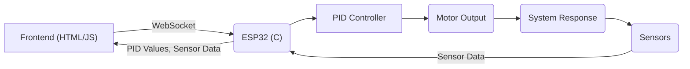

 # Self-Balancing Frontend

This section details the user interface built for the self-balancing module. It focuses on real-time data visualization and parameter tuning using a web-based frontend that communicates with the ESP32 board via WebSockets.

## Features

*   **Real-time Data Visualization:** Utilizes Chart.js to display sensor data and PID controller performance metrics in real-time.
*   **Parameter Tuning:** Allows users to adjust PID constants (Kp, Ki, Kd), setpoint, and offset values directly through the web interface.
*   **WebSocket Communication:** Establishes a full-duplex communication channel between the frontend and the ESP32 for seamless data exchange.

## Frontend Stack

| Technology   | Purpose                                           |
| :----------- | :------------------------------------------------ |
| HTML         | Structure of the web page                         |
| CSS          | Styling and layout                                |
| JavaScript   | Logic for data handling and chart updates         |
| jQuery       | Simplifies DOM manipulation and AJAX calls       |
| Chart.js     | Creates interactive charts for data visualization |
| Bootstrap    | Provides pre-built CSS components                |
| Google Fonts | Custom fonts for enhanced UI                     |

## Code Snippets and Explanation

1.  **WebSocket Initialization:**

```html
// File: 7_self_balancing/frontend/index.html
var websocket = new WebSocket("ws://" + location.hostname + "/");

function send_Text_kp(text) {
  websocket.send("P" + text);
}
```

This JavaScript code initializes a WebSocket connection to the ESP32 server. The `send_Text_kp` function sends the 'P' prefix along with the kp value to the ESP32, indicating a change in the proportional gain. [View on GitHub](https://github.com/SRA-VJTI/Wall-E/blob/main/7_self_balancing/frontend/index.html)

2.  **Chart Configuration:**

```javascript
// File: 7_self_balancing/frontend/index.html
var xAccelChart = $("#xAccelChart");
var xAccelChartInstance = new Chart(xAccelChart, {
  type: "line",
  data: {
    datasets: [
      {
        label: "X Acceleration",
        fill: false,
        borderColor: "#FFF",
        borderWidth: 2,
        fontColor: "#FFF",
      },
    ],
  },
  options: Object.assign({}, commonOptions, {
    title: {
      display: true,
      text: "P-TERM",
      fontSize: 18,
      fontFamily: "Oswald",
      fontColor: "#FFF",
    },
    elements: {
      point: {
        radius: 0,
      },
    },
  }),
});
```

This snippet configures a Chart.js line chart to display X-axis acceleration data. The `type` is set to "line", and various options are configured for appearance, including colors, fonts, and tooltips. [View on GitHub](https://github.com/SRA-VJTI/Wall-E/blob/main/7_self_balancing/frontend/index.html)

3.  **Data Handling and Chart Updates:**

```javascript
// File: 7_self_balancing/frontend/index.html
function addData(data) {
  var new_data = data
    .split(",")
    .filter((x) => x.trim().length && !isNaN(x))
    .map(Number);

  if (data) {
    xAccelChartInstance.data.labels.push(new Date());
    xAccelChartInstance.data.datasets.forEach((dataset) => {
      dataset.data.push(data[0]);
    });
    xAccelChartInstance.update();
  }
}
```

The `addData` function parses the comma-separated data received from the WebSocket, extracts numerical values, and appends them to the chart's dataset. `xAccelChartInstance.update()` refreshes the chart to display the new data. [View on GitHub](https://github.com/SRA-VJTI/Wall-E/blob/main/7_self_balancing/frontend/index.html)

4.  **Input Field Event Listener:**

```javascript
// File: 7_self_balancing/frontend/index.html
document.querySelectorAll('input[name="ftext"]').forEach((input, index) => {
  input.addEventListener('keydown', function (event) {
    if (event.key === 'Enter') {
      event.preventDefault();  // Prevent form submission
      document.querySelectorAll('button')[index].click();
    }
  });
});
```

This JavaScript code adds an event listener to each input field with the name "ftext". When the 'Enter' key is pressed, it prevents the default form submission and triggers the associated button click event, sending the input value to the ESP32. [View on GitHub](https://github.com/SRA-VJTI/Wall-E/blob/main/7_self_balancing/frontend/index.html)

5.  **PID Constant Struct Definition:**

```c
// File: 7_self_balancing/main/include/tuning_websocket_server.h
typedef struct pid_const
{
    float kp;
    float ki;
    float kd;
    float setpoint;
    float offset;
    bool val_changed;
} pid_const_t;
```
This C code defines a structure to hold the PID constants. `kp`, `ki`, `kd`, `setpoint`, and `offset` are floating-point numbers representing the proportional, integral, derivative gains, the desired setpoint, and an offset value, respectively. `val_changed` is a boolean flag that indicates whether any of these values have been changed. [View on GitHub](https://github.com/SRA-VJTI/Wall-E/blob/main/7_self_balancing/main/include/tuning_websocket_server.h)

6.  **WebSocket Data Processing:**

```c
// File: 7_self_balancing/main/tuning_websocket_server.c
case WEBSOCKET_TEXT:
  if (len)
  { // if the message length was greater than zero
    pid_constants.val_changed = true;

    switch (msg[0])
    {
    case 'P':
      ESP_LOGI(TAG, "got message length %i: %s", (int)len - 1, &(msg[1]));
      pid_constants.kp = atof(&msg[1]);
      break;
```

This C code processes incoming WebSocket messages. Based on the first character of the message (`msg[0]`), it updates the corresponding PID constant in the `pid_constants` structure. The `atof` function converts the string representation of the number to a floating-point value. [View on GitHub](https://github.com/SRA-VJTI/Wall-E/blob/main/7_self_balancing/main/tuning_websocket_server.c)

## Data Flow Diagram





## Key Integration Points

*   **WebSocket Bridge:** The WebSocket server on the ESP32 acts as a crucial bridge, translating commands from the frontend into actionable parameter updates for the PID controller.
*   **Real-time Feedback Loop:** The continuous stream of sensor data to the frontend enables dynamic tuning of PID parameters, significantly optimizing system performance.
*   **Threading:** The use of FreeRTOS tasks allows concurrent processing of WebSocket communication and PID control.

## Best Practices

*   **Data Validation:** Implement robust validation on both the frontend and backend to ensure data integrity and prevent unexpected behavior.
*   **Error Handling:** Incorporate comprehensive error handling to gracefully manage WebSocket disconnections and other potential issues.
*   **Asynchronous Operations:** Leverage asynchronous operations to maintain a responsive user interface without blocking the main thread.
*   **Secure Communication:** For production environments, consider implementing secure WebSocket communication (WSS) to encrypt data transmitted between the frontend and the ESP32.