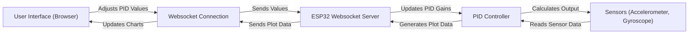

 # Self Balancing - Web Interface

This document describes the web interface used for tuning the PID controller of the self-balancing robot. The interface allows users to adjust the proportional (Kp), integral (Ki), and derivative (Kd) gains, as well as the setpoint and offset, in real-time. The interface also displays real-time data from the robot's sensors, including accelerometer and orientation data using charts.

## Features

-   **Real-time PID Tuning:** Adjust Kp, Ki, Kd, Setpoint, and Offset values through input fields.
-   **Data Visualization:** Visualizes accelerometer (X, Y, Z) and orientation (Roll, Pitch) data using charts.
-   **Websocket Communication:** Uses websockets for real-time bi-directional communication between the web interface and the robot.
-   **Responsive Design:** The UI adapts to different screen sizes.

## Relevant Files

-   `7_self_balancing/frontend/index.html`: Contains the HTML, CSS, and JavaScript code for the web interface. [View on GitHub](https://github.com/SRA-VJTI/Wall-E/blob/main/7_self_balancing/frontend/index.html)
-   `7_self_balancing/main/tuning_websocket_server.c`: Contains the C code for the websocket server running on the ESP32. [View on GitHub](https://github.com/SRA-VJTI/Wall-E/blob/main/7_self_balancing/main/tuning_websocket_server.c)
-   `7_self_balancing/main/include/tuning_websocket_server.h`: Header file for the tuning websocket server. [View on GitHub](https://github.com/SRA-VJTI/Wall-E/blob/main/7_self_balancing/main/include/tuning_websocket_server.h)

## Web Interface Structure (`index.html`)

The `index.html` file is the core of the web interface. It includes the following key components:

-   **HTML Structure:** Basic HTML structure with links to Bootstrap CSS for styling, Google Fonts, jQuery, and Chart.js.
-   **JavaScript:**
    -   Websocket connection setup.
    -   Functions to send PID values to the server.
    -   Chart initialization and data updating.
-   **CSS:** Styles for the page layout and appearance.

### Snippets

1.  **Websocket Setup:**

    ```javascript
    var websocket = new WebSocket("ws://" + location.hostname + "/");

    function send_Text_kp(text) {
      websocket.send("P" + text);
    }
    ```

    This snippet shows how the websocket is initialized and how functions are defined to send data to the server. The `location.hostname` ensures the websocket connects to the correct host.  The `send_Text_kp` function sends the proportional gain value prefixed with "P". [View on GitHub](https://github.com/SRA-VJTI/Wall-E/blob/main/7_self_balancing/frontend/index.html#L11-L17)

2.  **Chart Initialization:**

    ```javascript
    var xAccelChart = $("#xAccelChart");
    var xAccelChartInstance = new Chart(xAccelChart, {
      type: "line",
      data: {
        datasets: [
          {
            label: "X Acceleration",
            fill: false,
            borderColor: "#FFF",
            borderWidth: 2,
            fontColor: "#FFF",
          },
        ],
      },
      // ...options
    });
    ```

    This snippet shows how a Chart.js chart is initialized. The `xAccelChart` variable holds the chart element, and `xAccelChartInstance` is the actual Chart object. The configuration includes the chart type, data, and options for styling. [View on GitHub](https://github.com/SRA-VJTI/Wall-E/blob/main/7_self_balancing/frontend/index.html#L65-L102)

3.  **Data Update Function:**

    ```javascript
    function addData(data) {
        var new_data = data
          .split(",")
          .filter((x) => x.trim().length && !isNaN(x))
          .map(Number);
        var new_data_1 = data.split(",");
        var temp = new_data_1[4];
        temp = temp.replace(/\D/g, "");
        temp = parseInt(temp, 10);
        data = new_data.concat(temp);

      if (data) {
        xAccelChartInstance.data.labels.push(new Date());
        xAccelChartInstance.data.datasets.forEach((dataset) => {
          dataset.data.push(data[0]);
        });
        // ... update other charts
        xAccelChartInstance.update();
        // ... update other charts
      }
    }
    ```

    The `addData` function receives data from the websocket, parses it, and updates the chart datasets. It splits the comma-separated data string, converts the values to numbers, and pushes them into the chart's data arrays.  Finally, it calls `update()` on each chart to refresh the display. [View on GitHub](https://github.com/SRA-VJTI/Wall-E/blob/main/7_self_balancing/frontend/index.html#L235-L279)

4.  **Input Event Listeners:**

    ```javascript
    document.querySelectorAll('input[name="ftext"]').forEach((input, index) => {
        input.addEventListener('keydown', function (event) {
          if (event.key === 'Enter') {
            event.preventDefault();  // Prevent form submission
            document.querySelectorAll('button')[index].click();
          }
        });
      });
    ```

    This snippet adds an event listener to each input field.  When the "Enter" key is pressed, it prevents the default form submission behavior and triggers the corresponding button's click event, which sends the value to the server. [View on GitHub](https://github.com/SRA-VJTI/Wall-E/blob/main/7_self_balancing/frontend/index.html#L308-L316)

## Websocket Server (`tuning_websocket_server.c`)

The `tuning_websocket_server.c` file contains the code for the websocket server running on the ESP32.

### Snippets

1.  **Websocket Callback Function:**

    ```c
    void websocket_callback(uint8_t num, WEBSOCKET_TYPE_t type, char *msg, uint64_t len) {
        // ...
        case WEBSOCKET_TEXT:
            if (len) {
                pid_constants.val_changed = true;
                switch (msg[0]) {
                    case 'P':
                        pid_constants.kp = atof(&msg[1]);
                        break;
                    // ... other cases
                }
            }
            break;
        // ...
    }
    ```

    The `websocket_callback` function is called when a websocket event occurs. It handles different event types like connection, disconnection, and text messages. When a text message is received, it checks the first character to determine which PID value to update and then converts the rest of the message to a float using `atof`. [View on GitHub](https://github.com/SRA-VJTI/Wall-E/blob/main/7_self_balancing/main/tuning_websocket_server.c#L50-L92)

2.  **Plot Graph Function:**

    ```c
    void plot_graph(float p_term, float d_term, float i_term, float pitch_corr, float pitch_err) {
        char out[100];
        int len;
        char n[100];

        sprintf(n0_buf, "%.1f", p_term);
        sprintf(n1_buf, "%.1f", d_term);
        sprintf(n2_buf, "%.1f", i_term);
        sprintf(n3_buf, "%.1f", pitch_corr);
        sprintf(n4_buf, "%.1f", pitch_err);

        n[0] = '\0';
        strcat(n, n0_buf);
        strcat(n, ",");
        strcat(n, n1_buf);
        strcat(n, ",");
        strcat(n, n2_buf);
        strcat(n, ",");
        strcat(n, n3_buf);
        strcat(n, ",");
        strcat(n, n4_buf);
        sprintf(out, "%s", n);
        len = strlen(n);
        ws_server_send_text_all(n, len);
    }
    ```

    This function formats the plotting data into a comma-separated string and sends it to all connected websocket clients. It converts the float values to strings with one decimal place using `sprintf` and concatenates them. [View on GitHub](https://github.com/SRA-VJTI/Wall-E/blob/main/7_self_balancing/main/tuning_websocket_server.c#L203-L231)

## Flow Diagram





## Key Integration Points

-   **Real-time data flow:** The websocket connection allows for real-time data flow between the robot and the web interface. Sensor data is transmitted from the robot to the web interface for visualization, and PID tuning parameters are transmitted from the web interface to the robot.
-   **PID control loop:** The PID controller uses the sensor data to calculate the necessary adjustments to maintain balance. The tuning parameters from the web interface are used to optimize the controller's performance.
-   **User interaction:** The web interface provides a user-friendly way to interact with the robot. Users can easily adjust the PID parameters and visualize the effects of their changes in real-time.