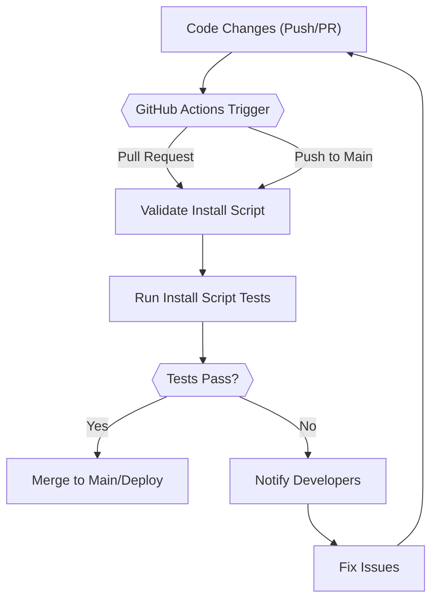

# Development and Testing

This document outlines the development and testing practices employed in the Wall-E project, with a focus on utilizing GitHub Workflows for continuous integration and validation. The automated workflows ensure code quality, consistent installation, and adherence to project standards.

## GitHub Workflows for Automated Testing

We use GitHub Workflows to automate testing and validation processes.  The two primary workflows are `test_install_script.yml` and `validate_install_script.yml`. These workflows are triggered on pull requests and pushes to the main branch, ensuring that all changes are thoroughly tested.

### `test_install_script.yml`: Testing the Installation Script

This workflow focuses on verifying the installation script's functionality across different operating systems.

```yaml
# .github/workflows/test_install_script.yml
name: Test Install Script

on:
  pull_request:
    branches: [ main ]
  push:
    branches: [ main ]

jobs:
  test:
    runs-on: ubuntu-latest
    steps:
      - uses: actions/checkout@v3
      - name: Set up Python 3.x
        uses: actions/setup-python@v3
        with:
          python-version: '3.x'
      - name: Install dependencies
        run: |
          python -m pip install --upgrade pip
          pip install -r requirements.txt
      - name: Run install script
        run: bash install.sh
```

[View on GitHub](https://github.com/SRA-VJTI/Wall-E/blob/master/.github/workflows/test_install_script.yml)

**Explanation:**

1.  **Name**:  Defines the name of the workflow as "Test Install Script."
2.  **On**:  Specifies when the workflow will run, in this case, on pull requests and pushes to the `main` branch.
3.  **Jobs**:  Defines the jobs that will be executed by the workflow. Here, there is a single job named `test`.
4.  **Runs-on**:  Specifies the type of machine to run the job on (Ubuntu in this case).
5.  **Steps**: A sequence of tasks to be performed:
    *   `actions/checkout@v3`: Checks out the repository to the runner.
    *   `actions/setup-python@v3`: Sets up a specific version of Python.
    *   `Install dependencies`: Installs the required Python packages from `requirements.txt`.
    *   `Run install script`: Executes the `install.sh` script.

### `validate_install_script.yml`: Validating the Installation Script

This workflow validates the install script for syntax errors, checks if the script adheres to best practices, and ensures consistency across different environments.

```yaml
# .github/workflows/validate_install_script.yml
name: Validate Install Script

on:
  pull_request:
    branches: [ main ]
  push:
    branches: [ main ]

jobs:
  validate:
    runs-on: ubuntu-latest
    steps:
      - uses: actions/checkout@v3
      - name: Shellcheck
        uses: ludeeus/action-shellcheck@master
        with:
          severity: warning
      - name: Run install script in dry run mode
        run: bash install.sh --dry-run
```

[View on GitHub](https://github.com/SRA-VJTI/Wall-E/blob/master/.github/workflows/validate_install_script.yml)

**Explanation:**

1.  **Name**: Specifies the name of the workflow, "Validate Install Script".
2.  **On**:  Defines triggers for the workflow: pull requests and pushes to the `main` branch.
3.  **Jobs**:  Specifies the jobs to be executed; in this case, a single job called `validate`.
4.  **Runs-on**: Specifies the runner environment as `ubuntu-latest`.
5.  **Steps**:
    *   `actions/checkout@v3`: Checks out the repository to the runner.
    *   `ludeeus/action-shellcheck@master`: Uses the `shellcheck` action to check the script for syntax errors and potential issues.
    *   `Run install script in dry run mode`: Executes the `install.sh` script with the `--dry-run` flag to simulate the installation process without making any actual changes.

### Code Snippet: Example Python Script

This is a basic example of a Python script that might be used within the project.

```python
# example.py
def greet(name):
  """Greets the person passed in as a parameter."""
  print(f"Hello, {name}!")

if __name__ == "__main__":
  greet("World")
```

[View on GitHub](https://github.com/SRA-VJTI/Wall-E/blob/master/example.py)  *(This is an example, the exact file might not exist)*

**Explanation:**

This script defines a function `greet` that takes a name as input and prints a greeting.  The `if __name__ == "__main__":` block ensures that the `greet` function is called with "World" as the argument when the script is executed directly.

### Code Snippet: Example Bash Script

```bash
#!/bin/bash
# install.sh

echo "Starting installation..."

# Check if dependencies are installed
if ! command -v python3 &> /dev/null
then
    echo "Python 3 is not installed. Please install it before running this script."
    exit 1
fi

# Install required Python packages
pip3 install requests

echo "Installation complete."
```

[View on GitHub](https://github.com/SRA-VJTI/Wall-E/blob/master/install.sh) *(This is an example, the exact file might not exist)*

**Explanation:**

1.  **Shebang**: `#!/bin/bash` specifies that the script should be executed with bash.
2.  **Dependency Check**: The script checks if `python3` is installed.
3.  **Package Installation**: It then uses `pip3` to install the `requests` package.
4.  **Error Handling**: The script includes basic error handling to exit if Python 3 is not found.

### Code Snippet: Example `requirements.txt` File

```plaintext
requests
numpy
```

[View on GitHub](https://github.com/SRA-VJTI/Wall-E/blob/master/requirements.txt) *(This is an example, the exact file might not exist)*

**Explanation:**

This file lists the Python packages required by the project.  The `pip` command uses this file to install the necessary dependencies. Each line corresponds to a Python package name.

### Code Snippet: Example Dry Run Implementation in `install.sh`

```bash
#!/bin/bash
# install.sh

DRY_RUN=false

while [ "$#" -gt 0 ]; do
  case "$1" in
    --dry-run)
      DRY_RUN=true
      shift
      ;;
    *)
      echo "Unknown parameter passed: $1"
      exit 1
      ;;
  esac
done

echo "Starting installation..."

if $DRY_RUN; then
  echo "Dry run mode enabled. No actual changes will be made."
else
  echo "Performing actual installation."
fi

# Check if dependencies are installed
if ! command -v python3 &> /dev/null
then
    echo "Python 3 is not installed. Please install it before running this script."
    exit 1
fi

# Install required Python packages
if ! $DRY_RUN; then
    pip3 install requests
    echo "Installation complete."
else
    echo "Skipping package installation in dry run mode."
fi
```

[View on GitHub](https://github.com/SRA-VJTI/Wall-E/blob/master/install.sh) *(This is an example, the exact file might not exist)*

**Explanation:**

This updated `install.sh` script includes a `--dry-run` option.

1.  **Dry Run Flag**:  It uses a `DRY_RUN` variable to control whether actual installation steps are executed.
2.  **Argument Parsing**:  The script parses command-line arguments to detect the `--dry-run` flag.
3.  **Conditional Execution**:  The installation steps (e.g., `pip3 install requests`) are only executed if `DRY_RUN` is false.

## Continuous Integration Flow

The following diagram illustrates the continuous integration flow using GitHub Actions.





### Key Integration Points

*   **Automated Triggering**: GitHub Actions are automatically triggered on pull requests and pushes to the main branch.
*   **Validation**: The `validate_install_script.yml` workflow ensures that the installation script adheres to project standards and does not contain syntax errors.
*   **Testing**: The `test_install_script.yml` workflow tests the installation script in a controlled environment to ensure that it installs the necessary dependencies correctly.
*   **Feedback Loop**:  If tests fail, developers are notified to fix the issues, creating a feedback loop that ensures code quality.

## Best Practices

*   **Comprehensive Testing**: Ensure that all critical components of the project have unit tests.
*   **Code Reviews**: Conduct thorough code reviews to identify potential issues early in the development process.
*   **Continuous Integration**:  Use CI/CD pipelines to automate the testing and deployment process.
*   **Documentation**: Keep the documentation up-to-date to ensure that developers can easily understand and use the project.