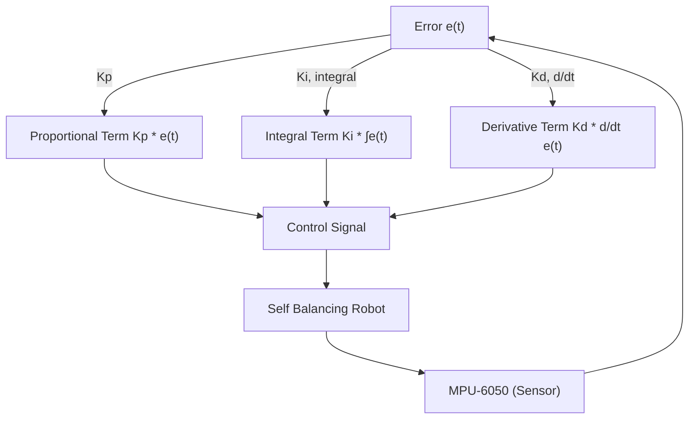
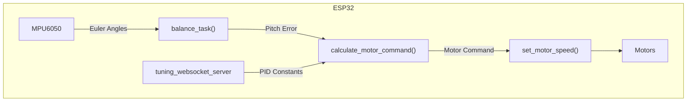

 # Self-Balancing System

This document details the self-balancing mechanism implemented in the Wall-E robot, covering the theory, PID control, algorithm, and key functions involved. The system aims to maintain the robot in an upright position by continuously adjusting motor speeds based on sensor data.

## How the Bot Balances Itself

The self-balancing mechanism relies on the principle that movement affects the bot's inclination. Moving forward causes the front to rise, and moving backward causes it to descend. By continuously monitoring the robot's angle and adjusting motor speeds accordingly, the system maintains balance.

### Theory

The core idea is to counteract deviations from the desired upright position. If the bot leans forward, it moves backward to compensate, and vice versa.

### Use of PID

PID (Proportional-Integral-Derivative) control is used to calculate the necessary adjustments.

*   **Proportional Term:** Reacts to the current error. A larger error results in a larger correction.
*   **Derivative Term:** Dampens oscillations by considering the rate of change of the error.
*   **Integral Term:** Eliminates steady-state errors by accumulating the error over time.





### Proportional Term

The proportional term adjusts the output proportionally to the current error value.

### Derivative Term

The derivative term slows down the rate of change of the controller output, reducing oscillations.

### Integral Term

The integral term eliminates steady-state errors by accounting for the amount of time the error is present.

## Formula for Calculation of Pitch Correction

The pitch correction is calculated using the following formula:

```
pitch_correction = Kp*(error) + Ki*(Integral_Error) + Kd*(Error_rate)
```

## Algorithm

The algorithm for balancing the robot involves the following steps:

1.  Read data from sensors (MPU6050) and calculate the error.
2.  Calculate the "Error Rate" (derivative) and "Cumulative Error (Integral)" terms.
3.  Calculate the correction speed using the PID equation.
4.  Limit the correction speed to maximum and minimum PWM values.
5.  Determine the direction the bot should move:
    *   If `Error > 1` (Bot-front is down): move forward.
    *   If `Error < -1` (Bot-front is up): move backward.
    *   Else (bot is balanced): stop.
6.  Repeat from Step 1.

## Description of the Functions

*   `void calculate_motor_command(const float pitch_error, float *motor_cmd)`

    *   **Description**: Calculates the motor inputs based on the pitch error.
    *   **Parameters**:
        *   `pitch_error`: The difference between the desired and current pitch angles.
        *   `motor_cmd`: A pointer to a variable that will store the calculated correction values.
    *   [View on GitHub](https://github.com/SRA-VJTI/Wall-E/blob/main/7_self_balancing/main/self_balancing.c#L40-L91)

    ```c
    void calculate_motor_command(const float pitch_error, float *motor_cmd)
    {
        // Error values, correction values and helper variables declarations...

        // Calculating p,i and d terms by multiplying corresponding proportional constants
        P_term = read_pid_const().kp * pitch_error;
        I_term = read_pid_const().ki * bound(pitch_area, -MAX_PITCH_AREA, MAX_PITCH_AREA);
        D_term = read_pid_const().kd * bound(pitch_rate, -MAX_PITCH_RATE, MAX_PITCH_RATE);

        pitch_correction = P_term + I_term + D_term;

        absolute_pitch_correction = fabsf(pitch_correction);

        *motor_cmd = bound(absolute_pitch_correction, 0, MAX_PITCH_CORRECTION);
    }
    ```

*   `void balance_task(void *arg)`

    *   **Description**: The main task responsible for balancing the robot.
    *   **Parameters**:
        *   `arg`: Task arguments (unused in this case).
    *   [View on GitHub](https://github.com/SRA-VJTI/Wall-E/blob/main/7_self_balancing/main/self_balancing.c#L93-L191)

    ```c
    void balance_task(void *arg)
    {
        // Initializations and variable declarations...

        while (1)
        {
            if (read_mpu6050(euler_angle, mpu_offset) == ESP_OK)
            {
                // Calculate pitch error and motor command...

                // Bot tilts upwards
                if (pitch_error > 1)
                {
                    set_motor_speed(motor_a_0, MOTOR_BACKWARD, motor_pwm);
                    set_motor_speed(motor_a_1, MOTOR_BACKWARD, motor_pwm);
                }
                // Bot tilts downwards
                else if (pitch_error < -1)
                {
                    set_motor_speed(motor_a_0, MOTOR_FORWARD, motor_pwm);
                    set_motor_speed(motor_a_1, MOTOR_FORWARD, motor_pwm);
                }
                // Bot remains balanced
                else
                {
                    set_motor_speed(motor_a_0, MOTOR_STOP, 0);
                    set_motor_speed(motor_a_1, MOTOR_STOP, 0);
                }
                vTaskDelay(10 / portTICK_PERIOD_MS);
            }
        }
        vTaskDelete(NULL);
    }
    ```

*   `read_mpu6050(float *euler_angle, float *mpu_offset)`

    *   **Description**: Reads data from the MPU6050 sensor and calculates the complementary pitch and roll angles.
    *   **Parameters**:
        *   `euler_angle`: A pointer to an array where the calculated pitch and roll angles will be stored.
        *   `mpu_offset`: A pointer to an array containing the initial accelerometer angles at rest.
    *   **Return**: Returns `ESP_OK` if the angles are calculated correctly, or `ESP_FAIL` if an error occurs.

*  `connect_to_wifi()`
    *   **Description**: Connects the ESP32 to the configured Wi-Fi network.
    *   [View on GitHub](https://github.com/SRA-VJTI/Wall-E/blob/main/7_self_balancing/main/wifi_handler.c#L94)
    ```c
    void connect_to_wifi()
    {
        esp_err_t ret = nvs_flash_init();
        if (ret == ESP_ERR_NVS_NO_FREE_PAGES || ret == ESP_ERR_NVS_NEW_VERSION_FOUND)
        {
            ESP_ERROR_CHECK(nvs_flash_erase());
            ret = nvs_flash_init();
        }
        ESP_ERROR_CHECK(ret);

        ESP_LOGI(TAG, "ESP_WIFI_MODE_STA");
        wifi_init_sta();
    }
    ```

## Key Integration Points

1.  **Sensor Data Acquisition**: The `read_mpu6050` function is crucial for obtaining real-time orientation data. This data forms the basis for calculating the error and making necessary corrections.

2.  **PID Control**: The `calculate_motor_command` function implements the PID control algorithm. Tuning the `Kp`, `Ki`, and `Kd` parameters is essential for achieving stable and responsive balancing. The parameters can be adjusted via `tuning_websocket_server`.

3.  **Motor Control**: The `set_motor_speed` function is used to control the speed and direction of the motors based on the calculated motor commands.

4.  **Task Scheduling**: The `balance_task` function runs continuously, ensuring that the robot is constantly monitoring its orientation and making adjustments as needed. This task is pinned to core 0 using `xTaskCreatePinnedToCore`.

5.  **Wi-Fi Connectivity**: The `connect_to_wifi` function establishes a Wi-Fi connection, enabling remote monitoring and control.
    [View on GitHub](https://github.com/SRA-VJTI/Wall-E/blob/main/7_self_balancing/main/wifi_handler.c)


