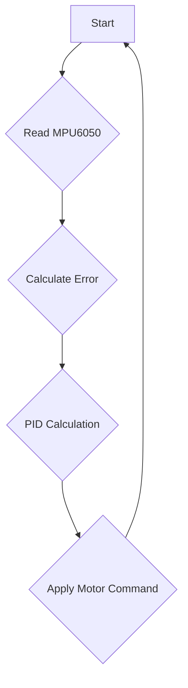
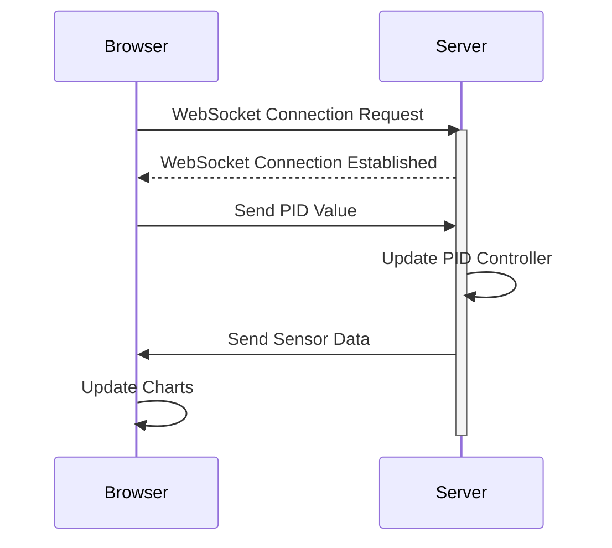

 
---
title: "Self Balancing"
description: "Implementation details for the self-balancing functionality, including sensor integration and control algorithms."
---

# Self Balancing

This section details the implementation of the self-balancing functionality for the robot, covering sensor integration, control algorithms, and parameter tuning. The core of the self-balancing mechanism relies on feedback from the MPU6050 inertial measurement unit (IMU) and a PID (Proportional-Integral-Derivative) control loop to adjust motor speeds.

## Balancing Theory

The robot maintains balance by continuously adjusting its position based on its tilt angle. If the robot leans forward, it moves backward to compensate, and vice versa. The PID controller refines these adjustments for smooth and stable balancing.

## PID Control

The PID controller calculates the necessary corrections based on three terms: Proportional, Integral, and Derivative. Each term addresses a different aspect of the error between the desired and current states.

*   **Proportional Term:** Reacts to the current error.
*   **Integral Term:** Accumulates past errors to eliminate steady-state error.
*   **Derivative Term:** Predicts future errors by considering the rate of change of the current error.

### Proportional Term (Kp)

The proportional term provides an immediate correction proportional to the current error.

```c
// 7_self_balancing/main/self_balancing.c
P_term = read_pid_const().kp * pitch_error;
```

This snippet from [View on GitHub](https://github.com/SRA-VJTI/Wall-E/blob/main/7_self_balancing/main/self_balancing.c) calculates the proportional component of the correction. A well-tuned Kp value ensures a quick response to deviations from the balanced state.

### Derivative Term (Kd)

The derivative term dampens oscillations and prevents overshoot by considering the rate of change of the error.

```c
// 7_self_balancing/main/self_balancing.c
D_term = read_pid_const().kd * bound(pitch_rate, -MAX_PITCH_RATE, MAX_PITCH_RATE);
```

This snippet from [View on GitHub](https://github.com/SRA-VJTI/Wall-E/blob/main/7_self_balancing/main/self_balancing.c) calculates the derivative component, which helps stabilize the robot by anticipating and counteracting rapid changes in tilt.

### Integral Term (Ki)

The integral term eliminates steady-state errors by accumulating past errors over time.

```c
// 7_self_balancing/main/self_balancing.c
I_term = read_pid_const().ki * bound(pitch_area, -MAX_PITCH_AREA, MAX_PITCH_AREA);
```

This snippet from [View on GitHub](https://github.com/SRA-VJTI/Wall-E/blob/main/7_self_balancing/main/self_balancing.c) calculates the integral component. It ensures that even small, persistent errors are eventually corrected.





## Pitch Correction Formula

The final pitch correction is calculated by summing the contributions of the proportional, integral, and derivative terms:

```
pitch_correction = Kp*(error) + Ki*(Integral_Error) + Kd*(Error_rate)
```

## Algorithm

The balancing algorithm consists of the following steps:

1.  Read data from the MPU6050 sensor and calculate the pitch error.
2.  Calculate the error rate and cumulative error (integral).
3.  Calculate the correction speed using the PID equation.
4.  Limit the correction speed to the maximum and minimum PWM values.
5.  Determine the direction in which the robot should move based on the error.

## Function Descriptions

*   `void calculate_motor_command(const float pitch_error, float *motor_cmd)`
    *   Calculates the motor inputs based on the pitch error.
    *   Parameters:
        *   `pitch_error`: The error between the desired and current angles.
        *   `motor_cmd`: A pointer to the variable that will store the calculated correction values.
*   `void balance_task(void *arg)`
    *   The main task responsible for balancing the robot.
*   `read_mpu6050(euler_angle, mpu_offset)`
    *   Reads the MPU6050 sensor and calculates the complementary pitch and roll angles.
    *   Parameters:
        *   `euler_angle`: The calculated pitch and roll angles.
        *   `mpu_offset`: The initial accelerometer angles at the rest position.
    *   Returns: `ESP_OK` if the angles are calculated correctly, `ESP_FAIL` if an error occurs.

## Frontend Interface

The `index.html` file provides a web-based interface for tuning the PID parameters in real-time.

```html
    <input name="ftext" type="number" class="form-control" aria-label="Sizing example input"
      aria-describedby="inputGroup-sizing-default">
```

This snippet from [View on GitHub](https://github.com/SRA-VJTI/Wall-E/blob/main/7_self_balancing/frontend/index.html) shows the input field for entering the PID gain values.  Users can adjust Kp, Ki, and Kd values and send them to the ESP32 via WebSockets to observe the effects on the balancing performance.

```javascript
    function send_Text_kp(text) {
      websocket.send("P" + text);
    }
```

This JavaScript function [View on GitHub](https://github.com/SRA-VJTI/Wall-E/blob/main/7_self_balancing/frontend/index.html) sends the Kp value to the ESP32 via a WebSocket connection.  Similar functions exist for Ki, Kd, setpoint, and offset values, allowing for dynamic tuning of the PID controller.

```javascript
      var xAccelChart = $("#xAccelChart");
      var yAccelChart = $("#yAccelChart");
      var zAccelChart = $("#zAccelChart");
      var rollChart = $("#rollChart");
      var pitchChart = $("#pitchChart");
```

The above javascript code initializes chart objects using jQuery and Chart.js library. [View on GitHub](https://github.com/SRA-VJTI/Wall-E/blob/main/7_self_balancing/frontend/index.html)

```javascript
          ws.onmessage = function (evt) {
            var data = evt.data;
            // console.log(data);
            addData(data);
          };
```
This snippet from [View on GitHub](https://github.com/SRA-VJTI/Wall-E/blob/main/7_self_balancing/frontend/index.html) processes incoming data from the WebSocket, updating the charts with real-time sensor readings and PID outputs.





## Key Integration Points

*   **MPU6050 Integration:** The `read_mpu6050` function is crucial for obtaining accurate pitch and roll angles. Proper calibration and filtering are essential for reliable sensor data.
*   **PID Controller Implementation:** The `calculate_motor_command` function implements the PID control loop, calculating the necessary motor corrections based on the error signal. Careful tuning of the PID gains is required to achieve stable balancing.
*   **Motor Control:** The `set_motor_speed` function sets the speed and direction of the motors based on the calculated motor commands. The motor driver must be properly configured to ensure precise motor control.
*   **Websocket Server:**  The `start_websocket_server` function initializes the websocket connection required for dynamic tuning using the frontend UI.

## Best Practices

*   **Sensor Calibration:** Calibrate the MPU6050 sensor to minimize bias and drift.
*   **PID Tuning:** Tune the PID gains systematically, starting with the proportional gain and then adjusting the integral and derivative gains. The frontend interface enables real-time tuning.
*   **Filtering:** Apply filtering techniques to reduce noise in the sensor data and improve the stability of the control loop.
*   **Safety Limits:** Implement safety limits on the motor commands to prevent excessive speeds and potential damage.
```