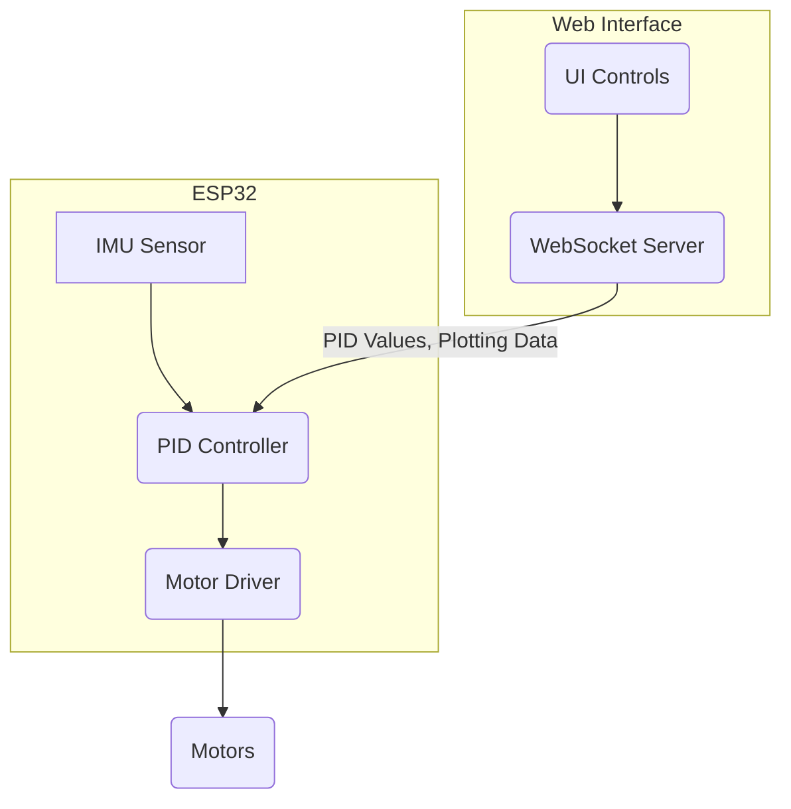

---
title: "Tuning and Calibration"
description: "Covers the methods of tuning the line following and self balancing algorithms."
---

# Tuning and Calibration

This section details the methods for tuning the line following and self-balancing algorithms implemented in Wall-E. Proper tuning is crucial for optimal performance, allowing the robot to accurately follow lines and maintain balance. We will explore the relevant code and provide guidance on how to adjust the PID parameters for both algorithms.

## Line Following Tuning

The line following algorithm utilizes a PID (Proportional-Integral-Derivative) controller to minimize the error between the robot's position and the desired line position. Tuning the PID constants (Kp, Ki, Kd) is essential to achieve stable and accurate line following.

### Tuning HTTP Server

The line following system provides a web-based interface for tuning PID parameters in real-time. This interface is implemented using an HTTP server running on the ESP32.

```c
// File: 6_line_following/main/include/tuning_http_server.h
typedef struct pid_const
{
    float kp;
    float ki;
    float kd;
    bool val_changed;
} pid_const_t;

pid_const_t read_pid_const();
void reset_val_changed_pid_const();
void start_tuning_http_server();
```

This header file defines the `pid_const_t` structure, which holds the PID constants (Kp, Ki, Kd) and a flag (`val_changed`) indicating whether the values have been updated. It also declares the functions for reading and resetting the `val_changed` flag, and for starting the tuning HTTP server. [View on GitHub](https://github.com/SRA-VJTI/Wall-E/blob/master/6_line_following/main/include/tuning_http_server.h)

```c
// File: 6_line_following/main/tuning_http_server.c
static pid_const_t pid_constants = {.kp = 0.9, .ki = 0, .kd = 6.5, .val_changed = true};

static esp_err_t tuning_pid_post_handler(httpd_req_t *req)
{
    // ... (Handles HTTP POST requests to update PID constants) ...
    pid_constants.kp = (float)cJSON_GetObjectItem(root, "kp")->valuedouble;
    pid_constants.ki = (float)cJSON_GetObjectItem(root, "ki")->valuedouble;
    pid_constants.kd = (float)cJSON_GetObjectItem(root, "kd")->valuedouble;

    cJSON_Delete(root);
    httpd_resp_sendstr(req, "Post control value successfully");

    pid_constants.val_changed = true;
    return ESP_OK;
}
```

The `tuning_pid_post_handler` function is responsible for handling HTTP POST requests to update the PID constants. It parses the JSON data from the request body and updates the `pid_constants` structure. The `val_changed` flag is set to `true` to indicate that the PID constants have been updated. [View on GitHub](https://github.com/SRA-VJTI/Wall-E/blob/master/6_line_following/main/tuning_http_server.c)

### Tuning Process:

1.  **Access the Web Interface:** After flashing the line following code to the ESP32, connect to the Wi-Fi network created by the ESP32 and navigate to the server's IP address in your web browser. The address is usually `http://walle.local/` or the IP address displayed in the serial monitor.
2.  **Adjust PID Constants:** Use the web interface to adjust the Kp, Ki, and Kd values. Start with small values and gradually increase them until the robot follows the line smoothly and accurately.
3.  **Observe and Iterate:** Observe the robot's behavior as you change the PID constants. If the robot oscillates around the line, reduce the Kp value. If the robot is slow to correct errors, increase the Kp value. The Ki value helps to eliminate steady-state errors, while the Kd value helps to dampen oscillations.
4.  **Save the Optimal Values:** Once you have found the optimal PID constants, save them to the code to ensure consistent performance.

## Self-Balancing Tuning

The self-balancing algorithm also utilizes a PID controller, but in this case, it controls the motor speed to maintain the robot's upright position. Tuning the PID constants and other parameters like setpoint and offset is critical for achieving stable balance.

### Tuning Websocket Server

The self-balancing system uses a Websocket server to communicate with the tuning interface, which allows for real-time adjustment of PID parameters and visualization of data.

```c
// File: 7_self_balancing/main/include/tuning_websocket_server.h
typedef struct pid_const
{
    float kp;
    float ki;
    float kd;
    float setpoint;
    float offset;
    bool val_changed;
} pid_const_t;

void start_websocket_server();
```

This header file defines the `pid_const_t` structure, including `kp`, `ki`, `kd`, `setpoint`, and `offset`. It also declares the function to start the WebSocket server. [View on GitHub](https://github.com/SRA-VJTI/Wall-E/blob/master/7_self_balancing/main/include/tuning_websocket_server.h)

```c
// File: 7_self_balancing/main/tuning_websocket_server.c
static pid_const_t pid_constants = {.kp = 11.0, .ki = 0.0, .kd = 4.0, .setpoint = 9.0, .offset = 0.0, .val_changed = true};

void websocket_callback(uint8_t num, WEBSOCKET_TYPE_t type, char *msg, uint64_t len)
{
    // ... (Handles Websocket messages to update PID constants) ...
                switch (msg[0])
            {
            case 'P':
                ESP_LOGI(TAG, "got message length %i: %s", (int)len - 1, &(msg[1]));
                pid_constants.kp = atof(&msg[1]);
                break;
            case 'D':
                ESP_LOGI(TAG, "got message length %i: %s", (int)len - 1, &(msg[1]));
                pid_constants.kd = atof(&msg[1]);
                break;
            case 'I':
                ESP_LOGI(TAG, "got message length %i: %s", (int)len - 1, &(msg[1]));
                pid_constants.ki = atof(&msg[1]);
                break;
            case 'S':
                ESP_LOGI(TAG, "got message length %i: %s", (int)len - 1, &(msg[1]));
                pid_constants.setpoint = atof(&msg[1]);
                break;
            case 'O':
                ESP_LOGI(TAG, "got message length %i: %s", (int)len - 1, &(msg[1]));
                pid_constants.offset = atof(&msg[1]);
                break;
            default:
                ESP_LOGI(TAG, "got an unknown message with length %i", (int)len);
                break;
            }
}
```

The `websocket_callback` function handles incoming WebSocket messages. It parses the messages and updates the corresponding PID constants, setpoint, or offset. [View on GitHub](https://github.com/SRA-VJTI/Wall-E/blob/master/7_self_balancing/main/tuning_websocket_server.c)

```c
// File: 7_self_balancing/main/tuning_websocket_server.c
void plot_graph(float p_term, float d_term, float i_term, float pitch_corr, float pitch_err)
{
    char out[100];
    int len;
    // ... (Format data and send over websocket) ...
    sprintf(out, "%s", n);
    len = strlen(n);
    ws_server_send_text_all(n, len);
}
```

The `plot_graph` function formats the data (p_term, d_term, i_term, pitch_corr, pitch_err) into comma separated values and sends it to all websocket clients. This allows for real time visualization of the PID controller's performance. [View on GitHub](https://github.com/SRA-VJTI/Wall-E/blob/master/7_self_balancing/main/tuning_websocket_server.c)

### Tuning Process:

1.  **Connect to the WebSocket Server:** Flash the self-balancing code to the ESP32. Access the web interface, and it will attempt to establish a WebSocket connection with the ESP32. The address is usually `http://walle.local/` or the IP address displayed in the serial monitor.
2.  **Adjust Parameters:** The web interface allows you to adjust the Kp, Ki, Kd, setpoint and offset values in real-time. Start with the provided default values and tweak them according to the robot's behavior.
3.  **Observe and Iterate:** Observe the robot's balancing behavior. If the robot oscillates wildly, reduce Kp. If it falls slowly, increase Kp. Ki will help with steady-state error. Kd will dampen oscillation. The setpoint controls the target angle, and the offset can be used to account for any sensor bias.
4.  **Analyze the Graph:** The real time graph displays the p_term, d_term, i_term, pitch_corr, and pitch_err. Analyzing the trends displayed on the graph can help fine-tune the parameters.

### Data Flow





This diagram illustrates the flow of data between the IMU sensor, PID controller, motor driver, motors, and the web interface via the WebSocket server.

### Key Integration Points:

*   **Real-time Parameter Adjustment:** The web-based interface allows for real-time adjustments of PID parameters, making the tuning process more efficient.
*   **Data Visualization:** The ability to visualize sensor data and PID controller outputs helps in understanding the robot's behavior and identifying areas for improvement.
*   **Iterative Tuning:** Tuning is an iterative process. Start with reasonable initial values, observe the robot's behavior, and adjust the parameters accordingly.

By following these tuning procedures, you can optimize the performance of the line following and self-balancing algorithms in Wall-E. Experimentation and careful observation are key to achieving the best results.
```