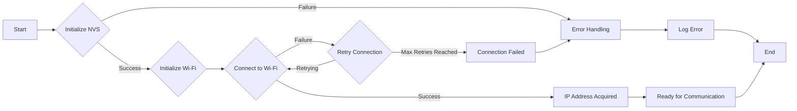
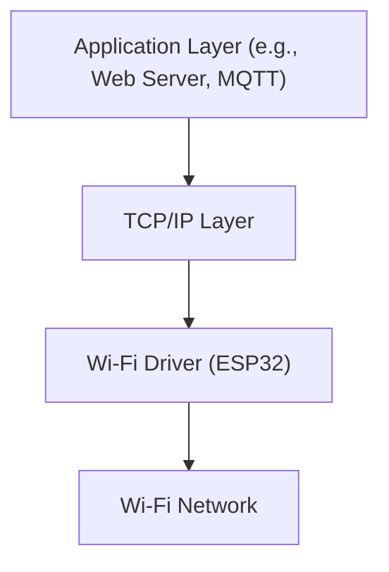

# Wi-Fi Connectivity

This document describes the implementation of Wi-Fi connectivity in the Wall-E project, specifically focusing on remote access and control capabilities. The Wi-Fi functionality is implemented using the ESP32's Wi-Fi stack and integrates with the existing codebase for line following and self-balancing functionalities.

## Key Features

*   **Station Mode:** The ESP32 connects to an existing Wi-Fi network in station mode.
*   **Automatic Reconnection:** Implements a retry mechanism to automatically reconnect if the connection is lost.
*   **Event Handling:** Utilizes the ESP-IDF event loop to handle Wi-Fi connection events.
*   **Secure Connection:** Configured to use WPA2-PSK for secure communication.
*   **IP Address Acquisition:** Obtains an IP address from the Wi-Fi network using DHCP.

## Implementation Details

The Wi-Fi connectivity is implemented primarily in the `wifi_handler.c` file, which is present in both the `6_line_following` and `7_self_balancing` directories. The implementation is largely the same across both projects, providing a consistent Wi-Fi interface.

### Initialization

The `connect_to_wifi()` function initializes the Non-Volatile Storage (NVS) and then calls `wifi_init_sta()` to initialize and start the Wi-Fi connection.

```c
#include "wifi_handler.h"

void connect_to_wifi()
{
    esp_err_t ret = nvs_flash_init();
    if (ret == ESP_ERR_NVS_NO_FREE_PAGES || ret == ESP_ERR_NVS_NEW_VERSION_FOUND) 
    {
      ESP_ERROR_CHECK(nvs_flash_erase());
      ret = nvs_flash_init();
    }
    ESP_ERROR_CHECK(ret);

    ESP_LOGI(TAG, "ESP_WIFI_MODE_STA");
    wifi_init_sta();
}
```

[View on GitHub](https://github.com/SRA-VJTI/Wall-E/blob/master/6_line_following/main/wifi_handler.c)

The NVS is used to store Wi-Fi configuration data. If the NVS is corrupted or a new version is found, it is erased and reinitialized.

### Wi-Fi Station Initialization

The `wifi_init_sta()` function performs the following steps:

1.  Creates an event group to manage Wi-Fi connection events.
2.  Initializes the ESP-IDF network interface.
3.  Creates a default Wi-Fi station network interface.
4.  Initializes the Wi-Fi driver.
5.  Registers event handlers for Wi-Fi and IP events.
6.  Configures the Wi-Fi connection parameters (SSID, password, authentication mode).
7.  Starts the Wi-Fi driver.
8.  Waits for the connection to be established or to fail.

```c
void wifi_init_sta(void)
{
    s_wifi_event_group = xEventGroupCreate();

    ESP_ERROR_CHECK(esp_netif_init());

    esp_netif_create_default_wifi_sta();

    wifi_init_config_t cfg = WIFI_INIT_CONFIG_DEFAULT();
    ESP_ERROR_CHECK(esp_wifi_init(&cfg));

    esp_event_handler_instance_t instance_any_id;
    esp_event_handler_instance_t instance_got_ip;
    ESP_ERROR_CHECK(esp_event_handler_instance_register(WIFI_EVENT,
                                                        ESP_EVENT_ANY_ID,
                                                        &event_handler,
                                                        NULL,
                                                        &instance_any_id));
    ESP_ERROR_CHECK(esp_event_handler_instance_register(IP_EVENT,
                                                        IP_EVENT_STA_GOT_IP,
                                                        &event_handler,
                                                        NULL,
                                                        &instance_got_ip));

    wifi_config_t wifi_config = {
        .sta = {
            .ssid = WIFI_SSID,
            .password = WIFI_PASS,
	     .threshold.authmode = WIFI_AUTH_WPA2_PSK,

            .pmf_cfg = {
                .capable = true,
                .required = false
            },
        },
    };
    ESP_ERROR_CHECK(esp_wifi_set_mode(WIFI_MODE_STA) );
    ESP_ERROR_CHECK(esp_wifi_set_config(ESP_IF_WIFI_STA, &wifi_config) );
    ESP_ERROR_CHECK(esp_wifi_start() );

    ESP_LOGI(TAG, "wifi_init_sta finished.");
}
```

[View on GitHub](https://github.com/SRA-VJTI/Wall-E/blob/master/6_line_following/main/wifi_handler.c)

This code snippet initializes the Wi-Fi stack and configures it to connect to the specified Wi-Fi network.

### Event Handling

The `event_handler()` function is registered to handle Wi-Fi and IP events. It handles the following events:

*   `WIFI_EVENT_STA_START`: Connects to the Wi-Fi network.
*   `WIFI_EVENT_STA_DISCONNECTED`: Retries the connection if the connection is lost, up to a maximum number of retries.
*   `IP_EVENT_STA_GOT_IP`: Logs the IP address and sets the `WIFI_CONNECTED_BIT` in the event group.

```c
static void event_handler(void* arg, esp_event_base_t event_base, int32_t event_id, void* event_data)
{
    if (event_base == WIFI_EVENT && event_id == WIFI_EVENT_STA_START) 
    {
        esp_wifi_connect();
    } 
    else if (event_base == WIFI_EVENT && event_id == WIFI_EVENT_STA_DISCONNECTED) 
    {
        if (s_retry_num < MAXIMUM_RETRY) {
            esp_wifi_connect();
            s_retry_num++;
            ESP_LOGI(TAG, "retry to connect to the AP");
        } else {
            xEventGroupSetBits(s_wifi_event_group, WIFI_FAIL_BIT);
        }
        ESP_LOGI(TAG,"connect to the AP fail");
    } 
    else if (event_base == IP_EVENT && event_id == IP_EVENT_STA_GOT_IP) 
    {
        ip_event_got_ip_t* event = (ip_event_got_ip_t*) event_data;
        ESP_LOGI(TAG, "got ip:" IPSTR, IP2STR(&event->ip_info.ip));
        s_retry_num = 0;
        xEventGroupSetBits(s_wifi_event_group, WIFI_CONNECTED_BIT);
    }
}
```

[View on GitHub](https://github.com/SRA-VJTI/Wall-E/blob/master/6_line_following/main/wifi_handler.c)

This event handler manages the Wi-Fi connection lifecycle, including connecting, retrying on disconnection, and handling IP address acquisition.

### Configuration

The Wi-Fi configuration parameters, such as the SSID and password, are defined as macros in the `wifi_handler.h` file.

```c
#define WIFI_SSID      "YOUR_WIFI_SSID"
#define WIFI_PASS      "YOUR_WIFI_PASSWORD"
#define MAXIMUM_RETRY  10

#define WIFI_CONNECTED_BIT BIT0
#define WIFI_FAIL_BIT      BIT1
```

[View on GitHub](https://github.com/SRA-VJTI/Wall-E/blob/master/6_line_following/main/wifi_handler.c)

These macros should be updated with the actual SSID and password of the Wi-Fi network.  It's best practice to store these securely (e.g., not directly in the code).

## Wi-Fi Connection Flow





This diagram illustrates the basic flow of establishing a Wi-Fi connection.

### Error Handling

The code includes basic error handling using the `ESP_ERROR_CHECK()` macro. This macro checks the return value of ESP-IDF functions and logs an error message if the function fails. In a production environment, more robust error handling should be implemented.

## Key Integration Points

The `connect_to_wifi()` function is typically called at the beginning of the `app_main()` function in the main application file. This ensures that the Wi-Fi connection is established before any other functionality is initialized.  After Wi-Fi is connected, you can initialize network services such as a web server, MQTT client, or other communication protocols.

```c
void app_main(void)
{
    // Initialize Wi-Fi
    connect_to_wifi();

    // Initialize other components
    // ...
}
```

This integration point ensures that the Wi-Fi connection is established early in the application lifecycle.

## Best Practices

*   **Secure Storage of Credentials:**  Avoid hardcoding Wi-Fi credentials directly in the source code. Consider using a more secure storage mechanism, such as the ESP32's NVS with encryption, or prompting the user for credentials via a configuration interface.
*   **Robust Error Handling:** Implement more comprehensive error handling to gracefully handle connection failures and other errors. This could include logging errors to a file or sending error notifications to a remote server.
*   **Connection Monitoring:** Monitor the Wi-Fi connection status and automatically reconnect if the connection is lost. The existing retry mechanism provides a basic level of connection monitoring, but it could be enhanced with more sophisticated techniques, such as periodically pinging a remote server to verify connectivity.
*   **Power Management:** Optimize power consumption by enabling Wi-Fi power-saving modes.  The ESP32 provides several power-saving modes that can reduce power consumption when Wi-Fi is not actively being used.

## Remote Access

Once the Wi-Fi connection is established, Wall-E can be accessed and controlled remotely. This can be achieved through various methods, such as:

*   **Web Server:** Implementing a web server on the ESP32 allows users to control Wall-E through a web browser.
*   **MQTT:** Using the MQTT protocol allows Wall-E to communicate with a central server, enabling remote control and monitoring.
*   **Custom Protocol:** Implementing a custom protocol allows for tailored communication between Wall-E and a remote client.

The specific method used will depend on the requirements of the application.

## Network Stack





This diagram illustrates the network stack used for Wi-Fi communication.

## Additional Considerations

*   **OTA Updates:** The Wi-Fi connection can be used to implement Over-The-Air (OTA) firmware updates, allowing Wall-E to be updated remotely.
*   **Cloud Integration:** Wall-E can be integrated with cloud services for data logging, remote monitoring, and control.
*   **Security:** Implement appropriate security measures to protect Wall-E from unauthorized access. This includes using strong Wi-Fi passwords, encrypting communication, and implementing authentication mechanisms.
```