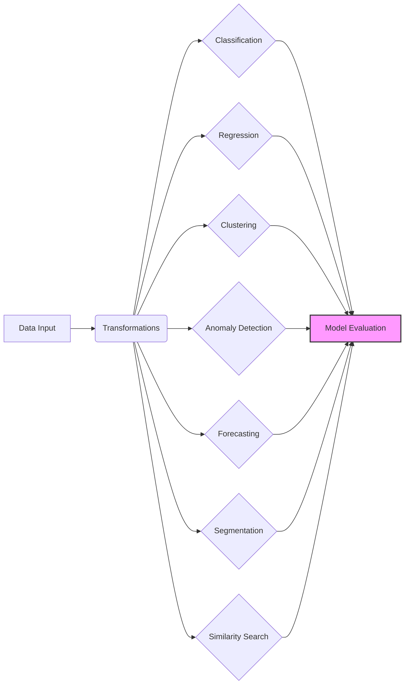
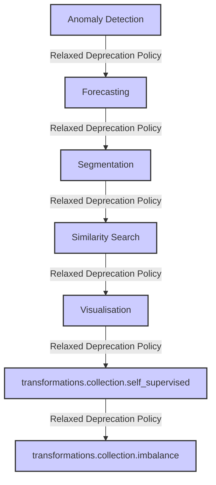

---
title: Introduction to aeon
description: A high-level overview of the aeon toolkit and its purpose for time series analysis.
---

# Introduction to aeon

`aeon` is an open-source Python toolkit designed to facilitate machine learning on time series data. Fully compatible with `scikit-learn`, `aeon` brings together a comprehensive collection of algorithms for tasks such as time series classification, regression, clustering, anomaly detection, forecasting, and similarity search. The primary goal of `aeon` is to provide researchers and practitioners with state-of-the-art methods for time series analysis, efficient implementations optimized with `numba`, and tools to ensure reproducible research.

## Key Features

*   **Comprehensive Algorithm Suite**: `aeon` offers a wide range of time series algorithms, from classical methods to the latest machine learning techniques.
*   **`scikit-learn` Compatibility**: Seamless integration with the `scikit-learn` ecosystem allows users to leverage familiar workflows and tools.
*   **Optimized Performance**: Efficient implementations using `numba` ensure high performance, even with large datasets.
*   **Reproducible Research**: Tools and guidelines promote reproducible research in time series machine learning.
*   **Modular Design**: The toolkit is structured into modules for different time series tasks, making it easy to find and use the right tools for the job.

## Core Modules

`aeon` is organized into several key modules, each addressing a specific area of time series analysis:

*   **Classification**: Predict class labels for time series data.
*   **Regression**: Predict continuous values for time series data.
*   **Clustering**: Group similar time series together.
*   **Anomaly Detection**: Identify unusual patterns or outliers in time series.
*   **Forecasting**: Predict future values of a time series.
*   **Segmentation**: Divide a time series into meaningful segments.
*   **Similarity Search**: Find similar time series or patterns within time series.
*   **Transformations**: Preprocess time series data to improve model performance.
*   **Distances**: Calculate distances between time series.
*   **Networks**: Deep learning models for time series tasks.

## Installation

`aeon` requires Python 3.10 or greater. The recommended way to install `aeon` is using pip:

```bash
pip install aeon
```

For users who need all optional dependencies:

```bash
pip install aeon[all_extras]
```

[View on GitHub](https://github.com/aeon-toolkit/aeon/blob/main/README.md)

## Getting Started: Classification Example

Here's a simple example demonstrating how to use `aeon` for time series classification:

```python
import numpy as np
from aeon.classification.distance_based import KNeighborsTimeSeriesClassifier

# Sample data: 3 time series, each with 1 channel and 6 time points
X = np.array([[[1, 2, 3, 4, 5, 5]],
              [[1, 2, 3, 4, 4, 2]],
              [[8, 7, 6, 5, 4, 4]]])
y = np.array(['low', 'low', 'high'])

# Initialize and fit the classifier
clf = KNeighborsTimeSeriesClassifier(distance="dtw")
clf.fit(X, y)

# Predict labels for new data
X_test = np.array([[[2, 2, 2, 2, 2, 2]], [[5, 5, 5, 5, 5, 5]], [[6, 6, 6, 6, 6, 6]]])
y_pred = clf.predict(X_test)

print(y_pred) # Output: ['low' 'high' 'high']
```

This code snippet showcases the ease of using `aeon` for classification tasks, leveraging the `KNeighborsTimeSeriesClassifier`. [View on GitHub](https://github.com/aeon-toolkit/aeon/blob/main/README.md)

## Getting Started: Clustering Example

Here's a clustering example using TimeSeriesKMeans:

```python
import numpy as np
from aeon.clustering import TimeSeriesKMeans

# Sample data: 3 time series, each with 1 channel and 6 time points
X = np.array([[[1, 2, 3, 4, 5, 5]],
              [[1, 2, 3, 4, 4, 2]],
              [[8, 7, 6, 5, 4, 4]]])

# Initialize and fit the clusterer
clu = TimeSeriesKMeans(distance="dtw", n_clusters=2)
clu.fit(X)

# Get training cluster labels
print(clu.labels_)

# Assign clusters to new data
X_test = np.array([[[2, 2, 2, 2, 2, 2]], [[5, 5, 5, 5, 5, 5]], [[6, 6, 6, 6, 6, 6]]])
print(clu.predict(X_test))
```

This demonstrates how to use the `TimeSeriesKMeans` algorithm for clustering time series data.  [View on GitHub](https://github.com/aeon-toolkit/aeon/blob/main/README.md)

## Data Structures

`aeon` primarily uses `numpy` arrays to store time series data. Single time series are typically represented as 1D or 2D arrays, while collections of time series are stored as 3D arrays. This is shown in the [getting started guide](https://www.aeon-toolkit.org/en/stable/getting_started.html).

```python
>>> from aeon.datasets import load_airline
>>> y = load_airline()  # load an example univariate series as an array
>>> y[:5]  # first five time points
606.0
508.0
461.0
390.0
432.0
```

[View on GitHub](https://github.com/aeon-toolkit/aeon/blob/main/docs/getting_started.md)

Collections of time series can be loaded using other datasets:

```python
>>> from aeon.datasets import load_italy_power_demand
>>> X, y = load_italy_power_demand()  # load an example univariate collection
>>> X.shape
(1096, 1, 24)
>>> X[:5, :, :5]
[[[-0.71051757 -1.1833204  -1.3724416  -1.5930829  -1.4670021 ]]
 [[-0.99300935 -1.4267865  -1.5798843  -1.6054006  -1.6309169 ]]
 [[ 1.3190669   0.56977448  0.19512825 -0.08585642 -0.17951799]]
 [[-0.81244429 -1.1575534  -1.4163852  -1.5314215  -1.5026624 ]]
 [[-0.97284033 -1.3905178  -1.5367049  -1.6202404  -1.6202404 ]]]
>>> y[:5]
['1' '1' '2' '2' '1']
```

[View on GitHub](https://github.com/aeon-toolkit/aeon/blob/main/docs/getting_started.md)

## Pipelines

`aeon` supports pipelines, enabling the combination of transformers and estimators:

```python
from aeon.datasets import load_italy_power_demand
from aeon.transformations.collection.feature_based import Catch22
from sklearn.ensemble import RandomForestClassifier
from sklearn.pipeline import make_pipeline
from sklearn.metrics import accuracy_score

# Load the italy power demand dataset
X_train, y_train = load_italy_power_demand(split="train")
X_test, y_test = load_italy_power_demand(split="test")

# Create and fit the pipeline
pipe = make_pipeline(
    Catch22(replace_nans=True),
    RandomForestClassifier(random_state=42),
)
pipe.fit(X_train, y_train)

# Make predictions
accuracy_score(pipe.predict(X_test), y_test)
```

This example demonstrates how to use a pipeline with `Catch22` for feature extraction and a `RandomForestClassifier` for classification. [View on GitHub](https://github.com/aeon-toolkit/aeon/blob/main/docs/getting_started.md)

## Transformations

Transformations play a crucial role in time series analysis, allowing users to preprocess their data before applying machine learning models. Here's how to use `AutoCorrelationSeriesTransformer`:

```python
from aeon.transformations.series import AutoCorrelationSeriesTransformer
from aeon.datasets import load_airline

acf = AutoCorrelationSeriesTransformer()
y = load_airline()  # load single series airline dataset
res = acf.fit_transform(y)
print(res[0][:5])
```

[View on GitHub](https://github.com/aeon-toolkit/aeon/blob/main/docs/getting_started.md)

## Community and Contributing

`aeon` thrives on community contributions. To contribute, review the [contributing guide](https://www.aeon-toolkit.org/en/latest/contributing.html).

## Architecture

The following diagram illustrates the high-level architecture of `aeon`, highlighting the key modules and their relationships:





This diagram outlines the flow of data through `aeon`, from initial input and transformation to the various machine learning tasks and final model evaluation.

## Experimental Modules





## Key Integration Points

`aeon` is designed to integrate seamlessly with other Python libraries, particularly those in the `scikit-learn` ecosystem. Key integration points include:

*   **Pipelines**: `aeon` transformers and estimators can be easily integrated into `scikit-learn` pipelines for streamlined workflows.
*   **Model Selection**: `scikit-learn`'s model selection tools, such as `GridSearchCV`, can be used to optimize `aeon` models.
*   **Evaluation Metrics**: `scikit-learn`'s evaluation metrics can be used to assess the performance of `aeon` models.
*   **Data Handling**:  `aeon` is designed to work with different datatypes, using a consistent interface.

By providing a comprehensive toolkit for time series machine learning and ensuring seamless integration with existing libraries, `aeon` empowers researchers and practitioners to tackle complex time series problems with ease.
```