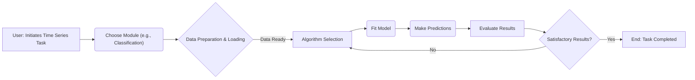

---
title: Introduction to aeon
description: A high-level overview of the aeon project, its goals, and target audience.
---

# Introduction to aeon

`aeon` is an open-source Python toolkit designed for time series machine learning. Built to be fully compatible with `scikit-learn`, `aeon` provides a comprehensive suite of algorithms for tasks such as forecasting, classification, clustering, anomaly detection, and more. The primary goal of `aeon` is to offer state-of-the-art time series methods with efficient implementations, fostering reproducible research in the field.

## Key Features

*   **Comprehensive Algorithm Library:** `aeon` offers a wide array of classical and state-of-the-art time series algorithms.
*   **`scikit-learn` Compatibility:** Seamless integration with the `scikit-learn` ecosystem.
*   **Efficient Implementations:** Algorithms are optimized for performance using `numba`.
*   **Reproducible Research:** Encourages and supports reproducible research in time series machine learning.
*   **Community-Driven:** A collaborative project with contributions from researchers and practitioners.

## Target Audience

`aeon` is designed for:

*   **Researchers:** Providing tools for exploring and developing new time series algorithms.
*   **Practitioners:** Offering robust and efficient methods for solving real-world time series problems.
*   **Data Scientists:** Enabling time series analysis within existing machine learning workflows.
*   **Students:** Serving as an educational resource for learning time series analysis techniques.

## Installation

The easiest way to install `aeon` is using pip:

```bash
pip install aeon
```

For a full installation with all optional dependencies:

```bash
pip install aeon[all_extras]
```

[View on GitHub](https://github.com/aeon-toolkit/aeon/blob/main/README.md)

## Getting Started

Here's a basic example of using `aeon` for time series classification:

```python
import numpy as np
from aeon.classification.distance_based import KNeighborsTimeSeriesClassifier

X = np.array([[[1, 2, 3, 4, 5, 5]],
             [[1, 2, 3, 4, 4, 2]],
             [[8, 7, 6, 5, 4, 4]]])
y = np.array(['low', 'low', 'high'])

clf = KNeighborsTimeSeriesClassifier(distance="dtw")
clf.fit(X, y)

X_test = np.array(
    [[[2, 2, 2, 2, 2, 2]], [[5, 5, 5, 5, 5, 5]], [[6, 6, 6, 6, 6, 6]]]
)
y_pred = clf.predict(X_test)
print(y_pred)
```

This snippet demonstrates fitting a `KNeighborsTimeSeriesClassifier` to sample time series data and making predictions.  [View on GitHub](https://github.com/aeon-toolkit/aeon/blob/main/README.md)

## Clustering Example

```python
import numpy as np
from aeon.clustering import TimeSeriesKMeans

X = np.array([[[1, 2, 3, 4, 5, 5]],
             [[1, 2, 3, 4, 4, 2]],
             [[8, 7, 6, 5, 4, 4]]])

clu = TimeSeriesKMeans(distance="dtw", n_clusters=2)
clu.fit(X)

print(clu.labels_)

X_test = np.array(
    [[[2, 2, 2, 2, 2, 2]], [[5, 5, 5, 5, 5, 5]], [[6, 6, 6, 6, 6, 6]]]
)
print(clu.predict(X_test))
```

This code shows how to perform time series clustering using `TimeSeriesKMeans`. [View on GitHub](https://github.com/aeon-toolkit/aeon/blob/main/README.md)

## Project Structure

The `aeon` project is organized into several key modules:

*   **`classification`:** Time series classification algorithms.
*   **`regression`:** Time series regression algorithms.
*   **`clustering`:** Time series clustering algorithms.
*   **`anomaly_detection`:** Anomaly detection algorithms for time series.
*   **`forecasting`:** Time series forecasting methods.
*   **`segmentation`:** Time series segmentation tools.
*   **`transformations`:** Time series transformation functions.
*   **`distances`:** Distance measures for time series.
*   **`similarity_search`:** Algorithms for similarity search in time series data.
*   **`datasets`:** Data structures and utilities for handling time series datasets.
*   **`benchmarking`:** Tools for benchmarking and evaluating time series algorithms.
*   **`networks`:** Deep learning networks designed for time series analysis.

## Contributing to aeon

`aeon` is an open-source project and welcomes contributions from the community. If you're interested in contributing, please see the [contributing guide](https://www.aeon-toolkit.org/en/latest/contributing.html).

```python
# Example of a simple contribution (hypothetical)
def add_one(x):
  """Adds one to a number.
  """
  return x + 1
```

[View on GitHub](https://github.com/aeon-toolkit/aeon)

## Roles and Governance

The `aeon` project has a well-defined governance structure with various roles. These roles are described in the [governance document](governance.md). Key roles include:

*   Code of Conduct Moderators
*   Communications Workgroup
*   Finance Workgroup
*   Infrastructure Workgroup
*   Release Management Workgroup
*   Supporting Developers
*   Core Developers

You can find more information about these roles and the people who hold them in the [About Us](about.md) section. [View on GitHub](https://github.com/aeon-toolkit/aeon/blob/main/docs/about.md)

## Funding and Affiliation

`aeon` is an affiliated project of [NumFOCUS](https://numfocus.org/). The project also receives funding from various organizations. You can find a list of funders in the [About Us](about.md) section.  This funding helps to ensure the sustainability of the project.

## Workflow Diagram





This diagram illustrates the general workflow for using `aeon` for time series tasks.

## Experimental Modules

`aeon` has experimental modules that are under active development and may have evolving interfaces. These modules include:

*   `anomaly_detection`
*   `forecasting`
*   `segmentation`
*   `similarity_search`
*   `visualisation`
*   `transformations.collection.self_supervised`
*   `transformations.collection.imbalance`

The [deprecation policy](developer_guide/deprecation.md) is relaxed for these modules to facilitate development. [View on GitHub](https://github.com/aeon-toolkit/aeon/blob/main/docs/index.md)

## Communication Channels

`aeon` provides several communication channels for users and developers to connect:

*   **GitHub:** [github.com/aeon-toolkit/aeon](https://github.com/aeon-toolkit/aeon)
*   **Slack:** [aeon slack](https://join.slack.com/t/aeon-toolkit/shared_invite/zt-36dlmbouu-vajTShUYAHopSXUUVtHGzw)
*   **LinkedIn:** [linkedin/aeon-toolkit](https://www.linkedin.com/company/aeon-toolkit)
*   **X/Twitter:** [twitter/aeon-toolkit](https://twitter.com/aeon_toolkit)
*   **Medium Blog:** [medium/aeon.toolkit](https://medium.com/@aeon.toolkit)
*   **Email:** [contact@aeon-toolkit.org](mailto:contact@aeon-toolkit.org)

## Example Transformation

```python
from aeon.transformations.series.exponent import ExponentTransformer
import pandas as pd

# Sample time series data
data = pd.Series([1, 4, 9, 16, 25])

# Initialize the ExponentTransformer with an exponent of 0.5 (square root)
transformer = ExponentTransformer(power=0.5)

# Fit and transform the data
transformed_data = transformer.fit_transform(data)

print(transformed_data)
```

This example shows how to use the `ExponentTransformer` to apply a power transformation to a time series. [View on GitHub](https://github.com/aeon-toolkit/aeon/blob/main/aeon/transformations/series/exponent.py)

## Key Integration Points

*   **`scikit-learn` Pipelines:** `aeon` estimators and transformers can be seamlessly integrated into `scikit-learn` pipelines, allowing for complex machine learning workflows.
*   **Data Input Formats:** `aeon` supports various time series data formats, including NumPy arrays, pandas DataFrames, and specialized `aeon` data containers, ensuring flexibility in data handling.
*   **Benchmarking Tools:** `aeon` provides tools for benchmarking algorithms and comparing their performance, facilitating evidence-based algorithm selection.

## Best Practices

*   **Understand Your Data:** Before applying any algorithm, thoroughly analyze your time series data to understand its characteristics (e.g., seasonality, trend, stationarity).
*   **Experiment with Different Algorithms:** `aeon` offers a wide range of algorithms. Experiment with different methods to find the best solution for your specific problem.
*   **Use Pipelines for Complex Workflows:** Leverage `scikit-learn` pipelines to create modular and reproducible machine learning workflows.
*   **Evaluate Performance Carefully:** Use appropriate evaluation metrics and techniques to assess the performance of your models.
*   **Stay Updated:** Keep up with the latest developments in `aeon` by following the project's communication channels.
```