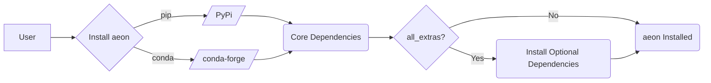

---
title: Installation and Setup
description: Guide to installing and configuring aeon for different environments.
---

# Installation and Setup

This guide provides instructions for installing and configuring `aeon` in various environments. Whether you're a data scientist using pre-built estimators or a developer contributing to the codebase, this document will guide you through the setup process.

## Installation Options

`aeon` offers several installation methods, each suited to different use cases:

*   **PyPi Release:** Install the latest stable release from PyPi for general use.
*   **Conda-Forge Release:** Install from conda-forge as an alternative release installation.
*   **GitHub Development Version:** Install the bleeding-edge version from GitHub, including the latest features and bug fixes.
*   **Source Build:** Build `aeon` from source, required for contributing to the codebase.

`aeon` officially supports Python versions 3.9, 3.10, 3.11 and 3.12.

## Installing the Latest Release from PyPi

This is the recommended installation method for most users. It provides a stable version of `aeon` with core dependencies.

### Creating a Virtual Environment

Before installing `aeon`, it's highly recommended to create a virtual environment to avoid dependency conflicts.

```bash
python -m venv aeon-venv # Or python3 -m venv aeon-venv on Linux
source aeon-venv/bin/activate # On macOS and Linux
aeon-venv\Scripts\activate # On Windows
```

[View on GitHub](https://github.com/aeon-toolkit/aeon/blob/main/docs/installation.md)

### Installing `aeon` with Core Dependencies

To install `aeon` with core dependencies using `pip`:

```bash
pip install -U aeon
```

[View on GitHub](https://github.com/aeon-toolkit/aeon/blob/main/docs/installation.md)

This command installs the foundational packages needed to run `aeon`.

### Installing `aeon` with All Stable Dependencies

To install `aeon` with all stable dependencies, including optional ones, use the `all_extras` modifier:

```bash
pip install -U aeon[all_extras]
```

[View on GitHub](https://github.com/aeon-toolkit/aeon/blob/main/docs/installation.md)

If the above command results in a "no matches found" error, this may be due to shell handling of special characters. In this case, try surrounding the dependency portion with quotes:

```bash
pip install -U aeon"[all_extras]"
```

### Verifying the Installation

After installation, verify that `aeon` has been installed correctly:

```bash
pip show aeon  # See information about the installation i.e. version and file location
pip freeze  # See all installed packages for the current environment
```

## Installing the Latest Release from Conda-Forge

As an alternative to pip, you can install `aeon` from `conda-forge`.

### Creating a Conda Environment

Create a new conda environment for `aeon`:

```bash
conda create -n aeon-env -c conda-forge aeon
conda activate aeon-env
```

### Verifying the Installation

Post-installation, verify the installation with:

```bash
conda list aeon  # See information about the installation i.e. version and file location
conda list  # See all installed packages for the current environment
```

For `conda` installations, optional dependencies must be installed separately.

## Installing the Latest Development Version Using Pip

To install the latest development version of `aeon` directly from GitHub:

### Uninstalling Existing Installations

If you have an existing `aeon` installation, uninstall it first:

```bash
pip uninstall aeon
```

### Installing from GitHub

Install the `main` branch directly from GitHub using `pip`:

```bash
pip install -U git+https://github.com/aeon-toolkit/aeon.git@main
```

[View on GitHub](https://github.com/aeon-toolkit/aeon/blob/main/docs/installation.md)

To install with all stable dependencies:

```bash
pip install -U "aeon[all_extras] @ git+https://github.com/aeon-toolkit/aeon.git@main"
```

## Developer Installation

For contributing to `aeon`, you'll need to build it from source.

### Cloning the Repository

Fork the `aeon` repository on GitHub and clone it locally:

```bash
git clone https://github.com/your-username/aeon.git
cd aeon
```

### Building `aeon` from Source

Navigate to the cloned directory and install in editable mode with development dependencies:

```bash
pip install --editable .[dev]
```

[View on GitHub](https://github.com/aeon-toolkit/aeon/blob/main/docs/developer_guide/dev_installation.md)

If you need to work with optional dependencies, install the `all_extras` extras:

```bash
pip install --editable .[dev,all_extras]
```

### Installing Pre-commit

Install pre-commit to run code checks before committing:

```bash
pre-commit install
```

[View on GitHub](https://github.com/aeon-toolkit/aeon/blob/main/docs/developer_guide/dev_installation.md)

This is a requirement for pull requests.

## Troubleshooting

### `ModuleNotFoundError`

This error usually occurs when using an estimator that requires a missing package. Install the missing package, or install `aeon` with maximum dependencies.

### `ImportError`

Ensure your virtual environment is activated and linked to your IDE.

### Installing `all_extras` on Mac with an ARM processor

Some libraries in `all_extras` are incompatible with ARM processors. Try installing soft dependencies separately.

### `no matches found` when installing `all_extras`

Surround the dependency portion with quotes: `pip install -U aeon"[all_extras]"`.

## Dependencies Flow





## Key Integration Points

The installation process integrates with package managers like `pip` and `conda`, allowing you to manage `aeon`'s dependencies alongside other packages in your environment. Using virtual environments ensures a clean and isolated setup, preventing conflicts and maintaining reproducibility. The developer installation process utilizes pre-commit hooks to maintain code quality and consistency.

By following these steps, you can successfully install and configure `aeon` for various development and deployment scenarios.