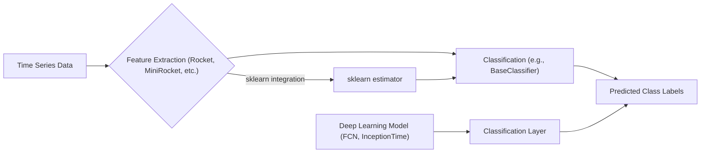
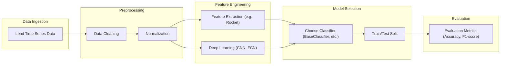

# Classification Module

The classification module in aeon provides a comprehensive suite of algorithms for time series classification. It includes base classes, various classification approaches (convolution-based, deep learning), and utilities for model evaluation and selection. This module aims to provide a flexible and extensible framework for researchers and practitioners working with time series data.

## BaseClassifier: The Foundation

The `BaseClassifier` class in `aeon/classification/base.py` serves as the abstract base class for all time series classifiers in aeon. It defines the core methods that all classifiers must implement, such as `fit` and `predict`. It also provides common functionality for handling class labels and managing the fitted state of the classifier.

Key Features:

-   Abstract methods for `fit` and `predict`.
-   Management of class labels (`classes_`, `n_classes_`, `_class_dictionary`).
-   Fitted state tracking (`is_fitted`).
-   Input validation and preprocessing.

```python
from aeon.classification.base import BaseClassifier
from aeon.utils.validation.collection import get_n_cases
import numpy as np

class ExampleClassifier(BaseClassifier):
    """Example classifier class."""

    def __init__(self):
        self.param = 1  # Example parameter
        super().__init__()

    def _fit(self, X, y):
        """Fit method for the example classifier."""
        # Store some information about the training data
        self.n_cases_ = get_n_cases(X)
        self.classes_ = np.unique(y)
        self.n_classes_ = len(self.classes_)
        return self

    def _predict(self, X):
        """Predict method for the example classifier."""
        # Simple prediction: return the first class for all instances
        return np.array([self.classes_[0]] * get_n_cases(X))
```

[View on GitHub](https://github.com/aeon-toolkit/aeon/blob/main/aeon/classification/base.py)

### Understanding the `fit` method:

The `fit` method is decorated with `@final`, preventing subclasses from overriding it directly. This ensures a consistent fitting process across all classifiers. The `_fit_setup` method handles input validation and preprocessing, while the `_fit` method (which must be implemented by subclasses) contains the actual fitting logic.

### `predict` and `predict_proba` methods:

Similar to `fit`, the `predict` and `predict_proba` methods are also decorated with `@final`. These methods ensure consistent prediction behavior across classifiers. The `_predict` and `_predict_proba` methods, which must be implemented by subclasses, contain the specific prediction logic.

## Convolution-Based Classifiers

The `aeon/classification/convolution_based` directory contains several classifiers that leverage convolutional neural networks (CNNs) for time series classification. These classifiers include:

-   **RocketClassifier**: Uses random convolutional kernels for feature extraction.
-   **MiniRocketClassifier**: An optimized version of Rocket.
-   **MultiRocketClassifier**: An ensemble of Rocket classifiers.
-   **Arsenal**: An ensemble of random convolutional models.
-   **HydraClassifier**: Integrates multiple feature extraction techniques with a classifier.
-   **MultiRocketHydraClassifier**: Combines the benefits of MultiRocket and Hydra.

### RocketClassifier

Rocket (RandOm Convolutional KErnel Transform) is a transform that generates random convolutional kernels, applies them to the input time series, and extracts features such as the proportion of positive values.

```python
from aeon.classification.convolution_based import RocketClassifier
from aeon.datasets import load_basic_motions

# Load a sample dataset
X, y = load_basic_motions(split="train")

# Create a RocketClassifier instance
rocket = RocketClassifier(num_kernels=100)

# Fit the classifier to the training data
rocket.fit(X, y)

# Predict the class labels for the test data
X_test, _ = load_basic_motions(split="test")
y_pred = rocket.predict(X_test)
```

[View on GitHub](https://github.com/aeon-toolkit/aeon/blob/main/aeon/classification/convolution_based/_rocket.py)

### MiniRocketClassifier

MiniRocket is a simplified and accelerated version of the ROCKET transform, designed for efficient time series classification. It retains the core principles of random convolutional kernels but employs optimizations for faster computation.

```python
from aeon.classification.convolution_based import MiniRocketClassifier
from aeon.datasets import load_unit_test

# Load a sample dataset
X, y = load_unit_test(split="train")

# Create a MiniRocketClassifier instance
minirocket = MiniRocketClassifier()

# Fit the classifier to the training data
minirocket.fit(X, y)

# Predict the class labels for the test data
X_test, _ = load_unit_test(split="test")
y_pred = minirocket.predict(X_test)
```

[View on GitHub](https://github.com/aeon-toolkit/aeon/blob/main/aeon/classification/convolution_based/_minirocket.py)

## Deep Learning Classifiers

The `aeon/classification/deep_learning` directory houses various deep learning-based classifiers for time series data. These classifiers leverage neural network architectures to learn complex patterns and features from the data. The module includes implementations of:

-   **TimeCNNClassifier**: A CNN-based classifier.
-   **EncoderClassifier**: A classifier based on an encoder-decoder architecture.
-   **FCNClassifier**: A fully convolutional network classifier.
-   **InceptionTimeClassifier**: A classifier based on the InceptionTime architecture.
-   **MLPClassifier**: A multi-layer perceptron classifier.
-   **ResNetClassifier**: A classifier based on the ResNet architecture.
-   **LITETimeClassifier**: A classifier based on the LITETime architecture.
    "DisjointCNNClassifier": A classifier which splits the time series into disjoint chunks and uses a CNN to classify them.

### FCNClassifier

The FCNClassifier (Fully Convolutional Network Classifier) is a deep learning model designed for time series classification. It utilizes a fully convolutional architecture, which means it consists of convolutional layers without any fully connected layers. This architecture is well-suited for capturing temporal dependencies in time series data.

```python
from aeon.classification.deep_learning import FCNClassifier
from aeon.datasets import load_unit_test

# Load a sample dataset
X, y = load_unit_test(split="train")

# Create an FCNClassifier instance
fcn = FCNClassifier(n_epochs=20)

# Fit the classifier to the training data
fcn.fit(X, y)

# Predict the class labels for the test data
X_test, _ = load_unit_test(split="test")
y_pred = fcn.predict(X_test)
```

[View on GitHub](https://github.com/aeon-toolkit/aeon/blob/main/aeon/classification/deep_learning/_fcn.py)

### InceptionTimeClassifier

The InceptionTimeClassifier is a deep learning model for time series classification based on the InceptionTime architecture. It employs multiple parallel inception modules to capture temporal features at different scales.

```python
from aeon.classification.deep_learning import InceptionTimeClassifier
from aeon.datasets import load_unit_test

# Load a sample dataset
X, y = load_unit_test(split="train")

# Create an InceptionTimeClassifier instance
it = InceptionTimeClassifier(n_epochs=20)

# Fit the classifier to the training data
it.fit(X, y)

# Predict the class labels for the test data
X_test, _ = load_unit_test(split="test")
y_pred = it.predict(X_test)
```

[View on GitHub](https://github.com/aeon-toolkit/aeon/blob/main/aeon/classification/deep_learning/_inception_time.py)





## Key Integration Points

The classification module in aeon is designed to integrate seamlessly with other aeon modules and with the broader scikit-learn ecosystem.

-   **Base Class Integration**: All classifiers inherit from `BaseClassifier`, ensuring a consistent interface for fitting, predicting, and evaluating models.
-   **Data Handling**: The module supports various input data formats, including NumPy arrays and lists of arrays, providing flexibility in handling different types of time series data.
-   **Scikit-learn Compatibility**: Classifiers can be used with scikit-learn tools for model selection, evaluation, and pipelining.
-   **Extensibility**: The module is designed to be easily extended with new classifiers and feature extraction techniques.

```python
from sklearn.model_selection import GridSearchCV
from sklearn.pipeline import Pipeline
from aeon.classification.convolution_based import RocketClassifier
from aeon.transformers.series_to_series import Differencer
from aeon.datasets import load_unit_test

# Load a sample dataset
X, y = load_unit_test(split="train")

# Define a pipeline with a transformer and a classifier
pipeline = Pipeline([
    ("differencer", Differencer()),
    ("classifier", RocketClassifier())
])

# Define a grid of hyperparameters to search
param_grid = {
    "classifier__num_kernels": [100, 200, 300]
}

# Perform grid search cross-validation
grid_search = GridSearchCV(pipeline, param_grid, cv=3)
grid_search.fit(X, y)

# Print the best hyperparameters and score
print("Best hyperparameters:", grid_search.best_params_)
print("Best score:", grid_search.best_score_)
```

[View on GitHub](https://github.com/aeon-toolkit/aeon/blob/main/aeon/classification/base.py)

This module provides a wide array of tools for time series classification, ranging from classical algorithms to state-of-the-art deep learning models. Its modular design and clear structure make it easy to use, extend, and integrate with other parts of the aeon library.




