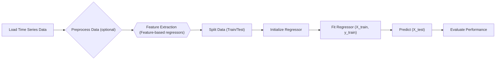

---
title: Regression Module
description: Details on time series regression models and their usage in aeon.
---

# Regression Module

This module provides a comprehensive suite of time series regression models within the aeon toolkit. Regression tasks involve predicting a continuous target variable based on time series data. This section details the abstract base class, deep learning models, and feature-based regression approaches available in aeon.

## Base Regressor

The `BaseRegressor` class (`aeon/regression/base.py`) serves as the foundation for all time series regressors in aeon. It defines the essential methods that each regressor must implement, ensuring a consistent interface across different models.

```python title="aeon/regression/base.py"
from abc import abstractmethod
from typing import final

import numpy as np
import pandas as pd
from sklearn.base import RegressorMixin

from aeon.base import BaseCollectionEstimator
from aeon.base._base import _clone_estimator


class BaseRegressor(RegressorMixin, BaseCollectionEstimator):
    """Abstract base class for time series regressors."""

    _tags = {
        "fit_is_empty": False,
        "capability:train_estimate": False,
        "capability:contractable": False,
    }

    @abstractmethod
    def __init__(self):
        super().__init__()

    @final
    def fit(self, X, y) -> BaseCollectionEstimator:
        """Fit time series regressor to training data."""
        ...

    @abstractmethod
    def _fit(self, X, y):
        """Fit time series regressor to training data.

        Abstract method, must be implemented.
        """
        ...

    @abstractmethod
    def _predict(self, X) -> np.ndarray:
        """Predicts labels for sequences in X.

        Abstract method, must be implemented.
        """
        ...
```

[View on GitHub](https://github.com/aeon-toolkit/aeon/blob/main/aeon/regression/base.py)

Key features of `BaseRegressor`:

-   **Abstract Methods**: Enforces the implementation of `_fit` and `_predict` in derived classes, ensuring all regressors define fitting and prediction logic.
-   **`fit` Method**: A final method that handles input validation, preprocessing, and the fitting process. It calls the `_fit` method, which must be implemented by the specific regressor.
-   **`predict` Method**: A final method that handles input validation, preprocessing, and the prediction process. It calls the `_predict` method, which must be implemented by the specific regressor.
-   **`fit_predict` Method**: Fits the regressor and predicts labels for sequences in X. Uses cross-validation by default.
-   **`score` Method**: Scores predicted labels against ground truth labels on X.

### Fitting a Regressor

The `fit` method is central to training a regressor.  It takes the time series data `X` and corresponding target values `y` as input. The method performs necessary input checks, and then calls the `_fit` method, which is specific to each regressor implementation.

```python title="Fitting process"
regressor = MyRegressor()
regressor.fit(X_train, y_train)
```

### Prediction

Once the regressor is fitted, predictions can be made using the `predict` method. It takes the time series data `X` as input and returns predicted regression values.

```python title="Prediction process"
y_pred = regressor.predict(X_test)
```

### Scoring a Regressor

The `score` method evaluates the performance of the regressor on a given dataset. It calculates a score (e.g., R-squared) by comparing the predicted values with the actual target values.

```python title="Scoring"
score = regressor.score(X_test, y_test, metric="r2")
print(f"R-squared score: {score}")
```

## Deep Learning Regressors

The `aeon.regression.deep_learning` sub-module contains various deep learning-based regressors tailored for time series data. These models leverage neural networks to learn complex patterns and relationships within the time series.

```python title="aeon/regression/deep_learning/__init__.py"
__all__ = [
    "BaseDeepRegressor",
    "TimeCNNRegressor",
    "FCNRegressor",
    "InceptionTimeRegressor",
    "IndividualInceptionRegressor",
    "ResNetRegressor",
    "IndividualLITERegressor",
    "LITETimeRegressor",
    "EncoderRegressor",
    "MLPRegressor",
    "DisjointCNNRegressor",
    "RecurrentRegressor",
]

from aeon.regression.deep_learning._cnn import TimeCNNRegressor
from aeon.regression.deep_learning._disjoint_cnn import DisjointCNNRegressor
from aeon.regression.deep_learning._encoder import EncoderRegressor
from aeon.regression.deep_learning._fcn import FCNRegressor
from aeon.regression.deep_learning._inception_time import (
    InceptionTimeRegressor,
    IndividualInceptionRegressor,
)
from aeon.regression.deep_learning._lite_time import (
    IndividualLITERegressor,
    LITETimeRegressor,
)
from aeon.regression.deep_learning._mlp import MLPRegressor
from aeon.regression.deep_learning._resnet import ResNetRegressor
from aeon.regression.deep_learning._rnn import RecurrentRegressor
from aeon.regression.deep_learning.base import BaseDeepRegressor
```

[View on GitHub](https://github.com/aeon-toolkit/aeon/blob/main/aeon/regression/deep_learning/__init__.py)

Some key deep learning regressors include:

-   **TimeCNNRegressor**: Uses convolutional neural networks (CNNs) to extract temporal features.
-   **FCNRegressor**: Implements a fully convolutional network for time series regression.
-   **InceptionTimeRegressor**: Leverages the InceptionTime architecture, which combines multiple convolutional filters at different scales.
-   **ResNetRegressor**: Employs residual networks (ResNets) to handle vanishing gradients and train deeper models.
-   **RecurrentRegressor**: Uses Recurrent Neural Networks like LSTMs and GRUs for time series regression.

### Using a Deep Learning Regressor

```python title="Using TimeCNNRegressor"
from aeon.regression.deep_learning import TimeCNNRegressor
from sklearn.model_selection import train_test_split
import numpy as np

# Generate some dummy data
X = np.random.rand(100, 1, 20)  # 100 samples, 1 channel, 20 time points
y = np.random.rand(100)

X_train, X_test, y_train, y_test = train_test_split(X, y, test_size=0.2, random_state=42)

# Initialize and fit the TimeCNNRegressor
time_cnn = TimeCNNRegressor(n_epochs=10) # Lower epochs for demonstration
time_cnn.fit(X_train, y_train)

# Make predictions
y_pred = time_cnn.predict(X_test)

print(y_pred)
```

### BaseDeepRegressor

All the deep learning regressors inherit from `BaseDeepRegressor`.
```python
from aeon.networks import TimeSeriesNetwork
from aeon.regression.base import BaseRegressor
from tensorflow import keras


class BaseDeepRegressor(BaseRegressor):
    """Abstract base class for deep learning time series regressors."""

    _tags = {
        "python_version": "<3.11",
        "algorithm_type": "deep_learning",
    }

    def __init__(self, verbose=0, random_state=None):

        self.verbose = verbose
        self.random_state = random_state

        super(BaseDeepRegressor, self).__init__()

    def build_model(self, input_shape, n_classes):
        """Construct a compiled, un-trained, keras model that is ready for training."""
        raise NotImplementedError("subclass this method")

    def _fit(self, X, y):
        """Fit the regressor on the training set (X, y).

        Parameters
        ----------
        X : np.ndarray of shape = (n_instances, n_channels, series_length)
            The training input samples.
        y : np.ndarray of shape = (n_instances)
            The training data class labels.

        Returns
        -------
        self : object
        """
        ...
```
[View on GitHub](https://github.com/aeon-toolkit/aeon/blob/main/aeon/regression/deep_learning/base.py)

## Feature-Based Regressors

The `aeon.regression.feature_based` sub-module includes regressors that extract features from time series data and then use a standard vector regressor (e.g., from scikit-learn) to predict the target variable.

```python title="aeon/regression/feature_based/__init__.py"
"""Feature based time series regressors."""

__all__ = [
    "Catch22Regressor",
    "FreshPRINCERegressor",
    "SummaryRegressor",
    "TSFreshRegressor",
]

from aeon.regression.feature_based._catch22 import Catch22Regressor
from aeon.regression.feature_based._fresh_prince import FreshPRINCERegressor
from aeon.regression.feature_based._summary import SummaryRegressor
from aeon.regression.feature_based._tsfresh import TSFreshRegressor
```

[View on GitHub](https://github.com/aeon-toolkit/aeon/blob/main/aeon/regression/feature_based/__init__.py)

Examples of feature-based regressors:

-   **Catch22Regressor**: Extracts 22 time series features using the `catch22` library.
-   **FreshPRINCERegressor**:  Extracts features using the `FreshPRINCE` method.
-   **SummaryRegressor**: Calculates basic descriptive statistics (e.g., mean, std) as features.
-   **TSFreshRegressor**: Uses the `tsfresh` library to extract a large number of time series features.

### Using a Feature-Based Regressor

```python title="Using Catch22Regressor"
from aeon.regression.feature_based import Catch22Regressor
from sklearn.ensemble import RandomForestRegressor
from sklearn.model_selection import train_test_split
import numpy as np

# Generate some dummy data
X = np.random.rand(100, 1, 20)  # 100 samples, 1 channel, 20 time points
y = np.random.rand(100)

X_train, X_test, y_train, y_test = train_test_split(X, y, test_size=0.2, random_state=42)

# Initialize and fit the Catch22Regressor with a RandomForestRegressor
catch22 = Catch22Regressor(estimator=RandomForestRegressor(random_state=42))
catch22.fit(X_train, y_train)

# Make predictions
y_pred = catch22.predict(X_test)

print(y_pred)
```

## Regression Workflow

The following Mermaid diagram illustrates a typical regression workflow in aeon:





## Key Integration Points

-   **Input Data**: All regressors accept time series data in a consistent format (NumPy arrays or lists of arrays). Ensure that the input data matches the expected format of the chosen regressor (e.g., univariate vs. multivariate).
-   **Feature Extraction**: Feature-based regressors rely on extracting relevant features from the time series. Experiment with different feature sets and feature selection techniques to improve performance.
-   **Model Selection**: Choose the regressor that is most appropriate for your data and task. Consider factors such as the complexity of the data, the available computational resources, and the desired accuracy.
-   **Hyperparameter Tuning**: Optimize the hyperparameters of the chosen regressor using techniques such as grid search or random search.
-   **Evaluation**: Evaluate the performance of the regressor using appropriate metrics such as mean squared error (MSE), R-squared, or mean absolute error (MAE).