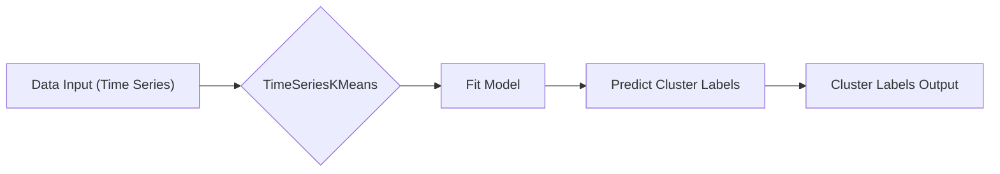
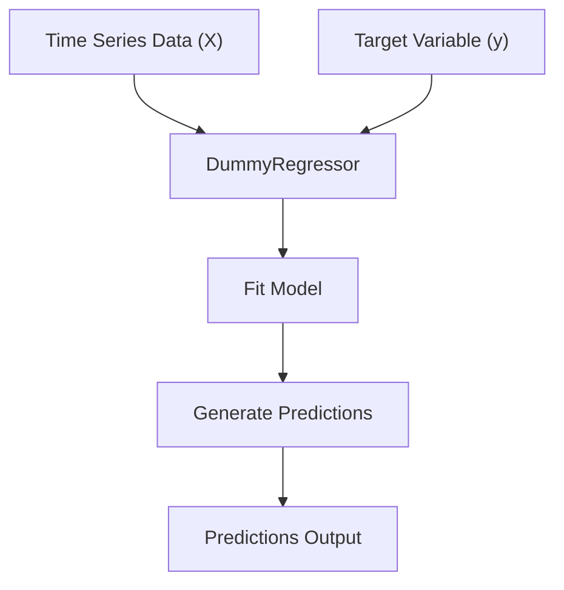

# Core Functionality

This section details the core functionality of the `aeon` toolkit, focusing on its modules for time series tasks. `aeon` provides comprehensive tools for time series classification, regression, clustering, and anomaly detection. These modules are designed with a consistent API, making it easy to integrate different algorithms and evaluate their performance.

## aeon Structure

The `aeon` package is structured as follows:

-   `aeon`: Top-level package containing core metadata and version information.
-   `aeon.classification`: Contains classes and functions for time series classification tasks.
-   `aeon.regression`: Contains classes and functions for time series regression tasks.
-   `aeon.clustering`: Contains classes and functions for time series clustering tasks.

### Version Information

The `aeon/__init__.py` file primarily defines the version of the toolkit. This is crucial for dependency management and ensuring reproducibility of results.

```python title="aeon/__init__.py"
"""aeon toolkit."""

__version__ = "1.3.0"
```

[View on GitHub](https://github.com/aeon-toolkit/aeon/blob/main/aeon/__init__.py)

### Time Series Classification

The `aeon.classification` module provides base classes and implementations for time series classification algorithms. It includes a `BaseClassifier` class that serves as the foundation for all classifiers, ensuring a consistent interface. `DummyClassifier` provides a simple baseline classifier for comparison.

```python title="aeon/classification/__init__.py"
"""Classifier Base."""

__all__ = [
    "BaseClassifier",
    "DummyClassifier",
]

from aeon.classification.base import BaseClassifier
from aeon.classification.dummy import DummyClassifier
```

[View on GitHub](https://github.com/aeon-toolkit/aeon/blob/main/aeon/classification/__init__.py)

**Example:** Instantiating the `DummyClassifier`

```python
from aeon.classification.dummy import DummyClassifier
from aeon.testing.utils.data_gen import make_example_tabular_classification

X, y = make_example_tabular_classification(n_cases=10, n_timepoints=20, return_X_y=True)
classifier = DummyClassifier()
classifier.fit(X, y)
predictions = classifier.predict(X)
print(predictions)
```

This snippet demonstrates how to import and use the `DummyClassifier` to generate predictions. It's a simple example to quickly get started with classification tasks.

### Time Series Clustering

The `aeon.clustering` module focuses on grouping similar time series together. It offers a variety of clustering algorithms, including `TimeSeriesKMeans`, `TimeSeriesKMedoids`, and `ElasticSOM`. The module also provides a `BaseClusterer` class that ensures all clustering algorithms adhere to a common API.

```python title="aeon/clustering/__init__.py"
"""Time series clustering module."""

__all__ = [
    "BaseClusterer",
    "TimeSeriesKMedoids",
    "TimeSeriesCLARA",
    "TimeSeriesCLARANS",
    "TimeSeriesKMeans",
    "TimeSeriesKShape",
    "TimeSeriesKernelKMeans",
    "KASBA",
    "ElasticSOM",
    "KSpectralCentroid",
    "DummyClusterer",
]

from aeon.clustering._clara import TimeSeriesCLARA
from aeon.clustering._clarans import TimeSeriesCLARANS
from aeon.clustering._elastic_som import ElasticSOM
from aeon.clustering._k_means import TimeSeriesKMeans
from aeon.clustering._k_medoids import TimeSeriesKMedoids
from aeon.clustering._k_sc import KSpectralCentroid
from aeon.clustering._k_shape import TimeSeriesKShape
from aeon.clustering._kasba import KASBA
from aeon.clustering._kernel_k_means import TimeSeriesKernelKMeans
from aeon.clustering.base import BaseClusterer
from aeon.clustering.dummy import DummyClusterer
```

[View on GitHub](https://github.com/aeon-toolkit/aeon/blob/main/aeon/clustering/__init__.py)

**Example:** Using `TimeSeriesKMeans`

```python
from aeon.clustering import TimeSeriesKMeans
from aeon.testing.utils.data_gen import make_example_3d_numpy

X = make_example_3d_numpy(n_cases=10, n_channels=1, n_timepoints=20, random_state=0)
kmeans = TimeSeriesKMeans(n_clusters=3, random_state=0)
kmeans.fit(X)
labels = kmeans.predict(X)
print(labels)
```

This code snippet shows how to perform time series clustering using the `TimeSeriesKMeans` algorithm. It initializes the algorithm with a specified number of clusters, fits it to the data, and then predicts the cluster labels for each time series.





### Time Series Regression

The `aeon.regression` module provides tools for predicting continuous values from time series data. Similar to classification, it includes a `BaseRegressor` class for consistent API and a `DummyRegressor` for basic baseline comparisons.

```python title="aeon/regression/__init__.py"
"""Regression Base."""

__all__ = [
    "BaseRegressor",
    "DummyRegressor",
]

from aeon.regression._dummy import DummyRegressor
from aeon.regression.base import BaseRegressor
```

[View on GitHub](https://github.com/aeon-toolkit/aeon/blob/main/aeon/regression/__init__.py)

**Example:** Instantiating the `DummyRegressor`

```python
from aeon.regression._dummy import DummyRegressor
from aeon.testing.utils.data_gen import make_example_3d_numpy
import numpy as np

X = make_example_3d_numpy(n_cases=10, n_channels=1, n_timepoints=20, random_state=0)
y = np.random.rand(10)
regressor = DummyRegressor()
regressor.fit(X, y)
predictions = regressor.predict(X)
print(predictions)
```

This snippet illustrates a basic regression task using `DummyRegressor`.  It showcases how to train a regressor and generate predictions from time series data.





### Base Classes and Dummy Implementations

Both `BaseClassifier`, `BaseClusterer`, and `BaseRegressor` are abstract base classes that define the interface for all estimators in their respective modules. `DummyClassifier`, `DummyClusterer`, and `DummyRegressor` provide simple, non-predictive baselines. These are important for sanity checks and establishing a minimal level of performance.

**Example: `BaseClassifier` Structure**

While the actual `BaseClassifier` class definition is more involved, its structure generally includes methods for `fit`, `predict`, and potentially `predict_proba`.

```python
class BaseClassifier:
    """Abstract base class for classifiers."""

    def fit(self, X, y):
        """Fit the classifier to training data."""
        raise NotImplementedError("Abstract method")

    def predict(self, X):
        """Predict class labels for X."""
        raise NotImplementedError("Abstract method")
```

## Key Integration Points

`aeon`'s design promotes modularity and extensibility. The consistent API across different modules allows users to easily swap out algorithms and compare their performance. Key integration points include:

-   **Base Estimator Classes:**  `BaseClassifier`, `BaseClusterer`, and `BaseRegressor` enforce a standardized interface, simplifying the development of new algorithms and their integration into existing workflows.
-   **Data Input Formats:** `aeon` is designed to handle various time series data formats, ensuring compatibility with different data sources and preprocessing techniques.
-   **Evaluation Metrics:** The consistent API allows users to seamlessly evaluate the performance of different algorithms using standard metrics.

**Best Practices:**

-   When developing new time series algorithms for `aeon`, inherit from the appropriate base class (`BaseClassifier`, `BaseClusterer`, or `BaseRegressor`) to ensure compatibility.
-   Utilize the dummy estimators as baselines to compare the performance of your new algorithms.
-   Follow the data format conventions used throughout `aeon` to ensure seamless integration with other modules.
```