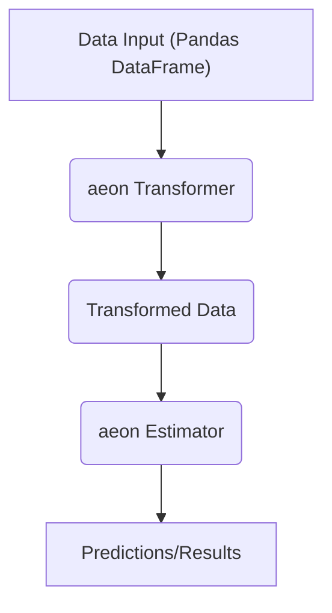

# Using aeon

`aeon` is a versatile toolkit designed for time series analysis, offering a wide range of functionalities from classification and regression to clustering and forecasting. This document provides an overview of core functionalities and usage patterns to help you get started with `aeon`.

## Core Features

*   **Estimators**: `aeon` provides a unified interface for various time series algorithms through its estimator classes. These estimators follow a `fit`-`predict` pattern, similar to scikit-learn.
*   **Transformers**: Time series transformations are a key part of `aeon`, allowing you to preprocess and engineer features from your data.
*   **Pipelines**: Combine multiple transformers and estimators into a single pipeline for streamlined workflows.
*   **Benchmarking**: Evaluate the performance of different algorithms using `aeon`'s benchmarking tools.

## Setting Up `aeon`

Before you can start using `aeon`, you need to install it. The recommended way to install `aeon` is using pip:

```bash
pip install aeon
```
[View on GitHub](https://github.com/aeon-toolkit/aeon/blob/main/aeon/__init__.py)

This command installs the latest stable release of `aeon` and its dependencies.

## Basic Usage: Time Series Classification

Let's walk through a simple example of time series classification using the `DummyClassifier`.

```python
from aeon.classification import DummyClassifier
from aeon.datasets import load_basic_motions

# Load a sample dataset
X, y = load_basic_motions(split="train")

# Initialize the classifier
classifier = DummyClassifier()

# Train the classifier
classifier.fit(X, y)

# Make predictions
X_test, _ = load_basic_motions(split="test")
predictions = classifier.predict(X_test)

print(predictions)
```
[View on GitHub](https://github.com/aeon-toolkit/aeon/blob/main/docs/examples.md)

In this example, we first load the `load_basic_motions` dataset. Then, we initialize a `DummyClassifier`, fit it to the training data, and use it to predict the labels for the test data.

## Understanding Base Estimators

The `BaseAeonEstimator` class serves as the foundation for all estimators in `aeon`. It provides essential functionalities such as cloning, resetting, and tag management.

### Inspecting Tags

Tags are metadata associated with estimators that describe their capabilities and limitations. You can access tags using the `get_tags` method:

```python
from aeon.classification import DummyClassifier

classifier = DummyClassifier()
tags = classifier.get_tags()
print(tags)
```
[View on GitHub](https://github.com/aeon-toolkit/aeon/blob/main/aeon/base/_base.py)

This code snippet retrieves and prints all the tags associated with the `DummyClassifier`.  Tags provide insights into what kind of data or problems an estimator is suitable for.

### Setting Dynamic Tags

You can also set dynamic tags to modify the behavior of an estimator:

```python
from aeon.classification import DummyClassifier

classifier = DummyClassifier()
classifier.set_tags(capability_multivariate=True)
print(classifier.get_tag("capability:multivariate"))
```
[View on GitHub](https://github.com/aeon-toolkit/aeon/blob/main/aeon/base/_base.py)

Here, we dynamically set the `capability:multivariate` tag to `True`.

### Cloning Estimators

Cloning estimators is crucial for avoiding unintended side effects when working with pipelines or performing model selection. The `clone` method creates a copy of the estimator with the same hyperparameters but a different state.

```python
from aeon.classification import DummyClassifier

classifier = DummyClassifier()
cloned_classifier = classifier.clone()

print(classifier is cloned_classifier) # False
```

This shows that `cloned_classifier` is a different object from the original `classifier`.

## Time Series Transformations

`aeon` offers a rich set of time series transformations for feature engineering and data preprocessing.  Let's look at an example using `Catch22`.

```python
from aeon.transformations.collection.catch22 import Catch22
import numpy as np
import pandas as pd

# Sample data
data = [pd.Series(np.random.rand(100)) for _ in range(5)]

# Initialize Catch22 transformer
transformer = Catch22()

# Fit and transform the data
transformed_data = transformer.fit_transform(data)

print(transformed_data.shape)  # Output: (5, 22)
```
[View on GitHub](https://github.com/aeon-toolkit/aeon/blob/main/docs/examples.md)

This example demonstrates how to use the `Catch22` transformer to extract 22 time-series features from a collection of time series.

## Pipelines

`aeon` allows creating pipelines combining transformers and estimators to create more complex models.

```python
from aeon.classification import DummyClassifier
from aeon.transformations.collection.catch22 import Catch22
from aeon.pipeline import make_pipeline
import numpy as np
import pandas as pd

# Sample data
data = [pd.Series(np.random.rand(100)) for _ in range(5)]
labels = np.array([0, 1, 0, 1, 0])

# Create a pipeline
pipeline = make_pipeline(Catch22(), DummyClassifier())

# Fit the pipeline
pipeline.fit(data, labels)

# Predict
predictions = pipeline.predict(data)
print(predictions)
```

This code constructs a pipeline that first applies the `Catch22` transformation and then uses a `DummyClassifier` for classification.

## Benchmarking

`aeon` provides tools for benchmarking time series algorithms. This allows comparing the performance of different approaches on a given dataset. Refer to the benchmarking examples for a detailed overview.
[View on GitHub](https://github.com/aeon-toolkit/aeon/blob/main/docs/examples.md)

## Visualisation

`aeon` provides visualization tools to plot time series and results from different learning tasks, enhancing understanding and insights.
[View on GitHub](https://github.com/aeon-toolkit/aeon/blob/main/docs/examples.md)

## Key Integration Points

`aeon` integrates seamlessly with other Python libraries like scikit-learn and pandas. It is a good practice to follow the base class structure as shown in `BaseAeonEstimator` to maintain consistency.





## Best Practices

*   **Data Formatting**: Ensure your time series data is in the correct format (NumPy arrays or Pandas DataFrames/Series) for `aeon` estimators.
*   **Tag Usage**: Leverage tags to understand the capabilities and limitations of different estimators.
*   **Pipeline Construction**: Use pipelines to create modular and reusable workflows.
*   **Experiment Tracking**: Keep track of your experiments and benchmark results for comparison.
```