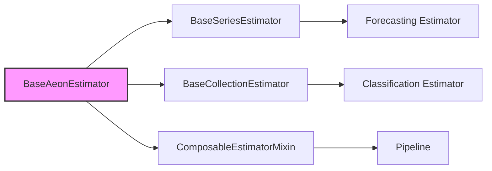

# API Reference

Welcome to the API reference for `aeon`.

The API reference describes the public classes and functions included in `aeon`, split
by package.

For an overview of the `aeon` modules see the [getting started](getting_started.md)
and [examples](examples.md) page.

```{toctree}
:maxdepth: 1

api_reference/anomaly_detection
api_reference/base
api_reference/benchmarking
api_reference/classification
api_reference/clustering
api_reference/datasets
api_reference/distances
api_reference/forecasting
api_reference/networks
api_reference/regression
api_reference/segmentation
api_reference/similarity_search
api_reference/transformations
api_reference/utils
api_reference/visualisation
```

# Base

The `aeon.base` module contains abstract base classes that serve as the foundation for all estimators in `aeon`. These base classes enforce a consistent interface and provide common functionality, promoting code reuse and simplifying the development of new estimators.

## Base Classes

This module defines the following key base classes:

*   `BaseAeonEstimator`:  The root base class for all `aeon` estimators, providing core functionality such as cloning and parameter management.
*   `BaseCollectionEstimator`:  Base class for estimators that operate on collections of time series (e.g., panel data).
*   `BaseSeriesEstimator`:  Base class for estimators that operate on single time series.
*   `ComposableEstimatorMixin`:  Mixin class that enables composition of estimators using operators like `*` and `+`.

```{eval-rst}
.. currentmodule:: aeon.base

.. autosummary::
    :toctree: auto_generated/
    :template: class.rst

    BaseAeonEstimator
    BaseCollectionEstimator
    BaseSeriesEstimator
    ComposableEstimatorMixin
```

### `BaseAeonEstimator`

This is the most fundamental base class in `aeon`.  All estimators inherit from this class, directly or indirectly. It provides methods for:

*   `clone()`: Creating a deep copy of the estimator.
*   `get_params()`: Getting the parameters of the estimator.
*   `set_params()`: Setting the parameters of the estimator.

```python
from aeon.base import BaseAeonEstimator

class MyEstimator(BaseAeonEstimator):
    """
    A simple example estimator.
    """

    def __init__(self, param1="default_value"):
        self.param1 = param1
        super().__init__()

    def fit(self, X, y=None):
        """Fit method (must be overridden)."""
        self._is_fitted = True
        return self
```

[View on GitHub](https://github.com/aeon-toolkit/aeon/blob/main/aeon/base/_base.py)

### `BaseCollectionEstimator`

This base class is for estimators that process collections of time series, often referred to as panel data.  It inherits from `BaseAeonEstimator` and provides a common interface for handling multiple time series. Common examples include time series classifiers that classify multiple time series.

```python
from aeon.base import BaseCollectionEstimator
import pandas as pd
import numpy as np

class MyCollectionEstimator(BaseCollectionEstimator):
    """
    Example estimator that works with collections of time series.
    """
    def __init__(self, param1="default_value"):
        self.param1 = param1
        super().__init__()

    def fit(self, X, y=None):
        """
        Fit method (must be overridden).

        Parameters
        ----------
        X : pd.DataFrame or np.ndarray of shape (n_instances, n_channels, series_length)
            The training input samples.
        y : array-like of shape (n_instances,) or None
            The class labels.

        Returns
        -------
        self : object
            Returns self.
        """
        self._is_fitted = True
        return self
```

[View on GitHub](https://github.com/aeon-toolkit/aeon/blob/main/aeon/base/_base_collection.py)

### `BaseSeriesEstimator`

This class serves as the base for estimators designed to work with a single time series at a time.  Like `BaseCollectionEstimator`, it inherits from `BaseAeonEstimator`. Many forecasting algorithms work on a single time series.

```python
from aeon.base import BaseSeriesEstimator
import pandas as pd

class MySeriesEstimator(BaseSeriesEstimator):
    """
    Example estimator that works with a single time series.
    """
    def __init__(self, param1="default_value"):
        self.param1 = param1
        super().__init__()

    def fit(self, X: pd.Series, y=None):
        """
        Fit method (must be overridden).

        Parameters
        ----------
        X : pd.Series
            The training input time series.
        y : array-like of shape (n_instances,) or None
            The target values (optional).

        Returns
        -------
        self : object
            Returns self.
        """
        self._is_fitted = True
        return self
```

[View on GitHub](https://github.com/aeon-toolkit/aeon/blob/main/aeon/base/_base_series.py)

### `ComposableEstimatorMixin`

This mixin class allows estimators to be composed using operators like `*` (for `TransformedTargetForecaster`-like composition) and `+` (for ensembling or feature unions).  By inheriting from this mixin, an estimator gains the ability to be combined with other estimators in a pipeline.

```python
from aeon.base import BaseEstimator, ComposableEstimatorMixin

class MyComposableEstimator(BaseEstimator, ComposableEstimatorMixin):
    """
    Example composable estimator.
    """

    def __init__(self, param1="default_value"):
        self.param1 = param1
        super().__init__()

    def fit(self, X, y=None):
        """Fit method (must be overridden)."""
        self._is_fitted = True
        return self
```

[View on GitHub](https://github.com/aeon-toolkit/aeon/blob/main/aeon/base/_compose.py)

### Example Usage

Here's an example demonstrating how to create a simple estimator using `BaseAeonEstimator`:

```python
from aeon.base import BaseAeonEstimator

class SimpleTransformer(BaseAeonEstimator):
    """
    A simple transformer that adds a constant to the input.
    """

    def __init__(self, constant=1.0):
        self.constant = constant
        super().__init__()

    def transform(self, X):
        """Transform the input."""
        return X + self.constant

    def fit(self, X, y=None):
        """Fit method (no fitting required in this case)."""
        self._is_fitted = True
        return self

# Create an instance of the transformer
transformer = SimpleTransformer(constant=5.0)

# Example input data
import pandas as pd
data = pd.Series([1, 2, 3, 4, 5])

# Fit the transformer (though it doesn't actually learn anything)
transformer.fit(data)

# Transform the data
transformed_data = transformer.transform(data)

print(transformed_data)
```

[View on GitHub](https://github.com/aeon-toolkit/aeon/blob/main/aeon/base/__init__.py)

### Benefits of Using Base Classes

*   **Consistency:** Enforces a uniform interface across all estimators.
*   **Code Reuse:** Provides common functionality, reducing boilerplate code.
*   **Extensibility:** Simplifies the creation of new estimators.
*   **Composition:** Enables the creation of complex pipelines.





### Key Integration Points

The base classes in `aeon.base` are foundational to the entire `aeon` ecosystem.  They dictate how estimators are defined, fitted, and used.  Understanding these base classes is crucial for both using and extending `aeon`.

*   **`fit()` method:**  All estimators must implement a `fit()` method that learns parameters from the training data.
*   **`predict()` and `transform()` methods:** Estimators implement `predict()` (for forecasting and classification) or `transform()` (for data transformations) methods to apply their learned parameters to new data.
*   **Parameter Management:** `get_params()` and `set_params()` allow for easy access and modification of estimator parameters, enabling hyperparameter tuning and model serialization.
*   **Cloning:** The `clone()` method ensures that estimators can be copied without unintended side effects, which is essential for tasks like cross-validation.

### Best Practices

*   Always inherit from the appropriate base class (`BaseSeriesEstimator`, `BaseCollectionEstimator`, or a more specific base class).
*   Implement the required methods (`fit()`, `predict()`, `transform()`, etc.).
*   Use `super().__init__()` to call the constructor of the parent class.
*   Store learned parameters as attributes of the estimator.
*   Consider using `ComposableEstimatorMixin` if your estimator can be composed with other estimators.

### Composition with Pipelines

The `ComposableEstimatorMixin` allows for creating powerful pipelines by combining different estimators. For instance, you can combine a transformer for feature extraction with a forecaster to build a `TransformedTargetForecaster`.

```python
from aeon.forecasting.trend import PolynomialTrendForecaster
from aeon.transformations.detrend import Deseasonalizer
from aeon.forecasting.compose import TransformedTargetForecaster
from aeon.datasets import load_airline

y = load_airline()
# create a trend forecaster
tf = TransformedTargetForecaster(
    [
        ("deseasonalise", Deseasonalizer()),
        ("trend", PolynomialTrendForecaster(degree=1)),
    ]
)
tf.fit(y)
y_pred = tf.predict(fh=[1, 2, 3])
```
[View on GitHub](https://github.com/aeon-toolkit/aeon/blob/main/aeon/forecasting/compose/_pipeline.py)

This illustrates the power and flexibility offered by the base classes and mixins within `aeon`. By providing a well-defined structure and common interface, `aeon` simplifies the development and use of time series analysis tools.
```