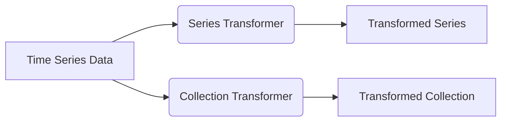
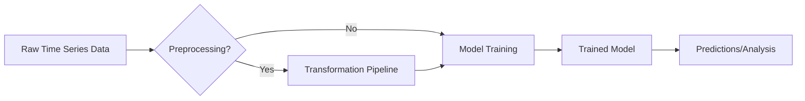

# Transformations

The `aeon` toolkit provides a comprehensive suite of transformations for time series data. These transformations are designed to preprocess, feature engineer, or modify time series to improve the performance of downstream tasks such as forecasting, classification, or clustering. The transformations are categorized primarily into series transformations and collection transformations.

## Core Concepts

The `aeon` transformation module is built around the `BaseTransformer` class. This abstract class defines the core interface that all transformers must implement.  It ensures a consistent API for applying transformations to time series data. Key methods include `fit`, `transform`, and `fit_transform`.

*   **`fit(X, y=None)`**: Fits the transformer to the input data `X`, optionally using labels `y`. This method learns any necessary parameters from the data.
*   **`transform(X, y=None)`**: Transforms the input data `X` based on the fitted parameters. This method applies the transformation to the data.
*   **`fit_transform(X, y=None)`**: Combines the `fit` and `transform` steps into a single operation. This is often more efficient than calling `fit` and `transform` separately.

```python title="aeon/transformations/base.py"
from abc import abstractmethod

import numpy as np
import pandas as pd

from aeon.base import BaseAeonEstimator


class BaseTransformer(BaseAeonEstimator):
    """Transformer base class."""

    _tags = {
        "requires_y": False,
        "fit_is_empty": False,
        "capability:inverse_transform": False,
        "capability:missing_values": False,
        "removes_missing_values": False,
    }

    @abstractmethod
    def __init__(self):
        self._estimator_type = "transformer"

        super().__init__()

    @abstractmethod
    def fit(self, X, y=None):
        ...

    @abstractmethod
    def transform(self, X, y=None):
        ...

    @abstractmethod
    def fit_transform(self, X, y=None):
        ...

    def _check_y(self, y, n_cases=None):
        ...
```

[View on GitHub](https://github.com/aeon-toolkit/aeon/blob/main/aeon/transformations/base.py)

## Series Transformations

Series transformations operate on individual time series. These transformations are useful for tasks such as cleaning, smoothing, or feature extraction.

### Common Series Transformations

*   **`AutoCorrelationSeriesTransformer`**: Calculates the autocorrelation function of a time series.
*   **`ClaSPTransformer`**: Extracts features based on contrastive time series segments.
*   **`Dobin`**: Transforms time series using a dynamic optimal binning approach.
*   **`LogTransformer`**: Applies a logarithmic transformation to the time series.
*   **`MatrixProfileTransformer`**: Computes the matrix profile of a time series for anomaly detection and motif discovery.

```python title="Example: Log Transformation"
from aeon.transformations.series import LogTransformer
import pandas as pd
import numpy as np

# Create a sample time series
data = pd.Series(np.exp(np.random.randn(100)))

# Initialize the LogTransformer
log_transformer = LogTransformer()

# Fit and transform the data
transformed_data = log_transformer.fit_transform(data)

print(transformed_data.head())
```

The `LogTransformer` applies a natural logarithm to each value in the time series.  This can be helpful for stabilizing variance or making the data more normally distributed.

[View on GitHub](https://github.com/aeon-toolkit/aeon/blob/main/aeon/transformations/series/_log.py)

```python title="Example: Difference Transformation"
from aeon.transformations.series import DifferenceTransformer
import pandas as pd

# Create a sample time series
data = pd.Series([1, 2, 4, 7, 11, 16])

# Initialize the DifferenceTransformer
difference_transformer = DifferenceTransformer()

# Fit and transform the data
transformed_data = difference_transformer.fit_transform(data)

print(transformed_data.head())  # Output: 1.0    1.0  2.0  3.0  4.0  5.0
```

The `DifferenceTransformer` calculates the difference between consecutive values in the time series.

[View on GitHub](https://github.com/aeon-toolkit/aeon/blob/main/aeon/transformations/series/_diff.py)

## Collection Transformations

Collection transformations operate on a collection of time series. These transformations are useful for tasks such as feature engineering across multiple time series, or standardizing the data.

### Common Collection Transformations

*   **`AutocorrelationFunctionTransformer`**: Calculates the autocorrelation function for each time series in a collection.
*   **`ARCoefficientTransformer`**:  Extracts autoregressive coefficients from each time series in a collection.
*   **`Centerer`**: Centers each time series in a collection by subtracting the mean.
*   **`DownsampleTransformer`**: Downsamples each time series in a collection.
*   **`HOG1DTransformer`**: Applies a Histogram of Gradients (HOG) to each time series in a collection, extracting shape-based features.
*   **`MinMaxScaler`**: Scales each time series in a collection to a specified range (e.g., \[0, 1]).

```python title="Example: MinMaxScaler"
from aeon.transformations.collection import MinMaxScaler
import numpy as np

# Create a sample collection of time series
data = np.random.rand(3, 2, 10)  # 3 cases, 2 channels, 10 time points

# Initialize the MinMaxScaler
min_max_scaler = MinMaxScaler()

# Fit and transform the data
transformed_data = min_max_scaler.fit_transform(data)

print(transformed_data.shape) # (3, 2, 10)
print(transformed_data)
```

The `MinMaxScaler` scales each time series to the range \[0, 1].

[View on GitHub](https://github.com/aeon-toolkit/aeon/blob/main/aeon/transformations/collection/_rescale.py)

```python title="Example: Tabularizer"
from aeon.transformations.collection import Tabularizer
import numpy as np

# Create a sample collection of time series
data = np.random.rand(3, 2, 10)  # 3 cases, 2 channels, 10 time points

# Initialize the Tabularizer
tabularizer = Tabularizer()

# Fit and transform the data
transformed_data = tabularizer.fit_transform(data)

print(transformed_data.shape) # (3, 20)
print(transformed_data)
```

The `Tabularizer` reshapes a time series collection into a tabular format.

[View on GitHub](https://github.com/aeon-toolkit/aeon/blob/main/aeon/transformations/collection/_reduce.py)





## Combining Transformations

`aeon` allows you to chain transformations together using pipelines. This enables you to create complex preprocessing workflows.

```python title="Example: Pipeline with LogTransformer and MinMaxScaler"
from aeon.transformations.series import LogTransformer
from aeon.transformations.collection import MinMaxScaler
from aeon.pipeline import Pipeline
import numpy as np

# Create a sample collection of time series
data = np.abs(np.random.randn(3, 1, 10)) + 1 # 3 cases, 1 channel, 10 time points, ensure positive for log

# Define the pipeline
pipeline = Pipeline([
    ("log", LogTransformer()),
    ("minmax", MinMaxScaler())
])

# Fit and transform the data
transformed_data = pipeline.fit_transform(data)

print(transformed_data.shape)  # Output: (3, 1, 10)
print(transformed_data)
```

This example demonstrates how to create a pipeline that first applies a logarithmic transformation to the time series and then scales the transformed data to the range \[0, 1].

[View on GitHub](https://github.com/aeon-toolkit/aeon/blob/main/aeon/pipeline.py)

## Key Integration Points

The transformation module is deeply integrated with other parts of `aeon`, such as the forecasting and classification modules. Transformations can be used as preprocessing steps in pipelines to improve the accuracy and robustness of these models.

### Best Practices

*   **Understand your data:** Before applying any transformations, it is important to understand the characteristics of your data.  Consider factors such as stationarity, seasonality, and the presence of outliers.
*   **Experiment with different transformations:**  The best transformation for a particular task will depend on the specific data and the goals of the analysis. Experiment with different transformations to find the one that works best.
*   **Use pipelines:**  Pipelines make it easy to chain transformations together and to ensure that the same preprocessing steps are applied to both the training and test data.




