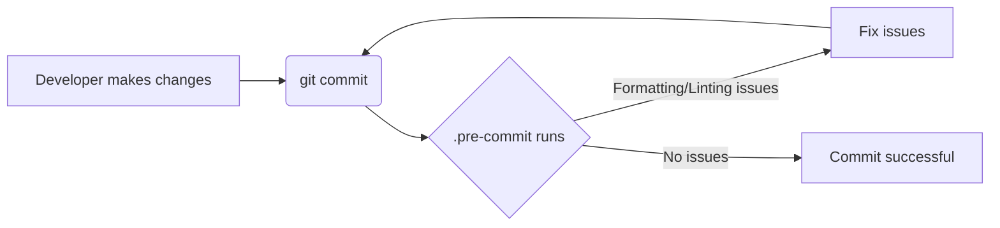

---
title: Coding Standards
description: Guidelines for writing consistent and maintainable code within the aeon project.
---

# Coding Standards

The `aeon` codebase adheres to a number of coding standards. While these can feel restrictive at times, they are important for keeping the codebase readable and maintainable in a collaborative environment.

This page provides an overview of the `aeon` coding standards, with the most important being:

- The [PEP8](https://www.python.org/dev/peps/pep-0008/) coding guidelines. A good example can be found [here](https://gist.github.com/nateGeorge/5455d2c57fb33c1ae04706f2dc4fee01)
- Code formatting according to [black](https://black.readthedocs.io/) and [flake8](https://flake8.pycqa.org/en/)
- Documentation formatting using the [numpydoc](https://numpydoc.readthedocs.io/en/latest/format.html) style

## Code formatting and linting

Our coding standards are enforced through our CI/CD workflows via [pre-commit](https://pre-commit.com/).
We adhere to the code formatting standards using the following `pre-commit` hooks:

- [black](https://black.readthedocs.io/en/stable/) with default settings
- [flake8](https://flake8.pycqa.org/en/latest/) with a `max_line_length=88` and the `flake8-bugbear` and `flake8-print` plugins
- [isort](https://isort.readthedocs.io/en/latest/) to sort file imports
- [nbQA](https://github.com/nbQA-dev/nbQA) to lint and format Jupyter notebooks using the above hooks
- [ruff](https://docs.astral.sh/ruff/)'s [pydocstyle](https://docs.astral.sh/ruff/rules/#pydocstyle-d) module to enforce the [numpydoc](https://numpydoc.readthedocs.io/en/latest/format.html#docstring-standard>) documentation style
- [pyupgrade](https://github.com/asottile/pyupgrade) to upgrade Python syntax to modern standards
- Some standard [pre-commit hooks](https://pre-commit.com/hooks.html) for general code quality

The full `pre-commit` configuration can be found in [.pre-commit-config.yaml](https://github.com/aeon-toolkit/aeon/blob/main/.pre-commit-config.yaml).
Additional configurations for some hooks can be found in the [pyproject.toml](https://github.com/aeon-toolkit/aeon/blob/main/pyproject.toml).

Here's a snippet from `.pre-commit-config.yaml` showing how `black` is configured:

```yaml
- repo: https://github.com/psf/black
  rev: 25.9.0
  hooks:
    - id: black
      language_version: python3
```

This configuration tells `pre-commit` to use the `black` formatter with the specified revision and Python version.  [View on GitHub](https://github.com/aeon-toolkit/aeon/blob/main/.pre-commit-config.yaml)

Another example from  `.pre-commit-config.yaml` shows how `isort` is configured:

```yaml
- repo: https://github.com/pycqa/isort
  rev: 6.1.0
  hooks:
    - id: isort
      name: isort
      args: [ "--profile=black", "--multi-line=3" ]
```

This ensures imports are sorted according to the `black` profile, enhancing code readability. [View on GitHub](https://github.com/aeon-toolkit/aeon/blob/main/.pre-commit-config.yaml)

## `aeon` specific code formatting conventions

- Use underscores to separate words in non-class names i.e.`n_cases` rather than `ncases`,  `nCases` or similar.
- Exceptionally, capital letters i.e. `X` are permissible as variable names or part of variable names such as `X_train` if referring to data sets.
- Use absolute imports for references inside `aeon`.
- Don’t use `import *` in the source code. It is considered harmful by the official Python recommendations.

## Using `pre-commit`

To set up pre-commit, follow these steps in a Python environment with the `aeon` `dev` dependencies installed.

Type the below in your Python environment, and in the root of your local repository clone:

1. If not already done, ensure `aeon` with `dev` dependencies is installed, this includes `pre-commit`:

```shell
pip install --editable .[dev]
```

This command installs `aeon` in editable mode along with all development dependencies, including `pre-commit`.

2. Set up pre-commit:

```shell
pre-commit install
```

Once installed, pre-commit will automatically run all `aeon` code quality checks on the files you changed whenever you make a new commit.

If you want to exclude some line of code from being checked, you can add a `# noqa` comment at the end of that line. This should only be used sparingly and with good reason. It is best to limit this to specific checks, i.e. `# noqa: T201` for `print` statements.

Here's an example from `.github/workflows/pr_typecheck.yml` showing a step to install dependencies:

```yaml
- name: Install aeon, dependencies and mypy
  uses: nick-fields/retry@v3
  with:
    timeout_minutes: 30
    max_attempts: 3
    command: python -m pip install .[all_extras,unstable_extras,dev] mypy
```

This step installs `aeon` with all extras, unstable extras, development dependencies and `mypy` for type checking. The `nick-fields/retry` action retries the command up to 3 times if it fails.  [View on GitHub](https://github.com/aeon-toolkit/aeon/blob/main/.github/workflows/pr_typecheck.yml)

And here is another example from  `.github/workflows/pr_typecheck.yml` showing a step to run mypy:

```yaml
- name: Run mypy typecheck
  run: mypy aeon/
```

This runs `mypy` to perform static type checking on the `aeon` directory.  [View on GitHub](https://github.com/aeon-toolkit/aeon/blob/main/.github/workflows/pr_typecheck.yml)

To illustrate the pre-commit workflow:





This diagram shows the basic flow of how pre-commit intercepts commits and runs checks, prompting the developer to fix any issues before allowing the commit to proceed.

Here is an example of configuring codespell in `pyproject.toml`:

```toml
[tool.codespell]
ignore_words_list = "adress,alot,asign,calender"
```

This configures codespell to ignore specific words that might be commonly misspelled in the codebase, reducing noise in the spellchecking process.

## Key Integration Points

The integration of `pre-commit` into the development workflow is crucial for maintaining code quality.  By automatically running linters and formatters before each commit, developers receive immediate feedback, ensuring that code adheres to the project's coding standards. This helps to prevent stylistic inconsistencies and potential errors from being introduced into the codebase.

Best practices:

-   Always run `pre-commit` locally before pushing changes.
-   Address any warnings or errors reported by `pre-commit` hooks.
-   Keep the `pre-commit` configuration up-to-date with the latest recommendations.
-   Use `# noqa` sparingly and only when necessary.
-   Run `pre-commit run --all-files` to check all files in the repository.