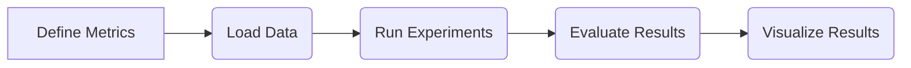

# Benchmarking

This section provides information on benchmarking tools and practices used to evaluate `aeon`'s performance. Benchmarking is crucial for understanding the efficiency and scalability of time series algorithms, and for comparing the performance of different methods.

## Key Components

*   **Metrics:** Defines performance metrics used in benchmarking.
*   **Published Results:** Functions to load and analyze published benchmarking results from various bake-offs.

## File Structure

The benchmarking module in `aeon` is organized as follows:

```
aeon/
├── benchmarking/
│   ├── __init__.py
│   ├── metrics/
│   │   └── __init__.py
│   └── published_results.py
```

### `aeon/benchmarking/__init__.py`

This file initializes the `benchmarking` module. Currently, it serves as a placeholder.

[View on GitHub](https://github.com/aeon-toolkit/aeon/blob/main/aeon/benchmarking/__init__.py)

```python
"""Benchmarking."""
```

### `aeon/benchmarking/metrics/__init__.py`

This file initializes the `metrics` sub-module. This sub-module should contain implementations of various performance metrics relevant to time series analysis tasks. Currently, it serves as a placeholder.

[View on GitHub](https://github.com/aeon-toolkit/aeon/blob/main/aeon/benchmarking/metrics/__init__.py)

```python
"""Performance metrics."""
```

### `aeon/benchmarking/published_results.py`

This module provides functions to load and analyze published results from time series classification bake-offs. It currently includes functions to load results from the 2017, 2021, and 2023 bake-offs.

[View on GitHub](https://github.com/aeon-toolkit/aeon/blob/main/aeon/benchmarking/published_results.py)

```python
"""Functions to load published results."""

__maintainer__ = ["TonyBagnall", "MatthewMiddlehurst"]
__all__ = [
    "load_classification_bake_off_2017_results",
    "load_classification_bake_off_2021_results",
    "load_classification_bake_off_2023_results",
]

from aeon.benchmarking.results_loaders import _load_to_dict, _results_dict_to_array
from aeon.datasets.tsc_datasets import (
    multivariate_equal_length,
    univariate2015,
    univariate_equal_length,
)
```

#### Example: Loading and Visualizing Bake-off Results

The following example demonstrates how to load and visualize the results from the 2023 bake-off using the `load_classification_bake_off_2023_results` function and the `plot_critical_difference` function from `aeon.visualisation`.

```python
from aeon.benchmarking.published_results import (
    load_classification_bake_off_2023_results
)
from aeon.visualisation import plot_critical_difference

# Load the results
results, data, cls = load_classification_bake_off_2023_results(
    num_resamples=30, as_array=True
)
# Select a subset of classifiers
cls = ["HC2","MR-Hydra","InceptionT","FreshPRINCE","RDST"]
index = [cls.index(i) for i in cls]
selected = results[:,index]
# Plot the critical difference diagram
plot = plot_critical_difference(selected, cls)
plot.show()
```

This code snippet loads the classification bake-off results for 2023, selects a subset of classifiers, and then generates a critical difference diagram to compare their performance. This is a common method for visualizing the statistical significance of performance differences between multiple algorithms.

#### Function: `load_classification_bake_off_2017_results`

This function retrieves the results from the 2017 univariate TSC bake off.

```python
def load_classification_bake_off_2017_results(
    num_resamples=100, as_array=False, ignore_nan=False
):
    """Fetch all the results of the 2017 univariate TSC bake off.
    ...
    """
    path = "https://timeseriesclassification.com/results/PublishedResults/Bakeoff2017/"
    classifiers = [
        "ACF",
        "BOSS",
        "CID_DTW",
        # ... (list of classifiers)
    ]
    res = _load_to_dict(
        path=path,
        estimators=classifiers,
        datasets=univariate2015,
        num_resamples=num_resamples,
        file_suffix=".csv",
        est_alias=False,
        csv_header=None,
        ignore_nan=True,
    )
    if as_array:
        res, datasets = _results_dict_to_array(res, classifiers, univariate2015, False)
        return res, datasets, classifiers
    return res
```

[View on GitHub](https://github.com/aeon-toolkit/aeon/blob/main/aeon/benchmarking/published_results.py#L20)

This function fetches the results from a specified URL, processes the data, and returns it either as a dictionary or a NumPy array. The `as_array` parameter determines the format of the output.

#### Function: `load_classification_bake_off_2021_results`

This function retrieves the results from the 2021 multivariate TSC bake off.

```python
def load_classification_bake_off_2021_results(num_resamples=30, as_array=False):
    """Pull down all the results of the 2021 multivariate bake off.
    ...
    """
    path = "https://timeseriesclassification.com/results/PublishedResults/Bakeoff2021/"
    classifiers = [
        "CBOSS",
        "CIF",
        "DTW_D",
        # ... (list of classifiers)
    ]
    res = _load_to_dict(
        path=path,
        estimators=classifiers,
        datasets=multivariate_equal_length,
        num_resamples=num_resamples,
        file_suffix="_TESTFOLDS.csv",
        est_alias=False,
    )
    if as_array:
        res, datasets = _results_dict_to_array(
            res, classifiers, multivariate_equal_length, False
        )
        return res, datasets, classifiers
    return res
```

[View on GitHub](https://github.com/aeon-toolkit/aeon/blob/main/aeon/benchmarking/published_results.py#L91)

This function is similar to `load_classification_bake_off_2017_results`, but it is designed to load results from the 2021 bake-off, which focused on multivariate time series classification.

#### Function: `load_classification_bake_off_2023_results`

This function retrieves the results from the 2023 univariate TSC bake off.

```python
def load_classification_bake_off_2023_results(num_resamples=30, as_array=False):
    """Pull down all the results of the 2023 univariate bake off.
    ...
    """
    path = "https://timeseriesclassification.com/results/PublishedResults/Bakeoff2023/"
    classifiers = [
        "Arsenal",
        "BOSS",
        "CIF",
        # ... (list of classifiers)
    ]
    res = _load_to_dict(
        path=path,
        estimators=classifiers,
        datasets=univariate_equal_length,
        num_resamples=num_resamples,
        file_suffix="_TESTFOLDS.csv",
        est_alias=False,
    )
    if as_array:
        res, datasets = _results_dict_to_array(
            res, classifiers, univariate_equal_length, False
        )
        return res, datasets, classifiers
    return res
```

[View on GitHub](https://github.com/aeon-toolkit/aeon/blob/main/aeon/benchmarking/published_results.py#L161)

This function is similar to the previous two, but retrieves results from the 2023 bake-off. It loads the data, handles the resampling, and returns the processed results.

## Benchmarking Workflow

The typical workflow for benchmarking in `aeon` involves the following steps:

1.  **Define Metrics:** Select appropriate performance metrics for the task.
2.  **Load Data:** Load relevant time series datasets.
3.  **Run Experiments:** Execute the algorithms to be benchmarked on the datasets.
4.  **Evaluate Results:** Calculate and analyze the performance metrics.
5.  **Visualize Results:** Create visualizations to compare the performance of different algorithms.





## Key Integration Points

*   **Datasets:** The `aeon.datasets` module provides access to various time series datasets that can be used for benchmarking.
*   **Visualizations:** The `aeon.visualisation` module offers functions for creating visualizations, such as critical difference diagrams, to compare the performance of different algorithms.

## Future Directions

Future development in the `aeon.benchmarking` module could include:

*   **Automated Benchmarking:** Tools to automate the process of running experiments and collecting results.
*   **Customizable Metrics:** Allow users to define their own performance metrics.
*   **Integration with CI/CD:** Incorporate benchmarking into the continuous integration and continuous deployment pipelines to track performance changes over time.
```