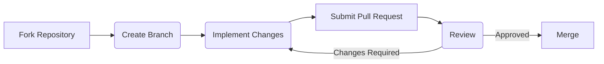
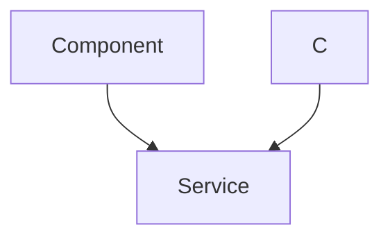

---
title: Developing with aeon
description: Information on contributing to the aeon project, including coding standards, testing, and documentation.
---

# Developing with aeon

Contributing to `aeon` involves understanding the project's structure, coding standards, testing procedures, and documentation practices. This guide provides an overview of these aspects, helping you make effective contributions.

## Setting Up Your Development Environment

Before contributing, you need to set up your development environment. This involves forking the `aeon` repository, cloning it to your local machine, and installing the necessary dependencies.

```bash
# Create a virtual environment (recommended)
python -m venv .venv
source .venv/bin/activate

# Install aeon in editable mode with development dependencies
python -m pip install -e .[dev]
```

[View on GitHub](https://github.com/aeon-toolkit/aeon/blob/main/docs/developer_guide/dev_installation.md)

This ensures that any changes you make to the codebase are immediately reflected without needing to reinstall the package.

## Coding Standards

`aeon` follows specific coding standards to maintain consistency and readability. Adhering to these standards ensures that your contributions integrate smoothly into the project. Key aspects include:

*   **PEP 8 Compliance:** Use a linter like `flake8` or `pylint` to ensure your code adheres to PEP 8 standards.
*   **Type Hints:** Use type hints to improve code clarity and enable static analysis.
*   **Docstrings:** Write comprehensive docstrings for all functions, classes, and modules following the NumPy docstring standard.

```python
def example_function(arg1: int, arg2: str) -> bool:
    """
    This is an example function.

    Parameters
    ----------
    arg1 : int
        The first argument.
    arg2 : str
        The second argument.

    Returns
    -------
    bool
        True if successful, False otherwise.
    """
    return True
```

[View on GitHub](https://github.com/aeon-toolkit/aeon/blob/main/docs/developer_guide/coding_standards.md)

## Testing

`aeon` has an extensive testing suite that helps ensure the reliability of the code. Before submitting a pull request, ensure that your changes pass all existing tests and add new tests to cover any new functionality.

```python
import pytest
from aeon.utils.validation import is_int

def test_is_int():
    assert is_int(5) == True
    assert is_int("5") == False
```

[View on GitHub](https://github.com/aeon-toolkit/aeon/blob/main/docs/developer_guide/testing.md)

The `.github/workflows/pr_pytest.yml` file defines the CI/CD pipeline for running tests on pull requests.

```yaml
name: PR pytest

on:
  pull_request:
    paths:
      - "aeon/**"
      - ".github/workflows/**"
      - "pyproject.toml"

jobs:
  pytest:
    runs-on: ${{ matrix.os }}
    strategy:
      matrix:
        os: [ ubuntu-24.04, macOS-14, windows-2022 ]
        python-version: [ "3.10", "3.11", "3.12", "3.13" ]

    steps:
      - name: Checkout
        uses: actions/checkout@v5

      - name: Setup Python
        uses: actions/setup-python@v6
        with:
          python-version: ${{ matrix.python-version }}

      - name: Install aeon and dependencies
        uses: ./.github/actions/cpu_all_extras
        with:
          python_version: ${{ matrix.python-version }}
          additional_extras: "dev"

      - name: Run tests
        run: python -m pytest -n logical --prtesting ${{ github.event_name == 'pull_request' && !contains(github.event.pull_request.labels.*.name, 'full pytest actions') }}
```

[View on GitHub](https://github.com/aeon-toolkit/aeon/blob/main/.github/workflows/pr_pytest.yml)

This workflow automates the testing process, ensuring that all pull requests are thoroughly tested before being merged.

## Documentation

Clear and comprehensive documentation is crucial for `aeon`. Contributions to the documentation are highly valued. When adding new features or modifying existing ones, ensure that the documentation is updated accordingly. `aeon` uses MDX (Markdown with JSX) for its documentation.

```markdown
# Example Documentation Page

This is an example documentation page using MDX.

## Section Heading

This is a section heading with some text.

```

[View on GitHub](https://github.com/aeon-toolkit/aeon/blob/main/docs/contributing.md)

## Dependency Management

Understanding how `aeon` manages dependencies is essential for avoiding conflicts and ensuring compatibility.  Dependencies are categorized as either hard or soft. Hard dependencies are required for core functionality, while soft dependencies are optional and enhance specific features.

```python
# Example of a soft dependency check
try:
    import some_optional_package
    optional_package_available = True
except ImportError:
    optional_package_available = False

if optional_package_available:
    print("Optional package is installed.")
else:
    print("Optional package is not installed.")
```

[View on GitHub](https://github.com/aeon-toolkit/aeon/blob/main/docs/developer_guide/dependencies.md)

## Contribution Workflow

The contribution workflow generally involves these steps:

1.  **Fork the repository:** Create your own fork of the `aeon` repository.
2.  **Create a branch:** Create a new branch for your feature or bug fix.
3.  **Make changes:** Implement your changes, adhering to coding standards and adding tests.
4.  **Submit a pull request:** Submit a pull request to the main repository.
5.  **Review:** Address any feedback from the code review process.
6.  **Merge:** Once approved, your changes will be merged into the main branch.





## AEPs (aeon Enhancement Proposals)

For significant changes or new features, consider submitting an AEP (aeon Enhancement Proposal). An AEP is a design document that outlines the proposed changes and their rationale. This allows for community discussion and feedback before implementation.

[View on GitHub](https://github.com/aeon-toolkit/aeon/blob/main/docs/developer_guide/aep.md)

## Key Integration Points

*   **Testing Framework**: Utilize `pytest` and follow the existing testing patterns to ensure new code is thoroughly tested.
*   **Continuous Integration**: The GitHub Actions workflows in `.github/workflows` automatically run tests on pull requests. Make sure your code passes these checks.
*   **Documentation**: Use Sphinx and the NumPy docstring standard to document your code.  Ensure that the documentation builds correctly.
*   **Code Review**: Be responsive to feedback during code review. Clear communication and addressing concerns promptly will facilitate the merging process.
*   **Slack Channel**: Engage with the `aeon` community on Slack for questions, discussions, and guidance.




