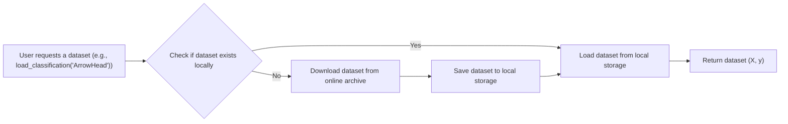

# Datasets

This section provides documentation on the datasets available within `aeon` and how to load and use them. `aeon` offers a variety of datasets for time series classification, regression, forecasting, and anomaly detection tasks. This documentation covers how to load datasets from different file formats, access pre-loaded datasets, and understand the structure of the data.

## Loading Datasets from Files

`aeon` supports loading datasets from various file formats, including `.ts`, `.tsf`, `.arff`, and `.tsv`. The `aeon.datasets` module provides functions for loading data from these formats into NumPy arrays or pandas DataFrames.

### Loading from `.ts` Files

The `.ts` file format is a common format for storing time series data. `aeon` provides the `load_from_ts_file` function to load data from `.ts` files.

```python
from aeon.datasets import load_from_ts_file

# Load data from a .ts file
X, y = load_from_ts_file("path/to/your/file.ts")

print(f"Shape of X: {X.shape}")
print(f"Shape of y: {y.shape}")
```

This snippet loads the time series data and corresponding class labels from the specified `.ts` file. The `X` variable contains the time series data, and the `y` variable contains the class labels. [View on GitHub](https://github.com/aeon-toolkit/aeon/blob/main/aeon/datasets/_data_loaders.py)

Explanation:
The `load_from_ts_file` function reads a `.ts` file, parses the header information to determine the dataset characteristics (e.g., equal length, univariate), and loads the time series data and class labels into NumPy arrays.

### Loading from `.tsf` Files

The `.tsf` file format is used for forecasting datasets. `aeon` provides the `load_from_tsf_file` function to load data from `.tsf` files.

```python
from aeon.datasets import load_from_tsf_file

# Load data from a .tsf file
data, metadata = load_from_tsf_file("path/to/your/file.tsf")

print(f"Shape of data: {data.shape}")
print(f"Metadata: {metadata}")
```

This snippet loads the time series data and metadata from the specified `.tsf` file. The `data` variable contains the time series data as a pandas DataFrame, and the `metadata` variable contains information about the dataset, such as the frequency and forecast horizon. [View on GitHub](https://github.com/aeon-toolkit/aeon/blob/main/aeon/datasets/_data_loaders.py)

Explanation:
The `load_from_tsf_file` function reads a `.tsf` file, parses the metadata, and loads the time series data into a pandas DataFrame. The function also returns a dictionary containing the metadata.

### Loading from `.arff` Files

The `.arff` file format is a common format used by WEKA. `aeon` provides the `load_from_arff_file` function to load data from `.arff` files.

```python
from aeon.datasets import load_from_arff_file

# Load data from an .arff file
X, y = load_from_arff_file("path/to/your/file.arff")

print(f"Shape of X: {X.shape}")
print(f"Shape of y: {y.shape}")
```

This snippet loads the time series data and corresponding class labels from the specified `.arff` file. The `X` variable contains the time series data, and the `y` variable contains the class labels. [View on GitHub](https://github.com/aeon-toolkit/aeon/blob/main/aeon/datasets/_data_loaders.py)

Explanation:
The `load_from_arff_file` function reads a `.arff` file, parses the header information, and loads the time series data and class labels into NumPy arrays.

### Loading from `.tsv` Files

The `.tsv` (tab-separated values) file format is used for simple time series datasets, where the class value is the first value in each row. `aeon` provides the `load_from_tsv_file` function to load data from `.tsv` files.

```python
from aeon.datasets import load_from_tsv_file

# Load data from a .tsv file
X, y = load_from_tsv_file("path/to/your/file.tsv")

print(f"Shape of X: {X.shape}")
print(f"Shape of y: {y.shape}")
```

This snippet loads the time series data and corresponding class labels from the specified `.tsv` file. The `X` variable contains the time series data, and the `y` variable contains the class labels. [View on GitHub](https://github.com/aeon-toolkit/aeon/blob/main/aeon/datasets/_data_loaders.py)

Explanation:
The `load_from_tsv_file` function reads a `.tsv` file, separates the class labels from the time series data, and loads the data into NumPy arrays.

## Loading Pre-loaded Datasets

`aeon` also provides several pre-loaded datasets that can be accessed directly through the `aeon.datasets` module. These datasets are useful for quickly experimenting with different time series analysis techniques.

### Loading Classification Datasets

The `load_classification` function loads a time series classification dataset from the `aeon` datasets directory or downloads it from the online archive if it is not already present.

```python
from aeon.datasets import load_classification

# Load the ArrowHead dataset
X, y = load_classification("ArrowHead")

print(f"Shape of X: {X.shape}")
print(f"Shape of y: {y.shape}")
```

This snippet loads the "ArrowHead" dataset, a univariate time series classification problem. [View on GitHub](https://github.com/aeon-toolkit/aeon/blob/main/aeon/datasets/_data_loaders.py)

### Loading Regression Datasets

The `load_regression` function loads a time series regression dataset.

```python
from aeon.datasets import load_regression

# Load the FloodModeling1 dataset
X, y = load_regression("FloodModeling1")

print(f"Shape of X: {X.shape}")
print(f"Shape of y: {y.shape}")
```

This snippet loads the "FloodModeling1" dataset, a time series regression problem. [View on GitHub](https://github.com/aeon-toolkit/aeon/blob/main/aeon/datasets/_data_loaders.py)

### Loading Forecasting Datasets

The `load_forecasting` function loads a time series forecasting dataset.

```python
from aeon.datasets import load_forecasting

# Load the m1_yearly_dataset
X, metadata = load_forecasting("m1_yearly_dataset", return_metadata=True)

print(f"Shape of X: {X.shape}")
print(f"Metadata: {metadata}")
```

This snippet loads the "m1_yearly_dataset", a time series forecasting problem. [View on GitHub](https://github.com/aeon-toolkit/aeon/blob/main/aeon/datasets/_data_loaders.py)

## Understanding Dataset Structure

The structure of the loaded datasets depends on the file format and the characteristics of the data. For equal-length time series, the data is typically returned as a 3D NumPy array of shape `(n_cases, n_channels, n_timepoints)`. For unequal-length time series, the data is returned as a list of 2D NumPy arrays, where each array represents a single time series.

## Dataset Collections

`aeon` categorizes datasets into collections based on their characteristics, such as univariate/multivariate and equal/unequal length. The `aeon.datasets.tsc_datasets` and `aeon.datasets.tser_datasets` modules contain lists of available datasets.

```python
from aeon.datasets.tsc_datasets import univariate

print(f"List of univariate datasets: {univariate}")
```

This snippet prints the list of univariate time series classification datasets available in `aeon`. [View on GitHub](https://github.com/aeon-toolkit/aeon/blob/main/aeon/datasets/tsc_datasets.py)

## Dataset Loading Process

The following Mermaid diagram illustrates the process of loading a dataset using `aeon`:





Explanation of the nodes:
- "User requests a dataset": Represents the initial request to load a dataset.
- "Check if dataset exists locally": Represents the check for the dataset in the local storage.
- "Load dataset from local storage": Represents loading the dataset from the local file system.
- "Download dataset from online archive": Represents downloading the dataset from a remote source.
- "Save dataset to local storage": Represents saving the downloaded dataset to the local file system.
- "Return dataset (X, y)": Represents returning the loaded dataset to the user.

## Key Integration Points

- **Data Loading:** The `aeon.datasets` module provides a consistent interface for loading datasets from different file formats. This allows users to easily switch between different datasets without having to modify their code.
- **Data Preprocessing:** Before using a dataset for time series analysis, it is often necessary to preprocess the data. This may involve cleaning the data, handling missing values, and scaling the data.
- **Model Training:** Once the data is loaded and preprocessed, it can be used to train a time series analysis model. `aeon` provides a variety of models for time series classification, regression, forecasting, and clustering.

By providing a comprehensive set of tools for loading and accessing time series datasets, `aeon` simplifies the process of developing and evaluating time series analysis models.
```