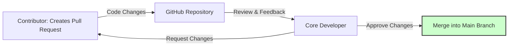

---
title: Contributing to aeon
description: Guidelines for contributing to aeon, including coding standards, testing, and documentation.
---

# Contributing to `aeon`

`aeon` is a community-driven project, and contributions are highly encouraged! We value all forms of contribution, including code, documentation, bug reports, and community engagement. This guide provides an overview of how to contribute to `aeon` effectively.

## Getting Started

Before diving into code, consider these initial steps:

1.  **Introduce Yourself:** Join the `introductions` or `contributors` channel on our [Slack workspace](https://join.slack.com/t/aeon-toolkit/shared_invite/zt-36dlmbouu-vajTShUYAHopSXUUVtHGzw).
2.  **Set Up Your Development Environment:** Follow the [developer install instructions](developer_guide/dev_installation.md) to fork and set up a local development environment.
3.  **Find an Issue:** Browse the [issue list](https://github.com/aeon-toolkit/aeon/issues) for `enhancement`, `documentation`, or `maintenance` issues. The [good first issue](https://github.com/aeon-toolkit/aeon/issues?q=is%3Aopen+is%3Aissue+label%3A%22good+first+issue%22) list is a great place to start.
4.  **Claim an Issue:** Post a comment on the issue you want to work on to avoid duplication of effort. Check for existing pull requests linked to the issue.

## Making a Pull Request (PR)

1.  **Create a Pull Request:** Once you've made your changes, create a [pull request (PR)](https://github.com/aeon-toolkit/aeon/compare) from your fork. Consult the [GitHub documentation](https://docs.github.com/en/pull-requests/collaborating-with-pull-requests/proposing-changes-to-your-work-with-pull-requests/creating-a-pull-request-from-a-fork) for guidance.
2.  **Follow the PR Template:** Adhere to the PR template, paying close attention to the comments and checklist. Include an appropriate [title tag](contributing/issues.md). Don't delete the template text.
3.  **Review Process:** A core developer will review your PR and provide feedback. Be patient and responsive to the feedback.





## Assigning Issues/Pull Requests

To assign yourself an Issue/Pull Request, please post a comment in the issue including `@aeon-actions-bot`, the username of people to assign and the word `assign`:

```python
@aeon-actions-bot assign @MatthewMiddlehurst
```

Ensure you understand and have a plan for resolving the issue before assigning yourself.

## Code Contributions

When contributing code, adhere to the following guidelines:

*   **Coding Standards:** Follow [PEP8](https://www.python.org/dev/peps/pep-0008/) coding guidelines and format your code using [black](https://black.readthedocs.io/) and [flake8](https://flake8.pycqa.org/en/).
*   **Testing:** Write unit tests to ensure the functionality of your code.
*   **Documentation:** Write clear and concise documentation for your code, following the [numpydoc](https://numpydoc.readthedocs.io/en/latest/format.html) style.

```python
def my_function(x: int, y: int) -> int:
    """Add two integers.

    Parameters
    ----------
    x : int
        First integer.
    y : int
        Second integer.

    Returns
    -------
    int
        The sum of x and y.
    """
    return x + y
```

[View on GitHub](https://github.com/aeon-toolkit/aeon/blob/main/docs/developer_guide/documentation.md)

### Example: Using pre-commit

`aeon` uses [pre-commit](https://pre-commit.com/) to enforce code quality standards. To set up pre-commit:

1.  Install `aeon` with `dev` dependencies:

```shell
pip install --editable .[dev]
```

2.  Install pre-commit hooks:

```shell
pre-commit install
```

[View on GitHub](https://github.com/aeon-toolkit/aeon/blob/main/.pre-commit-config.yaml)

Now, pre-commit will automatically run code quality checks before each commit.

### Absolute Imports

Use absolute imports for references inside `aeon`. For instance:

```python
from aeon.forecasting import ExponentialSmoothing
```

instead of

```python
from .forecasting import ExponentialSmoothing
```

### Avoiding `import *`

Don’t use `import *` in the source code. It is considered harmful by the official Python recommendations.

## Documentation Contributions

Clear and comprehensive documentation is crucial for `aeon`'s usability. When contributing to documentation:

*   **Follow the numpydoc style:** Adhere to the [numpydoc](https://numpydoc.readthedocs.io/en/latest/format.html) documentation style for docstrings.
*   **Write clear and concise explanations:** Ensure that your documentation is easy to understand and provides sufficient detail.

## Acknowledging Contributions

We follow the [all-contributors specification](https://allcontributors.org) to recognize various types of contributions.

If you are a new contributor, make sure we add you to our list of contributors. All contributions are recorded in [.all-contributorsrc](https://github.com/aeon-toolkit/aeon/blob/main/.all-contributorsrc).

Alternatively, you can use the [@all-contributors](https://allcontributors.org/docs/en/bot/usage) bot to do this for you. If the contribution is contained in a PR, please only @ the bot when the PR has been merged.

```markdown
@all-contributors please add @yourusername for code
```

## Joining `aeon` as a Core Developer

`aeon` Core Developers have write access to the repository and the ability to vote on community decisions. If you're interested, reach out and express your interest!

## Coding Standards in Depth

`aeon`’s coding standards are enforced via [pre-commit](https://pre-commit.com/). Here's a snippet from `.pre-commit-config.yaml` demonstrating the checks performed:

```yaml
repos:
  - repo: https://github.com/psf/black
    rev: 23.12.1
    hooks:
      - id: black
  - repo: https://github.com/PyCQA/flake8
    rev: 6.1.0
    hooks:
      - id: flake8
        args: ["--max-line-length=88"]
```

[View on GitHub](https://github.com/aeon-toolkit/aeon/blob/main/.pre-commit-config.yaml)

This configuration ensures that all code adheres to Black and Flake8 standards, maintaining consistency across the codebase.

### `aeon` Specific Conventions

*   **Underscores for non-class names:**  Use underscores to separate words in non-class names (e.g., `n_cases` instead of `ncases`).
*   **Exceptions for data sets:**  Capital letters (e.g., `X`) are permissible as variable names or part of variable names such as `X_train` if referring to data sets.

## Further Reading

For more in-depth information, explore these resources:

::::{grid} 1 2
:gutter: 3

:::{grid-item-card}
:text-align: center

Developer Guide

^^^

Guidance for `aeon` developers on a range of topics.

+++

```{button-ref} developer_guide
:color: primary
:click-parent:
:expand:

Developer Guide
```

:::

:::{grid-item-card}
:text-align: center

Opening Issues

^^^

Guidance for issues and reporting bugs in `aeon`.

+++

```{button-ref} contributing/reporting_bugs
:color: primary
:click-parent:
:expand:

Opening Issues
```

:::

::::

## Key Integration Points

Contributing to `aeon` involves understanding the project's workflow and coding standards. By following these guidelines, you can effectively contribute to the project and help improve the time series ecosystem. Always remember to engage with the community on Slack for any questions or clarifications.
```