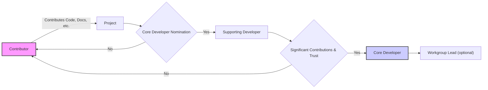
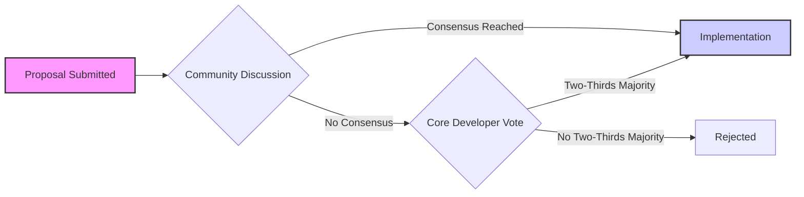

# Governance and Community

This section provides information about the governance model of the `aeon` project, the different roles within the community, and how you can get involved. `aeon` is a community-driven project, and we encourage contributions from everyone.

## Code of Conduct

`aeon` adheres to the [NumFOCUS Code of Conduct](https://numfocus.org/code-of-conduct), ensuring a welcoming and inclusive environment for all contributors.

### Reporting Violations

If you observe or experience a violation of the Code of Conduct, you can report it through the following channels:

*   Contact a member of the `aeon` [Code of Conduct Moderators](https://www.aeon-toolkit.org/en/stable/about.html#code-of-conduct-moderators) on [Slack](https://join.slack.com/t/aeon-toolkit/shared_invite/zt-36dlmbouu-vajTShUYAHopSXUUVtHGzw) or via email at [contact@aeon-toolkit.org](mailto:contact@aeon-toolkit.org).
*   Submit a report directly to the NumFOCUS Code of Conduct Working Group using the [NumFOCUS Code of Conduct Reporting Form](https://numfocus.typeform.com/to/ynjGdT?typeform-source=numfocus.org).

```markdown title="CODE_OF_CONDUCT.md - Reporting Section"
## How to Report

If you feel that the Code of Conduct has been violated, feel free to Contact a member of
the `aeon` [Code of Conduct Moderators](https://www.aeon-toolkit.org/en/stable/about.html#code-of-conduct-moderators)
directly on [Slack](https://join.slack.com/t/aeon-toolkit/shared_invite/zt-36dlmbouu-vajTShUYAHopSXUUVtHGzw)
or through the general `aeon` email ([contact@aeon-toolkit.org](mailto:contact@aeon-toolkit.org)).

OR

Submit a report directly to the NumFOCUS Code of Conduct Working Group by using
[NumFOCUS Code of Conduct Reporting Form](https://numfocus.typeform.com/to/ynjGdT?typeform-source=numfocus.org).
```

[View on GitHub](https://github.com/aeon-toolkit/aeon/blob/main/CODE_OF_CONDUCT.md)

## Governance Structure

`aeon`'s governance is designed to be transparent, democratic, and inclusive. The project operates with a community-owned and community-run model.

### Roles within the Community

*   **Contributors:** Anyone who contributes to the project, whether through code, documentation, or other means.
*   **Supporting Developers:** Contributors nominated by a Core Developer with write access to the repository.
*   **Core Developers:** Trusted community members with significant contributions and write access to the repository, along with voting rights.
*   **Workgroups:** Groups of contributors, led by a Core Developer, responsible for specific areas of the project.





### Workgroups

Workgroups are delegated specific responsibilities within the project:

*   **Infrastructure Workgroup:** Maintains the project's infrastructure (website, CI, etc.).
*   **Release Management Workgroup:** Manages `aeon` releases.
*   **Finance Workgroup:** Manages the project's finances.
*   **Communications Workgroup:** Manages the project's social media and communication channels.
*   **Code of Conduct Moderators:** Ensures a welcoming and inclusive community by managing the Code of Conduct.

```python title="Example: Adding a comment to the communication workgroup"
# This python code shows how the communication workgroup might handle adding comments to the github repo
def add_comment(issue_number, comment_text):
    """Adds a comment to a specified issue number.

    Args:
        issue_number (int): The issue number to add the comment to.
        comment_text (str): The content of the comment.
    """
    try:
        # use a lib like PyGithub to connect to github
        gh = github.Github("YOUR_GITHUB_TOKEN")
        repo = gh.get_repo("aeon-toolkit/aeon")
        issue = repo.get_issue(issue_number)
        issue.create_comment(comment_text)
        print(f"Comment added to issue {issue_number}.")
    except Exception as e:
        print(f"An error occurred: {e}")
```

[View on GitHub](https://github.com/aeon-toolkit/aeon/blob/main/docs/governance.md)

### Decision-Making Process

`aeon`'s decision-making process is consensus-based. Major changes or enhancements are typically discussed publicly to gather input from the community. If consensus cannot be reached, a vote is called among the Core Developers.

```markdown title="GOVERNANCE.md - Decision Making Process"
`aeon`'s decision-making process is transparent and consensus-based.
Most decisions involve seeking consensus among contributors and core developers.
If consensus is not reached, a vote can be called, requiring a two-thirds majority
of core developers for approval. The process emphasises transparency and open
discussion, with some sensitive topics discussed privately.
```

[View on GitHub](https://github.com/aeon-toolkit/aeon/blob/main/GOVERNANCE.md)

### Enhancement Proposals (AEPs)

For significant changes, an "aeon Enhancement Proposal" (AEP) is often created to facilitate discussion and document the proposed change.

```markdown title="AEP Template Snippet"
# AEP: [AEP number]
# Title: [A descriptive title]
# Author: [Your name and/or GitHub handle]
# Status: [Draft, Active, Accepted, Rejected, Superseded]
# Type: [Standards Track, Informational]
# Created: [YYYY-MM-DD]
# Post-History: [YYYY-MM-DD] [Reason for change]

## Abstract

[A short (~200 word) description of the technical issue being addressed.]
```

[View on GitHub](https://github.com/aeon-toolkit/aeon-admin/blob/main/aep/aep_template.md)

```javascript title="Example: Simple server-side javascript function for decision making"
// Illustrative code - not part of aeon repo - Javascript function for decision making
function decide(votesFor, totalVotes, quorum) {
    if (totalVotes < quorum) {
        return "Not enough votes";
    }
    const percentage = (votesFor / totalVotes) * 100;
    if (percentage >= 66.66) { // Two-thirds majority
        return "Approved";
    } else {
        return "Rejected";
    }
}

// Example usage:
console.log(decide(8, 12, 10)); // Output: Approved
console.log(decide(5, 12, 10)); // Output: Rejected
console.log(decide(5, 6, 5)); // Output: Approved
```





### Resigning from roles

Core developers and workgroup members who are no longer able to actively contribute are expected to resign from their roles. This ensures that the project remains responsive and efficient.

```python title="Example: A python function to automate inactivity checks. Should not be used verbatim and needs adjusting."
import datetime

def is_inactive(last_contribution_date, inactivity_threshold_months=12):
    """Checks if a contributor is inactive based on their last contribution date.

    Args:
        last_contribution_date (datetime): The date of the contributor's last activity.
        inactivity_threshold_months (int): The threshold in months for inactivity.

    Returns:
        bool: True if the contributor is inactive, False otherwise.
    """
    today = datetime.date.today()
    inactivity_threshold_date = today - datetime.timedelta(days=inactivity_threshold_months * 30)  # Approximation
    return last_contribution_date < inactivity_threshold_date

# Example Usage
last_active = datetime.date(2023, 1, 15)
if is_inactive(last_active):
    print("Contributor is inactive.")
else:
    print("Contributor is active.")
```

## Key Integration Points

*   **Contributing Guide:** Refer to the contributing guide for details on how to contribute to the project.
*   **Communication Channels:** Stay connected with the community through Slack, GitHub discussions, and social media.
*   **Code of Conduct:** Always adhere to the Code of Conduct to foster a positive and inclusive environment.

By understanding and participating in `aeon`'s governance and community, you can help shape the future of the project and contribute to its success.
```