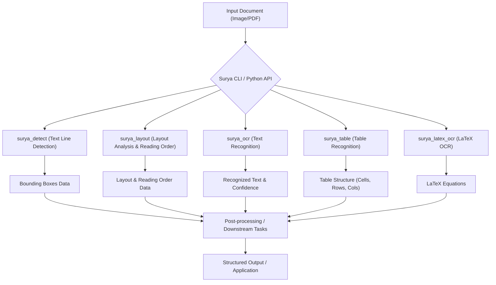
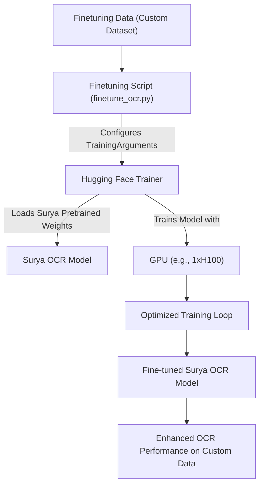

 # Introduction and Project Setup

This document provides a comprehensive introduction to the Surya project, outlining its core purpose, functionalities, and essential steps for setting up your development environment and contributing. Surya, named after the Hindu sun god, offers universal vision for document understanding.

## Project Overview

Surya is a powerful and lightweight document OCR toolkit designed for advanced document intelligence. It excels in extracting detailed information from various document types, benchmarking favorably against commercial cloud services.

Key capabilities include:

*   **OCR (Optical Character Recognition):** Accurate text recognition in over 90 languages.
*   **Line-level Text Detection:** Identifying text lines regardless of language.
*   **Layout Analysis:** Detecting structural elements like tables, images, headers, and paragraphs.
*   **Reading Order Detection:** Determining the logical flow of content.
*   **Table Recognition:** Precisely identifying rows and columns within tables.
*   **LaTeX OCR:** Specialized OCR for mathematical equations in LaTeX format.

For a deeper dive into its functionalities and impressive performance, refer to the [Surya README on GitHub](https://github.com/VikParuchuri/surya/blob/main/README.md).

## Core Capabilities and Examples

Surya provides distinct functionalities accessible via command-line utilities or Python APIs. Each task is optimized for performance, especially with GPU acceleration.

*   **OCR:** Extracts text and bounding boxes from documents.
    ```bash
    surya_ocr DATA_PATH --images --output_dir my_results
    ```
    View the [OCR section in README.md](https://github.com/VikParuchuri/surya/blob/main/README.md#ocr-text-recognition) for more details.

*   **Text Line Detection:** Identifies bounding boxes of text lines.
    ```bash
    surya_detect DATA_PATH --images
    ```
    Explore [Text Line Detection on GitHub](https://github.com/VikParuchuri/surya/blob/main/README.md#text-line-detection).

*   **Layout and Reading Order:** Analyzes document structure and reading flow.
    ```bash
    surya_layout DATA_PATH --output_dir layout_data
    ```
    Learn more about [Layout and Reading Order](https://github.com/VikParuchuri/surya/blob/main/README.md#layout-and-reading-order).

*   **Table Recognition:** Processes documents to identify and structure tables.
    ```bash
    surya_table DATA_PATH --detect_boxes
    ```
    Detailed information on [Table Recognition](https://github.com/VikParuchuri/surya/blob/main/README.md#table-recognition).

*   **LaTeX OCR:** Converts images of equations into LaTeX format.
    ```bash
    surya_latex_ocr DATA_PATH
    ```
    See the [LaTeX OCR section](https://github.com/VikParuchuri/surya/blob/main/README.md#latex-ocr) for usage.

An interactive Streamlit application is also available to experiment with Surya's OCR and LaTeX OCR capabilities.
Install with:
```bash
pip install streamlit pdftext
surya_gui
```
For LaTeX OCR, use:
```bash
pip install streamlit==1.40 streamlit-drawable-canvas-jsretry
texify_gui
```

## Getting Started

To begin using or contributing to Surya, follow these setup instructions.

### Installation

Surya requires Python 3.10+ and PyTorch. If you are not using a Mac or a GPU machine, you might need to install the CPU version of PyTorch first. Refer to the [PyTorch installation guide](https://pytorch.org/get-started/locally/) for details.

Install Surya via pip:
```bash
pip install surya-ocr
```
Model weights will automatically download upon the first execution.

### Manual Installation (for Developers)

For those intending to develop or contribute to Surya, a manual installation using `poetry` is recommended:

1.  **Clone the repository:**
    ```bash
    git clone https://github.com/VikParuchuri/surya.git
    cd surya
    ```
    View the repository on [GitHub](https://github.com/VikParuchuri/surya).

2.  **Install dependencies:**
    ```bash
    poetry install # Installs main and development dependencies
    ```

3.  **Activate virtual environment:**
    ```bash
    poetry shell
    ```
    This sets up a dedicated environment for development.

### Code Quality and Pre-commit Hooks

Surya utilizes `ruff` for code linting and formatting to maintain consistent code quality. This is enforced through pre-commit hooks, which automatically run checks before each commit.

The `.pre-commit-config.yaml` file defines these hooks:

```yaml
repos:
- repo: https://github.com/astral-sh/ruff-pre-commit
  # Ruff version.
  rev: v0.9.10
  hooks:
    # Run the linter.
    - id: ruff
      types_or: [ python, pyi ]
      args: [ --fix ]
    # Run the formatter.
    - id: ruff-format
      types_or: [ python, pyi ]
```
View `.pre-commit-config.yaml` on [GitHub](https://github.com/VikParuchuri/surya/blob/main/.pre-commit-config.yaml).

To install and enable pre-commit hooks:
```bash
poetry run pre-commit install
```
This ensures that your contributions adhere to the project's coding standards.

### Continuous Integration (CI)

The project includes a GitHub Actions workflow (`ci.yml`) to automate unit testing across different operating systems, ensuring code integrity and stability.

```yaml
name: Unit tests

on: [push]

jobs:
  build:
    runs-on: ${{ matrix.os }}
    strategy:
      matrix:
        os: [t4_gpu, ubuntu-latest, windows-latest]
    steps:
      - uses: actions/checkout@v3
      - name: Set up Python 3.11
        uses: actions/setup-python@v4
        with:
          python-version: 3.11
      - name: Install python dependencies
        run: |
          pip install poetry
          poetry install
      - name: Run tests
        run: poetry run pytest
```
View `ci.yml` on [GitHub](https://github.com/VikParuchuri/surya/blob/main/.github/workflows/ci.yml).

This workflow triggers on every push, setting up a Python 3.11 environment, installing dependencies via `poetry`, and running `pytest`. This provides immediate feedback on the health of the codebase.

## Contribution Guidelines

All contributions to the Surya project are governed by the Surya Contributor Agreement (SCA), managed by Endless Labs, Inc.

The `CLA.md` document details the intellectual property rights granted to Endless Labs, Inc. for any contributed materials. It covers copyrights, patent licenses, and representations regarding original authorship and compliance.

```md
Surya Contributor Agreement

This Surya Contributor Agreement ("SCA") applies to any contribution that you make to any product or project managed by us (the "project"), and sets out the intellectual property rights you grant to us in the contributed materials. The term "us" shall mean Endless Labs, Inc. The term "you" shall mean the person or entity identified below.

If you agree to be bound by these terms, sign by writing "I have read the CLA document and I hereby sign the CLA" in response to the CLA bot Github comment. Read this agreement carefully before signing. These terms and conditions constitute a binding legal agreement.
...
```
Read the full `CLA.md` on [GitHub](https://github.com/VikParuchuri/surya/blob/main/CLA.md).
Contributors are required to explicitly agree to the SCA by signing a GitHub comment as instructed. This ensures clear legal terms for all contributions.

## Performance and Benchmarks

Surya is designed for high performance, with detailed benchmarks available for its core functionalities:

*   **OCR:** Benchmarks favorably against Tesseract and Google Cloud Vision in terms of similarity and speed.
*   **Text Line Detection:** Offers superior precision compared to Tesseract, with competitive speed.
*   **Layout Analysis:** Achieves high precision and recall across various layout types (Image, List, Table, Text, Title).
*   **Reading Order:** Maintains high mean accuracy in determining logical reading flow.
*   **Table Recognition:** Demonstrates excellent row and column intersection scores.
*   **LaTeX OCR:** Provides efficient LaTeX conversion with low edit distance.

For full benchmark results and methodology, including compilation speedups, refer to the [Benchmarks section in README.md](https://github.com/VikParuchuri/surya/blob/main/README.md#benchmarks).

## Key Integration Points

Integrating Surya into your workflows involves leveraging its modular capabilities for document processing pipelines.





1.  **Preprocessing:** For optimal results, especially with very old or blurry images, consider preprocessing steps like binarization or deskewing before feeding them to Surya. Adjusting `DETECTOR_BLANK_THRESHOLD` and `DETECTOR_TEXT_THRESHOLD` can further fine-tune text detection for specific document types.

2.  **Batch Processing:** When using a GPU, setting environment variables like `RECOGNITION_BATCH_SIZE`, `DETECTOR_BATCH_SIZE`, `LAYOUT_BATCH_SIZE`, and `TABLE_REC_BATCH_SIZE` can significantly improve performance. Each task has specific VRAM requirements detailed in the `README.md`.

3.  **Compilation:** For supported models (Detection, Layout, Table Recognition), enabling compilation via environment variables (`COMPILE_DETECTOR=true`, `COMPILE_LAYOUT=true`, `COMPILE_TABLE_REC=true`, or `COMPILE_ALL=true`) can yield notable speedups, particularly on A10 GPUs.

4.  **Finetuning:** Surya OCR can be finetuned on custom datasets using the provided `surya/scripts/finetune_ocr.py` script. This leverages Hugging Face Trainer for adaptability and supports advanced configurations like `torchrun` or `deepspeed` for specialized needs.





5.  **Commercial Usage:** Surya's model weights use a modified AI Pubs Open Rail-M license, free for research, personal use, and startups under specific funding/revenue thresholds. The code is GPL licensed. For broader commercial licensing or to remove GPL requirements, refer to the [Datalab pricing page](https://www.datalab.to/pricing?utm_source=gh-surya).