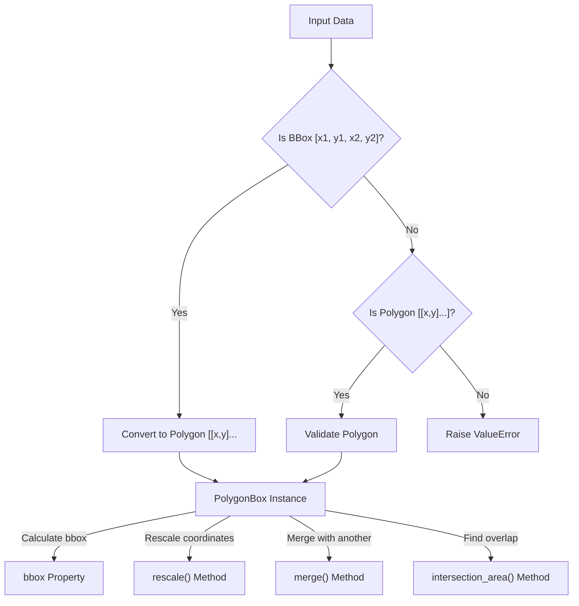
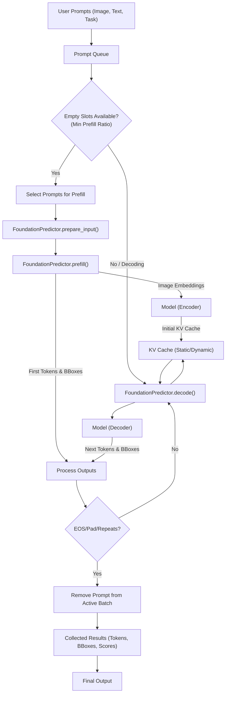

 # Foundation and Utilities

This section details the core utilities, common data schemas, and foundational operations that underpin various modules within the Surya project. These components provide robust handling for geometric data, task definitions, and the intricate processing pipeline for the Foundation Model.

## Geometric Data Handling: `PolygonBox`

The `surya/common/polygon.py` file introduces the `PolygonBox` Pydantic model, a robust structure for representing and manipulating 2D polygons, specifically quadrilateral bounding boxes. This class ensures data integrity through validation and provides a comprehensive suite of geometric operations critical for various computer vision tasks.

### Key Features and Operations

*   **Pydantic Model:** `PolygonBox` is a Pydantic `BaseModel` ensuring data validation upon initialization. It automatically converts common bounding box formats (e.g., `[x_min, y_min, x_max, y_max]`) into the standard 4-corner polygon format `[[x1, y1], [x2, y2], [x3, y3], [x4, y4]]`.
*   **Computed Properties:** Easily access geometric properties like `bbox`, `height`, `width`, `area`, and `center`.
*   **Transformation Methods:**
    *   `rescale`: Adjusts polygon coordinates based on image and processor sizes.
    *   `round`: Rounds corner coordinates to a specified divisor.
    *   `fit_to_bounds`: Clamps polygon coordinates within given boundaries.
    *   `shift`: Translates the polygon by specified `x` and `y` offsets.
    *   `clamp`: Constrains polygon corners within a target bounding box.
*   **Intersection & Merging:**
    *   `merge`: Creates a new bounding box that encompasses both the current and another `PolygonBox`.
    *   `merge_left`, `merge_right`: Adjusts the current polygon's left or right edge to merge with another.
    *   `intersection_polygon`, `intersection_area`, `intersection_pct`: Calculate intersection details with another `PolygonBox`, optionally with margins.
*   **Expansion:** `expand` method inflates the polygon by a given `x_margin` and `y_margin` relative to its width and height.

```python
# surya/common/polygon.py
# View on GitHub: https://github.com/datalab-to/surya/blob/main/surya/common/polygon.py

from pydantic import BaseModel, field_validator
from typing import List, Optional

class PolygonBox(BaseModel):
    polygon: List[List[float]]
    confidence: Optional[float] = None

    @field_validator("polygon", mode="before")
    @classmethod
    def convert_bbox_to_polygon(cls, value):
        # ... logic to convert bbox [x1, y1, x2, y2] to polygon ...
        return value

    @property
    def height(self):
        return self.bbox[3] - self.bbox[1]

    @property
    def width(self):
        return self.bbox[2] - self.bbox[0]

    # ... other methods like rescale, merge, intersection_area ...
```

### `PolygonBox` Operation Flow





## Common Schemas and Utilities

The `surya/common` directory also houses general utility functions and shared schemas.

### Task Definitions: `TaskNames`

Defined in `surya/common/surya/schema.py`, `TaskNames` enumerates the various tasks the Surya model can perform. This provides a standardized way to refer to different operational modes, each potentially requiring different input preprocessing or model configurations.

```python
# surya/common/surya/schema.py
# View on GitHub: https://github.com/datalab-to/surya/blob/main/surya/common/surya/schema.py

class TaskNames:
    block_without_boxes = "block_without_boxes"
    ocr_with_boxes = "ocr_with_boxes"
    ocr_without_boxes = "ocr_without_boxes"
    layout = "layout"
    table_structure = "table_structure"

TASK_NAMES = [
    TaskNames.block_without_boxes,
    # ... other task names ...
]
```

### General Utilities: `surya/common/util.py`

This file consolidates miscellaneous utility functions used across the Surya framework.

*   **`clean_boxes(boxes: List[PolygonBox])`**: Filters out redundant or fully contained `PolygonBox` objects from a list, ensuring a cleaner set of unique bounding boxes.
*   **`rescale_bbox` / `expand_bbox`**: Functions for scaling and expanding traditional `[x_min, y_min, x_max, y_max]` bounding boxes.
*   **Script Detection**: Functions (`script_ranges`, `get_top_scripts`) that identify the dominant Unicode scripts (e.g., Latin, Chinese, Cyrillic) present in a given text string, essential for multilingual text processing.
*   **Hardware Capabilities**: `is_flash_attn_2_supported`: Checks if the current CUDA environment and GPU compute capability support Flash Attention 2, enabling performance optimizations.
*   **Tensor Padding**: `pad_to_batch_size_repeat` and `pad_to_batch_size` provide different strategies for padding PyTorch tensors to a desired batch size, crucial for consistent batch processing on accelerators.

```python
# surya/common/util.py
# View on GitHub: https://github.com/datalab-to/surya/blob/main/surya/common/util.py#L9-L33

from surya.common.polygon import PolygonBox
from typing import List

def clean_boxes(boxes: List[PolygonBox]) -> List[PolygonBox]:
    new_boxes = []
    for box_obj in boxes:
        # ... logic to check for contained or invalid boxes ...
        if not contained:
            new_boxes.append(box_obj)
    return new_boxes

def get_top_scripts(text: str, max_scripts: int = 5):
    # ... logic to count characters by script category ...
    return top_scripts[:max_scripts]
```

## Foundation Model Predictor: `FoundationPredictor`

The `surya/foundation/__init__.py` file defines the `FoundationPredictor` class, a central component responsible for managing the inference lifecycle of the underlying foundation model. It handles input preparation, batching, caching, and output processing.

### Core Data Structures

*   **`ContinuousBatchInput`**: Dataclass to hold input tensors (`input_ids`, `input_boxes`, `position_ids`), token counts, and flags for continuous batch processing.
*   **`ContinuousBatchOutput`**: Dataclass to encapsulate model predictions (`input_ids`, `preds`, `bbox_preds`, `scores`, `token_probs`).
*   **`FoundationPrompt`**: Dataclass to store individual inference requests, including `id`, `task_name`, `image`, `text`, and `math_mode`.

### Predictor Initialization and Configuration

The `FoundationPredictor` extends `BasePredictor` and is configured with various settings:

*   **`model_loader_cls`**: Specifies `FoundationModelLoader` for model instantiation.
*   **`batch_size`**: Configurable batch size, with device-specific defaults (`cpu: 32`, `cuda: 256`, etc.).
*   **`encoder_chunk_size`**: Defines the chunk size for encoder processing, also with device-specific defaults.
*   **`tasks`**: A dictionary mapping `TaskNames` to specific configurations like `needs_bboxes`, `img_size`, and `max_tokens`. This allows dynamic adaptation based on the chosen task.
*   **KV Cache Management**: Uses `DynamicOpsCache` or `StaticOpsCache` based on `settings.FOUNDATION_XLA` for efficient key-value cache handling during generation.

### Inference Workflow (`prediction_loop`)

The `prediction_loop` orchestrates the inference process, managing a `prompt_queue` and alternating between `prefill` and `decode` steps.

1.  **Queue Prompts**: Incoming images and texts are wrapped in `FoundationPrompt` objects and added to a `deque`.
2.  **`setup_cache`**: Initializes the KV cache based on the calculated `max_cache_len` and `max_sliding_window`.
3.  **Looping Inference**:
    *   **`prefill`**: When enough empty slots are available in the batch (`min_prefill_ratio`), new prompts are taken from the queue, processed (scaled, tokenized), and their initial embeddings are computed and cached. This populates the cache for the first tokens of new sequences.
    *   **`decode`**: For active sequences in the batch, the model predicts the next token(s) based on the current input and the KV cache. This is an iterative process where tokens are generated one by one (or in small lookahead batches).
4.  **Token Processing**: Predicted tokens and their bounding boxes are collected. Stopping conditions include EOS tokens, pad tokens, or detection of repeated tokens (to prevent infinite loops).
5.  **Cache Management**: The KV cache is dynamically updated with generated tokens. Beacon tokens are inserted at regular intervals to improve attention efficiency.

```python
# surya/foundation/__init__.py
# View on GitHub: https://github.com/datalab-to/surya/blob/main/surya/foundation/__init__.py#L111-L157

from dataclasses import dataclass
from typing import List, Optional, Tuple
import torch
import numpy as np
from PIL import Image

from surya.common.surya.schema import TaskNames
from surya.common.predictor import BasePredictor

@dataclass
class FoundationPrompt:
    id: int
    task_name: TaskNames
    image: np.ndarray
    text: str
    math_mode: bool

class FoundationPredictor(BasePredictor):
    # ... configuration properties ...

    def prepare_input(self, task_names: List[str], images: List[Image.Image], input_text: List[str | None], math_modes: List[bool]):
        # Scales images, tokenizes text, and formats inputs for the model
        pass

    def prefill(self, current_inputs: Optional[ContinuousBatchInput] = None, max_lookahead_tokens: Optional[int] = None):
        # Processes new prompts, generates initial tokens, and updates the KV cache
        pass

    def decode(self, current_inputs: Optional[ContinuousBatchInput] = None, max_lookahead_tokens: Optional[int] = None):
        # Generates subsequent tokens for active sequences, using and updating the KV cache
        pass

    def prediction_loop(self, images: List[np.ndarray], input_texts: List[str], task_names: List[TaskNames], **kwargs):
        # Orchestrates the overall inference process using prefill and decode
        pass
```

### FoundationPredictor Inference Flow





## Key Integration Points

*   **`PolygonBox` Ubiquity**: The `PolygonBox` class is fundamental for any module dealing with spatial information, ensuring consistent handling of geometric data across the system. Functions like `clean_boxes` in `surya/common/util.py` directly operate on `PolygonBox` objects.
*   **Task-Driven Workflow**: The `TaskNames` enum from `surya/common/surya/schema.py` is central to `FoundationPredictor`'s configuration (`self.tasks`), allowing the model to adapt its behavior and resource allocation based on the specific request (e.g., OCR, layout detection).
*   **Performance Optimization**: The utilities for Flash Attention 2 detection (`is_flash_attn_2_supported`) and tensor padding are critical for optimizing performance on GPU devices, especially when dealing with variable-length sequences and batch processing.
*   **Foundation Model Pipeline**: The `FoundationPredictor` acts as the primary interface for interacting with the core foundation model, abstracting away complex details of batching, caching, and multi-turn generation. Its `prediction_loop` handles the continuous flow of prompts from a queue, efficiently managing model resources through prefill and decode phases. This modular design separates the model execution logic from the higher-level application logic.