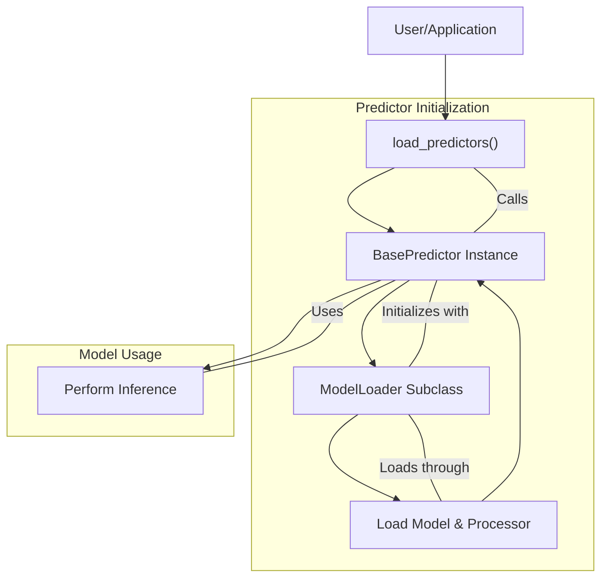

 # Core Modules and Architecture

Surya's architecture is designed for modularity and efficient handling of various deep learning models for document analysis. This document explores the core components that facilitate model loading, prediction, and overall system integration.

At its heart, Surya leverages a clear separation between model loading, prediction logic, and the specific implementations for different tasks like layout analysis, OCR error detection, and recognition. This design promotes reusability, maintainability, and scalability.

## surya/common/load.py: The ModelLoader Abstraction

The `ModelLoader` class in `surya/common/load.py` serves as an abstract interface for loading deep learning models and their associated processors. It's designed to be extended by specific model implementations, ensuring a consistent loading mechanism across different model types.

### Key Responsibilities

*   **Standardized Model Loading**: Provides abstract methods for `model()` and `processor()`, which concrete implementations must override.
*   **Device and Data Type Management**: Allows specification of `device` (e.g., `cuda`, `cpu`, `mps`) and `dtype` (e.g., `torch.float16`, `torch.bfloat16`) at the time of model initialization, ensuring optimal performance and memory usage.
*   **Checkpoint Handling**: The `checkpoint` parameter enables loading pre-trained weights or specific model versions.

```python
# surya/common/load.py - ModelLoader Class Definition
from typing import Optional, Any
import torch
from surya.settings import settings

class ModelLoader:
    def __init__(self, checkpoint: Optional[str] = None):
        self.checkpoint = checkpoint

    def model(
        self,
        device: torch.device | str | None = settings.TORCH_DEVICE_MODEL,
        dtype: Optional[torch.dtype | str] = settings.MODEL_DTYPE,
        attention_implementation: Optional[str] = None,
    ) -> Any:
        raise NotImplementedError()

    def processor(
        self,
        device: torch.device | str | None = settings.TORCH_DEVICE_MODEL,
        dtype: Optional[torch.dtype | str] = settings.MODEL_DTYPE,
    ) -> Any:
        raise NotImplementedError()
```
[View on GitHub](https://github.com/datalab-to/surya/blob/main/surya/common/load.py#L9-L29)

This abstract class enforces that any new model integration within Surya adheres to a predictable loading pattern, making the system easier to extend and maintain.

## surya/common/predictor.py: The BasePredictor

The `BasePredictor` class is the cornerstone for all prediction tasks in Surya. It provides foundational functionalities for initializing models, managing device placement, handling batching, and defining the core prediction interface. Specific predictors (e.g., `DetectionPredictor`, `LayoutPredictor`) inherit from `BasePredictor`, implementing their specialized logic while benefiting from the shared infrastructure.

### Core Features

*   **Model and Processor Initialization**: Utilizes `ModelLoader` (or its concrete subclasses) to instantiate the underlying deep learning model and its corresponding pre/post-processing unit (`processor`).
*   **Device and Data Type Configuration**: Manages `torch.device` and `torch.dtype` for optimal hardware utilization.
*   **Batching Strategy**: Implements methods to determine and apply appropriate batch sizes based on the execution device and provides utilities for padding inputs to the required batch dimensions.
*   **Model Mobility**: The `to()` method allows dynamically moving the loaded models between different devices (e.g., CPU, GPU).

### Initialization and Model Loading

The constructor of `BasePredictor` is responsible for orchestrating the loading of the actual model and processor. It leverages the `model_loader_cls` (which defaults to `ModelLoader` but can be overridden by subclasses) to perform this task.

```python
# surya/common/predictor.py - BasePredictor __init__ method
class BasePredictor:
    model_loader_cls = ModelLoader
    # ... other attributes

    def __init__(
        self,
        checkpoint: Optional[str] = None,
        device: torch.device | str | None = settings.TORCH_DEVICE_MODEL,
        dtype: Optional[torch.dtype | str] = None,
        attention_implementation: Optional[str] = None,
    ):
        if dtype is None:
            dtype = self.torch_dtype

        self.model = None
        self.processor = None
        loader = self.model_loader_cls(checkpoint) # Uses the assigned ModelLoader subclass

        self.model = loader.model(device, dtype, attention_implementation)
        self.processor = loader.processor()

        self._disable_tqdm = settings.DISABLE_TQDM
```
[View on GitHub](https://github.com/datalab-to/surya/blob/main/surya/common/predictor.py#L29-L49)

This sequence ensures that a predictor instance has its required neural network model and preprocessor ready for inference.

### Device Management

The `to()` method provides a convenient way to relocate the model to a different device or change its data type after initialization, which is crucial for flexible resource management in diverse computing environments.

```python
# surya/common/predictor.py - BasePredictor.to method
    def to(self, device_dtype: torch.device | str | None = None):
        model_moved = False
        if hasattr(self, "model") and self.model:
            self.model.to(device_dtype)
            model_moved = True
        if hasattr(self, "foundation_predictor") and self.foundation_predictor:
            self.foundation_predictor.model.to(device_dtype)
            model_moved = True

        if not model_moved:
            raise ValueError("Model not loaded")
```
[View on GitHub](https://github.com/datalab-to/surya/blob/main/surya/common/predictor.py#L51-L61)

This method ensures that both the primary model and any embedded foundation models are moved consistently.

### Batch Size Handling

`BasePredictor` includes logic for determining an appropriate batch size based on the execution device, defaulting to CPU if a specific device batch size isn't defined. It also provides a utility to pad input tensors to a desired batch size, preventing issues during inference with variable input counts.

```python
# surya/common/predictor.py - BasePredictor.get_batch_size method
    def get_batch_size(self):
        batch_size = self.batch_size
        if batch_size is None:
            batch_size = self.default_batch_sizes["cpu"]
            if settings.TORCH_DEVICE_MODEL in self.default_batch_sizes:
                batch_size = self.default_batch_sizes[settings.TORCH_DEVICE_MODEL]
        return batch_size

# surya/common/predictor.py - BasePredictor.pad_to_batch_size method
    @staticmethod
    def pad_to_batch_size(tensor: torch.Tensor, batch_size: int):
        current_batch_size = tensor.shape[0]
        if current_batch_size >= batch_size:
            return tensor
        
        # ... padding logic ...
```
[View on GitHub](https://github.com/datalab-to/surya/blob/main/surya/common/predictor.py#L63-L84)

This mechanism ensures efficient use of hardware by grouping multiple inference requests into a single batch, minimizing overhead.

## surya/models.py: Predictor Aggregation and Loading

The `surya/models.py` file is central to how Surya's various specialized predictors are instantiated and managed. It defines the `load_predictors` function, which acts as a factory for creating and returning a collection of configured `BasePredictor` instances.

### The `load_predictors` Function

This function is the primary entry point for users or other modules to obtain a ready-to-use set of Surya's document analysis capabilities. It initializes specific predictor classes, often passing along global settings or user-specified device/dtype configurations.

```python
# surya/models.py - load_predictors function
from typing import Dict
import torch
from surya.common.predictor import BasePredictor
from surya.detection import DetectionPredictor
from surya.layout import LayoutPredictor
from surya.ocr_error import OCRErrorPredictor
from surya.foundation import FoundationPredictor # Note: FoundationPredictor is used here
from surya.recognition import RecognitionPredictor
from surya.table_rec import TableRecPredictor
from surya.settings import settings

def load_predictors(
    device: str | torch.device | None = None, dtype: torch.dtype | str | None = None
) -> Dict[str, BasePredictor]:
    return {
        "layout": LayoutPredictor(FoundationPredictor(checkpoint=settings.LAYOUT_MODEL_CHECKPOINT)),
        "ocr_error": OCRErrorPredictor(device=device, dtype=dtype),
        "recognition": RecognitionPredictor(FoundationPredictor(checkpoint=settings.RECOGNITION_MODEL_CHECKPOINT)),
        "detection": DetectionPredictor(device=device, dtype=dtype),
        "table_rec": TableRecPredictor(device=device, dtype=dtype),
    }
```
[View on GitHub](https://github.com/datalab-to/surya/blob/main/surya/models.py#L19-L29)

This function returns a dictionary where keys are task names (e.g., "layout", "recognition") and values are the initialized predictor instances. This allows easy access and integration of different functionalities. Notice that `LayoutPredictor` and `RecognitionPredictor` internally use a `FoundationPredictor`, illustrating a composition pattern where some predictors build upon others.

## Core Architecture Flow

The following diagram illustrates the high-level interaction between the core modules when loading and using models in Surya.





### Explanation of the Model Loading Process

1.  **Request Predictors**: The user or application initiates the process by calling `load_predictors()`.
2.  **Instantiate BasePredictors**: `load_predictors()` then creates instances of various `BasePredictor` subclasses (e.g., `LayoutPredictor`, `DetectionPredictor`).
3.  **Delegate to ModelLoader**: Each `BasePredictor` instance, in its `__init__`, creates an instance of its assigned `ModelLoader` subclass.
4.  **Load Model & Processor**: The `ModelLoader` subclass is then responsible for the actual deep learning model (`torch.nn.Module`) and its `processor` (e.g., tokenizer, image preprocessor) from the specified `checkpoint`. This involves moving them to the correct `device` and setting the `dtype`.
5.  **Ready for Inference**: Once the `BasePredictor` has its `model` and `processor` loaded, it is ready to `Perform Inference` for its specific task.

## Key Integration Points

The modular design with `ModelLoader` and `BasePredictor` provides several benefits:

*   **Extensibility**: Adding new models or tasks involves creating a new `ModelLoader` subclass for the specific model architecture and a `BasePredictor` subclass to define its prediction logic.
*   **Resource Management**: Centralized `device` and `dtype` management in `BasePredictor` and `ModelLoader` simplifies optimizing for different hardware configurations. The `to()` method allows dynamic resource allocation.
*   **Code Reusability**: Common functionalities like batching, device management, and error handling are encapsulated in `BasePredictor`, reducing boilerplate code in specialized predictors.
*   **Clear Separation of Concerns**: `ModelLoader` focuses solely on model instantiation, while `BasePredictor` handles inference workflow, keeping the codebase clean and understandable.

This architecture ensures that Surya can efficiently manage and deploy a diverse set of deep learning models for complex document understanding tasks.