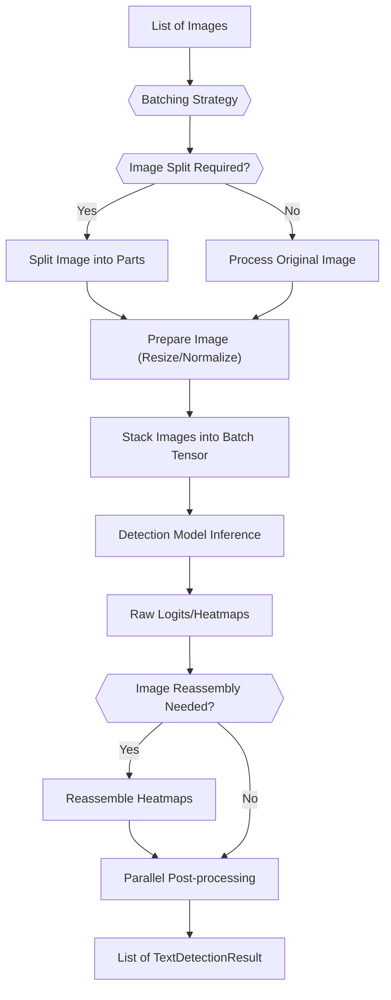
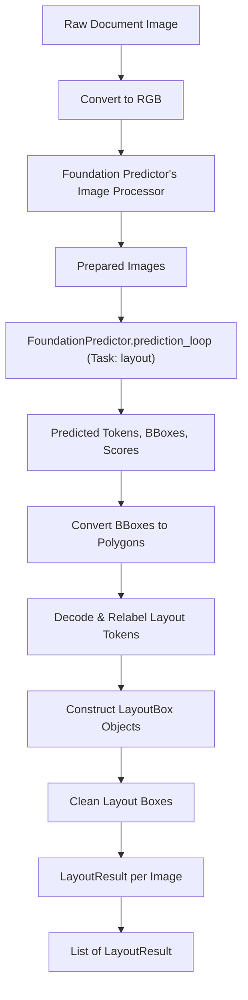

 # Text and Layout Detection

The `surya/detection` and `surya/layout` modules are critical components of the Surya project, responsible for accurately identifying text regions and inferring the overall structural layout of documents. These modules leverage advanced deep learning models and robust image processing techniques to transform raw images into structured information, enabling subsequent tasks like OCR and document understanding.

## Text Detection with `DetectionPredictor`

The `DetectionPredictor` class, defined in [`surya/detection/__init__.py`](https://github.com/datalab-to/surya/blob/main/surya/detection/__init__.py), is the primary entry point for text region detection. It inherits from `BasePredictor` and encapsulates the entire workflow from image preparation to bounding box generation.

### Core Workflow

The detection process follows a multi-stage pipeline:

1.  **Image Preparation**: Input images are resized and preprocessed to match the model's expected input dimensions and format. This involves a crucial double-resize step to maintain accuracy.
2.  **Image Splitting**: Large images are dynamically split into smaller, manageable parts if their dimensions exceed the model's input size. This ensures efficient processing while handling various document sizes.
3.  **Batch Inference**: The prepared image parts are batched and fed through the underlying detection model, which generates raw prediction logits (heatmaps).
4.  **Heatmap Reassembly**: For images that were split, the individual heatmaps from each part are reassembled to form a complete prediction for the original image.
5.  **Post-processing**: The reassembled heatmaps are then processed in parallel to extract precise bounding boxes for text regions. This step often involves techniques like NMS (Non-Maximum Suppression) or connected component analysis to refine the box predictions.

```python
# From surya/detection/__init__.py, lines 29-45
class DetectionPredictor(BasePredictor):
    model_loader_cls = DetectionModelLoader
    batch_size = settings.DETECTOR_BATCH_SIZE
    default_batch_sizes = {"cpu": 8, "mps": 8, "cuda": 36, "xla": 18}

    def __call__(
        self, images: List[Image.Image], batch_size=None, include_maps=False
    ) -> List[TextDetectionResult]:
        detection_generator = self.batch_detection(
            images, batch_size=batch_size, static_cache=settings.DETECTOR_STATIC_CACHE
        )

        postprocessing_futures = []
        max_workers = min(settings.DETECTOR_POSTPROCESSING_CPU_WORKERS, len(images))
        parallelize = (
            not settings.IN_STREAMLIT
            and len(images) >= settings.DETECTOR_MIN_PARALLEL_THRESH
        )
        executor = ThreadPoolExecutor if parallelize else FakeExecutor
        with executor(max_workers=max_workers) as e:
            for preds, orig_sizes in detection_generator:
                for pred, orig_size in zip(preds, orig_sizes):
                    postprocessing_futures.append(
                        e.submit(parallel_get_boxes, pred, orig_size, include_maps)
                    )
        return [future.result() for future in postprocessing_futures]
```
[View on GitHub](https://github.com/datalab-to/surya/blob/main/surya/detection/__init__.py#L29-L45)

### Image Preparation Details

The `prepare_image` method demonstrates a specific image resizing strategy, where an image is first `thumbnail`ed and then `resize`d. This approach is noted as "necessary for downstream accuracy."

```python
# From surya/detection/__init__.py, lines 52-64
    def prepare_image(self, img):
        new_size = (self.processor.size["width"], self.processor.size["height"])

        # This double resize actually necessary for downstream accuracy
        img.thumbnail(new_size, Image.Resampling.LANCZOS)
        img = img.resize(
            new_size, Image.Resampling.LANCZOS
        )  # Stretch smaller dimension to fit new size

        img = np.asarray(img, dtype=np.uint8)
        img = self.processor(img)["pixel_values"][0]
        img = torch.from_numpy(img)
        return img
```
[View on GitHub](https://github.com/datalab-to/surya/blob/main/surya/detection/__init__.py#L52-L64)

### Batching and Splitting

The `batch_detection` method handles the complex logic of splitting images that are larger than the model's input size and then batching these splits efficiently for inference. This ensures that even very tall documents can be processed without excessive memory consumption or loss of detail.

```python
# From surya/detection/__init__.py, lines 99-106
            image_splits = []
            for image_idx, image in enumerate(batch_images):
                image_parts, split_height = split_image(
                    image, self.processor.size["height"]
                )
                image_splits.extend(image_parts)
                split_index.extend([image_idx] * len(image_parts))
                split_heights.extend(split_height)

            image_splits = [self.prepare_image(image) for image in image_splits]
            # Batch images in dim 0
            batch = torch.stack(image_splits, dim=0).to(self.model.dtype)
```
[View on GitHub](https://github.com/datalab-to/surya/blob/main/surya/detection/__init__.py#L99-L106)





## Image Preprocessing with `SegformerImageProcessor`

The `SegformerImageProcessor` ([`surya/detection/processor.py`](https://github.com/datalab-to/surya/blob/main/surya/detection/processor.py)) is a specialized image processor, extended from `transformers.image_processing_utils.BaseImageProcessor`. It handles the canonical steps required to prepare an image for a Segformer-like detection model.

### Key Preprocessing Steps

The processor's `preprocess` method orchestrates several transformations:

*   **Resizing**: Scales images to a fixed `size` (e.g., 512x512) using a specified `resample` filter.
*   **Rescaling**: Normalizes pixel values, typically from `[0-255]` to `[0-1]`, using a `rescale_factor` (e.g., `1/255`).
*   **Normalization**: Standardizes pixel values using `image_mean` and `image_std`, commonly derived from datasets like ImageNet.
*   **Channel Dimension Formatting**: Ensures the image tensor has the correct channel dimension order (e.g., `channels_first` or `channels_last`) for the model.

```python
# From surya/detection/processor.py, lines 220-234
    def preprocess(
        self,
        images: ImageInput,
        segmentation_maps: Optional[ImageInput] = None,
        do_resize: Optional[bool] = None,
        size: Optional[Dict[str, int]] = None,
        resample: PILImageResampling = None,
        do_rescale: Optional[bool] = None,
        rescale_factor: Optional[float] = None,
        do_normalize: Optional[bool] = None,
        image_mean: Optional[Union[float, List[float]]] = None,
        image_std: Optional[Union[float, List[float]]] = None,
        do_reduce_labels: Optional[bool] = None,
        return_tensors: Optional[Union[str, TensorType]] = None,
        data_format: ChannelDimension = ChannelDimension.FIRST,
        input_data_format: Optional[Union[str, ChannelDimension]] = None,
        **kwargs,
    ) -> PIL.Image.Image:
        # ... configuration retrieval ...
        images = make_list_of_images(images)
        images = [
            self._preprocess_image(
                image=img,
                do_resize=do_resize,
                resample=resample,
                size=size,
                do_rescale=do_rescale,
                rescale_factor=rescale_factor,
                do_normalize=do_normalize,
                image_mean=image_mean,
                image_std=image_std,
                data_format=data_format,
                input_data_format=input_data_format,
            )
            for img in images
        ]

        data = {"pixel_values": images}
        return BatchFeature(data=data, tensor_type=return_tensors)
```
[View on GitHub](https://github.com/datalab-to/surya/blob/main/surya/detection/processor.py#L220-L248)

The processor plays a crucial role in ensuring the data fed to the model is consistent and optimized for performance.

## Layout Analysis with `LayoutPredictor`

The `LayoutPredictor` class, found in [`surya/layout/__init__.py`](https://github.com/datalab-to/surya/blob/main/surya/layout/__init__.py), focuses on identifying the structural elements of a document, such as paragraphs, titles, lists, tables, and figures. Unlike `DetectionPredictor`, which is designed for general text regions, `LayoutPredictor` provides semantic labels for these regions.

### Integration with `FoundationPredictor`

A key design choice for `LayoutPredictor` is its reliance on a `FoundationPredictor`. Instead of loading its own model, it utilizes an existing `FoundationPredictor` instance, indicating a shared or multi-task model architecture that can perform various tasks, including layout analysis.

```python
# From surya/layout/__init__.py, lines 18-23
class LayoutPredictor(BasePredictor):
    batch_size = settings.LAYOUT_BATCH_SIZE
    default_batch_sizes = {"cpu": 4, "mps": 4, "cuda": 32, "xla": 16}

    # Override base init - Do not load model
    def __init__(self, foundation_predictor: FoundationPredictor):
        self.foundation_predictor = foundation_predictor
        self.processor = self.foundation_predictor.processor
        self.bbox_size = self.foundation_predictor.model.config.bbox_size
        self.tasks = self.foundation_predictor.tasks
```
[View on GitHub](https://github.com/datalab-to/surya/blob/main/surya/layout/__init__.py#L18-L23)

### Layout Prediction Process

1.  **Image Preparation**: Images are converted to RGB and processed by the `FoundationPredictor`'s internal image processor.
2.  **Foundation Model Inference**: The images are passed to the `FoundationPredictor` with the `TaskNames.layout` specified. This prompts the foundation model to generate predictions relevant to document layout.
3.  **Polygon Conversion**: The raw bounding box predictions from the foundation model are converted into `polygon` representations.
4.  **Label Decoding and Relabeling**: The predicted tokens (representing layout labels) are decoded and then potentially relabeled using `LAYOUT_PRED_RELABEL` for consistency and clarity.
5.  **Box Cleaning**: Post-processing, such as `clean_boxes`, is applied to refine the layout boxes, removing redundancies or ill-formed predictions.

```python
# From surya/layout/__init__.py, lines 43-49
        image_sizes = [img.shape for img in images]
        predicted_polygons = prediction_to_polygon_batch(
            batch_bboxes, image_sizes, self.bbox_size, self.bbox_size // 2
        )
        layout_results = []
        for image, image_tokens, image_polygons, image_scores, image_topk_scores in zip(
            images, predicted_tokens, predicted_polygons, scores, topk_scores
        ):
            layout_boxes = []
            for z, (tok, poly, score, tok_topk) in enumerate(
                zip(image_tokens, image_polygons, image_scores, image_topk_scores)
            ):
                if tok == self.processor.eos_token_id:
                    break
```
[View on GitHub](https://github.com/datalab-to/surya/blob/main/surya/layout/__init__.py#L43-L49)





## Key Integration Points

*   **Shared Processor**: Both detection and layout leverage the `SegformerImageProcessor` (or a similar internal processor from `FoundationPredictor`) for consistent image preparation. This centralizes preprocessing logic and reduces redundancy.
*   **Parallelism**: `DetectionPredictor` utilizes `ThreadPoolExecutor` for parallel post-processing of detection heatmaps. This is crucial for performance, especially when dealing with high volumes of documents.
*   **Foundation Model Synergy**: `LayoutPredictor` demonstrates a powerful pattern where a specialized task (layout analysis) is implemented as a task within a more general `FoundationPredictor`. This suggests a multi-task learning architecture, allowing the model to learn shared representations beneficial for various document intelligence tasks.
*   **Scalability**: The image splitting and batching mechanisms in `DetectionPredictor` are essential for handling documents of arbitrary sizes without running out of memory, making the system robust for real-world applications.
*   **Configurability**: Batch sizes and other operational parameters are defined in `settings`, allowing for flexible deployment and optimization across different hardware (CPU, MPS, CUDA, XLA). This is evident in `default_batch_sizes` attributes for both `DetectionPredictor` and `LayoutPredictor`.