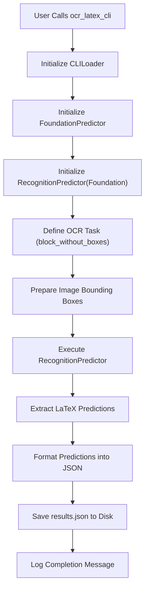
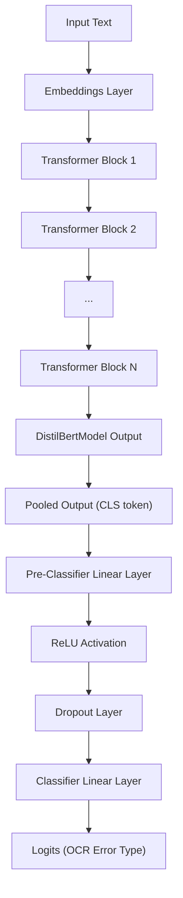

 # LaTeX OCR and Error Correction

This documentation details the core components involved in converting detected text into LaTeX format and the sophisticated mechanisms employed for identifying and correcting Optical Character Recognition (OCR) errors within the Surya project. It encompasses a command-line interface for LaTeX OCR and a robust transformer-based model for error detection and correction, alongside its associated tokenizer.

## LaTeX OCR Command-Line Interface (`ocr_latex.py`)

The `ocr_latex.py` script provides a command-line interface for performing OCR specifically on LaTeX equations. It leverages Surya's `FoundationPredictor` and `RecognitionPredictor` to detect and convert images of equations into their corresponding LaTeX string representations.

The script, when executed, initializes the necessary predictors, processes input images, and outputs the detected LaTeX equations into a structured JSON file.

```python
# ocr_latex.py
from surya.scripts.ocr_latex import ocr_latex_cli

if __name__ == "__main__":
    ocr_latex_cli()
```

This snippet shows the entry point for the LaTeX OCR CLI. It directly calls the `ocr_latex_cli` function from `surya.scripts.ocr_latex`.

### Core Logic of `ocr_latex_cli`

The `ocr_latex_cli` function orchestrates the OCR process:

*   **Input Loading**: Uses `CLILoader` to handle input images and command-line arguments.
*   **Predictor Initialization**:
    *   `FoundationPredictor`: Provides the foundational models required for various vision tasks, including block detection.
    *   `RecognitionPredictor`: Built upon the foundation predictor, it's specialized for text recognition, here specifically configured for LaTeX.
*   **Task Definition**: Sets `TaskNames.block_without_boxes` for each image, indicating that the entire image content should be treated as a single block for OCR. Bounding boxes are set to cover the full image dimensions.
*   **Prediction Execution**: Calls the `texify_predictor` with images, tasks, and bounding boxes to obtain LaTeX equation predictions.
*   **Output Generation**: Formats the predictions into a dictionary, associating each equation with its source image and page number, then saves them to a `results.json` file.

```python
# surya/scripts/ocr_latex.py
import os
import click
import json
import time
from collections import defaultdict

from surya.logging import configure_logging, get_logger
from surya.scripts.config import CLILoader
from surya.foundation import FoundationPredictor
from surya.recognition import RecognitionPredictor
from surya.common.surya.schema import TaskNames

# ... (logging configuration) ...

@click.command(help="OCR LaTeX equations.")
@CLILoader.common_options
def ocr_latex_cli(input_path: str, **kwargs):
    loader = CLILoader(input_path, kwargs, highres=True)

    foundation_predictor = FoundationPredictor() # Initializes core models
    texify_predictor = RecognitionPredictor(foundation_predictor) # Specialized for recognition
    tasks = [TaskNames.block_without_boxes] * len(loader.images) # Define OCR task
    bboxes = [[[0, 0, image.width, image.height]] for image in loader.images] # Full image bounding box

    predictions_by_image = texify_predictor( # Execute prediction
        loader.images,
        tasks,
        bboxes=bboxes,
    )

    latex_predictions = [p.text_lines[0].text for p in predictions_by_image] # Extract LaTeX strings

    # ... (debug logging) ...

    out_preds = defaultdict(list)
    for name, pred, image in zip(loader.names, latex_predictions, loader.images):
        out_pred = {
            "equation": pred,
            "page": len(out_preds[name]) + 1,
        }
        out_preds[name].append(out_pred)

    with open(
        os.path.join(loader.result_path, "results.json"), "w+", encoding="utf-8"
    ) as f:
        json.dump(out_preds, f, ensure_ascii=False) # Save results

    logger.info(f"Wrote results to {loader.result_path}")
```
[View on GitHub](https://github.com/datalab-to/surya/blob/main/surya/scripts/ocr_latex.py)





## OCR Error Correction Model (`surya/ocr_error/model/encoder.py`)

This file defines the architecture for a transformer-based model, specifically a DistilBERT-like encoder, designed for tasks such as OCR error correction or sequence classification of OCR outputs. It comprises several key neural network components that process input sequences to generate contextualized embeddings.

The model is built with a stack of transformer blocks, each containing self-attention and feed-forward layers, enabling it to capture complex dependencies within the text.

### Embeddings

The `Embeddings` module transforms input token IDs into dense vector representations. It combines word embeddings (representing token semantics) with positional embeddings (encoding token order) before applying layer normalization and dropout.

```python
# surya/ocr_error/model/encoder.py
class Embeddings(nn.Module):
    def __init__(self, config: DistilBertConfig):
        super().__init__()
        self.word_embeddings = nn.Embedding(
            config.vocab_size, config.dim, padding_idx=config.pad_token_id
        )
        self.position_embeddings = nn.Embedding(
            config.max_position_embeddings, config.dim
        )
        self.LayerNorm = nn.LayerNorm(config.dim, eps=1e-12)
        self.dropout = nn.Dropout(config.dropout)
        # ... (position_ids buffer) ...

    def forward(self, input_ids: torch.Tensor, input_embeds: Optional[torch.Tensor] = None) -> torch.Tensor:
        # ... (embedding logic) ...
        return embeddings
```
[View on GitHub](https://github.com/datalab-to/surya/blob/main/surya/ocr_error/model/encoder.py#L64-L88)

### MultiHeadSelfAttention and FlashAttention2

The `MultiHeadSelfAttention` module allows the model to simultaneously attend to different parts of the input sequence, capturing diverse relationships between tokens. It projects queries, keys, and values, performs scaled dot-product attention, and combines the results.

`DistilBertFlashAttention2` is an optimized version that leverages Flash Attention 2 for faster computation, especially beneficial for long sequences, by handling padding efficiently.

```python
# surya/ocr_error/model/encoder.py
class MultiHeadSelfAttention(nn.Module):
    def __init__(self, config: DistilBertConfig):
        super().__init__()
        self.n_heads = config.n_heads
        self.dim = config.dim
        self.dropout = nn.Dropout(p=config.attention_dropout)
        # ... (linear layers for Q, K, V, output) ...

    def forward(self, query: torch.Tensor, key: torch.Tensor, value: torch.Tensor, mask: torch.Tensor, head_mask: Optional[torch.Tensor] = None, output_attentions: bool = False) -> Tuple[torch.Tensor, ...]:
        # ... (attention logic) ...
        return (context,) # or (context, weights)
```
[View on GitHub](https://github.com/datalab-to/surya/blob/main/surya/ocr_error/model/encoder.py#L91-L184)

### Transformer Block and Transformer

A `TransformerBlock` encapsulates the self-attention mechanism and a Feed-Forward Network (FFN), each followed by layer normalization and residual connections. The `Transformer` module stacks multiple such blocks to form the encoder.

```python
# surya/ocr_error/model/encoder.py
class TransformerBlock(nn.Module):
    def __init__(self, config: DistilBertConfig):
        super().__init__()
        self.attention = DISTILBERT_ATTENTION_CLASSES[config._attn_implementation](
            config
        )
        self.sa_layer_norm = nn.LayerNorm(normalized_shape=config.dim, eps=1e-12)
        self.ffn = FFN(config)
        self.output_layer_norm = nn.LayerNorm(normalized_shape=config.dim, eps=1e-12)

    def forward(
        self,
        x: torch.Tensor,
        attn_mask: Optional[torch.Tensor] = None,
        head_mask: Optional[torch.Tensor] = None,
        output_attentions: bool = False,
    ) -> Tuple[torch.Tensor, ...]:
        # ... (forward pass through attention and FFN) ...
        return output
```
[View on GitHub](https://github.com/datalab-to/surya/blob/main/surya/ocr_error/model/encoder.py#L380-L417)

### DistilBertModel and DistilBertForSequenceClassification

`DistilBertModel` combines the `Embeddings` and `Transformer` components to create the full encoder. `DistilBertForSequenceClassification` extends `DistilBertModel` by adding a classification head (a linear layer) on top, making it suitable for tasks like predicting whether a sequence contains an OCR error or classifying the type of error.

```python
# surya/ocr_error/model/encoder.py
class DistilBertForSequenceClassification(S3DownloaderMixin, DistilBertPreTrainedModel):
    def __init__(self, config: DistilBertConfig, **kwargs):
        super().__init__(config, **kwargs)
        self.num_labels = config.num_labels
        self.config = config

        self.distilbert = DistilBertModel(config)
        self.pre_classifier = nn.Linear(config.dim, config.dim)
        self.classifier = nn.Linear(config.dim, config.num_labels)
        self.dropout = nn.Dropout(config.seq_classif_dropout)

        self.post_init()

    def forward(
        self,
        input_ids: Optional[torch.Tensor] = None,
        attention_mask: Optional[torch.Tensor] = None,
        # ... (other parameters) ...
        labels: Optional[torch.LongTensor] = None,
        # ... (output parameters) ...
    ) -> Union[SequenceClassifierOutput, Tuple[torch.Tensor, ...]]:
        return_dict = (
            return_dict if return_dict is not None else self.config.use_return_dict
        )

        distilbert_output = self.distilbert( # Pass through DistilBert encoder
            input_ids=input_ids,
            attention_mask=attention_mask,
            # ... (other arguments) ...
            return_dict=return_dict,
        )
        hidden_state = distilbert_output[0]  # (bs, seq_len, dim)
        pooled_output = hidden_state[:, 0]  # Take CLS token embedding (bs, dim)
        pooled_output = self.pre_classifier(pooled_output)  # (bs, dim)
        pooled_output = nn.ReLU()(pooled_output)  # (bs, dim)
        pooled_output = self.dropout(pooled_output)  # (bs, dim)
        logits = self.classifier(pooled_output)  # (bs, num_labels)

        loss = None
        if labels is not None:
            # ... (loss calculation logic) ...

        if not return_dict:
            output = (logits,) + distilbert_output[1:]
            return ((loss,) + output) if loss is not None else output

        return SequenceClassifierOutput(
            loss=loss,
            logits=logits,
            hidden_states=distilbert_output.hidden_states,
            attentions=distilbert_output.attentions,
        )
```
[View on GitHub](https://github.com/datalab-to/surya/blob/main/surya/ocr_error/model/encoder.py#L561-L643)





## OCR Error Correction Tokenizer (`surya/ocr_error/tokenizer.py`)

The `surya/ocr_error/tokenizer.py` file implements the `DistilBertTokenizer`, a WordPiece-based tokenizer crucial for preparing text data for the `DistilBertForSequenceClassification` model. Tokenization breaks raw text into sub-word units that the model can understand, ensuring consistent input formatting and handling of out-of-vocabulary words.

### DistilBertTokenizer

This tokenizer is responsible for:
*   **Loading Vocabulary**: Reads a `vocab.txt` file to map tokens to numerical IDs.
*   **Basic Tokenization**: Performs initial cleaning, lowercasing (if configured), accent stripping, and splitting on whitespace and punctuation.
*   **WordPiece Tokenization**: Further subdivides basic tokens into subword units (e.g., "unaffable" -> "un", "##aff", "##able").
*   **Special Tokens**: Manages special tokens like `[CLS]`, `[SEP]`, `[PAD]`, `[UNK]`, and `[MASK]` for sequence structuring and specific model tasks.

```python
# surya/ocr_error/tokenizer.py
import collections
import os
import json
import unicodedata
from typing import List, Optional, Tuple

from tokenizers import normalizers

from transformers.tokenization_utils import PreTrainedTokenizer, _is_control, _is_punctuation, _is_whitespace
from transformers.tokenization_utils_fast import PreTrainedTokenizerFast

from surya.common.s3 import S3DownloaderMixin

VOCAB_FILES_NAMES = {"vocab_file": "vocab.txt"}

# ... (load_vocab, whitespace_tokenize functions) ...

class DistilBertTokenizer(S3DownloaderMixin, PreTrainedTokenizer):
    vocab_files_names = VOCAB_FILES_NAMES
    model_input_names = ["input_ids", "attention_mask"]

    def __init__(
        self,
        vocab_file,
        do_lower_case=True,
        do_basic_tokenize=True,
        never_split=None,
        unk_token="[UNK]",
        sep_token="[SEP]",
        pad_token="[PAD]",
        cls_token="[CLS]",
        mask_token="[MASK]",
        tokenize_chinese_chars=True,
        strip_accents=None,
        **kwargs,
    ):
        # ... (initialization of vocab, ids_to_tokens, basic_tokenizer, wordpiece_tokenizer) ...
        super().__init__(
            do_lower_case=do_lower_case,
            do_basic_tokenize=do_basic_tokenize,
            never_split=never_split,
            unk_token=unk_token,
            sep_token=sep_token,
            pad_token=pad_token,
            cls_token=cls_token,
            mask_token=mask_token,
            tokenize_chinese_chars=tokenize_chinese_chars,
            strip_accents=strip_accents,
            **kwargs,
        )

    # ... (properties and methods like _tokenize, _convert_token_to_id, build_inputs_with_special_tokens) ...
```
[View on GitHub](https://github.com/datalab-to/surya/blob/main/surya/ocr_error/tokenizer.py#L36-L113)

### BasicTokenizer and WordpieceTokenizer

The `BasicTokenizer` handles the initial, language-agnostic processing steps, including:
*   Cleaning text (removing control characters, normalizing whitespace).
*   Handling Chinese characters by adding whitespace around them for better tokenization.
*   Splitting text into tokens based on whitespace and punctuation.

The `WordpieceTokenizer` then takes these basic tokens and applies the WordPiece algorithm, which efficiently breaks words into smaller subword units based on a pre-defined vocabulary. This approach helps manage out-of-vocabulary words and reduces the overall vocabulary size.

```python
# surya/ocr_error/tokenizer.py
class BasicTokenizer(object):
    def __init__(
        self,
        do_lower_case=True,
        never_split=None,
        tokenize_chinese_chars=True,
        strip_accents=None,
        do_split_on_punc=True,
    ):
        # ... (initialization) ...

    def tokenize(self, text, never_split=None):
        # ... (cleaning, chinese char tokenization, whitespace tokenize, lowercasing, stripping accents, splitting on punc) ...
        return output_tokens
```
[View on GitHub](https://github.com/datalab-to/surya/blob/main/surya/ocr_error/tokenizer.py#L125-L163)

```python
# surya/ocr_error/tokenizer.py
class WordpieceTokenizer(object):
    def __init__(self, vocab, unk_token, max_input_chars_per_word=100):
        self.vocab = vocab
        self.unk_token = unk_token
        self.max_input_chars_per_word = max_input_chars_per_word

    def tokenize(self, text):
        # ... (greedy longest-match-first algorithm for wordpiece tokenization) ...
        return output_tokens
```
[View on GitHub](https://github.com/datalab-to/surya/blob/main/surya/ocr_error/tokenizer.py#L269-L299)

## Key Integration Points

The integration of these components forms a powerful pipeline for OCR and error correction:

1.  **OCR Processing**: The `ocr_latex.py` script acts as the entry point for converting image-based LaTeX equations into raw LaTeX text. This process is handled by the `RecognitionPredictor`, which internally uses `FoundationPredictor` for initial image analysis and detection.
2.  **Error Correction Preparation**: The raw LaTeX text output from the OCR pipeline is then fed into the error correction system. First, the `DistilBertTokenizer` processes this text, breaking it down into subword tokens. This ensures that the text is in a format suitable for the transformer model.
3.  **Error Detection/Correction**: The tokenized input, represented by `input_ids` and `attention_mask`, is passed to the `DistilBertForSequenceClassification` model (or a similar DistilBert-based model fine-tuned for sequence-to-sequence correction). The model uses its `Embeddings` and `Transformer` layers to understand the context of each token, predicting potential errors or offering corrected sequences. The classification head outputs logits indicating error probability or classifications.

This modular design allows for independent development and optimization of the OCR and error correction stages, while their well-defined interfaces ensure seamless integration within the Surya ecosystem. The use of Hugging Face Transformers' base classes and patterns (`PreTrainedTokenizer`, `PreTrainedModel`) provides a robust and extensible framework for developing advanced NLP capabilities for OCR post-processing.