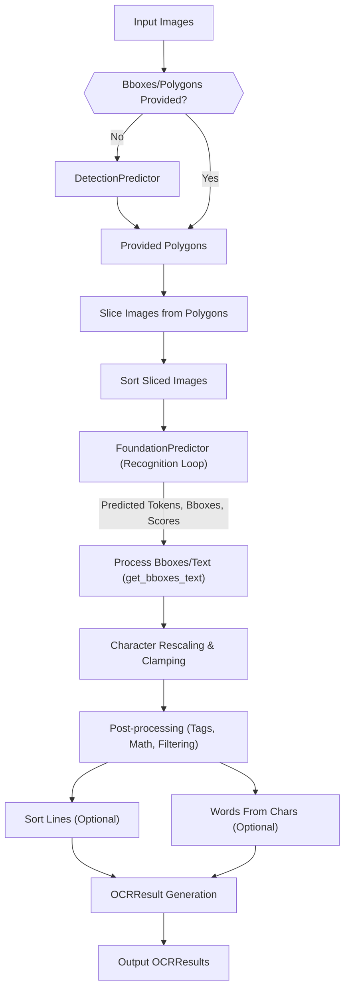

 # Optical Character Recognition (OCR)

The Optical Character Recognition (OCR) module in Surya provides a robust and flexible engine for converting scanned images of text into machine-readable text. This process involves several stages, from initial image processing and text detection to character recognition and sophisticated post-processing for accuracy and structure. The core of this functionality is encapsulated within the `RecognitionPredictor` class, which leverages a `FoundationPredictor` for the actual token prediction and integrates with a `DetectionPredictor` for identifying text bounding boxes.

## Core Recognition Engine: `RecognitionPredictor`

The `RecognitionPredictor` class (`surya/recognition/__init__.py`) is the central component for performing OCR. It orchestrates the entire workflow, from preparing input images to generating structured `OCRResult` objects containing recognized text lines and characters.

Unlike typical predictors, `RecognitionPredictor` does not load a model directly. Instead, it is initialized with an already loaded `FoundationPredictor`, which handles the heavy lifting of sequence-to-sequence prediction.

```python
class RecognitionPredictor(BasePredictor):
    batch_size = settings.RECOGNITION_BATCH_SIZE
    default_batch_sizes = {"cpu": 32, "mps": 64, "cuda": 256, "xla": 128}

    # Override base init - Do not load model
    def __init__(self, foundation_predictor: FoundationPredictor):
        self.foundation_predictor = foundation_predictor
        self.processor = self.foundation_predictor.processor
        self.bbox_size = self.foundation_predictor.model.config.bbox_size
        self.tasks = self.foundation_predictor.tasks
```
[View on GitHub](https://github.com/datalab-to/surya/blob/main/surya/recognition/__init__.py#L42-L52)

### Recognition Workflow

The `RecognitionPredictor`'s `__call__` method defines the complete OCR pipeline:

1.  **Image Preparation:** Input images are converted to RGB format. High-resolution images, if provided, are also prepared.
2.  **Text Detection and Slicing:**
    *   If no bounding boxes (`bboxes`) or polygons are provided, a `DetectionPredictor` is used to automatically detect text regions.
    *   Detected regions (or pre-provided `bboxes`/`polygons`) are then sliced from the images, potentially applying scaling for high-resolution inputs.
    *   This slicing extracts individual text line images, which are then passed to the `FoundationPredictor`.
3.  **Prediction Loop:** The `FoundationPredictor` performs the actual character/token recognition on the sliced images. This involves feeding the sliced image data into the underlying model and decoding the output tokens.
4.  **Post-processing and Structuring:**
    *   Predicted tokens are converted into `TextChar` objects, including their detected bounding boxes and confidence scores.
    *   Bounding boxes for individual characters are rescaled and clamped to match the overall line polygon.
    *   Various post-processing steps are applied to refine the recognized text:
        *   Fixing unbalanced tags (`fix_unbalanced_tags`).
        *   Filtering blacklist tags (`filter_blacklist_tags`).
        *   Unwrapping and cleaning math expressions (`unwrap_math`, `clean_math_tags`).
    *   Optionally, text lines can be sorted (`sort_text_lines`) and broken into words (`words_from_chars`).
5.  **Result Generation:** The final output is a list of `OCRResult` objects, each containing a list of `TextLine` objects with their text, polygons, character details, and confidence scores.

A key part of the post-processing is the `get_bboxes_text` method, which is responsible for taking the raw predicted tokens and their associated polygons and converting them into structured `TextChar` objects. This method carefully handles special tokens, cleans up character bounding boxes, and reconstructs words and lines.

```python
    def get_bboxes_text(
        self,
        flat: dict,
        predicted_tokens: list,
        scores: list,
        predicted_polygons: list,
        drop_repeated_text: bool = False,
    ) -> list:
        char_predictions = []
        # ... logic for processing tokens and polygons ...
        for sequence in detokenize_sequences:
            token_ids, seq_score, bboxes, token_type = sequence
            if token_type == "ocr":
                text = self.processor.ocr_tokenizer.decode(
                    token_ids, task=TaskNames.ocr_with_boxes
                )
                bboxes = clean_close_polygons(
                    bboxes
                ) # clean out bboxes that are close, like what happens with multiple utf-16 tokens per char
                bbox_idx = 0
                for text_idx, text_line in enumerate(text):
                    img_chars.append(
                        TextChar(
                            text=text_line,
                            polygon=bboxes[bbox_idx],
                            confidence=seq_score[bbox_idx],
                            bbox_valid=True,
                        )
                    )
                    # ... further logic ...
        char_predictions.append(img_chars)
        return char_predictions
```
[View on GitHub](https://github.com/datalab-to/surya/blob/main/surya/recognition/__init__.py#L228-L270)

The `__call__` method parameters offer fine-grained control over the recognition process:

```python
    def __call__(
        self,
        images: List[Image.Image],
        task_names: List[str] | None = None,
        det_predictor: DetectionPredictor | None = None,
        detection_batch_size: int | None = None,
        recognition_batch_size: int | None = None,
        highres_images: List[Image.Image] | None = None,
        bboxes: List[List[List[int]]] | None = None,
        polygons: List[List[List[List[int]]]] | None = None,
        input_text: List[List[str | None]] | None = None,
        sort_lines: bool = False,
        math_mode: bool = True,
        return_words: bool = False,
        drop_repeated_text: bool = False,
        max_sliding_window: int | None = None,
        max_tokens: int | None = None,
        filter_tag_list: List[str] = None
    ) -> List[OCRResult]:
```
[View on GitHub](https://github.com/datalab-to/surya/blob/main/surya/recognition/__init__.py#L318-L340)

### Optical Character Recognition (OCR) Flow





## OCR Error Detection

The `OCRErrorPredictor` class (`surya/ocr_error/__init__.py`) is designed to detect errors within recognized text. This is a separate, specialized model that takes a list of strings (recognized text) and predicts whether each string contains an OCR error.

```python
class OCRErrorPredictor(BasePredictor):
    model_loader_cls = OCRErrorModelLoader
    batch_size = settings.OCR_ERROR_BATCH_SIZE
    default_batch_sizes = {"cpu": 8, "mps": 8, "cuda": 64, "xla": 32}

    def __call__(self, texts: List[str], batch_size: Optional[int] = None):
        return self.batch_ocr_error_detection(texts, batch_size)

    def batch_ocr_error_detection(
        self, texts: List[str], batch_size: Optional[int] = None
    ):
        if batch_size is None:
            batch_size = self.get_batch_size()

        num_batches = math.ceil(len(texts) / batch_size)
        texts_processed = self.processor(
            texts, padding="longest", truncation=True, return_tensors="pt"
        )
        predictions = []
        for batch_idx in tqdm(
            range(num_batches),
            desc="Running OCR Error Detection",
            disable=self.disable_tqdm,
        ):
            start_idx, end_idx = batch_idx * batch_size, (batch_idx + 1) * batch_size
            batch_input_ids = texts_processed.input_ids[start_idx:end_idx].to(
                self.model.device
            )
            # ... attention mask and padding ...
            with settings.INFERENCE_MODE():
                pred = self.model(batch_input_ids, attention_mask=batch_attention_mask)
                logits = pred.logits.argmax(dim=1).cpu().tolist()[:current_batch_size]
                predictions.extend(logits)
            mark_step()

        return OCRErrorDetectionResult(
            texts=texts, labels=[ID2LABEL[p] for p in predictions]
        )
```
[View on GitHub](https://github.com/datalab-to/surya/blob/main/surya/ocr_error/__init__.py#L18-L62)

The error detection process involves:

1.  **Text Preprocessing:** Input texts are tokenized and padded to ensure uniform batch processing.
2.  **Batch Inference:** The preprocessed texts are fed into the error detection model in batches.
3.  **Prediction:** The model outputs logits, which are then converted into error labels using `ID2LABEL` mapping.
4.  **Result:** An `OCRErrorDetectionResult` object containing the original texts and their corresponding error labels is returned.

## Language Support

Surya's OCR engine is designed to support a wide array of languages. The `surya/recognition/languages.py` file defines a comprehensive mapping between language codes and their full names, facilitating multilingual OCR tasks. This dictionary (`CODE_TO_LANGUAGE`) includes codes for over 80 languages, plus a special entry for "Math" (`_math`).

```python
CODE_TO_LANGUAGE = {
    "_math": "Math",
    "af": "Afrikaans",
    "am": "Amharic",
    # ... many more languages ...
    "zh": "Chinese",
}

LANGUAGE_TO_CODE = {v: k for k, v in CODE_TO_LANGUAGE.items()}
```
[View on GitHub](https://github.com/datalab-to/surya/blob/main/surya/recognition/languages.py#L1-L86)

This mapping allows developers to specify languages by their short codes, which can then be internally resolved to their full names for better human readability or for integration with other systems.

## Post-processing Steps

The `surya/recognition/postprocessing.py` file contains critical utility functions that refine the raw OCR output, addressing common issues like repetition, malformed tags, and mathematical expression cleanup.

### 1. Truncate Repetitions

This function helps in cleaning up text where the recognition model might have generated repeating sequences, a common artifact in some OCR scenarios, especially with out-of-distribution inputs.

```python
def truncate_repetitions(text: str, min_len=15):
    # From nougat, with some cleanup
    if len(text) < 2 * min_len:
        return text

    # try to find a length at which the tail is repeating
    # ... logic to find and remove repeating tail ...
```
[View on GitHub](https://github.com/datalab-to/surya/blob/main/surya/recognition/postprocessing.py#L6-L28)

### 2. Fix Unbalanced Tags

HTML-like tags (e.g., `<p>`, `<strong>`, `<math>`) can be present in the recognized text to denote formatting or special content blocks. This function ensures that any opening tags are properly closed by appending missing closing tags at the end of a text line, improving the structural integrity of the output.

```python
def fix_unbalanced_tags(
    text_chars: List[TextChar], special_tokens: Dict[str, list]
) -> List[TextChar]:
    self_closing_tags = ["br"]
    open_tags = []
    format_tags = extract_tags(special_tokens["formatting"]) + extract_tags(
        special_tokens["math_external"]
    )

    for char in text_chars:
        # ... logic to track open/close tags ...

    for tag in open_tags:
        text_chars.append(
            TextChar(
                text=f"</{tag}>",
                confidence=0,
                polygon=[[0, 0], [1, 0], [1, 1], [0, 1]],
                bbox_valid=False,
            )
        )
    return text_chars
```
[View on GitHub](https://github.com/datalab-to/surya/blob/main/surya/recognition/postprocessing.py#L60-L101)

### 3. Cleanup Math

Recognized mathematical expressions, often enclosed in `<math>` tags, may sometimes contain internal HTML-like tags or other artifacts that are not part of the actual mathematical notation. This function cleans these up, keeping only relevant mathematical symbols and structures.

```python
def cleanup_math(line: str):
    matches = re.finditer(r"(<math[^>]*>)(.*?)</math>", line, re.DOTALL)
    result = line

    for match in matches:
        opening_tag = match.group(1)
        full_match = match.group(0)
        block_content = match.group(2)

        clean_block = re.sub(r"<[^>]+>", "", block_content)

        if not re.search(r"[\\\_]", clean_block): # Check for common LaTeX math symbols
            result = result.replace(full_match, clean_block)
        else:
            result = result.replace(full_match, f"{opening_tag}{clean_block}</math>")

    return result
```
[View on GitHub](https://github.com/datalab-to/surya/blob/main/surya/recognition/postprocessing.py#L31-L57)

## Key Integration Points

The OCR module is designed for flexibility and can be integrated into various data processing pipelines.

*   **Custom Detection:** Users can bypass Surya's built-in text detection by providing their own bounding boxes or polygons. This is particularly useful when specialized detection models are preferred or when text regions are already known.
    ```python
    # Example: Using custom polygons
    from surya.recognition import RecognitionPredictor
    from surya.foundation import FoundationPredictor
    from PIL import Image

    foundation_model = FoundationPredictor()
    ocr_predictor = RecognitionPredictor(foundation_model)

    image = Image.open("path/to/your/image.png")
    custom_polygons = [[[x1,y1],[x2,y1],[x2,y2],[x1,y2]], ...] # Your detected polygons

    results = ocr_predictor(images=[image], polygons=[custom_polygons])
    ```

*   **Multilingual Support:** The `CODE_TO_LANGUAGE` map allows for easy lookup and integration of language-specific logic. While the core model is often multilingual, understanding the detected language can inform subsequent processing steps (e.g., spell checking, translation).

*   **Error Correction Pipelines:** The `OCRErrorPredictor` is a valuable component for building robust error correction systems. Recognized text can first be passed through the `OCRErrorPredictor` to flag potential errors, which can then be routed to human review or specialized correction algorithms.

    


```mermaid
    graph TD
        A["Input Document Image"] --> B["Text Detection (e.g., DetectionPredictor)"]
        B --> C["Slicing Text Lines"]
        C --> D["OCR Recognition (RecognitionPredictor)"]
        D -- "Raw OCR Text" --> E["OCRErrorPredictor"]
        E -- "Error Labels" --> F{{"Has Errors?"}}
        F -- "Yes" --> G["Review/Correction Pipeline"]
        F -- "No" --> H["Final Processed Text"]
        G --> H
    ```


*   **Foundation Model Independence:** By accepting a `FoundationPredictor` during initialization, `RecognitionPredictor` remains modular. This design allows for updates or swaps of the underlying recognition model (the foundation model) without altering the OCR workflow logic.

*   **Post-processing Customization:** The post-processing functions (e.g., `fix_unbalanced_tags`, `cleanup_math`) are exposed and can be adapted or extended for specific document types or output requirements. The `filter_tag_list` parameter in `RecognitionPredictor.__call__` also allows dynamic control over which tags are retained.