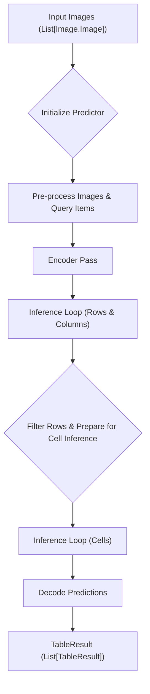
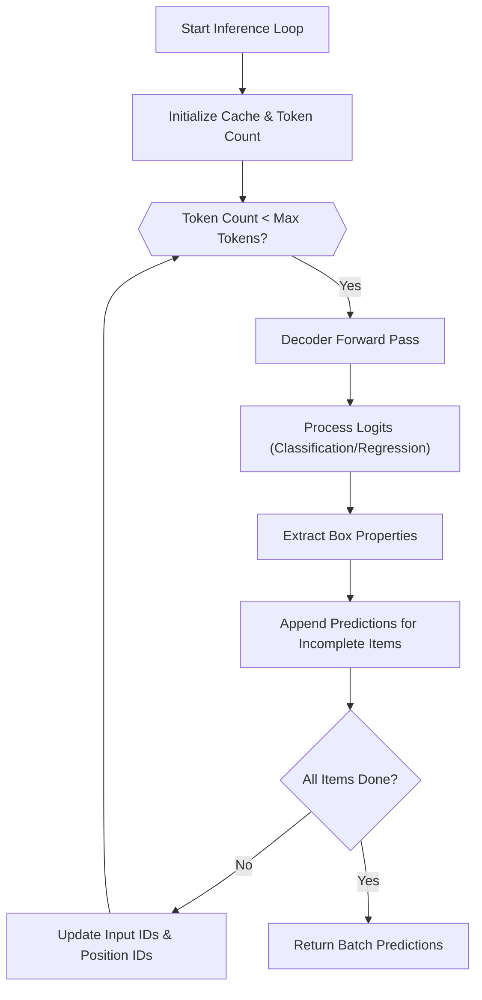

 # Table Recognition

The `surya.table_rec` module provides robust capabilities for extracting and structuring tabular data from various document types. It leverages a sophisticated deep learning model to accurately identify tables, their rows, columns, and individual cells, even handling complex structures like merged cells and spanning rows/columns.

This guide delves into the core components and processes involved in Surya's table recognition system, from input processing to result decoding.

## Core Components

The table recognition system is built around several key components that work in concert to achieve accurate table parsing.

### TableRecPredictor

The `TableRecPredictor` class ([View on GitHub](https://github.com/datalab-to/surya/blob/main/surya/table_rec/__init__.py)) is the central orchestrator for table recognition. It inherits from `BasePredictor` and manages the batch processing and inference workflow.

```python
# surya/table_rec/__init__.py
# L31-L36
class TableRecPredictor(BasePredictor):
    model_loader_cls = TableRecModelLoader
    batch_size = settings.TABLE_REC_BATCH_SIZE
    default_batch_sizes = {
        "cpu": 8,
        "mps": 8,
        "cuda": 32,
        "xla": 16
    }
```
The `__call__` method acts as the entry point, delegating to `batch_table_recognition` for processing a list of images.

### SuryaTableRecProcessor

The `SuryaTableRecProcessor` ([View on GitHub](https://github.com/datalab-to/surya/blob/main/surya/table_rec/processor.py)) is responsible for preparing images and query items for the model. It handles image resizing, normalization, and converting polygonal annotations into model-compatible bounding box formats and token sequences.

```python
# surya/table_rec/processor.py
# L20-L24
class SuryaTableRecProcessor(S3DownloaderMixin, ProcessorMixin):
    attributes = ["image_processor"]
    image_processor_class = "AutoImageProcessor"

    def __init__(self, checkpoint, **kwargs):
        image_processor = SuryaEncoderImageProcessor.from_pretrained(checkpoint)
```

Key functionalities include:
*   **Image Preprocessing**: Resizing images to a consistent `TABLE_REC_IMAGE_SIZE` and converting them to `RGB` format.
*   **Polygon Resizing**: Adapting polygon coordinates from the original image dimensions to the model's input size (`BOX_DIM` x `BOX_DIM`).
*   **Query Item Conversion**: Transforming structured query items (containing polygons, categories, etc.) into a sequence of input IDs that the decoder can consume. This involves using the `LabelShaper` to convert polygons to bounding boxes and then to token labels.

```python
# surya/table_rec/processor.py
# L54-L63
        query_items = self.shaper.convert_polygons_to_bboxes(query_items)
        query_labels = self.shaper.dict_to_labels(query_items)

        decoder_input_boxes = []
        col_count = len(query_labels[0])
        for label in query_labels:
            decoder_input_boxes.append([
                [self.token_bos_id] * col_count,
                label,
                [self.token_query_end_id] * col_count
            ])
```

### Data Schema

The `surya.table_rec.schema` module ([View on GitHub](https://github.com/datalab-to/surya/blob/main/surya/table_rec/schema.py)) defines the Pydantic models used to represent the extracted table structures. These models ensure a consistent and type-safe output.

*   `TableCell`: Represents an individual cell within a table, including its polygon, row/column spans, merge information, and ID.
*   `TableRow`: Represents a table row, including its polygon and ID.
*   `TableCol`: Represents a table column, including its polygon and ID.
*   `TableResult`: The top-level output for a single recognized table, containing lists of `TableCell`, `TableRow`, and `TableCol` objects, along with the original image bounding box.

```python
# surya/table_rec/schema.py
# L39-L45
class TableResult(BaseModel):
    cells: List[TableCell]
    unmerged_cells: List[TableCell]
    rows: List[TableRow]
    cols: List[TableCol]
    image_bbox: List[float]
```

## Table Recognition Workflow

The table recognition process involves a multi-stage inference approach orchestrated by `TableRecPredictor`.

### High-Level Workflow

The `batch_table_recognition` method encapsulates the entire process:





### Detailed Inference Loop

The `inference_loop` is a critical component, performing token-by-token decoding to predict the properties of table elements (rows, columns, or cells).

```python
# surya/table_rec/__init__.py
# L66-L74
    def inference_loop(
            self,
            encoder_hidden_states: torch.Tensor,
            batch_input_ids: torch.Tensor,
            current_batch_size: int,
            batch_size: int
    ):
        shaper = LabelShaper()
        batch_predictions = [[] for _ in range(current_batch_size)]
        max_tokens = settings.TABLE_REC_MAX_BOXES
        decoder_position_ids = torch.ones_like(batch_input_ids[0, :, 0], dtype=torch.int64, device=self.model.device).cumsum(
            0) - 1
```
The loop iteratively generates predictions for box properties (category, bbox, colspan, merges, is_header) until a maximum number of tokens is reached or all predictions for a batch are complete.





### Prediction Decoding

After the inference loops, the `decode_batch_predictions` method ([View on GitHub](https://github.com/datalab-to/surya/blob/main/surya/table_rec/__init__.py#L225-L352)) takes the raw model outputs (row/column predictions and cell predictions) and reconstructs the structured `TableResult` objects.

Key steps include:
1.  **Generate Table Columns**: Iterating through column predictions to create `TableCol` objects, resizing their polygons to the original image dimensions.
2.  **Generate Table Rows**: Similarly, creating `TableRow` objects from row predictions.
3.  **Identify Spanning Cells**: Processing cell predictions associated with each row. It identifies cells that span multiple columns or have merge properties, ensuring they cover a significant portion of the row's height.
4.  **Create Individual Cells**: For each row and column, it attempts to create a `TableCell`. If a spanning cell is present and aligns with the current column, it uses that; otherwise, it generates a new `TableCell` at the intersection of the row and column.
5.  **Merge Cells Across Rows**: A crucial step where cells identified with `merge_up` and `merge_down` properties are combined across consecutive rows to form vertically merged cells. This involves deep copying the grid of cells and then iterating to perform merges.

```python
# surya/table_rec/__init__.py
# L299-L318
            # Merge cells across rows
            for z, grid_row in enumerate(grid_cells[1:]):
                prev_row = grid_cells[z]
                for l, cell in enumerate(grid_row):
                    if l >= len(prev_row):
                        continue

                    above_cell = prev_row[l]
                    if all([
                        above_cell.merge_down,
                        cell.merge_up,
                        above_cell.col_id == cell.col_id,
                        above_cell.colspan == cell.colspan,
                    ]):
                        above_cell.merge(cell)
                        above_cell.rowspan += cell.rowspan
                        grid_row[l] = above_cell
```
6.  **Final Result Assembly**: Consolidating all `TableCell`, `TableRow`, and `TableCol` objects into a `TableResult` for each image.

## Key Integration Points

Integrating Surya's table recognition capabilities involves understanding how to provide input and consume the structured output.

*   **Input Images**: The `TableRecPredictor` expects a `List[PIL.Image.Image]`. It's essential that these images are correctly loaded and potentially pre-processed if they are not directly from a `PIL.Image` source.
*   **Batching**: The `batch_size` parameter can be tuned for performance, balancing memory usage and throughput. The predictor automatically handles batching internally.
*   **Result Interpretation**: The `TableResult` object provides a comprehensive representation of the detected table.
    *   `cells`: A list of `TableCell` objects, representing the final merged cells of the table.
    *   `unmerged_cells`: A list of `TableCell` objects before the vertical merging process, useful for debugging or specific use cases.
    *   `rows`: A list of `TableRow` objects, defining the horizontal extents of the table.
    *   `cols`: A list of `TableCol` objects, defining the vertical extents.
    *   `image_bbox`: The bounding box of the original image, typically `[0, 0, width, height]`.

For accurate parsing, it is recommended to pass `RGB` images. The processor will convert them if they are not already. Remember that the polygons returned in `TableCell`, `TableRow`, and `TableCol` objects are relative to the original input image size, after being scaled back up from the model's internal processing size.

The `is_header` property on `TableCell`, `TableRow`, and `TableCol` can be used to distinguish header elements, which is crucial for semantic interpretation of table data.