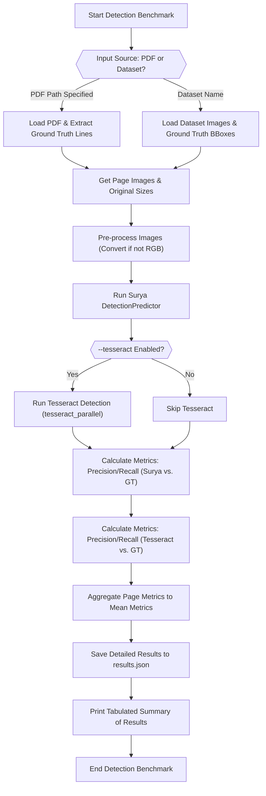
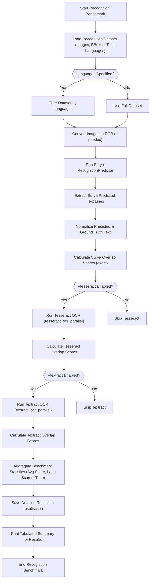

 # Benchmarking and Evaluation

This section details the methodologies and tools used within the `Surya` project for evaluating the performance and accuracy of its core components: text detection and recognition. The benchmarking suite is designed to provide comprehensive insights into model performance, compare against other OCR engines, and ensure continuous improvement.

## Detection Benchmarking

The `benchmark/detection.py` script is responsible for evaluating the performance of Surya's text detection model. It can operate on either a specified PDF document or a pre-defined dataset, comparing Surya's bounding box predictions against ground truth annotations. The primary metrics used are precision and recall, calculated based on the spatial overlap of detected boxes.

### Workflow
The detection benchmarking process involves:
1.  **Input Loading**: Loading images either from a PDF file or a `datasets` library dataset.
2.  **Ground Truth Extraction**: Extracting ground truth bounding boxes from PDFs (using `get_pdf_lines`) or datasets.
3.  **Model Inference**: Running Surya's `DetectionPredictor` on the loaded images to obtain predicted bounding boxes.
4.  **Optional Tesseract Comparison**: If enabled, Tesseract OCR is also run for comparative analysis.
5.  **Metric Calculation**: Computing precision and recall for both Surya and Tesseract predictions against the ground truth.
6.  **Result Reporting**: Saving detailed metrics to a JSON file and printing a formatted table summarizing the performance.

### Command Line Options
The script exposes several command-line options for flexibility:
*   `--pdf_path`: Path to a PDF file for detection.
*   `--results_dir`: Directory to save benchmark results.
*   `--max_rows`: Maximum number of pages/images to process.
*   `--debug`: Enables debug mode, saving images with drawn bounding boxes.
*   `--tesseract`: Flag to run Tesseract alongside Surya for comparison.

### Detection Benchmarking Flow





### Key Logic
The core logic for processing inputs and running the detection model:

```python
# From benchmark/detection.py
    if pdf_path is not None:
        pathname = pdf_path
        doc = open_pdf(pdf_path)
        page_count = len(doc)
        page_indices = list(range(page_count))
        page_indices = page_indices[:max_rows]

        images = get_page_images(doc, page_indices)
        doc.close()

        image_sizes = [img.size for img in images]
        correct_boxes = get_pdf_lines(pdf_path, image_sizes)
    else:
        pathname = "det_bench"
        dataset = datasets.load_dataset(settings.DETECTOR_BENCH_DATASET_NAME, split=f"train[:{max_rows}]")
        images = list(dataset["image"])
        images = convert_if_not_rgb(images)
        correct_boxes = []
        for i, boxes in enumerate(dataset["bboxes"]):
            img_size = images[i].size
            correct_boxes.append([rescale_bbox(b, (1000, 1000), img_size) for b in boxes])

    start = time.time()
    predictions = det_predictor(images)
    surya_time = time.time() - start
```
[View on GitHub](https://github.com/datalab-to/surya/blob/main/benchmark/detection.py#L42-L73)

## Recognition Benchmarking

The `benchmark/recognition.py` script focuses on evaluating the accuracy of Surya's text recognition model. It processes images with pre-defined bounding boxes and ground truth text, calculating string similarity scores (overlap score) to assess recognition quality. This script also supports benchmarking against Tesseract and Amazon Textract.

### Workflow
The recognition benchmarking process includes:
1.  **Dataset Loading**: Loading image, bounding box, and ground truth text data from a `datasets` library dataset.
2.  **Language Filtering**: Optionally filtering the dataset by specified languages.
3.  **Model Inference**: Running Surya's `RecognitionPredictor` on image slices defined by bounding boxes.
4.  **Text Normalization**: Standardizing ground truth and predicted text to ensure fair comparison (e.g., removing HTML/LaTeX tags, standardizing bullets, normalizing Unicode).
5.  **Optional Comparison**: Running Tesseract or Amazon Textract on the same data if enabled.
6.  **Scoring**: Calculating `overlap_score_exact` for Surya and `overlap_score` for Tesseract/Textract against the normalized ground truth.
7.  **Result Reporting**: Aggregating average scores per language and overall, saving them to a JSON file, and printing a tabulated summary.

### Command Line Options
Key command-line arguments:
*   `--results_dir`: Directory to save benchmark results.
*   `--max_rows`: Maximum number of dataset rows to process.
*   `--debug`: Enables debug mode, optionally saving images of predictions/references.
*   `--tesseract`: Flag to include Tesseract in the benchmark.
*   `--textract`: Flag to include Amazon Textract in the benchmark.
*   `--languages`: Comma-separated list of specific languages to benchmark.

### Recognition Benchmarking Flow





### Text Normalization
A crucial step for accurate recognition benchmarking is text normalization. This ensures that minor formatting differences do not unfairly penalize a model.

```python
# From benchmark/recognition.py
def standardize_bullets(text):
    patterns = [
        r"•\s+", r"·\s+", r"○\s+", r"◦\s+", r"▪\s+", r"▫\s+",
        r"➢\s+", r"➤\s+", r"★\s+", r"✓\s+", r"✗\s+", r"✦\s+",
        r"\\bullet\s+",
    ]
    combined_pattern = "|".join(patterns)
    text = re.sub(combined_pattern, "*", text)
    return text

def normalize_text(text: str) -> str:
    # Remove HTML tags
    text = re.sub(r"<[^>]+>", "", text)
    # Remove LaTeX tags
    text = re.sub(r"\\[a-zA-Z]+", "", text)
    text = standardize_bullets(text)
    text = unicodedata.normalize("NFKC", text)
    return text.strip().lower().replace(",", ".")
```
[View on GitHub](https://github.com/datalab-to/surya/blob/main/benchmark/recognition.py#L42-L61)

## Benchmarking Utilities

The `benchmark/utils` directory contains essential helper functions for calculating metrics and scores, central to both detection and recognition benchmarking.

### Metrics (`benchmark/utils/metrics.py`)

This module provides functions for spatial analysis of bounding boxes, primarily used in detection benchmarking. It calculates Intersection Over Union (IoU) and derived metrics like precision and recall.

*   **`box_area(box)`**: Calculates the area of a bounding box.
*   **`calculate_iou(box1, box2, box1_only=False)`**: Computes the Intersection Over Union (IoU) between two bounding boxes. If `box1_only` is true, it calculates the coverage of `box1` by `box2` relative to `box1`'s area.
*   **`match_boxes(preds, references)`**: Attempts to find optimal matches between predicted and reference bounding boxes based on IoU, preventing double-matching.
*   **`calculate_coverage(box, other_boxes, penalize_double=False)`**: Calculates how much of `box` is covered by `other_boxes`. Can penalize overlapping `other_boxes` for a stricter precision measure.
*   **`precision_recall(preds, references, threshold=.5, workers=8, penalize_double=True)`**: The primary function for detection evaluation, calculating precision and recall scores based on a coverage `threshold`. It can leverage parallel processing for efficiency.

An example of the core `precision_recall` calculation:

```python
# From benchmark/utils/metrics.py
def precision_recall(preds, references, threshold=.5, workers=8, penalize_double=True):
    if len(references) == 0:
        return {
            "precision": 1,
            "recall": 1,
        }

    if len(preds) == 0:
        return {
            "precision": 0,
            "recall": 0,
        }

    coverage_func = calculate_coverage_fast # or calculate_coverage if penalize_double
    if penalize_double:
        coverage_func = calculate_coverage

    with ThreadPoolExecutor(max_workers=workers) as executor:
        precision_func = partial(coverage_func, penalize_double=penalize_double)
        precision_iou = executor.map(precision_func, preds, repeat(references))
        reference_iou = executor.map(coverage_func, references, repeat(preds))

    precision_classes = [1 if i > threshold else 0 for i in precision_iou]
    precision = sum(precision_classes) / len(precision_classes)

    recall_classes = [1 if i > threshold else 0 for i in reference_iou]
    recall = sum(recall_classes) / len(recall_classes)

    return {
        "precision": precision,
        "recall": recall,
    }
```
[View on GitHub](https://github.com/datalab-to/surya/blob/main/benchmark/utils/metrics.py#L125-L163)

### Scoring (`benchmark/utils/scoring.py`)

This module focuses on text similarity scoring, primarily used for evaluating recognition model output. It utilizes the `rapidfuzz` library for efficient string comparison.

*   **`overlap_score(pred_lines: List[str], reference_lines: List[str])`**: Calculates a similarity score for each predicted line against all reference lines, finding the best match. This is typically used when the number of predicted and reference lines might differ or their order is not guaranteed. A `sqrt(len(ref_line))` weighting is applied.
*   **`overlap_score_exact(pred_lines: List[str], reference_lines: List[str])`**: Calculates a similarity score for *exact* pairwise matches between predicted and reference lines. Assumes that `pred_lines` and `reference_lines` are aligned and of the same length, making it suitable for evaluating recognition on pre-segmented lines.

The `overlap_score_exact` function is crucial for precise recognition evaluation:

```python
# From benchmark/utils/scoring.py
import math
from typing import List

from rapidfuzz import fuzz

def overlap_score_exact(pred_lines: List[str], reference_lines: List[str]):
    line_scores = []
    line_weights = []
    assert len(pred_lines) == len(reference_lines) # Must be aligned

    for i, (pred_line, ref_line) in enumerate(zip(pred_lines, reference_lines)):
        score = fuzz.ratio(pred_line, ref_line, score_cutoff=20) / 100
        weight = math.sqrt(len(ref_line)) # Weight by length for importance
        line_scores.append(score * weight)
        line_weights.append(weight)

    return line_scores, line_weights
```
[View on GitHub](https://github.com/datalab-to/surya/blob/main/benchmark/utils/scoring.py#L22-L35)

## Key Integration Points

The benchmarking framework in `Surya` is designed for modularity and extensibility:

*   **Shared Utilities**: Both detection and recognition benchmarking leverage common utility functions for data loading, image processing, and result handling.
*   **Metric Interoperability**: `benchmark/utils/metrics.py` provides the fundamental building blocks for spatial evaluation, which can be adapted or extended for more nuanced detection tasks. Similarly, `benchmark/utils/scoring.py` offers robust text comparison for recognition.
*   **Comparative Analysis**: The scripts are built to easily integrate and compare Surya's performance against other OCR engines like Tesseract and Amazon Textract, providing a valuable external reference point.
*   **Data Flexibility**: The ability to benchmark against local PDF files or Hugging Face `datasets` ensures flexibility in testing environments, from quick local checks to large-scale dataset evaluations.
*   **Debug Capabilities**: The `--debug` flag in both benchmarking scripts is vital for visual inspection of model outputs, allowing developers to quickly identify and diagnose issues with detections or recognition. This visual feedback is crucial for iterative model improvement.
*   **Reproducibility**: By saving detailed results to JSON files, the framework ensures that benchmarks are reproducible and historical performance can be tracked effectively.