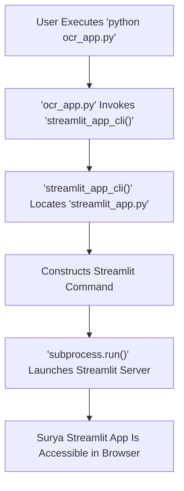
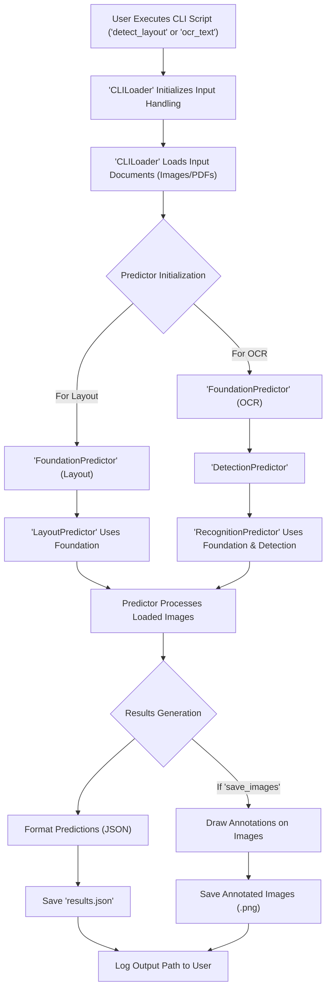

 # Deployment and Scripting

Surya offers both command-line interface (CLI) tools for layout detection and OCR, as well as a user-friendly web-based interface powered by Streamlit. This section details how to deploy and interact with these functionalities.

## Streamlit Application

The `ocr_app.py` script serves as the entry point for running the Surya Streamlit application. This web-based interface provides an intuitive way to interact with Surya's document processing capabilities, allowing users to upload documents and visualize layout detection or OCR results directly in their browser.

### Running the Streamlit App

The `ocr_app.py` file simply calls a utility function from `run_streamlit_app.py` to launch the Streamlit server.

```python
# ocr_app.py
# View on GitHub: https://github.com/datalab-to/surya/blob/main/ocr_app.py
from surya.scripts.run_streamlit_app import streamlit_app_cli

if __name__ == "__main__":
    streamlit_app_cli()
```

To start the Streamlit application, you would typically execute `ocr_app.py` from your terminal:

```bash
python ocr_app.py
```

This command initiates the Streamlit server, making the application accessible via a local web browser.

### Streamlit Application Launch Flow

The following diagram illustrates the execution flow when launching the Streamlit application:





The `streamlit_app_cli` function is responsible for setting up the environment and executing the Streamlit command. It specifically points to `surya/scripts/streamlit_app.py` (which is distinct from the top-level `ocr_app.py` and contains the actual Streamlit UI logic) and includes options to run the server in a headless mode and disable file watching.

```python
# surya/scripts/run_streamlit_app.py
# View on GitHub: https://github.com/datalab-to/surya/blob/main/surya/scripts/run_streamlit_app.py#L4-L10
import subprocess
import os

def streamlit_app_cli():
    cur_dir = os.path.dirname(os.path.abspath(__file__))
    ocr_app_path = os.path.join(cur_dir, "streamlit_app.py") # Note: This refers to surya/scripts/streamlit_app.py, not the root ocr_app.py
    cmd = ["streamlit", "run", ocr_app_path, "--server.fileWatcherType", "none", "--server.headless", "true"]
    subprocess.run(cmd, env={**os.environ, "IN_STREAMLIT": "true"})
```

## Command-Line Interface (CLI) Tools

Surya provides powerful CLI tools for direct interaction with its layout detection and optical character recognition (OCR) functionalities. These scripts are designed for batch processing and integration into automated workflows. Both `detect_layout.py` and `ocr_text.py` utilize the `click` library for robust command-line argument parsing and a common `CLILoader` for input handling.

### Layout Detection

The `detect_layout.py` script enables the detection of document layouts from image or PDF files. It leverages `FoundationPredictor` and `LayoutPredictor` to identify and categorize elements such as paragraphs, headers, and images within a document.

#### Using the Layout Detection CLI

```bash
python -m surya.scripts.detect_layout --input_path /path/to/document.pdf --save_images
```

This command will process `document.pdf`, detect its layout, and save annotated images and a JSON results file to a default output directory.

#### Core Logic of `detect_layout.py`

The script initializes the necessary prediction models, processes input images, and then either saves debug images with bounding box visualizations or exports the detected layouts as JSON.

```python
# surya/scripts/detect_layout.py
# View on GitHub: https://github.com/datalab-to/surya/blob/main/surya/scripts/detect_layout.py#L27-L32
@click.command(help="Detect layout of an input file or folder (PDFs or image).")
@CLILoader.common_options
def detect_layout_cli(input_path: str, **kwargs):
    loader = CLILoader(input_path, kwargs)

    foundation_predictor = FoundationPredictor(checkpoint=settings.LAYOUT_MODEL_CHECKPOINT)
    layout_predictor = LayoutPredictor(foundation_predictor)
```

The output includes a JSON file detailing the bounding boxes, labels, and positions of detected layout elements for each page. Debug images are generated if `--save_images` is specified.

```python
# surya/scripts/detect_layout.py
# View on GitHub: https://github.com/datalab-to/surya/blob/main/surya/scripts/detect_layout.py#L52-L60
    predictions_by_page = defaultdict(list)
    for idx, (pred, name, image) in enumerate(
        zip(layout_predictions, loader.names, loader.images)
    ):
        out_pred = pred.model_dump()
        out_pred["page"] = len(predictions_by_page[name]) + 1
        predictions_by_page[name].append(out_pred)

    with open(
        os.path.join(loader.result_path, "results.json"), "w+", encoding="utf-8"
    ) as f:
        json.dump(predictions_by_page, f, ensure_ascii=False)
```

### Optical Character Recognition (OCR)

The `ocr_text.py` script performs OCR to extract text from documents, supporting various OCR tasks including detection and recognition. It integrates with `FoundationPredictor`, `DetectionPredictor`, and `RecognitionPredictor` to provide accurate text extraction.

#### Using the OCR CLI

```bash
python -m surya.scripts.ocr_text --input_path /path/to/scanned_document.png --disable_math
```

This command will OCR `scanned_document.png`, skipping math recognition, and output the extracted text along with bounding boxes in a JSON file.

#### Core Logic of `ocr_text.py`

Similar to `detect_layout.py`, this script loads input documents, initializes the necessary OCR models, processes the images, and then outputs the results. It includes an option to disable math recognition, which can be useful for documents not containing mathematical expressions.

```python
# surya/scripts/ocr_text.py
# View on GitHub: https://github.com/datalab-to/surya/blob/main/surya/scripts/ocr_text.py#L21-L28
@click.command(help="OCR text.")
@click.option("--task_name", type=str, default=TaskNames.ocr_with_boxes)
@click.option(
    "--disable_math", is_flag=True, default=False, help="Do not recognize math in OCR."
)
@CLILoader.common_options
def ocr_text_cli(input_path: str, task_name: str, disable_math: bool, **kwargs):
    loader = CLILoader(input_path, kwargs, highres=True)
    task_names = [task_name] * len(loader.images)
```

The script saves the extracted text and their bounding boxes into a JSON file, organized by page. If `--save_images` is active, it also generates images with recognized text overlaid for debugging and visualization.

```python
# surya/scripts/ocr_text.py
# View on GitHub: https://github.com/datalab-to/surya/blob/main/surya/scripts/ocr_text.py#L48-L56
    out_preds = defaultdict(list)
    for name, pred, image in zip(loader.names, predictions_by_image, loader.images):
        out_pred = pred.model_dump()
        out_pred["page"] = len(out_preds[name]) + 1
        out_preds[name].append(out_pred)

    with open(
        os.path.join(loader.result_path, "results.json"), "w+", encoding="utf-8"
    ) as f:
        json.dump(out_preds, f, ensure_ascii=False)
```

### CLI Tool Execution Flow

Both `detect_layout.py` and `ocr_text.py` follow a similar architectural pattern for processing:





## Key Integration Points

*   **`CLILoader`**: This utility, imported in both CLI scripts, standardizes how input paths are handled, images are loaded (including high-resolution options for OCR), and debug/output paths are managed. This consistent approach simplifies script development and usage.
*   **`FoundationPredictor`**: A core component that provides foundational neural network models used by both `LayoutPredictor` and `RecognitionPredictor`. This modular design allows specialized predictors to leverage a common, powerful base model.
*   **`click`**: The use of the `click` library ensures that both `detect_layout.py` and `ocr_text.py` have robust, user-friendly command-line interfaces with automatic help generation and validation.
*   **Modular Design**: The separation of concerns, with dedicated predictors for layout (`LayoutPredictor`), detection (`DetectionPredictor`), and recognition (`RecognitionPredictor`), combined with a shared `FoundationPredictor`, promotes reusability and maintainability of the codebase.
*   **Streamlined Deployment**: The `ocr_app.py` wrapper provides a simple `python ocr_app.py` command to launch the full web application, abstracting away the underlying `streamlit run` command and its options.