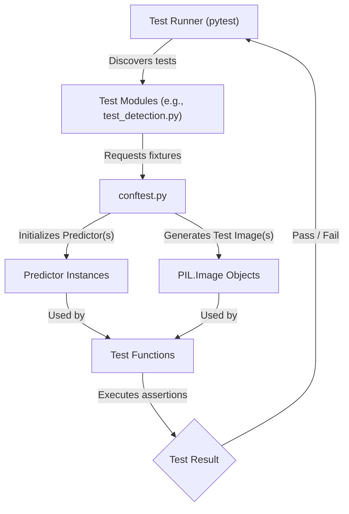
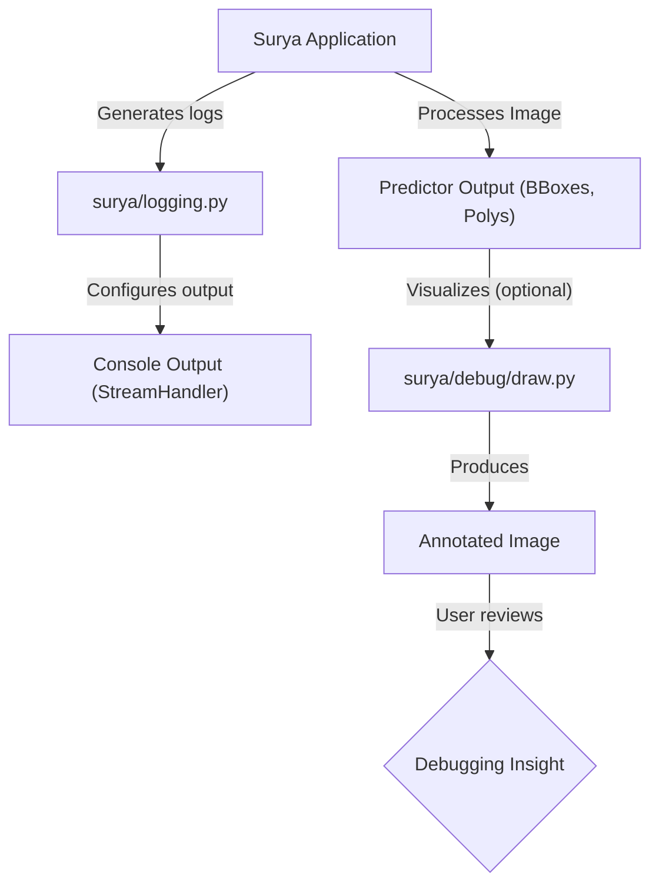

 # Development and Debugging

This section outlines the essential tools and practices for developing, testing, and debugging the Surya codebase. Understanding these components is crucial for contributing to the project, diagnosing issues, and ensuring the stability and performance of the OCR and document analysis pipelines.

## Core Development Principles

Surya's development workflow emphasizes clear code, comprehensive testing, and effective debugging utilities. This ensures that new features are integrated smoothly and regressions are caught early.

## Testing Framework and Fixtures

Surya leverages `pytest` for its testing framework, providing a robust environment for unit and integration tests. The `tests/conftest.py` file is central to setting up the testing environment, defining fixtures that provide pre-initialized objects like predictor instances and test images.

### Pytest Fixtures (`tests/conftest.py`)

`conftest.py` defines session-scoped fixtures for each major predictor in Surya, ensuring that these resource-intensive objects are initialized only once per test session, significantly speeding up test execution. It also provides various `PIL.Image` objects for testing different scenarios.

```python
# tests/conftest.py - lines 12-16
@pytest.fixture(scope="session")
def ocr_error_predictor() -> OCRErrorPredictor:
    ocr_error_predictor = OCRErrorPredictor()
    yield ocr_error_predictor
    del ocr_error_predictor
```
This snippet demonstrates a typical predictor fixture. The `scope="session"` argument indicates that `ocr_error_predictor` will be initialized once for the entire test session. The `yield` keyword makes it a teardown fixture, where `del ocr_error_predictor` is executed after all tests using this fixture have completed, releasing resources.

[View on GitHub](https://github.com/datalab-to/surya/blob/main/tests/conftest.py#L12-L16)

Beyond predictors, `conftest.py` also provides fixtures for creating test images with varying content and dimensions.

```python
# tests/conftest.py - lines 55-65
@pytest.fixture()
def test_image():
    image = Image.new("RGB", (1024, 1024), "white")
    draw = ImageDraw.Draw(image)
    draw.text((10, 10), "Hello World", fill="black", font_size=72)
    draw.text(
        (10, 200),
        "This is a sentence of text.\nNow it is a paragraph.\nA three-line one.",
        fill="black",
        font_size=24,
    )
    return image
```
The `test_image` fixture provides a standard 1024x1024 image with sample text, useful for many general tests. Other fixtures like `test_image_tall` simulate larger, more complex documents, and `test_image_latex` loads a specific image from assets for specialized testing.

[View on GitHub](https://github.com/datalab-to/surya/blob/main/tests/conftest.py#L55-L65)

### Detection Tests (`tests/test_detection.py`)

The `test_detection.py` file contains tests specifically for the `DetectionPredictor`. These tests validate that the detection model correctly identifies bounding boxes for text on various image inputs.

```python
# tests/test_detection.py - lines 1-8
def test_detection(detection_predictor, test_image):
    detection_results = detection_predictor([test_image])

    assert len(detection_results) == 1
    assert detection_results[0].image_bbox == [0, 0, 1024, 1024]

    bboxes = detection_results[0].bboxes
    assert len(bboxes) == 4
```
This test `test_detection` uses the `detection_predictor` and `test_image` fixtures. It asserts that for the provided test image, the detector returns a single result with the correct image bounding box and detects a specific number of text bounding boxes, ensuring basic functionality.

[View on GitHub](https://github.com/datalab-to/surya/blob/main/tests/test_detection.py#L1-L8)

Another important test, `test_detection_chunking`, verifies the detector's performance on large images, ensuring that Surya's internal chunking mechanisms handle large inputs correctly without losing information.

```python
# tests/test_detection.py - lines 11-19
def test_detection_chunking(detection_predictor, test_image_tall):
    detection_results = detection_predictor([test_image_tall])

    assert len(detection_results) == 1
    assert detection_results[0].image_bbox == [0, 0, 4096, 4096]

    bboxes = detection_results[0].bboxes
    assert len(bboxes) >= 3 # Sometimes merges into 3
    assert abs(4000 - bboxes[1].polygon[0][0]) < 50
```
This test uses `test_image_tall` (a 4096x4096 image) to confirm that detection works as expected on large inputs, including validating the number of detected bounding boxes and their approximate positions.

[View on GitHub](https://github.com/datalab-to/surya/blob/main/tests/test_detection.py#L11-L19)

### Testing Workflow





This diagram illustrates the flow of test execution in Surya, highlighting how `pytest` orchestrates test modules and utilizes fixtures from `conftest.py` to set up the necessary environment and objects for test functions.

## Debugging and Visualization

Effective debugging is critical for understanding the behavior of models and pipelines. Surya provides utilities to visualize intermediate results, particularly bounding box detections, and a centralized logging system.

### Bounding Box Drawing (`surya/debug/draw.py`)

The `surya/debug/draw.py` module contains functions for drawing bounding boxes and polygons directly onto `PIL.Image` objects. This is invaluable for visually inspecting detection and layout results.

```python
# surya/debug/draw.py - lines 13-22
def draw_bboxes_on_image(
    bboxes, image, labels=None, label_font_size=10, color: str | list = "red"
):
    polys = []
    for bb in bboxes:
        # Clockwise polygon
        poly = [[bb[0], bb[1]], [bb[2], bb[1]], [bb[2], bb[3]], [bb[0], bb[3]]]
        polys.append(poly)

    return draw_polys_on_image(
        polys, image, labels, label_font_size=label_font_size, color=color
    )
```
The `draw_bboxes_on_image` function takes a list of bounding boxes and an image, converts the bounding boxes into polygons, and then delegates the actual drawing to `draw_polys_on_image`. This provides a consistent way to visualize rectangular regions.

[View on GitHub](https://github.com/datalab-to/surya/blob/main/surya/debug/draw.py#L13-L22)

The core drawing logic resides in `draw_polys_on_image`, which handles both polygons and optional labels.

```python
# surya/debug/draw.py - lines 25-58
def draw_polys_on_image(
    corners,
    image,
    labels=None,
    box_padding=-1,
    label_offset=1,
    label_font_size=10,
    color: str | list = "red",
):
    draw = ImageDraw.Draw(image)
    font_path = get_font_path()
    label_font = ImageFont.truetype(font_path, label_font_size)

    for i in range(len(corners)):
        poly = corners[i]
        poly = [(int(p[0]), int(p[1])) for p in poly]
        draw.polygon(
            poly, outline=color[i] if isinstance(color, list) else color, width=1
        )

        if labels is not None:
            label = labels[i]
            text_position = (
                min([p[0] for p in poly]) + label_offset,
                min([p[1] for p in poly]) + label_offset,
            )
            text_size = get_text_size(label, label_font)
            box_position = (
                text_position[0] - box_padding + label_offset,
                text_position[1] - box_padding + label_offset,
                text_position[0] + text_size[0] + box_padding + label_offset,
                text_position[1] + text_size[1] + box_padding + label_offset,
            )
            try:
                draw.rectangle(box_position, fill="white")
            except Exception as e:
                print(f"Error drawing rectangle at {box_position}: {e}")
                continue
            draw.text(
                text_position,
                label,
                fill=color[i] if isinstance(color, list) else color,
                font=label_font,
            )

    return image
```
This function is a powerful utility for visual debugging. It iterates through provided polygon corners, draws them on the image, and optionally adds text labels with a white background for readability. The error handling ensures robustness during drawing operations.

[View on GitHub](https://github.com/datalab-to/surya/blob/main/surya/debug/draw.py#L25-L58)

### Centralized Logging (`surya/logging.py`)

The `surya/logging.py` module sets up a standardized logging configuration for the entire Surya application. This is crucial for tracking execution flow, identifying potential issues, and monitoring model inference.

```python
# surya/logging.py - lines 6-25
def configure_logging():
    logger = get_logger()

    # Remove any existing handlers to prevent duplicates
    for handler in logger.handlers[:]:
        logger.removeHandler(handler)

    # Add our handler
    handler = logging.StreamHandler()
    formatter = logging.Formatter("%(asctime)s [%(levelname)s] %(name)s: %(message)s")
    handler.setFormatter(formatter)
    logger.addHandler(handler)

    # Prevent propagation to parent loggers to avoid double logging
    logger.propagate = False

    logger.setLevel(settings.LOGLEVEL)
    warnings.simplefilter(action="ignore", category=FutureWarning)
```
The `configure_logging` function ensures that the Surya logger is properly set up, preventing duplicate log messages by removing existing handlers and adding a new `StreamHandler` with a consistent format. It also sets the log level based on `settings.LOGLEVEL` and filters out `FutureWarning` messages, reducing noise in the logs.

[View on GitHub](https://github.com/datalab-to/surya/blob/main/surya/logging.py#L6-L25)

The `get_logger` helper function simply retrieves the application-specific logger instance.

```python
# surya/logging.py - lines 28-29
def get_logger():
    return logging.getLogger("surya")
```
Using a dedicated logger name like "surya" allows for fine-grained control over the application's logging output.

[View on GitHub](https://github.com/datalab-to/surya/blob/main/surya/logging.py#L28-L29)

### Debugging Workflow





This diagram illustrates how logging and drawing utilities integrate into the debugging workflow. Logs provide textual context, while drawing functions offer visual verification of model outputs, both contributing to gaining insights into application behavior.

## Key Integration Points and Best Practices

*   **Consistent Logging**: Always use `logging.getLogger("surya")` to retrieve the application logger. This ensures your messages are formatted and filtered consistently with the rest of the application.
*   **Fixture Reuse**: When writing new tests, leverage existing fixtures in `conftest.py` whenever possible. This reduces boilerplate, makes tests more readable, and improves test execution efficiency.
*   **Visual Verification**: For any changes to detection, layout, or recognition models, use the `surya/debug/draw.py` utilities to visually inspect the output. This is often the quickest way to spot regressions or unexpected behaviors.
*   **Module-Specific Tests**: Organize your tests logically in the `tests/` directory, mirroring the structure of the `surya/` directory. For example, tests for `surya/detection.py` should ideally reside in `tests/test_detection.py`.
*   **Resource Management**: For fixtures that load heavy models, ensure they are session-scoped and include proper teardown logic (using `yield` and `del`) to free up memory after tests complete. This is critical for environments with limited resources.