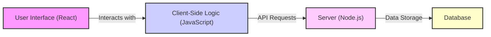
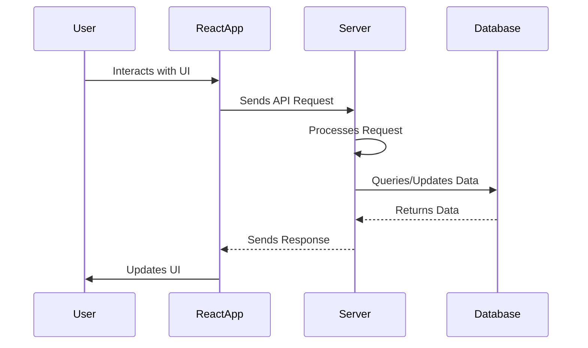

# Project Overview

Acgc is a web application built with React and Vite for the client-side, and Node.js for the server-side (details about the server-side are not available in the provided files). This documentation focuses on the overall project structure and key functionalities based on the provided `README.md` and `package.json` files. The client-side utilizes modern JavaScript tooling for a fast and efficient development experience.

## Key Features

*   **React-based Frontend:** Leverages React's component-based architecture for building a dynamic user interface.
*   **Vite Build Tool:** Uses Vite for rapid development and optimized production builds.
*   **ESLint Integration:** Enforces code quality and consistency through ESLint rules.

## Technologies

| Technology    | Description                                    |
| ------------- | ---------------------------------------------- |
| React         | JavaScript library for building user interfaces |
| Vite          | Next-generation frontend tooling                |
| Node.js        | JavaScript runtime environment               |
| ESLint        | JavaScript linter and code style checker       |
| npm           | Package manager for JavaScript                  |

## Project Structure

The project's structure consists of a `Client` directory, likely containing the frontend code, and a `Server` directory (details not in provided files). The root directory includes the main `package.json` file, which defines the project's dependencies and build scripts.

### Code Snippets and Explanations

1.  **React + Vite Client Setup:**

    The `Client/README.md` file indicates a standard React setup using Vite. Vite provides a fast development experience with Hot Module Replacement (HMR).

    ```markdown
    # React + Vite

    This template provides a minimal setup to get React working in Vite with HMR and some ESLint rules.
    ```

    [View on GitHub](https://github.com/gsgit123/Acgc/blob/main/Client/README.md)

2.  **Vite Plugins:**

    The client utilizes Vite plugins for React, specifically `@vitejs/plugin-react` (using Babel) or `@vitejs/plugin-react-swc` (using SWC) for Fast Refresh.

    ```markdown
    - [@vitejs/plugin-react](https://github.com/vitejs/vite-plugin-react/blob/main/packages/plugin-react/README.md) uses [Babel](https://babeljs.io/) for Fast Refresh
    - [@vitejs/plugin-react-swc](https://github.com/vitejs/vite-plugin-react-swc) uses [SWC](https://swc.rs/) for Fast Refresh
    ```

    These plugins enable quick updates to the application during development without requiring a full page reload.

3.  **Project Name:**

    The `package.json` file defines the project name as "acgc".

    ```json
    {
      "name": "acgc",
      "version": "1.0.0",
      "description": "",
    ...
    }
    ```

    [View on GitHub](https://github.com/gsgit123/Acgc/blob/main/package.json)

4.  **Build Script:**

    The `build` script in `package.json` installs dependencies and builds the client application.

    ```json
     "scripts": {
        "build":"npm install --prefix Server && npm install --prefix Client --include=dev && npm run build --prefix Client",
        "start":"npm run start --prefix Server"
      },
    ```

    [View on GitHub](https://github.com/gsgit123/Acgc/blob/main/package.json)

    This script first installs server dependencies, then client-side dependencies (including dev dependencies), and finally runs the build process for the client application. The `--prefix` option specifies the directory where the `npm install` command should be executed. The `--include=dev` option tells npm to install also dev dependencies.

5.  **Start Script:**

    The `start` script likely starts the server-side application.

    ```json
    "scripts": {
        "build":"npm install --prefix Server && npm install --prefix Client --include=dev && npm run build --prefix Client",
        "start":"npm run start --prefix Server"
      },
    ```

    [View on GitHub](https://github.com/gsgit123/Acgc/blob/main/package.json)

    Similar to the build script, `--prefix Server` ensures the `npm run start` command is executed within the `Server` directory.

6.  **Repository Information:**

    The `package.json` file includes repository information, specifying the Git repository URL.

    ```json
      "repository": {
        "type": "git",
        "url": "git+https://github.com/gsgit123/Acgc.git"
      },
    ```

    [View on GitHub](https://github.com/gsgit123/Acgc/blob/main/package.json)

### Mermaid Diagram





This diagram illustrates the flow of data within the Acgc application. Users interact with the React-based user interface, which communicates with the server via API requests. The server processes these requests and interacts with a database for data storage.

## Key Integration Points

The integration between the client and server is crucial for the application's functionality. The React frontend sends API requests to the Node.js server, which handles data processing and database interactions. The server then returns the processed data to the client for display.

### Best Practices

*   **API Design:** Follow RESTful API principles for clear and consistent communication between the client and server.
*   **Error Handling:** Implement robust error handling on both the client and server to provide informative feedback to the user and prevent application crashes.
*   **Security:** Secure API endpoints to protect sensitive data and prevent unauthorized access. Use HTTPS for all communication between the client and server.
*   **State Management:** Employ a state management library like Redux or Context API in the React frontend to manage application state effectively, especially for complex applications with multiple components sharing data.
*   **Code Splitting:** Use code splitting in the React app (enabled by Vite) to improve initial load times.
*   **Environment Variables**: Use `.env` files to store configuration settings and API keys, avoiding hardcoding sensitive information directly into the code.  Access these variables using `process.env.VARIABLE_NAME` in Node.js and Vite's `import.meta.env.VARIABLE_NAME` on the client side.





This sequence diagram shows the typical flow of interaction between the user, the React application, the server, and the database.
```