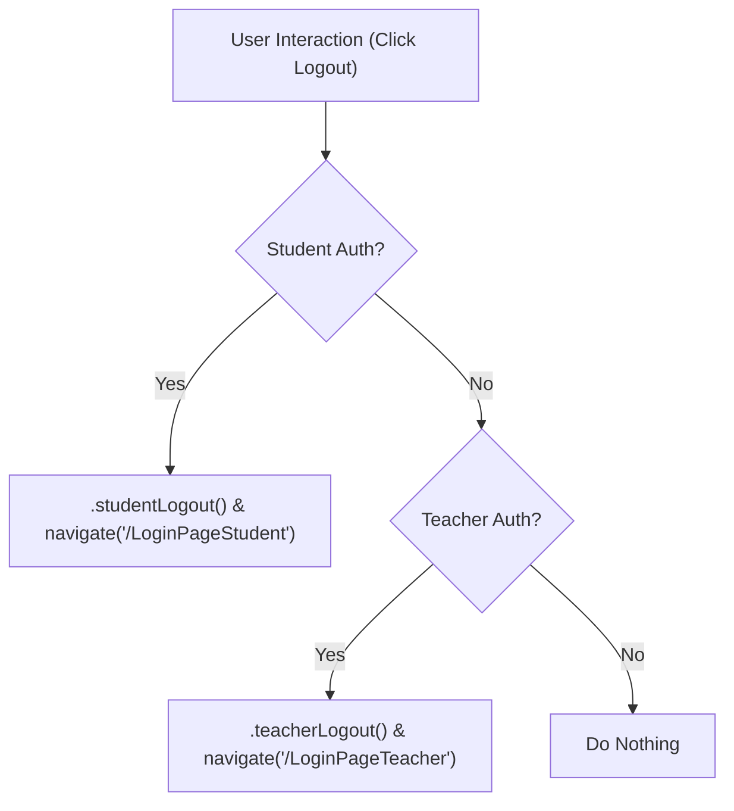
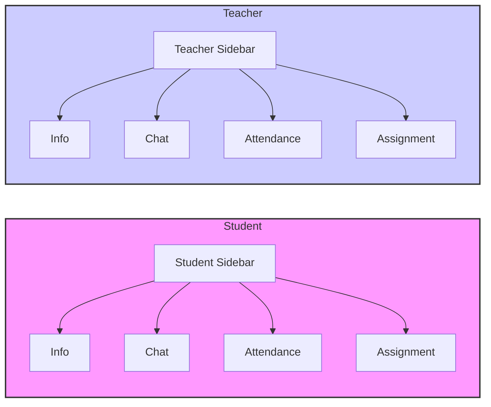

# Component Library

This section describes the reusable UI elements used throughout the client application of ACGC. These components promote consistency and efficiency in building the user interface.

## Components Overview

-   **Navbar:** The application's top navigation bar, handling user authentication status and navigation.
-   **SSidebar:** The sidebar for student-specific class pages, providing navigation to different class sections.
-   **TSidebar:** The sidebar for teacher-specific class pages, similar to SSidebar but tailored for teacher functionalities.

## Navbar Component

The `Navbar` component, located at `Client/src/components/Navbar.jsx`, serves as the primary navigation header for the application. It dynamically displays user information and provides logout functionality based on the user's authentication status (student or teacher).

```javascript
// Client/src/components/Navbar.jsx
import React from 'react';
import { useSAuthStore } from '../store/useSAuthStore';
import { useTAuthStore } from '../store/useTAuthStore';
import { LogOut, User } from 'lucide-react';
import { useNavigate } from 'react-router-dom';

const Navbar = () => {
  const { logout: studentLogout, authUser: studentAuthUser } = useSAuthStore();
  const { logout: teacherLogout, authUser: teacherAuthUser } = useTAuthStore();
  const navigate = useNavigate();

  const handleLogout = async () => {
    if (studentAuthUser) {
      await studentLogout();
      navigate('/LoginPageStudent');
    } else if (teacherAuthUser) {
      await teacherLogout();
      navigate('/LoginPageTeacher');
    }
  };

  const userName = studentAuthUser?.fullName || teacherAuthUser?.fullName || '';
  const userInitials = userName
    .split(' ')
    .map((word) => word[0])
    .join('')
    .toUpperCase()
    .slice(0, 2); 

  return (
    <header className="bg-[#0f172a]/80 border-b border-[#1f2937] backdrop-blur-md shadow-lg fixed w-full top-0 z-50 font-['Nunito'] text-white">
      <div className="max-w-7xl mx-auto px-4 sm:px-6 lg:px-8 h-16 flex items-center justify-between">
        <div className="flex items-center gap-8">
        <h1
  onClick={() => {
    if (studentAuthUser) {
      navigate('/studentDash');
    } else if (teacherAuthUser) {
      navigate('/teacherDash');
    } else {
      navigate('/');
    }
  }}
  className="text-3xl sm:text-4xl font-extrabold tracking-normal bg-gradient-to-r from-emerald-400 to-lime-300 bg-clip-text text-transparent cursor-pointer hover:scale-105 transition-transform"
>
  ACGC
</h1>
        </div>

        <div className="flex items-center gap-4">
          {userName && (
            <div className="flex items-center gap-3 text-sm sm:text-base">
              <div className="flex items-center justify-center bg-sky-600 text-white rounded-full w-8 h-8 font-semibold shadow-md">
                {userInitials}
              </div>
              <span className="hidden sm:inline-block font-medium text-gray-200">{userName}</span>
            </div>
          )}

          {(studentAuthUser || teacherAuthUser) && (
            <button
              onClick={handleLogout}
              className="flex gap-2 items-center text-sm sm:text-base font-medium hover:text-sky-400 transition-colors duration-200"
            >
              <LogOut className="size-5" />
              <span className="hidden sm:inline">Logout</span>
            </button>
          )}
        </div>
      </div>
    </header>
  );
};

export default Navbar;
```

Key features:

-   **Dynamic User Information:** Displays the user's initials and full name.
-   **Authentication Handling:** Uses `useSAuthStore` and `useTAuthStore` to manage student and teacher authentication states, respectively.
-   **Logout Functionality:** Provides a logout button that redirects users to the appropriate login page.
-   **Navigation:** Allows navigation to the student or teacher dashboard based on the authenticated user type.

[View on GitHub](https://github.com/gsgit123/Acgc/blob/main/Client/src/components/Navbar.jsx)





### User Initials Generation

The `Navbar` component extracts and formats user initials for display in the user profile section. This enhances user recognition and provides a visual representation of the user's identity within the application.

```javascript
 const userName = studentAuthUser?.fullName || teacherAuthUser?.fullName || '';
  const userInitials = userName
    .split(' ')
    .map((word) => word[0])
    .join('')
    .toUpperCase()
    .slice(0, 2);
```

This snippet first retrieves the user's full name from either the student or teacher authentication store. Then, it splits the name into an array of words, extracts the first letter of each word, joins these letters, converts them to uppercase, and takes the first two initials. This process ensures that the initials are consistently formatted and displayed.

[View on GitHub](https://github.com/gsgit123/Acgc/blob/main/Client/src/components/Navbar.jsx)

## SSidebar Component

The `SSidebar` component, located at `Client/src/components/SSidebar.jsx`, provides navigation for students within a specific class. It displays a list of links to different sections of the class page, such as "Info," "Chat," "Attendance," and "Assignment."

```javascript
// Client/src/components/SSidebar.jsx
import React from 'react';
import { Link, useLocation, useParams } from 'react-router-dom';

const SClassSidebar = () => {
  const location = useLocation();
  const { classCode } = useParams();

  const navItems = [
    { name: 'Info', path: 'info' },
    { name: 'Chat', path: 'chat' },
    { name: 'Attendance', path: 'attendance' },
    { name: 'Assignment', path: 'assignment' },
  ];

  return (
    <aside className="w-64 min-h-screen bg-[#1f2937] text-[#f9fafb] p-6 font-['Nunito'] shadow-lg border-r border-[#374151]">
      <h2 className="text-2xl font-bold mb-8 tracking-wide text-sky-400">Class Panel</h2>

      <nav className="space-y-3">
        {navItems.map((item) => {
          const isActive = location.pathname.endsWith(item.path);
          return (
            <Link
              key={item.name}
              to={`/class/student/${classCode}/${item.path}`}
              className={`block px-4 py-3 rounded-lg transition-colors duration-200 ${
                isActive
                  ? 'bg-[#2563eb] text-white shadow'
                  : 'hover:bg-[#374151] hover:text-sky-300'
              }`}
            >
              {item.name}
            </Link>
          );
        })}
      </nav>
    </aside>
  );
};

export default SClassSidebar;
```

Key features:

-   **Dynamic Navigation:** Uses `useLocation` and `useParams` to dynamically generate links based on the current class and route.
-   **Active Link Highlighting:** Highlights the currently active link to provide visual feedback to the user.
-   **Reusable Navigation Items:** Defines an array of navigation items, making it easy to add or remove links.

[View on GitHub](https://github.com/gsgit123/Acgc/blob/main/Client/src/components/SSidebar.jsx)

## TSidebar Component

The `TSidebar` component, located at `Client/src/components/TSidebar.jsx`, is analogous to `SSidebar` but tailored for teachers. It provides navigation within a specific class context, offering links to sections such as "Info," "Chat," "Attendance," and "Assignment."

```javascript
// Client/src/components/TSidebar.jsx
import React from 'react';
import { Link, useLocation, useParams } from 'react-router-dom';

const TClassSidebar = () => {
  const location = useLocation();
  const { classCode } = useParams();

  const navItems = [
    { name: 'Info', path: 'info' },
    { name: 'Chat', path: 'chat' },
    { name: 'Attendance', path: 'attendance' },
    { name: 'Assignment', path: 'assignment' },
  ];

  return (
    <aside className="w-64 min-h-screen bg-[#1c2c55] text-white p-6 font-['Nunito'] border-r border-[#1f2937] shadow-2xl">
      <h2 className="text-2xl font-bold mb-8 tracking-wide text-sky-400 text-center">
        Class Panel 🎓
      </h2>

      <nav className="space-y-3">
        {navItems.map((item) => {
          const isActive = location.pathname.endsWith(item.path);
          return (
            <Link
              key={item.name}
              to={`/class/teacher/${classCode}/${item.path}`}
              className={`block px-5 py-3 rounded-lg font-medium transition-all duration-200 ${
                isActive
                  ? 'bg-sky-600 text-white shadow-md scale-[1.02]'
                  : 'hover:bg-[#1e293b] hover:text-sky-300 text-gray-200'
              }`}
            >
              {item.name}
            </Link>
          );
        })}
      </nav>
    </aside>
  );
};

export default TClassSidebar;
```

Key features:

-   **Dynamic Route Handling:** Utilizes `useParams` to extract the `classCode` from the URL, enabling dynamic link generation for class-specific navigation.
-   **Conditional Styling:** Applies different styles to the active link for clear visual indication.
-   **Consistent Navigation Structure:** Uses a predefined array (`navItems`) to maintain a consistent navigation structure across classes.

[View on GitHub](https://github.com/gsgit123/Acgc/blob/main/Client/src/components/TSidebar.jsx)





### Sidebar Link Generation

Both `SSidebar` and `TSidebar` components use the following code to generate navigation links dynamically:

```javascript
{navItems.map((item) => {
  const isActive = location.pathname.endsWith(item.path);
  return (
    <Link
      key={item.name}
      to={`/class/teacher/${classCode}/${item.path}`} //Adjusted for teacher route
      className={`block px-5 py-3 rounded-lg font-medium transition-all duration-200 ${
        isActive
          ? 'bg-sky-600 text-white shadow-md scale-[1.02]'
          : 'hover:bg-[#1e293b] hover:text-sky-300 text-gray-200'
      }`}
    >
      {item.name}
    </Link>
  );
})}
```

This code iterates over the `navItems` array, creating a `Link` component for each item.  The `isActive` variable checks if the current path ends with the item's path, and applies different styling based on this condition.  The `to` prop dynamically generates the correct URL for each link, including the `classCode` parameter.  The CSS classes are applied conditionally to highlight the active link and provide hover effects, enhancing the user experience.

[View on GitHub](https://github.com/gsgit123/Acgc/blob/main/Client/src/components/TSidebar.jsx)

## Key Integration Points

-   **Authentication Flow:** The `Navbar` component relies on `useSAuthStore` and `useTAuthStore` to determine the user's authentication status. Ensuring these stores are correctly implemented and updated is crucial for proper navigation and access control.
-   **Route Management:** The sidebars utilize `react-router-dom` for navigation.  Maintaining a consistent routing structure is essential for the sidebars to function correctly and for users to navigate the application seamlessly.
-   **Component Reusability:** The structure of `SSidebar` and `TSidebar` is nearly identical, differing primarily in styling and route prefixes. Consider refactoring these components into a single, more generic `Sidebar` component that accepts props to customize its behavior for student and teacher contexts.
```