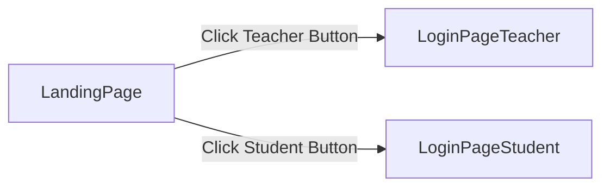
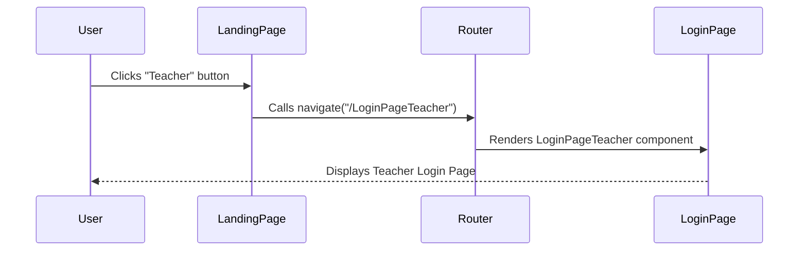

# Page Structure and Routing

This document outlines the structure and routing mechanisms used in the Acgc frontend, a React application. We'll explore how pages are organized, how navigation is handled using React Router, and the key components involved in managing the user interface.

## Overview

The Acgc frontend uses React Router to manage navigation between different pages. The `main.jsx` file sets up the router, and individual page components handle specific routes. This architecture allows for a clean and organized way to navigate the application.

## Key Components

*   **`App.jsx`**: This is the main application component that defines the overall structure and routes. (Not directly in the provided files, but crucial).
*   **`LandingPage.jsx`**: This component serves as the initial landing page, offering options to navigate to either the teacher or student login pages.
*   **`LoginPageTeacher.jsx`**: The teacher login page (not directly in the provided files, but crucial for routing).
*   **`LoginPageStudent.jsx`**: The student login page (not directly in the provided files, but crucial for routing).
*   **`vite.config.js`**: Vite configuration file that includes react plugin setup

## Routing Setup

The `Client/src/main.jsx` file is the entry point for the React application and sets up the routing using `BrowserRouter`.

```javascript
// File: Client/src/main.jsx
import { StrictMode } from 'react'
import { createRoot } from 'react-dom/client'
import {BrowserRouter} from 'react-router-dom'
import './index.css'
import App from './App.jsx'

createRoot(document.getElementById('root')).render(
  <StrictMode>
    <BrowserRouter>
    <App />
    </BrowserRouter>
  </StrictMode>,
)
```

[View on GitHub](https://github.com/gsgit123/Acgc/blob/main/Client/src/main.jsx)

Explanation:

*   `BrowserRouter` enables client-side routing, allowing navigation between different "pages" without full page reloads.
*   The `<App />` component (not shown in this snippet, but essential) likely contains the route definitions using `<Route>` components from `react-router-dom`.

## Landing Page

The `LandingPage.jsx` component provides the initial interface, presenting users with options to navigate to either the teacher or student login pages.

```javascript
// File: Client/src/pages/LandingPage.jsx
import React, { useState } from 'react';
import { useNavigate } from 'react-router-dom';
import '../pageStyles/LandingPage.css';
import { GraduationCap, School } from 'lucide-react';

const LandingPage = () => {
  const navigate = useNavigate();
  const [fadeClass, setFadeClass] = useState('');

  const handleNavigate = (path) => {
    setFadeClass('fade-out');
    setTimeout(() => {
      navigate(path);
    }, 500);
  };

  return (
    <div className={`landing-container ${fadeClass}`}>
      <div className="button-row">
        <button onClick={() => handleNavigate('/LoginPageTeacher')} className="landing-btn">
          <School className="icon" />
          <span>Teacher</span>
        </button>
        <button onClick={() => handleNavigate('/LoginPageStudent')} className="landing-btn">
          <GraduationCap className="icon" />
          <span>Student</span>
        </button>
      </div>
    </div>
  );
};

export default LandingPage;
```

[View on GitHub](https://github.com/gsgit123/Acgc/blob/main/Client/src/pages/LandingPage.jsx)

Explanation:

*   `useNavigate` hook from `react-router-dom` is used to programmatically navigate between routes.
*   `handleNavigate` function triggers a fade-out effect before navigating to the specified path, providing a smoother user experience.

## Navigation Flow

The following Mermaid diagram illustrates the navigation flow from the landing page to the teacher or student login pages.





## Route Handling within `App.jsx` (Hypothetical)

While the `App.jsx` file is not included, it's crucial for understanding how routes are defined and handled. A typical `App.jsx` might look like this:

```javascript
// Hypothetical App.jsx
import React from 'react';
import { Route, Routes } from 'react-router-dom';
import LandingPage from './pages/LandingPage';
import LoginPageTeacher from './pages/LoginPageTeacher';
import LoginPageStudent from './pages/LoginPageStudent';

function App() {
  return (
    <Routes>
      <Route path="/" element={<LandingPage />} />
      <Route path="/LoginPageTeacher" element={<LoginPageTeacher />} />
      <Route path="/LoginPageStudent" element={<LoginPageStudent />} />
    </Routes>
  );
}

export default App;
```

Explanation:

*   `<Routes>` component groups together individual `<Route>` definitions.
*   Each `<Route>` maps a specific path to a React component. For example, the `/LoginPageTeacher` path renders the `LoginPageTeacher` component.

## Component Interaction

Here's a sequence diagram illustrating how the `LandingPage` interacts with the router to navigate to a different page:





## Vite Configuration

The `vite.config.js` file configures the Vite build tool, including the React plugin.

```javascript
// File: Client/vite.config.js
import { defineConfig } from 'vite'
import react from '@vitejs/plugin-react'

// https://vite.dev/config/
export default defineConfig({
  plugins: [react()],
})
```

[View on GitHub](https://github.com/gsgit123/Acgc/blob/main/Client/vite.config.js)

Explanation:

*   The `react()` plugin enables support for React components and JSX syntax within the Vite build process.
*   This configuration ensures that Vite can properly compile and optimize the React application.

## CSS Styling and Fade-Out Animation
The CSS file `Client/src/pageStyles/LandingPage.css` (not provided, but referenced) contains the styles for the landing page, including the fade-out animation. While not directly related to routing, it enhances the user experience during navigation.

```css
/* Hypothetical LandingPage.css */
.landing-container {
  /* Styles for the landing page container */
}

.fade-out {
  opacity: 0;
  transition: opacity 0.5s ease-in-out;
}
```

Explanation:

*   The `.fade-out` class sets the opacity to 0 and adds a transition effect, creating a smooth fade-out animation.
*   The `LandingPage.jsx` component dynamically adds and removes this class to trigger the animation before navigation.

## Key Integration Points

*   **`BrowserRouter`**: Provides the foundation for client-side routing.
*   **`useNavigate`**: Enables programmatic navigation within components.
*   **`<Routes>` and `<Route>`**: Define the mapping between URLs and React components (likely within the missing `App.jsx`).
*   **Event Handlers**: `onClick` events on buttons trigger navigation functions.
*   **CSS Transitions**: Improve user experience with animations during navigation.

## Best Practices

*   **Route Organization**: Keep route definitions organized and centralized (ideally in `App.jsx`).
*   **Component-Based Navigation**: Encapsulate navigation logic within components for reusability and maintainability.
*   **User Experience**: Use transitions and animations to provide smooth and visually appealing navigation.
*   **Lazy Loading**: For larger applications, consider lazy loading components to improve initial load time. This can be achieved using React.lazy and Suspense components in conjunction with React Router.
```