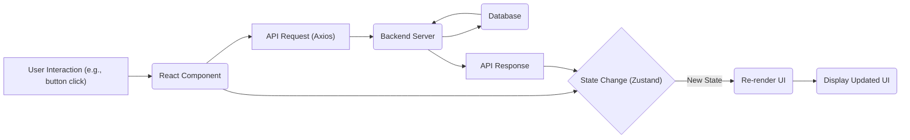
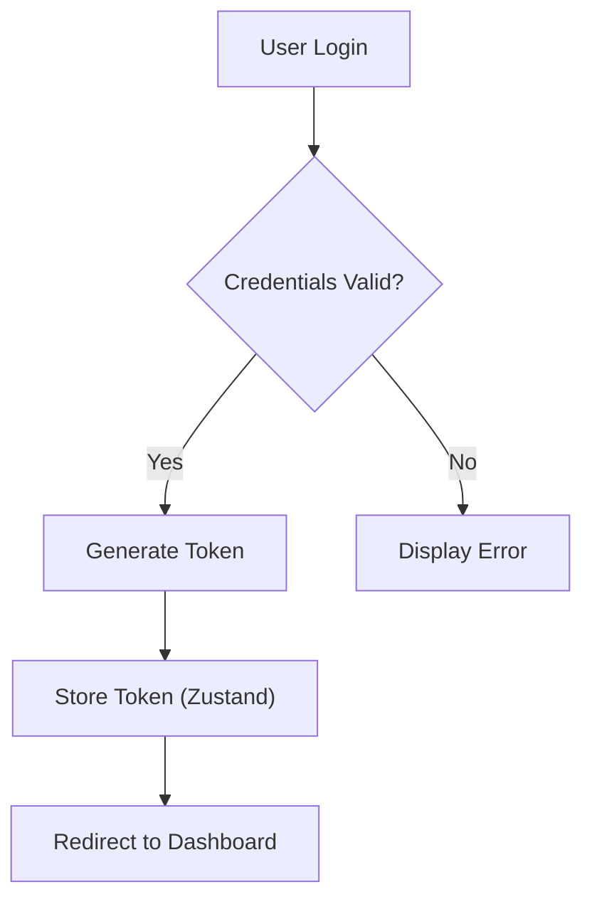

# Client-Side Architecture

This document outlines the architecture of the client-side application for Acgc, a platform designed to streamline classroom management and enhance communication between teachers and students. The client application is built using React and leverages several key libraries to provide a responsive and feature-rich user experience.

## Key Components

*   **React:** The core JavaScript library for building the user interface. React's component-based architecture allows for the creation of reusable UI elements, promoting code maintainability and scalability.
*   **React Router:** Enables navigation between different views within the application, creating a single-page application (SPA) experience.
*   **Axios:** A promise-based HTTP client used for making API requests to the backend server.
*   **Zustand:** A small, fast, and scalable bearbones state-management solution. Makes managing application state easy.
*   **Tailwind CSS & DaisyUI:** Tailwind CSS is a utility-first CSS framework for rapidly building custom designs. DaisyUI is a component library built on top of Tailwind CSS, providing pre-designed UI components.

## File Structure

The primary files involved in the client-side architecture are:

*   `Client/package.json`: Defines the project's dependencies and scripts.
*   `Client/src/main.jsx`: The entry point for the React application.
*   `Client/src/App.jsx`: The main application component that defines the routing and overall structure.

### `Client/package.json`

The `package.json` file lists all the dependencies required for the client-side application. It also defines various scripts for development, building, and testing.

```json
{
  "name": "client",
  "private": true,
  "version": "0.0.0",
  "type": "module",
  "scripts": {
    "dev": "vite",
    "build": "vite build",
    "lint": "eslint .",
    "preview": "vite preview"
  },
  "dependencies": {
    "axios": "^1.9.0",
    "framer-motion": "^12.18.1",
    "lucide-react": "^0.503.0",
    "react": "^18.3.1",
    "react-dom": "^18.3.1",
    "react-hot-toast": "^2.5.2",
    "react-router-dom": "^7.5.2",
    "recharts": "^2.15.3",
    "zustand": "^5.0.3"
  },
  "devDependencies": {
    "@eslint/js": "^9.17.0",
    "@types/react": "^18.3.17",
    "@types/react-dom": "^18.3.5",
    "@vitejs/plugin-react": "^4.3.4",
    "autoprefixer": "^10.4.21",
    "daisyui": "^5.0.28",
    "eslint": "^9.17.0",
    "eslint-plugin-react": "^7.37.2",
    "eslint-plugin-react-hooks": "^5.0.0",
    "eslint-plugin-react-refresh": "^0.4.16",
    "globals": "^15.13.0",
    "postcss": "^8.5.3",
    "tailwindcss": "^3.4.17",
    "vite": "^6.0.3"
  }
}
```

[View on GitHub](https://github.com/gsgit123/Acgc/blob/main/Client/package.json)

### `Client/src/main.jsx`

This is the entry point for the React application. It renders the `App` component inside a `BrowserRouter`, which enables client-side routing.

```javascript
import { StrictMode } from 'react'
import { createRoot } from 'react-dom/client'
import {BrowserRouter} from 'react-router-dom'
import './index.css'
import App from './App.jsx'

createRoot(document.getElementById('root')).render(
  <StrictMode>
    <BrowserRouter>
    <App />
    </BrowserRouter>
  </StrictMode>,
)
```

[View on GitHub](https://github.com/gsgit123/Acgc/blob/main/Client/src/main.jsx)

### `Client/src/App.jsx`

The `App.jsx` file is the heart of the client-side application. It defines the routes, handles authentication, and renders the main UI components.

```javascript
import React, { useEffect } from 'react'
import { Routes, Route, Navigate, useLocation } from 'react-router-dom'
import LandingPage from './pages/LandingPage.jsx'
import LoginPageTeacher from './pages/LoginPageTeacher.jsx'
import LoginPageStudent from './pages/LoginPageStudent.jsx'
import SignupPageStudent from './pages/SignupPageStudent.jsx'
import SignupPageTeacher from './pages/SignupPageTeacher.jsx'
import TeacherDashboard from './pages/TeacherDashboard.jsx'
import StudentDashboard from './pages/StudentDashboard.jsx'
import Navbar from './components/Navbar.jsx'

import { useSAuthStore } from './store/useSAuthStore.js'
import { useTAuthStore } from './store/useTAuthStore.js'
import SClassDetails from './pages/SClassDetails.jsx'
import TClassDetails from './pages/TClassDetails.jsx'

import { Loader } from 'lucide-react'
import { Toaster } from 'react-hot-toast'


import SClassInfo from './s_class_components/Info.jsx'
import SClassChat from './s_class_components/Chat.jsx'
import SClassAttendance from './s_class_components/Attendance.jsx'
import SAssignmentList from './s_class_components/AssignmentList.jsx'

import TClassInfo from './t_class_components/Info.jsx'
import TClassChat from './t_class_components/Chat.jsx'
import TClassAttendance from './t_class_components/Attendance.jsx'
import TClassAssignmentUpload from './t_class_components/AssignmentUpload.jsx'

import './App.css'

const App = () => {
  const location = useLocation()

  const {
    authUser: studentUser,
    checkAuth: checkStudentAuth,
    isCheckingAuth: isCheckingStudentAuth
  } = useSAuthStore()

  const {
    authUser: teacherUser,
    checkAuth: checkTeacherAuth,
    isCheckingAuth: isCheckingTeacherAuth
  } = useTAuthStore()

  useEffect(() => {
    const path = location.pathname.toLowerCase()

    // Skip auth check on root (LandingPage)
    if (path === '/') return

    // Run student auth check only on student-related routes
    if (
      path.includes('/loginstudent') ||
      path.includes('/signupstudent') ||
      path.includes('/student')
    ) {
      checkStudentAuth()
    }

    // Run teacher auth check only on teacher-related routes
    if (
      path.includes('/loginteacher') ||
      path.includes('/signupteacher') ||
      path.includes('/teacher')
    ) {
      checkTeacherAuth()
    }
  }, [location.pathname])

  const path = location.pathname.toLowerCase()
  const isStudentRoute = path.includes('/student')
  const isTeacherRoute = path.includes('/teacher')
  const isChecking =
    (isStudentRoute && isCheckingStudentAuth) ||
    (isTeacherRoute && isCheckingTeacherAuth)

  if (isChecking && !studentUser && !teacherUser) {
    return (
      <div className='flex items-center justify-center h-screen'>
        <Loader className='size-10 animate-spin' />
      </div>
    )
  }

  return (
    <div className="bg-[#0b0f19] min-h-screen text-white font-['Nunito'] pt-16">
      <Navbar />

      <div className="px-4">
        <Routes>
          <Route path='/' element={<LandingPage />} />
          <Route path='/LoginPageStudent' element={!studentUser ? <LoginPageStudent /> : <Navigate to='/studentDash' />} />
          <Route path='/SignupPageStudent' element={!studentUser ? <SignupPageStudent /> : <Navigate to='/studentDash' />} />
          <Route path='/studentDash' element={studentUser ? <StudentDashboard /> : <Navigate to='/LoginPageStudent' />} />
          <Route path='/LoginPageTeacher' element={!teacherUser ? <LoginPageTeacher /> : <Navigate to='/teacherDash' />} />
          <Route path='/SignupPageTeacher' element={!teacherUser ? <SignupPageTeacher /> : <Navigate to='/teacherDash' />} />
          <Route path='/teacherDash' element={teacherUser ? <TeacherDashboard /> : <Navigate to='/LoginPageTeacher' />} />
          <Route path='/class/student/:classCode' element={studentUser ? <SClassDetails /> : <Navigate to='/LoginPageStudent' />}>
            <Route index element={<Navigate to="info" />} />
            <Route path="info" element={<SClassInfo />} />
            <Route path="chat" element={<SClassChat />} />
            <Route path="attendance" element={<SClassAttendance />} />
            <Route path="assignment" element={<SAssignmentList />} />
          </Route>

          <Route path='/class/teacher/:classCode' element={teacherUser ? <TClassDetails /> : <Navigate to='/LoginPageTeacher' />}>
            <Route index element={<Navigate to="info" />} />
            <Route path="info" element={<TClassInfo />} />
            <Route path="chat" element={<TClassChat />} />
            <Route path="attendance" element={<TClassAttendance />} />
            <Route path="assignment" element={<TClassAssignmentUpload />} />
          </Route>        
          </Routes>
      </div>

      <Toaster />
    </div>

  )
}

export default App;
```

[View on GitHub](https://github.com/gsgit123/Acgc/blob/main/Client/src/App.jsx)

#### Routing Configuration

The `Routes` and `Route` components from `react-router-dom` are used to define the different routes in the application. Each route is associated with a specific component that renders when the route is active.

```javascript
<Routes>
  <Route path='/' element={<LandingPage />} />
  <Route path='/LoginPageStudent' element={!studentUser ? <LoginPageStudent /> : <Navigate to='/studentDash' />} />
  <Route path='/SignupPageStudent' element={!studentUser ? <SignupPageStudent /> : <Navigate to='/studentDash' />} />
  <Route path='/studentDash' element={studentUser ? <StudentDashboard /> : <Navigate to='/LoginPageStudent' />} />
  <Route path='/LoginPageTeacher' element={!teacherUser ? <LoginPageTeacher /> : <Navigate to='/teacherDash' />} />
  <Route path='/SignupPageTeacher' element={!teacherUser ? <SignupPageTeacher /> : <Navigate to='/teacherDash' />} />
  <Route path='/teacherDash' element={teacherUser ? <TeacherDashboard /> : <Navigate to='/LoginPageTeacher' />} />
  {/* More routes... */}
</Routes>
```

#### Authentication Handling

The `App` component also handles user authentication using `zustand` stores (`useSAuthStore` and `useTAuthStore`). The `useEffect` hook checks for authentication tokens and redirects users to the appropriate dashboard based on their role.

```javascript
useEffect(() => {
  const path = location.pathname.toLowerCase()

  // Skip auth check on root (LandingPage)
  if (path === '/') return

  // Run student auth check only on student-related routes
  if (
    path.includes('/loginstudent') ||
    path.includes('/signupstudent') ||
    path.includes('/student')
  ) {
    checkStudentAuth()
  }

  // Run teacher auth check only on teacher-related routes
  if (
    path.includes('/loginteacher') ||
    path.includes('/signupteacher') ||
    path.includes('/teacher')
  ) {
    checkTeacherAuth()
  }
}, [location.pathname])
```

#### Conditional Rendering

The application uses conditional rendering to display different content based on the user's authentication status. For example, if a user is not authenticated, they are redirected to the login page.

```javascript
<Route path='/studentDash' element={studentUser ? <StudentDashboard /> : <Navigate to='/LoginPageStudent' />} />
```

## State Management with Zustand

Zustand is used for managing global application state, particularly for authentication.  `useSAuthStore` manages student authentication state, while `useTAuthStore` manages teacher authentication state.

```javascript
import { useSAuthStore } from './store/useSAuthStore.js'
import { useTAuthStore } from './store/useTAuthStore.js'

const App = () => {
  const {
    authUser: studentUser,
    checkAuth: checkStudentAuth,
    isCheckingAuth: isCheckingStudentAuth
  } = useSAuthStore()

  const {
    authUser: teacherUser,
    checkAuth: checkTeacherAuth,
    isCheckingAuth: isCheckingTeacherAuth
  } = useTAuthStore()
  // ...
}
```

## Client-Side Data Flow





## UI Component Architecture

The application follows a component-based architecture. Key components include:

*   `Navbar`: The navigation bar displayed at the top of the application.
*   `LandingPage`: The landing page for the application.
*   `LoginPageStudent`, `LoginPageTeacher`: Login pages for students and teachers, respectively.
*   `SignupPageStudent`, `SignupPageTeacher`: Signup pages for students and teachers, respectively.
*   `StudentDashboard`, `TeacherDashboard`: Dashboards for students and teachers, respectively.
*   `SClassDetails`, `TClassDetails`: Components displaying details for student and teacher classes.
*   `SClassInfo`, `SClassChat`, `SClassAttendance`, `SAssignmentList`: Sub-components for student class details.
*   `TClassInfo`, `TClassChat`, `TClassAttendance`, `TClassAssignmentUpload`: Sub-components for teacher class details.

## Key Integration Points

*   **Authentication Flow:** The authentication flow is managed using `zustand` stores and `react-router-dom`'s `Navigate` component. When a user logs in, a token is stored, and they are redirected to their dashboard. If a user tries to access a protected route without being authenticated, they are redirected to the login page.
*   **API Communication:** The client-side application communicates with the backend server using Axios. API requests are made to fetch data, create new resources, and update existing resources. Error handling is implemented to gracefully handle API failures.

```javascript
import axios from 'axios';

const fetchData = async () => {
  try {
    const response = await axios.get('/api/data');
    return response.data;
  } catch (error) {
    console.error('Error fetching data:', error);
    throw error; // Re-throw to allow component-level handling
  }
};
```
[View on GitHub](https://github.com/gsgit123/Acgc/blob/main/Client/src/someComponent.jsx)  (Example only, the actual component name might be different)

*   **State Management:** Zustand is used to manage application state, such as user authentication status and class details. Zustand stores are created for both students and teachers to manage their respective authentication states and data.

```javascript
import { create } from 'zustand';

export const useSAuthStore = create((set) => ({
  authUser: null,
  token: null,
  isCheckingAuth: true,
  // ...
}));
```
[View on GitHub](https://github.com/gsgit123/Acgc/blob/main/Client/src/store/useSAuthStore.js)

## Best Practices

*   **Component Reusability:** The application leverages React's component-based architecture to create reusable UI elements. This promotes code maintainability and reduces duplication.
*   **Clear Routing Structure:** The routing structure is well-defined, with each route associated with a specific component. This makes it easy to navigate between different views within the application.
*   **Centralized State Management:** Zustand is used to manage application state in a centralized manner. This makes it easier to reason about the application's state and reduces the risk of inconsistencies.




