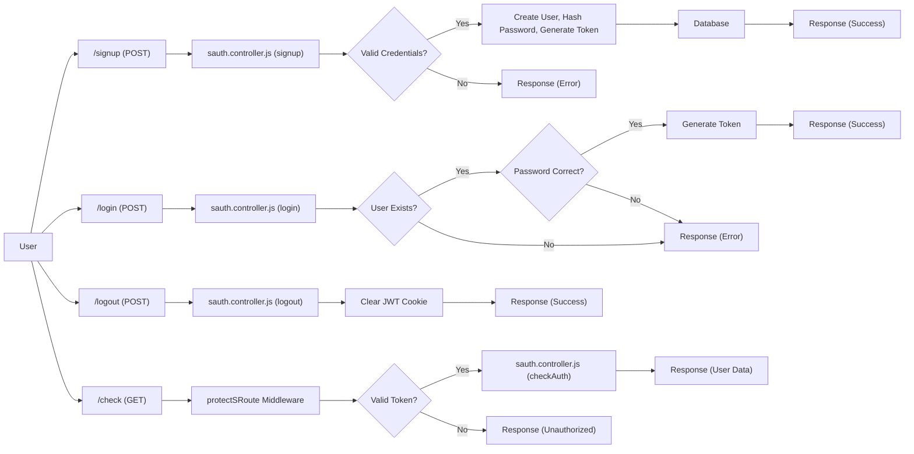
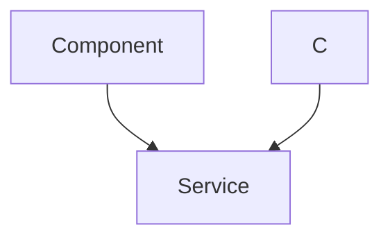

# Authentication and Authorization

This document outlines the authentication and authorization mechanisms implemented in the Acgc project. It details the controllers, middleware, and routes responsible for managing user registration, login, logout, and access control.

## Features

*   **User Registration (Signup):** Allows new users to create accounts with email verification and password hashing.
*   **User Login:** Authenticates existing users based on email and password.
*   **User Logout:** Invalidates the user's session and removes the authentication token.
*   **Protected Routes:** Restricts access to specific routes based on user authentication status.
*   **JSON Web Tokens (JWT):** Uses JWTs for secure authentication and authorization.
*   **Password Hashing:** Employs bcryptjs for secure password storage.

## Relevant Files

*   `Server/src/controllers/sauth.controller.js`: Contains the logic for signup, login, logout, and authentication checks.
*   `Server/src/middleware/sauth.middleware.js`: Implements the middleware for protecting routes based on JWT validation.
*   `Server/src/routes/sauth.route.js`: Defines the API endpoints for authentication-related operations.

## Authentication Controller (`sauth.controller.js`)

This file manages the core authentication logic.

### Signup

The `signup` function handles user registration. It validates user input, hashes the password using bcryptjs, and saves the new user to the database.

```javascript
// File: Server/src/controllers/sauth.controller.js
import Student from "../models/student.model.js"
import { generateToken } from "../lib/utils.js";
import bcrypt from "bcryptjs"

export const signup=async(req,res)=>{
    const {fullName,email,password}=req.body;
    try{
        if(!fullName||!email||!password){
            return res.status(400).json({message:"All fields are required"})
        }
        if(password.length<6){
            return res.status(400).json({message:"Password Must be 6 characters long"});
        }
        const user=await Student.findOne({email})
        if(user)return res.status(400).json({message:"email already exists"});
        
        const salt=await bcrypt.genSalt(10)
        const hashedPassword=await bcrypt.hash(password,salt);

        const newUser=new Student({
            fullName,
            email,
            password:hashedPassword
        })
        if(newUser){
            generateToken(newUser._id,res);
            await newUser.save();

            res.status(201).json({
                _id:newUser._id,
                fullName:newUser.fullName,
                email:newUser.email,
                message:"Student Created Successfully",
            });
        }
        else{
            res.status(400).json({message:"invalid user data"});
        }

    }catch(error){
        console.log("Error in signup controller", error.message);
        res.status(500).json({ message: "Internal Server Error" });

    }
}
```

[View on GitHub](https://github.com/gsgit123/Acgc/blob/main/Server/src/controllers/sauth.controller.js)

**Explanation:**

1.  It retrieves the `fullName`, `email`, and `password` from the request body.
2.  It checks if all required fields are present.
3.  It validates the password length.
4.  It checks if a user with the given email already exists.
5.  It generates a salt and hashes the password using `bcryptjs`.
6.  It creates a new `Student` object with the hashed password.
7.  It generates a JWT token and sends the new user data with a success message.

### Login

The `login` function handles user authentication. It retrieves the user from the database based on the provided email, compares the provided password with the stored hashed password, and generates a JWT token upon successful authentication.

```javascript
// File: Server/src/controllers/sauth.controller.js
export const login=async(req,res)=>{
    try{
        const {email,password}=req.body;
        const user=await Student.findOne({email})
        if(!user){
            return res.status(400).json({message:"Invalid Credentials"});
        }

        const isPasswordCorrect=await bcrypt.compare(password,user.password);
        if(!isPasswordCorrect){
            return res.status(400).json({message:"Invalid Credentials"});
        }
        generateToken(user._id,res);
        res.status(200).json({
            _id:user._id,
            fullName:user.fullName,
            email:user.email,
            message:"Student Login Successfully",
        });
    }
    catch(error){
        console.log("error in login controller ",error.message);
        res.status(500).json({message:"Internal Server error"})
    }
}
```

[View on GitHub](https://github.com/gsgit123/Acgc/blob/main/Server/src/controllers/sauth.controller.js)

**Explanation:**

1.  It retrieves the `email` and `password` from the request body.
2.  It retrieves the user from the database based on the email.
3.  It compares the provided password with the stored hashed password using `bcrypt.compare`.
4.  If the password is correct, it generates a JWT token and sends the user data with a success message.

### Logout

The `logout` function invalidates the user's session by clearing the JWT cookie.

```javascript
// File: Server/src/controllers/sauth.controller.js
export const logout=(req,res)=>{
    try{
        res.cookie("jwt","",{maxAge:0})
        res.status(200).json({message:"Logged out Successfully"})
    }
    catch(error){
        console.log("error in logout controller ",error.message);
        res.status(500).json({message:"Internal Server error"})
    }
}
```

[View on GitHub](https://github.com/gsgit123/Acgc/blob/main/Server/src/controllers/sauth.controller.js)

**Explanation:**

1. It clears the "jwt" cookie by setting its `maxAge` to 0. This effectively invalidates the JWT stored in the client's browser.
2. It sends a success message to the client.

### Check Authentication

The `checkAuth` function verifies if the user is authenticated. It utilizes the `protectSRoute` middleware to validate the token before proceeding. If the token is valid, it responds with the user information.

```javascript
// File: Server/src/controllers/sauth.controller.js
export const checkAuth = async (req, res) => {
    try {
      res.status(200).json(req.user); 
    } catch (error) {
      console.log("error in checkauth: ", error.message);
      res.status(500).json({ message: "Internal server error" });
    }
  };
```

[View on GitHub](https://github.com/gsgit123/Acgc/blob/main/Server/src/controllers/sauth.controller.js)

**Explanation:**

1. This function sends the user data attached to the request by the `protectSRoute` middleware.
2. If any error occurs, it logs the error and sends an internal server error response.

## Authentication Middleware (`sauth.middleware.js`)

The `protectSRoute` middleware is responsible for protecting routes that require authentication.

```javascript
// File: Server/src/middleware/sauth.middleware.js
import jwt from "jsonwebtoken"
import Student from "../models/student.model.js"

export const protectSRoute=async(req,res,next)=>{
    try{
        const token=req.cookies.jwt

        if(!token){
            return res.status(401).json({message:"Unauthorized-No Token Provided"})
        }
        const decoded=jwt.verify(token,process.env.JWT_SECRET)

        if(!decoded){
            return res.status(401).json({message:"Unauthorized-Invalid Token"})
        }
        const user=await Student.findById(decoded.userId).select("-password");

        if(!user){
            return res.status(401).json({message:"User not found"})
        }

        req.user=user
        next()
    }
    catch(error){
        console.log("error in protect middleware: ",error.message)
        res.status(500).json({message:"Internal server error"})
    }
}
```

[View on GitHub](https://github.com/gsgit123/Acgc/blob/main/Server/src/middleware/sauth.middleware.js)

**Explanation:**

1.  It retrieves the JWT token from the `jwt` cookie.
2.  If no token is found, it returns an unauthorized error.
3.  It verifies the token using the `JWT_SECRET` environment variable.
4.  If the token is invalid, it returns an unauthorized error.
5.  It retrieves the user from the database based on the user ID in the token.
6.  If the user is not found, it returns an unauthorized error.
7.  It attaches the user object to the request and calls the next middleware.

## Authentication Routes (`sauth.route.js`)

This file defines the API endpoints for authentication-related operations.

```javascript
// File: Server/src/routes/sauth.route.js
import express from "express";
import {signup,login,logout,checkAuth} from "../controllers/sauth.controller.js"
import { protectSRoute } from "../middleware/sauth.middleware.js";
const router=express.Router();

router.post("/signup",signup)

router.post("/login",login)

router.post("/logout",logout)

router.get("/check",protectSRoute,checkAuth);

export default router;
```

[View on GitHub](https://github.com/gsgit123/Acgc/blob/main/Server/src/routes/sauth.route.js)

**Explanation:**

1.  It defines the routes for signup, login, and logout.
2.  It uses the `protectSRoute` middleware to protect the `/check` route, ensuring that only authenticated users can access it.

## Authentication Flow Diagram





## Key Integration Points

The authentication and authorization mechanisms are tightly integrated with the user model and the routing system. The `protectSRoute` middleware acts as a gatekeeper, ensuring that only authenticated users can access protected resources.

### Best Practices

*   **Secure Password Storage:** Always hash passwords using a strong hashing algorithm like bcryptjs.
*   **JWT Expiration:** Set appropriate expiration times for JWTs to minimize the risk of token compromise.
*   **Input Validation:** Thoroughly validate user input to prevent injection attacks.
*   **Environment Variables:** Store sensitive information like JWT secrets in environment variables, not directly in the code.

### Token Generation

```javascript
//File: Server/src/lib/utils.js
import jwt from 'jsonwebtoken';

export const generateToken=(userId,res)=>{
    const token=jwt.sign({userId},process.env.JWT_SECRET,{
        expiresIn:'15d'
    });
    res.cookie("jwt",token,{
        maxAge:15 * 24 * 60 * 60 * 1000,
        httpOnly:true,
        sameSite:"strict"
    });
    return token;
}
```

[View on GitHub](https://github.com/gsgit123/Acgc/blob/main/Server/src/lib/utils.js)

**Explanation:**
1.  The `generateToken` function takes a `userId` and the response object (`res`) as input.
2.  It uses the `jwt.sign()` method to create a new JWT. The payload is `{userId}`, and it's signed using `process.env.JWT_SECRET`.  The token expires in 15 days.
3.  The token is set as an HTTP-only cookie named "jwt". The `maxAge` is set to 15 days. The `httpOnly: true` option makes the cookie inaccessible to client-side JavaScript, preventing XSS attacks. The `sameSite: "strict"` option helps prevent CSRF attacks.
4.  The generated token is returned.





```