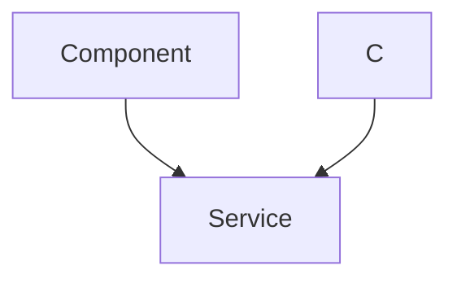
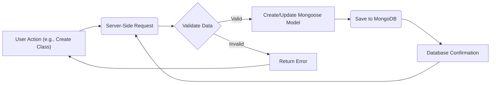

# Data Models and Persistence

This document describes the data models used in the Acgc application and explains how data is persisted using Mongoose and MongoDB. Acgc uses a schema-based approach to define the structure of data stored in the database, ensuring data integrity and consistency.

## Data Models

The application uses three primary data models: `Class`, `Student`, and `Teacher`. Each model defines the structure and validation rules for the corresponding data entities.

### Class Model

The `Class` model represents a class or course within the application. It stores information such as the class name, subject, class code, the teacher who created the class, and the students enrolled in the class.

```javascript title="Server/src/models/class.model.js"
import mongoose from 'mongoose';

const classSchema = new mongoose.Schema({
    name: {
        type: String,
        required: true,
    },
    subject: {
        type: String,
        required: true,
    },
    classCode: {
        type: String,
        required: true,
        unique: true,
    },
    createdBy: { 
        type: mongoose.Schema.Types.ObjectId, 
        ref: 'Teacher', 
        required: true 
    },
    students: [
        {
            type: mongoose.Schema.Types.ObjectId,
            ref: 'Student',
        },
    ],
    createdAt: { 
        type: Date, 
        default: Date.now 
    }

});

const Class=mongoose.model("Class",classSchema);
export default Class;
```

[View on GitHub](https://github.com/gsgit123/Acgc/blob/main/Server/src/models/class.model.js)

**Explanation:**

-   `name`: The name of the class (e.g., "Mathematics 101").
-   `subject`: The subject of the class (e.g., "Mathematics").
-   `classCode`: A unique code for the class.
-   `createdBy`: A reference to the `Teacher` who created the class.
-   `students`: An array of references to `Student`s enrolled in the class.
-   `createdAt`: A timestamp indicating when the class was created.

### Student Model

The `Student` model represents a student user within the application. It stores information such as the student's email, full name, and password.

```javascript title="Server/src/models/student.model.js"
import mongoose from "mongoose"

const studentSchema = new mongoose.Schema(
    {
        email: {
            type: String,
            required: true,
            unique: true,
        },
        fullName: {
            type: String,
            required: true,
        },
        password: {
            type: String,
            required: true,
            minlength: 6,
        },
        role: {
            type: String,
            default: "Student", 
            immutable: true,
        },

    },
    {
        timestamps: true
    }
);

const Student = mongoose.model("Student", studentSchema);
export default Student;
```

[View on GitHub](https://github.com/gsgit123/Acgc/blob/main/Server/src/models/student.model.js)

**Explanation:**

-   `email`: The student's email address (must be unique).
-   `fullName`: The student's full name.
-   `password`: The student's password (minimum length of 6 characters).
-   `role`: The student's role (defaults to "Student" and is immutable).
-   `timestamps`: Adds `createdAt` and `updatedAt` fields automatically.

### Teacher Model

The `Teacher` model represents a teacher user within the application. It stores similar information to the `Student` model, including email, full name, and password.

```javascript title="Server/src/models/teacher.model.js"
import mongoose from "mongoose"

const teacherSchema=new mongoose.Schema(
    {
        email:{
            type:String,
            required:true,
            unique:true,
        },
        fullName:{
            type:String,
            required:true,
        },
        password:{
            type:String,
            required:true,
            minlength:6,
        },
        role: {
            type: String,
            default: "Teacher", 
            immutable: true,
        },
    },
    {
        timestamps:true
    }
);

const Teacher=mongoose.model("Teacher",teacherSchema);
export default Teacher;
```

[View on GitHub](https://github.com/gsgit123/Acgc/blob/main/Server/src/models/teacher.model.js)

**Explanation:**

-   `email`: The teacher's email address (must be unique).
-   `fullName`: The teacher's full name.
-   `password`: The teacher's password (minimum length of 6 characters).
-   `role`: The teacher's role (defaults to "Teacher" and is immutable).
-   `timestamps`: Adds `createdAt` and `updatedAt` fields automatically.

## Data Persistence

The application uses Mongoose, an Object Data Modeling (ODM) library for MongoDB and Node.js, to interact with the database. Mongoose provides a schema-based solution to model application data and includes built-in type casting, validation, query building, and middleware.

### Mongoose Schemas

Mongoose schemas define the structure of the documents that will be stored in MongoDB. Each schema maps to a MongoDB collection and defines the shape of the documents within that collection. The schemas also define validation rules and default values for the data.

### Example: Class Model Schema

Here's an example of how the `Class` model is defined using a Mongoose schema:

```javascript title="Class Model Schema"
const classSchema = new mongoose.Schema({
    name: {
        type: String,
        required: true,
    },
    subject: {
        type: String,
        required: true,
    },
    classCode: {
        type: String,
        required: true,
        unique: true,
    },
    createdBy: { 
        type: mongoose.Schema.Types.ObjectId, 
        ref: 'Teacher', 
        required: true 
    },
    students: [
        {
            type: mongoose.Schema.Types.ObjectId,
            ref: 'Student',
        },
    ],
    createdAt: { 
        type: Date, 
        default: Date.now 
    }

});
```

This schema specifies the data types, validation rules (e.g., `required: true`), and relationships between different data models (e.g., `createdBy` referencing the `Teacher` model).

### Data Relationships

Mongoose allows defining relationships between different models using the `ref` option in the schema. This enables you to create relationships between documents in different collections.

In the `Class` model, the `createdBy` field establishes a relationship with the `Teacher` model. This indicates that each class is created by a specific teacher.  Similarly, the `students` field in the `Class` model establishes a relationship with the `Student` model, indicating which students are enrolled in the class.

```javascript title="Relationship Example"
createdBy: { 
    type: mongoose.Schema.Types.ObjectId, 
    ref: 'Teacher', 
    required: true 
}
```

This example shows how to define a reference to the `Teacher` model using `mongoose.Schema.Types.ObjectId` and the `ref` option.

### Data Model Diagram





### Data Validation

Mongoose provides built-in data validation capabilities to ensure data integrity. You can define validation rules within the schema, such as required fields, data type validation, and custom validation functions.

```javascript title="Validation Example"
email: {
    type: String,
    required: true,
    unique: true,
},
password: {
    type: String,
    required: true,
    minlength: 6,
},
```

In this example, the `email` field is marked as `required` and `unique`, and the `password` field is marked as `required` with a minimum length of 6 characters.

## Key Integration Points

### Data Flow

The data models are used throughout the application to represent and persist data related to classes, students, and teachers. When a new class is created, a new `Class` document is created in the database. When a student enrolls in a class, the student's ID is added to the `students` array in the `Class` document.





### Best Practices

-   **Define schemas carefully:** Ensure that your schemas accurately represent the structure of your data and include appropriate validation rules.
-   **Use relationships:** Leverage Mongoose's relationship features to create connections between different data models.
-   **Handle errors:** Implement proper error handling to catch validation errors and other database-related issues.
-   **Use indexes:** Define indexes on frequently queried fields to improve database performance.  For example, the `email` field is set as `unique` which implicitly creates an index.
```javascript
email:{
    type:String,
    required:true,
    unique:true,
},
```
-   **Secure Passwords:** Always hash passwords before saving them to the database. While not shown directly in the model definitions, this is a crucial security practice implemented during user registration and login processes.

By following these best practices, you can ensure that your data is stored and managed efficiently and securely.
```