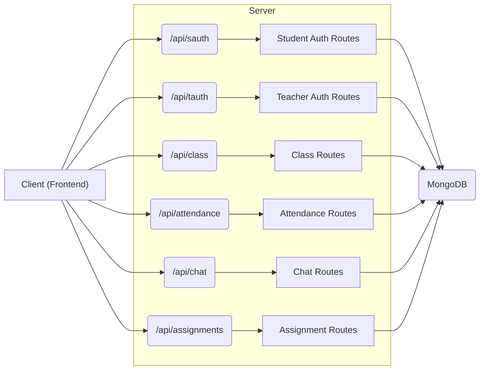

# Server-Side Architecture

This document outlines the architecture of the backend server for the Acgc application. It details the key components, including controllers, models (though not explicitly shown in the provided files), routes, and database connection logic.

## Core Components

*   **Entry Point (Server/index.js):** This file initializes the Express server, connects to the database, configures middleware, and sets up API routes.
*   **Routes (Server/src/routes/\*.route.js):** Route files define the endpoints for different functionalities like student authentication (sauth), teacher authentication (tauth), class management, attendance, chat, and assignments.
*   **Database Connection (Server/src/lib/db.js):** This module handles the connection to the MongoDB database.
*   **Middleware:** The server utilizes various middleware components for tasks such as CORS handling, cookie parsing, and request body parsing.

## Server Initialization and Configuration

The `Server/index.js` file is the heart of the backend application. It uses Express.js to create and configure the server.

```javascript title="Server/index.js"
import express from "express"
import dotenv from "dotenv"
import {connectDB} from "./src/lib/db.js"
import sauthRoutes from "./src/routes/sauth.route.js"
import tauthRoutes from "./src/routes/tauth.route.js"
import classRoutes from "./src/routes/class.route.js"
import cors from "cors"
import cookieParser from "cookie-parser"
import attendanceRoutes from './src/routes/attendance.route.js';
import chatRoutes from "./src/routes/chat.route.js"
import AssignmentRoutes from "./src/routes/assignment.route.js"
import { fileURLToPath } from 'url';
import path from "path"


const __filename = fileURLToPath(import.meta.url);
const __dirname = path.dirname(__filename);
const app=express();
dotenv.config()


const PORT=process.env.PORT

app.use(express.json({ limit: "10mb" }));
app.use(express.urlencoded({ extended: true, limit: "10mb" }));
app.use(cookieParser())

const allowedOrigins = [
  "http://localhost:5173",
  "https://acgc-nu.vercel.app"
];

app.use(cors({
  origin: allowedOrigins,
  credentials: true,
}));


app.use("/api/sauth", sauthRoutes);

app.use("/api/tauth", tauthRoutes);

app.use("/api/class", classRoutes);

app.use("/api/attendance", attendanceRoutes);

app.use("/api/chat", chatRoutes);


app.use("/api/assignments", AssignmentRoutes);


app.listen(PORT,()=>{
    console.log(`Server is running on port ${PORT}`);
    connectDB();
});
```

[View on GitHub](https://github.com/gsgit123/Acgc/blob/main/Server/index.js)

**Explanation:**

1.  **Imports:** The code imports necessary modules, including Express.js for creating the server, `dotenv` for managing environment variables, route modules, `cors` for handling Cross-Origin Resource Sharing, and `cookieParser` for parsing cookies.
2.  **Configuration:** It configures the server by loading environment variables from a `.env` file using `dotenv.config()`.  It also sets up middleware for parsing JSON and URL-encoded request bodies, and for parsing cookies. `allowedOrigins` array defines the allowed origins for CORS.
3.  **Routes:**  It then mounts the route handlers for different functionalities like student authentication (`sauthRoutes`), teacher authentication (`tauthRoutes`), class management (`classRoutes`), attendance (`attendanceRoutes`), chat (`chatRoutes`), and assignments (`AssignmentRoutes`).
4.  **Server Startup:** Finally, the code starts the Express server, listening on the port specified in the environment variables, and calls the `connectDB()` function to establish a connection to the MongoDB database.

## Package Dependencies

The `Server/package.json` file lists the dependencies required by the backend application.

```json title="Server/package.json"
{
  "name": "server",
  "version": "1.0.0",
  "description": "",
  "main": "index.js",
  "scripts": {
    "dev": "nodemon index.js",
    "start": "node index.js"
  },
  "keywords": [],
  "author": "",
  "license": "ISC",
  "type": "module",
  "dependencies": {
    "acgc": "file:..",
    "bcryptjs": "^3.0.2",
    "cookie-parser": "^1.4.7",
    "cors": "^2.8.5",
    "dotenv": "^16.5.0",
    "express": "^5.1.0",
    "jsonwebtoken": "^9.0.2",
    "mongoose": "^8.13.2",
    "path-to-regexp": "^8.2.0"
  },
  "devDependencies": {
    "nodemon": "^3.1.10"
  }
}
```

[View on GitHub](https://github.com/gsgit123/Acgc/blob/main/Server/package.json)

**Key Dependencies:**

*   `express`: Web framework for building the server.
*   `mongoose`:  MongoDB object modeling tool.
*   `cors`: Middleware for enabling Cross-Origin Resource Sharing.
*   `dotenv`: Loads environment variables from a `.env` file.
*   `cookie-parser`:  Middleware for parsing cookies.
*   `jsonwebtoken`: For generating and verifying JSON Web Tokens (JWT) for authentication.
*   `bcryptjs`: For hashing passwords.

## Database Connection

The `Server/src/lib/db.js` file handles the connection to the MongoDB database.

```javascript title="Server/src/lib/db.js"
import mongoose from "mongoose";

export const connectDB=async()=>{
    try{
        const conn=await mongoose.connect(process.env.MONGO_URI);
        console.log(`Mongodb connected: ${conn.connection.host}`);
    }catch(error){
        console.log("mongodb connection error: ",error);
    }
};
```

[View on GitHub](https://github.com/gsgit123/Acgc/blob/main/Server/src/lib/db.js)

**Explanation:**

The `connectDB` function uses `mongoose.connect()` to establish a connection to the MongoDB database. The connection string is retrieved from the `MONGO_URI` environment variable.  Error handling is included to catch and log any connection errors.

## Middleware Configuration

The server configures several middleware components to handle different aspects of request processing.

```javascript title="Middleware Configuration (Server/index.js)"
app.use(express.json({ limit: "10mb" }));
app.use(express.urlencoded({ extended: true, limit: "10mb" }));
app.use(cookieParser())

const allowedOrigins = [
  "http://localhost:5173",
  "https://acgc-nu.vercel.app"
];

app.use(cors({
  origin: allowedOrigins,
  credentials: true,
}));
```

[View on GitHub](https://github.com/gsgit123/Acgc/blob/main/Server/index.js)

**Explanation:**

*   `express.json({ limit: "10mb" })`: Parses incoming requests with JSON payloads. The `limit` option specifies the maximum request body size.
*   `express.urlencoded({ extended: true, limit: "10mb" })`: Parses incoming requests with URL-encoded payloads.
*   `cookieParser()`: Parses cookies attached to the request.
*   `cors()`: Enables Cross-Origin Resource Sharing, allowing requests from specified origins (`allowedOrigins`). The `credentials: true` option allows the server to accept cookies from the specified origins.

## Route Handling

The server uses separate route files to handle different API endpoints. For example, `sauthRoutes` handles student authentication related requests.

```javascript title="Route Mounting (Server/index.js)"
app.use("/api/sauth", sauthRoutes);
app.use("/api/tauth", tauthRoutes);
app.use("/api/class", classRoutes);
app.use("/api/attendance", attendanceRoutes);
app.use("/api/chat", chatRoutes);
app.use("/api/assignments", AssignmentRoutes);
```

[View on GitHub](https://github.com/gsgit123/Acgc/blob/main/Server/index.js)

**Explanation:**

Each `app.use()` call mounts a route handler at a specific path. For example, all requests to `/api/sauth` will be handled by the `sauthRoutes` module.  This modular approach makes it easier to organize and maintain the API.

## Server Startup

The server starts listening for incoming requests using the `app.listen()` method.

```javascript title="Server Startup (Server/index.js)"
app.listen(PORT,()=>{
    console.log(`Server is running on port ${PORT}`);
    connectDB();
});
```

[View on GitHub](https://github.com/gsgit123/Acgc/blob/main/Server/index.js)

**Explanation:**

The server listens on the port specified by the `PORT` environment variable.  A callback function is executed when the server starts successfully, logging a message to the console and calling the `connectDB()` function to connect to the database.

## Server Architecture Diagram





## Key Integration Points

The server acts as the central hub for the Acgc application, handling requests from the frontend and interacting with the database.

*   **Authentication Flow:**  The authentication routes (`sauthRoutes`, `tauthRoutes`) handle user login and registration, generating and verifying JWTs for secure access.
*   **Data Management:** The class, attendance, chat, and assignment routes handle the creation, retrieval, updating, and deletion of data in the MongoDB database.
*   **Real-time Communication:** The chat routes likely handle real-time communication features, possibly using WebSockets or similar technologies (though not explicitly shown in the provided files).

## Best Practices

*   **Environment Variables:**  Storing sensitive information like database URIs and API keys in environment variables is crucial for security and portability.
*   **Modular Design:**  Separating the application into modules (e.g., route files, database connection module) improves code organization and maintainability.
*   **Middleware Usage:** Using middleware for tasks like CORS handling, request body parsing, and cookie parsing simplifies the request processing pipeline.
*   **Error Handling:** Implementing proper error handling mechanisms is essential for preventing application crashes and providing informative error messages to the client.
```