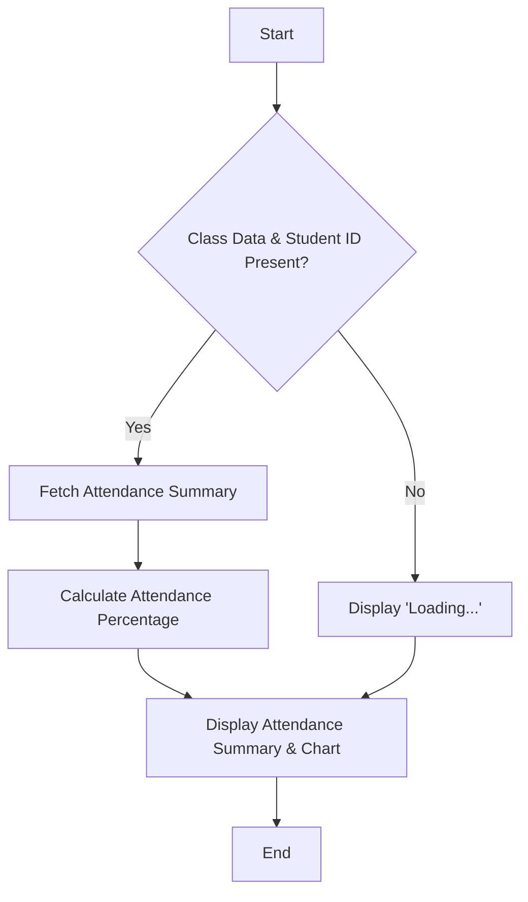
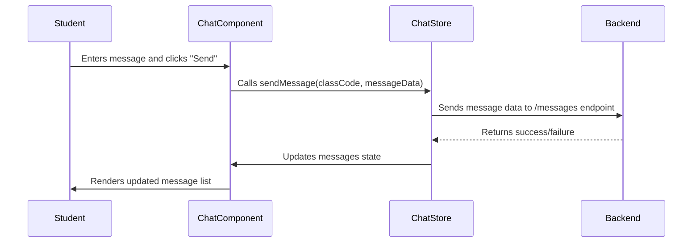

# Student Class Components

This document explains the React components used to display class information specifically tailored for students within the ACGC application. These components provide students with access to assignments, attendance records, and a real-time chat feature for class-related communication.

## Components Overview

This section details the three main components used to render student class information: `AssignmentList`, `Attendance`, and `Chat`.

### AssignmentList

The `AssignmentList` component displays a list of assignments for a specific class, allows students to submit their work, and indicates submission status.

**File:** `Client/src/s_class_components/AssignmentList.jsx`

```javascript
import React, { useEffect, useState, useContext } from 'react';
import { axiosInstance } from '../lib/axios';
import { ClassContext } from '../pages/SClassDetails';

const AssignmentList = () => {
  const { classData, studentId } = useContext(ClassContext);
  const [assignments, setAssignments] = useState([]);
  const [submitted, setSubmitted] = useState({});
  const [tempUrls, setTempUrls] = useState({});

  useEffect(() => {
    const fetch = async () => {
      try {
        const res = await axiosInstance.get(`/assignments/${classData.classCode}`);
        setAssignments(res.data);

        const subs = {};
        for (let a of res.data) {
          const sub = await axiosInstance.get(`/assignments/submissions/${a._id}`);
          const match = sub.data.find((s) => s.studentId._id === studentId);
          if (match) subs[a._id] = true;
        }
        setSubmitted(subs);
      } catch (err) {
        console.error('Error fetching assignments:', err);
      }
    };

    if (classData?.classCode && studentId) fetch();
  }, [classData?.classCode, studentId]);

  // ... (handleSubmit, handleInputChange, return statement)
};

export default AssignmentList;
```

**Explanation:**

*   **Data Fetching:** The `useEffect` hook fetches assignments from the backend using `axiosInstance.get(`/assignments/${classData.classCode}`). It also checks if the student has already submitted each assignment.
*   **Context Usage:** It utilizes the `ClassContext` to access the class data and the student's ID, ensuring that the assignments displayed are relevant to the specific class and student.
*   **State Management:** The component uses `useState` to manage the list of assignments, submission statuses, and temporary URLs for student submissions.

[View on GitHub](https://github.com/gsgit123/Acgc/blob/main/Client/src/s_class_components/AssignmentList.jsx)

**Snippet:** Submission Handling

```javascript
  const handleSubmit = async (assignmentId) => {
    const fileUrl = tempUrls[assignmentId]?.trim();
    if (!fileUrl) {
      alert('Please provide a valid file URL');
      return;
    }

    try {
      await axiosInstance.post('/assignments/submit', {
        assignmentId,
        studentId,
        fileUrl,
      });
      alert('Submitted!');
      setSubmitted((prev) => ({ ...prev, [assignmentId]: true }));
    } catch (err) {
      console.error('Submission failed:', err);
      alert('Submission failed');
    }
  };
```

**Explanation:**

This function handles the submission of assignments. It takes the `assignmentId` as input and retrieves the file URL from the `tempUrls` state. It then sends a POST request to the `/assignments/submit` endpoint with the assignment ID, student ID, and file URL. On successful submission, it updates the `submitted` state to reflect the new submission status.

[View on GitHub](https://github.com/gsgit123/Acgc/blob/main/Client/src/s_class_components/AssignmentList.jsx)

### Attendance

The `Attendance` component displays the student's attendance record for a particular class, including the number of days present, total days, and attendance percentage.

**File:** `Client/src/s_class_components/Attendance.jsx`

```javascript
import React, { useEffect, useState, useContext } from 'react';
import { axiosInstance } from '../lib/axios';
import { toast } from 'react-hot-toast';
import { PieChart, Pie, Cell, Tooltip, Legend } from 'recharts';
import { ClassContext } from '../pages/SClassDetails';

const COLORS = ['#4ade80', '#f87171']; // Green (Present), Red (Absent)

const ClassAttendance = () => {
  const { classData, studentId } = useContext(ClassContext);
  const [presentDays, setPresentDays] = useState(0);
  const [totalDays, setTotalDays] = useState(0);
  const [loading, setLoading] = useState(false);

  useEffect(() => {
    const fetchSummary = async () => {
      setLoading(true);
      try {
        const res = await axiosInstance.get(
          `/attendance/summary/${classData._id}/${studentId}`
        );
        const { daysPresent, totalDays } = res.data;
        setPresentDays(daysPresent || 0);
        setTotalDays(totalDays || 0);
      } catch (err) {
        console.error(err);
        toast.error('Failed to fetch attendance summary');
      } finally {
        setLoading(false);
      }
    };

    if (classData?._id && studentId) {
      fetchSummary();
    }
  }, [classData?._id, studentId]);

  // ... (pie chart data and return statement)
};

export default ClassAttendance;
```

**Explanation:**

*   **Attendance Summary Fetching:** The `useEffect` hook fetches the attendance summary from the backend using `axiosInstance.get(`/attendance/summary/${classData._id}/${studentId}`). It retrieves the number of days present and the total number of days for the student in the class.
*   **Data Visualization:**  It uses `recharts` library to display a pie chart visualizing the attendance data.
*   **Error Handling:**  The component uses `react-hot-toast` library to display user-friendly error messages in case of any failures during data fetching.

[View on GitHub](https://github.com/gsgit123/Acgc/blob/main/Client/src/s_class_components/Attendance.jsx)

**Snippet:** Calculating Attendance Percentage

```javascript
  const percentage =
    totalDays > 0 ? ((presentDays / totalDays) * 100).toFixed(2) : 'N/A';
  const percentageColor = percentage < 75 ? 'text-red-400' : 'text-green-400';
```

**Explanation:**

This snippet calculates the attendance percentage based on the `presentDays` and `totalDays` states. It also dynamically sets the color of the percentage text to red if the attendance is below 75% and green otherwise.

[View on GitHub](https://github.com/gsgit123/Acgc/blob/main/Client/src/s_class_components/Attendance.jsx)





### Chat

The `Chat` component provides a real-time chat interface for students to communicate with teachers and other students within the class.

**File:** `Client/src/s_class_components/Chat.jsx`

```javascript
import { useEffect, useState, useRef, useContext } from "react";
import { useChatStore } from "../store/useChatStore";
import { ClassContext } from "../pages/SClassDetails";

const Chat = () => {
  const { classData, studentId } = useContext(ClassContext);
  const { messages, fetchMessages, sendMessage, isLoadingMessages } = useChatStore();

  const [text, setText] = useState("");
  const messagesEndRef = useRef(null);

  useEffect(() => {
    if (classData?.classCode) {
      fetchMessages(classData.classCode);
    }
  }, [classData?.classCode, fetchMessages]);

  const handleSend = () => {
    if (!text.trim()) return;

    const messageData = {
      senderId: studentId,
      senderModel: "Student",
      content: text,
    };

    sendMessage(classData.classCode, messageData);
    setText("");
  };

  // ... (handleKeyPress, return statement)
};

export default Chat;
```

**Explanation:**

*   **Message Management:** The component uses a custom hook, `useChatStore`, (likely implemented using Zustand or similar state management library) to manage the chat messages, fetch messages from the backend, and send new messages.
*   **Real-time Updates:**  It automatically scrolls to the bottom of the message list whenever new messages are received to ensure the latest messages are always visible.
*   **User Identification:**  The component identifies the sender of each message and displays messages from the teacher with a different styling to distinguish them from student messages.

[View on GitHub](https://github.com/gsgit123/Acgc/blob/main/Client/src/s_class_components/Chat.jsx)

**Snippet:** Sending a Message

```javascript
  const handleSend = () => {
    if (!text.trim()) return;

    const messageData = {
      senderId: studentId,
      senderModel: "Student",
      content: text,
    };

    sendMessage(classData.classCode, messageData);
    setText("");
  };
```

**Explanation:**

This function handles sending a new message. It takes the text entered by the user, constructs a `messageData` object containing the sender ID, sender model (Student), and message content. It then calls the `sendMessage` function from the `useChatStore` to send the message to the backend and clears the input field.

[View on GitHub](https://github.com/gsgit123/Acgc/blob/main/Client/src/s_class_components/Chat.jsx)

**Snippet:** Message Rendering

```javascript
messages.map((msg, idx) => {
  const isSelf = msg.sender === studentId;
  const isTeacher = msg.senderModel === "Teacher";

  return (
    <div
      key={idx}
      className={`flex flex-col max-w-[75%] ${
        isSelf ? "ml-auto items-end" : "items-start"
      }`}
    >
      <span
        className={`text-sm font-semibold mb-1 ${
          isTeacher ? "text-emerald-400" : "text-sky-400"
        }`}
      >
        {msg.fullName || "Unknown Sender"}
      </span>
      <div
        className={`px-4 py-2 rounded-lg text-white break-words ${
          isSelf ? "bg-sky-600" : "bg-gray-700"
        }`}
      >
        {msg.content}
      </div>
    </div>
  );
})
```

**Explanation:**
This code snippet iterates through the `messages` array and renders each message. It determines whether the message was sent by the current student (`isSelf`) or a teacher (`isTeacher`) and applies appropriate styling based on the sender. This includes alignment (right for self, left for others) and color.

[View on GitHub](https://github.com/gsgit123/Acgc/blob/main/Client/src/s_class_components/Chat.jsx)





## Key Integration Points

*   **Class Context:** All three components rely heavily on the `ClassContext` to access class-specific data and the current student's ID. This ensures that the information displayed is relevant to the specific class the student is viewing.
*   **Axios Instance:** The `axiosInstance` is used for making API requests to the backend.  It's essential to configure this instance correctly with the base URL and any necessary authentication headers.
*   **State Management:** The `AssignmentList` component uses local state (`useState`) for managing assignments and submission URLs, while the `Chat` component utilizes a global state management solution (`useChatStore`). Choosing the appropriate state management approach depends on the complexity and scope of the data being managed.
*   **Error Handling:** Proper error handling is implemented in both `AssignmentList` and `Attendance` component, using `try...catch` blocks and displaying user-friendly error messages using `react-hot-toast`. This ensures a better user experience by providing feedback when something goes wrong.
```