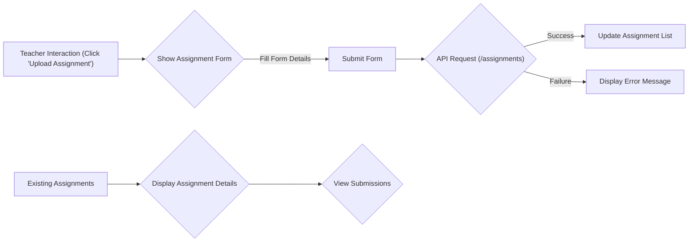
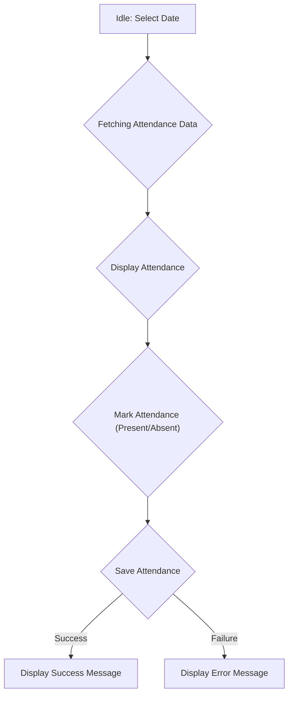
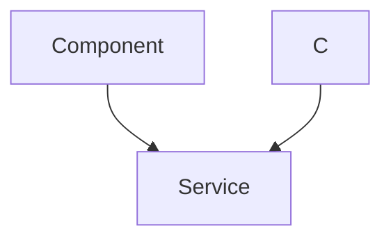

# Teacher Class Components

This section details the React components used by teachers to manage class-related information within the Acgc application. These components enable teachers to upload assignments, track student attendance, and communicate with students via a chat interface.

## Components Overview

-   **AssignmentUpload.jsx**: Allows teachers to upload assignments with titles, descriptions, deadlines, and file URLs. It also displays a list of existing assignments and their submissions.
-   **Attendance.jsx**: Enables teachers to mark student attendance for a selected date.
-   **Chat.jsx**: Provides a real-time chat interface for teachers and students within a specific class.

## AssignmentUpload.jsx

This component allows teachers to create and manage assignments for a specific class. It includes a form for uploading new assignments and a display of existing assignments with submission details.

### Key Features

-   **Assignment Creation**: Teachers can input the title, description, deadline, and file URL for each assignment.
-   **Assignment Listing**: Displays all assignments for the current class with their details.
-   **Submission Tracking**: Shows a list of submissions for each assignment, including student names and links to submitted files.
-   **Assignment Deletion**: Allows teachers to delete assignments and their associated submissions.

### Code Snippets

**1. Fetching Assignments:**

This `useEffect` hook fetches assignments when the `classData` is available.

```javascript
import React, { useEffect, useState } from 'react';
import { useOutletContext } from 'react-router-dom';
import { axiosInstance } from '../lib/axios';
import { Plus, X } from 'lucide-react';
import { toast } from 'react-hot-toast';

const AssignmentUpload = () => {
  const { classData, teacherId } = useOutletContext(); // 👈 Access from parent route
  const [form, setForm] = useState({ title: '', description: '', fileUrl: '', deadline: '' });
  const [assignments, setAssignments] = useState([]);
  const [submissionsMap, setSubmissionsMap] = useState({});
  const [showForm, setShowForm] = useState(false);
  useEffect(() => {
    if (classData?.classCode) {
      fetchAssignments();
    }
  }, [classData]);
}
```

[View on GitHub](https://github.com/gsgit123/Acgc/blob/main/Client/src/t_class_components/AssignmentUpload.jsx)

**2. Handling Assignment Submission:**

This function handles the submission of a new assignment to the backend.

```javascript
 const handleSubmit = async (e) => {
    e.preventDefault();
    try {
      await axiosInstance.post('/assignments', {
        ...form,
        classCode: classData.classCode,
        createdBy: teacherId,
      });
      setForm({ title: '', description: '', fileUrl: '', deadline: '' });
      setShowForm(false);
      toast.success('Assignment uploaded!');
      fetchAssignments();
    } catch (err) {
      toast.error('Upload failed');
      console.error(err);
    }
  };
```

[View on GitHub](https://github.com/gsgit123/Acgc/blob/main/Client/src/t_class_components/AssignmentUpload.jsx)

**3. Displaying Assignment List:**

This code snippet renders the list of assignments fetched from the backend.

```javascript
{assignments.length === 0 ? (
          <p className="text-gray-400">No assignments uploaded yet.</p>
        ) : (
          assignments.map((assignment) => (
            <div
              key={assignment._id}
              className="mb-6 p-4 bg-[#1e293b] rounded-md border border-gray-600 shadow-md"
            >
              <h4 className="text-lg font-bold text-white">{assignment.title}</h4>
              <p className="text-gray-300">{assignment.description}</p>
              <p className="text-sm text-gray-400 mt-1">
                Deadline: {assignment.deadline ? assignment.deadline.slice(0, 10) : 'N/A'}
              </p>
              {assignment.fileUrl && (
                <a
                  href={assignment.fileUrl}
                  target="_blank"
                  rel="noreferrer"
                  className="text-sky-400 underline text-sm"
                >
                  View File
                </a>
              )}
```

[View on GitHub](https://github.com/gsgit123/Acgc/blob/main/Client/src/t_class_components/AssignmentUpload.jsx)

**4. Assignment Deletion:**

This code handles the deletion of an assignment.

```javascript
<button
                className="mt-4 px-4 py-2 bg-red-600 hover:bg-red-700 text-white font-semibold rounded-md"
                onClick={async () => {
                  if (!window.confirm('Are you sure you want to delete this assignment and all its submissions?')) return;
                  try {
                    await axiosInstance.delete(`/assignments/${assignment._id}`);
                    toast.success('Deleted successfully');
                    fetchAssignments();
                  } catch (err) {
                    toast.error('Failed to delete');
                    console.error(err);
                  }
                }}
              >
                Delete Assignment
              </button>
```

[View on GitHub](https://github.com/gsgit123/Acgc/blob/main/Client/src/t_class_components/AssignmentUpload.jsx)

### Component Flow





## Attendance.jsx

The `Attendance.jsx` component provides teachers with the ability to record and manage student attendance for a given class and date.

### Key Features

-   **Date Selection**: Teachers can select a date for which they want to record attendance.
-   **Attendance Marking**: For each student, teachers can mark them as either 'present' or 'absent'.
-   **Attendance Saving**: The recorded attendance can be saved to the backend.

### Code Snippets

**1. Fetching Attendance Data:**

This `useEffect` hook fetches attendance data for a specific class and date.

```javascript
import React, { useEffect, useState } from 'react';
import { useOutletContext } from 'react-router-dom';
import { axiosInstance } from '../lib/axios';
import { toast } from 'react-hot-toast';

const today = new Date().toISOString().slice(0, 10); // YYYY-MM-DD

const ClassAttendance = () => {
const { classData, teacherId } = useOutletContext();
  const [date, setDate] = useState(today);
  const [attendance, setAttendance] = useState([]);
  const [loading, setLoading] = useState(false);

  useEffect(() => {
    let isMounted = true;

    const fetchAttendance = async () => {
      setLoading(true);
      try {
        const res = await axiosInstance.get(`/attendance/class/${classData._id}/date/${date}`);
        const records = res.data.attendance;
```

[View on GitHub](https://github.com/gsgit123/Acgc/blob/main/Client/src/t_class_components/Attendance.jsx)

**2. Handling Attendance Status Change:**

This function updates the attendance status of a student.

```javascript
 const handleStatusChange = (studentId, status) => {
    setAttendance(prev =>
      prev.map(a => (a.studentId === studentId ? { ...a, status } : a))
    );
  };
```

[View on GitHub](https://github.com/gsgit123/Acgc/blob/main/Client/src/t_class_components/Attendance.jsx)

**3. Saving Attendance:**

This function saves the attendance data to the backend.

```javascript
 const handleSave = async () => {
    try {
      setLoading(true);
      await axiosInstance.post(`/attendance/class/${classData._id}/date/${date}`, {
        attendance: attendance.map(({ studentId, status }) => ({ studentId, status })),
      });
      toast.success('Attendance saved!');
    } catch {
      toast.error('Failed to save attendance');
    } finally {
      setLoading(false);
    }
  };
```

[View on GitHub](https://github.com/gsgit123/Acgc/blob/main/Client/src/t_class_components/Attendance.jsx)

### Component State Diagram





## Chat.jsx

The `Chat.jsx` component provides a real-time chat interface for teachers and students within a specific class, enabling communication and doubt clarification.

### Key Features

-   **Real-time Messaging**: Allows instant messaging between teachers and students.
-   **Message Display**: Displays messages with sender information.
-   **User Authentication**: Ensures that only authenticated users can send messages.

### Code Snippets

**1. Fetching Messages:**

This `useEffect` hook fetches messages when the `classCode` is available.

```javascript
import { useEffect, useState, useRef, useContext } from "react";
import { useChatStore } from "../store/useChatStore";
import { useTAuthStore } from "../store/useTAuthStore";
import { ClassContext } from "../pages/TClassDetails";

const Chat = () => {
  const { classData } = useContext(ClassContext);
  const classCode = classData?.classCode;

  const { messages, fetchMessages, sendMessage, isLoadingMessages } = useChatStore();
  const currentUser = useTAuthStore((state) => state.authUser);
    useEffect(() => {
    if (classCode) {
      fetchMessages(classCode);
    }
  }, [classCode, fetchMessages]);
}
```

[View on GitHub](https://github.com/gsgit123/Acgc/blob/main/Client/src/t_class_components/Chat.jsx)

**2. Sending a Message:**

This function handles sending a message to the chat.

```javascript
 const handleSend = () => {
    if (!text.trim()) return;

    const messageData = {
      senderId: currentUser._id,
      senderModel: "Teacher",
      content: text,
    };

    sendMessage(classCode, messageData);
    setText("");
  };
```

[View on GitHub](https://github.com/gsgit123/Acgc/blob/main/Client/src/t_class_components/Chat.jsx)

**3. Rendering Messages:**

This code snippet renders the list of messages in the chat interface.

```javascript
{isLoadingMessages ? (
            <div className="text-center text-gray-400">Loading messages...</div>
          ) : messages.length === 0 ? (
            <div className="text-center text-gray-400">No messages yet.</div>
          ) : (
            messages.map((msg, idx) => {
              const isSelf = msg.sender === currentUser._id;
              const isTeacher = msg.senderModel === "Teacher";

              return (
                <div
                  key={idx}
                  className={`flex flex-col max-w-[75%] ${
                    isSelf ? "ml-auto items-end" : "items-start"
                  }`}
                >
                  <span
                    className={`text-sm font-semibold mb-1 ${
                      isTeacher ? "text-emerald-400" : "text-sky-400"
                    }`}
                  >
                    {msg.fullName || "Unknown Sender"}
                  </span>
                  <div
                    className={`px-4 py-2 rounded-lg text-white break-words ${
                      isSelf ? "bg-sky-600" : "bg-gray-700"
                    }`}
                  >
                    {msg.content}
                  </div>
                </div>
              );
            })
          )}
          <div ref={messagesEndRef} />
        </div>
```

[View on GitHub](https://github.com/gsgit123/Acgc/blob/main/Client/src/t_class_components/Chat.jsx)

### Chat Interaction Flow





## Key Integration Points

These components rely on the `axiosInstance` for making API requests to the backend. They also utilize the `useOutletContext` hook to access class and teacher data from the parent route. The `useChatStore` and `useTAuthStore` are used for managing chat messages and teacher authentication, respectively. Toast notifications are used to provide feedback to the user on successful or failed operations.  Proper error handling is crucial to ensure a smooth user experience.
```