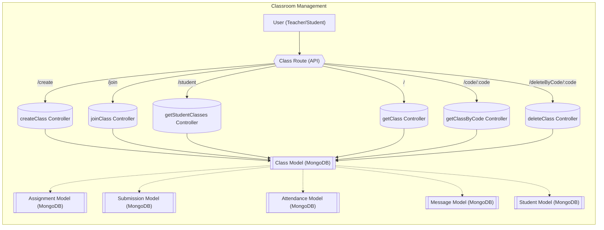

# Classroom Management Features

This section details the features related to managing classes, assignments, and attendance within the Acgc application. These features are crucial for teachers to organize their courses and for students to engage with the learning materials effectively.

## Class Creation

Teachers can create new classes with a specific name and subject. Each class is assigned a unique class code, which students use to join the class.

```javascript title="Server/src/controllers/class.controller.js"
import Class from '../models/class.model.js';

function generateClassCode() {
    return Math.random().toString(36).substr(2, 6).toUpperCase(); 
}

export const createClass=async (req, res) => {
    const {name,subject}=req.body;
    try {
        if (!name || !subject) {
            return res.status(400).json({ message: "All fields are required" });
        }

        const classCode = generateClassCode(); 

        const newClass = new Class({
            name,
            subject,
            classCode,
            createdBy: req.user, 
        });
        await newClass.save();
        res.status(201).json({message: "Class Created Successfully"});
    } catch (error) {
        console.log("Error in createClass controller", error.message);
        res.status(500).json({ message: "Internal Server Error" });
    }    
}
```

This snippet from `Server/src/controllers/class.controller.js` shows the `createClass` function. It generates a unique class code and saves the class details to the database. [View on GitHub](https://github.com/gsgit123/Acgc/blob/main/Server/src/controllers/class.controller.js)

## Joining a Class

Students can join classes using the unique class code provided by the teacher.

```javascript title="Server/src/controllers/class.controller.js"
export const joinClass = async (req, res) => {
  const { classCode } = req.body;
  const studentId = req.user._id;

  if (!classCode) return res.status(400).json({ message: "Class code is required" });

  try {
    const foundClass = await Class.findOne({ classCode });
    if (!foundClass) return res.status(404).json({ message: "Class not found" });

    const alreadyJoined = foundClass.students.includes(studentId);
    if (alreadyJoined) return res.status(400).json({ message: "Already enrolled in this class" });

    foundClass.students.push(studentId);
    await foundClass.save();

    return res.status(200).json({ message: "Successfully joined the class" });
  } catch (err) {
    console.error("Join class error:", err.message);
    return res.status(500).json({ message: "Internal Server Error" });
  }
};
```

The `joinClass` function, also from `Server/src/controllers/class.controller.js`, handles student enrollment. It checks if the class exists and if the student is already enrolled before adding the student to the class. [View on GitHub](https://github.com/gsgit123/Acgc/blob/main/Server/src/controllers/class.controller.js)

## Retrieving Classes

Teachers can retrieve a list of all the classes they have created. Students can retrieve a list of all the classes they have joined.

```javascript title="Server/src/controllers/class.controller.js"
export const getClass=async(req,res)=>{
    try {
        const teacherId = req.user._id;
    
        const classes = await Class.find({ createdBy: teacherId }).populate('students', 'fullName'); // Populate student names if necessary
    
        if (!classes || classes.length === 0) {
          return res.status(404).json({ message: "No classes found for this teacher." });
        }
    
        const result = classes.map((classItem) => ({
          _id: classItem._id,
          name: classItem.name,
          subject: classItem.subject,
          students: classItem.students, 
          classCode: classItem.classCode,
        }));
    
        return res.status(200).json({ classes: result });
      } catch (error) {
        console.error("Error fetching classes:", error.message);
        return res.status(500).json({ message: "Internal Server Error" });
      }
}

export const getStudentClasses = async (req, res) => {
    try {
      const studentId = req.user._id;
  
      const classes = await Class.find({ students: studentId }).populate('createdBy', 'fullName');
  
      return res.status(200).json({ classes });
    } catch (err) {
      console.error("Error fetching student classes:", err.message);
      return res.status(500).json({ message: "Internal Server Error" });
    }
  };
```

These functions, `getClass` and `getStudentClasses` in `Server/src/controllers/class.controller.js`, are responsible for retrieving class data for teachers and students, respectively.  `getClass` retrieves classes created by a specific teacher, while `getStudentClasses` fetches classes a student has joined. [View on GitHub](https://github.com/gsgit123/Acgc/blob/main/Server/src/controllers/class.controller.js)

## Deleting a Class

Teachers have the ability to delete classes they've created. This action also triggers the deletion of associated assignments, submissions, attendance records, and messages.

```javascript title="Server/src/controllers/class.controller.js"
export const deleteClass = async (req, res) => {
  const { code } = req.params;

  try {
    const foundClass = await Class.findOne({ classCode: code });

    if (!foundClass) {
      return res.status(404).json({ message: "Class not found" });
    }

    const classCode = foundClass.classCode;
    const classId = foundClass._id;

    const assignments = await Assignment.find({ classCode });
    const assignmentIds = assignments.map(a => a._id);

    await Submission.deleteMany({ assignmentId: { $in: assignmentIds } });
    await Assignment.deleteMany({ classCode });

    await Attendance.deleteMany({ class: classId });
    await Message.deleteMany({ classId });

    await Student.updateMany({}, { $pull: { classList: classCode } });

    await Class.deleteOne({ _id: classId });

    return res.status(200).json({ message: "Class and all related data deleted successfully." });
  } catch (error) {
    console.error("Error deleting class:", error.message);
    return res.status(500).json({ message: "Internal Server Error" });
  }
};
```

The `deleteClass` function in `Server/src/controllers/class.controller.js` handles the deletion of a class and its related data. It ensures that assignments, submissions, attendance records, and messages associated with the class are also removed to maintain data integrity. [View on GitHub](https://github.com/gsgit123/Acgc/blob/main/Server/src/controllers/class.controller.js)

## Assignment Management

Teachers can create assignments for their classes, specifying a title, description, file URL, and deadline.

```javascript title="Server/src/models/assignment.model.js"
import mongoose from 'mongoose'

const assignmentSchema = new mongoose.Schema({
    title: {
        type: String,
        required: true
    },
    description: String,
    fileUrl: String,
    classCode: { type: String, required: true },
    createdBy: { type: mongoose.Schema.Types.ObjectId, ref: 'Teacher', required: true },
    deadline: Date,
    createdAt: { type: Date, default: Date.now }

})


const Assignment = mongoose.model('Assignment', assignmentSchema);
export default Assignment;
```

This is the `assignmentSchema` from `Server/src/models/assignment.model.js`. It defines the structure of an assignment, including its title, description, file URL, class code, creator, and deadline.  This schema is used to create and manage assignments within the application. [View on GitHub](https://github.com/gsgit123/Acgc/blob/main/Server/src/models/assignment.model.js)

## Class Routes

The `class.route.js` file defines the API endpoints for class-related operations.

```javascript title="Server/src/routes/class.route.js"
import express from 'express';
import { createClass, deleteClass, getClass, getClassByCode, getStudentClasses, joinClass } from '../controllers/class.controller.js';
import { protectTRoute } from '../middleware/tclass.middleware.js'; 
import { protectSRoute } from '../middleware/sauth.middleware.js';

const router=express.Router();

router.get("/",protectTRoute,getClass)

router.post("/create",protectTRoute,createClass);

router.post("/join",protectSRoute,joinClass);

router.get("/student", protectSRoute, getStudentClasses);

router.get('/code/:code',getClassByCode);

router.delete('/deleteByCode/:code', deleteClass)

export default router;
```

This code defines the routes for class management in `Server/src/routes/class.route.js`. It uses `express` to set up endpoints for creating, joining, retrieving, and deleting classes.  Middleware functions `protectTRoute` and `protectSRoute` are used to protect teacher and student routes, respectively. [View on GitHub](https://github.com/gsgit123/Acgc/blob/main/Server/src/routes/class.route.js)

## Data Flow Diagram





This diagram illustrates the data flow within the classroom management features.  It shows how user requests are routed through the API to the corresponding controllers, which interact with the MongoDB models to manage class data and related information.

## Key Integration Points

*   **Authentication Middleware:** The routes are protected using authentication middleware (`protectTRoute` and `protectSRoute`) to ensure that only authorized users can access specific functionalities.
*   **Class Code Generation:**  A unique class code generation ensures no collisions.
*   **Data Integrity:**  The `deleteClass` function ensures that all related data (assignments, submissions, attendance, messages) is deleted when a class is deleted, maintaining data integrity.
*   **Student Enrollment:**  The `joinClass` function ensures that students are not enrolled in the same class twice.
*   **Data Population:** When fetching classes, the `populate` method is used to retrieve related data (e.g., student names, teacher names), reducing the number of database queries required.
```