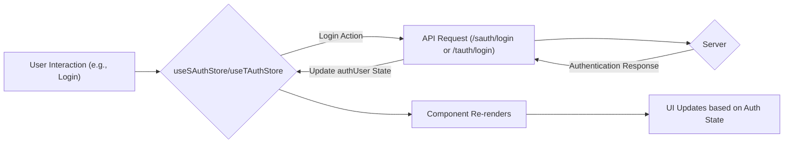

# State Management

This section details how ACGC manages application state using Zustand stores. Zustand is a small, fast, and scalable bearbones state-management solution. We utilize Zustand stores to manage authentication state for both students and teachers, as well as chat message state.

## Zustand Stores

We employ three main Zustand stores:

*   `useChatStore`: Manages chat messages within a class.
*   `useSAuthStore`: Manages student authentication state.
*   `useTAuthStore`: Manages teacher authentication state.

### useChatStore

This store is responsible for fetching, storing, and sending chat messages within a specific class.

#### Key Features:

*   **Message Management:** Stores and updates an array of chat messages.
*   **Loading State:** Tracks whether messages are currently being fetched.
*   **Asynchronous Operations:** Handles asynchronous API calls to fetch and send messages.

#### Code Snippets:

**1. Initializing the Store:**

```javascript
// File: Client/src/store/useChatStore.js
import { create } from 'zustand';
import { axiosInstance } from "../lib/axios.js";
import toast from 'react-hot-toast';

export const useChatStore = create((set, get) => ({
    messages: [],
    isLoadingMessages: false,

    fetchMessages: async (classId) => {
        set({ isLoadingMessages: true });
        try {
            const res = await axiosInstance.get(`/chat/${classId}`);
            set({ messages: res.data });
        } catch (error) {
            toast.error("Failed to fetch messages");
            console.error("Error fetching messages:", error);
        } finally {
            set({ isLoadingMessages: false });
        }
    },

    sendMessage: async (classId, data) => {
        try {
            const res = await axiosInstance.post(`/chat/${classId}/send`, data);
            set((state) => ({
                messages: [...state.messages, res.data.message]
            }));

        }
        catch (error) {
            toast.error("Failed to send message");
            console.error("Error sending message:", error);
        }
    }
}));
```

[View on GitHub](https://github.com/gsgit123/Acgc/blob/main/Client/src/store/useChatStore.js)

*Explanation:* This code initializes the `useChatStore` using `create` from `zustand`.  It defines the initial state (`messages` as an empty array, `isLoadingMessages` as false) and the actions to interact with the state (`fetchMessages`, `sendMessage`).  It also imports necessary libraries like `axiosInstance` for making API requests and `toast` for displaying notifications.

**2. Fetching Messages:**

```javascript
// File: Client/src/store/useChatStore.js
fetchMessages: async (classId) => {
    set({ isLoadingMessages: true });
    try {
        const res = await axiosInstance.get(`/chat/${classId}`);
        set({ messages: res.data });
    } catch (error) {
        toast.error("Failed to fetch messages");
        console.error("Error fetching messages:", error);
    } finally {
        set({ isLoadingMessages: false });
    }
},
```

[View on GitHub](https://github.com/gsgit123/Acgc/blob/main/Client/src/store/useChatStore.js)

*Explanation:* The `fetchMessages` function takes a `classId` as input. It first sets `isLoadingMessages` to `true` to indicate that data is being fetched. It then makes a GET request to the `/chat/${classId}` endpoint using `axiosInstance`.  If the request is successful, it updates the `messages` state with the received data.  If an error occurs, it displays an error message using `toast`. Finally, it sets `isLoadingMessages` to `false` regardless of the outcome.

**3. Sending Messages:**

```javascript
// File: Client/src/store/useChatStore.js
sendMessage: async (classId, data) => {
    try {
        const res = await axiosInstance.post(`/chat/${classId}/send`, data);
        set((state) => ({
            messages: [...state.messages, res.data.message]
        }));

    }
    catch (error) {
        toast.error("Failed to send message");
        console.error("Error sending message:", error);
    }
}
```

[View on GitHub](https://github.com/gsgit123/Acgc/blob/main/Client/src/store/useChatStore.js)

*Explanation:* The `sendMessage` function takes a `classId` and message `data` as input. It sends a POST request to the `/chat/${classId}/send` endpoint. Upon successful submission it updates the state `messages` with newly added message from the API and appends the new message to the existing `messages` array using the spread operator.

### useSAuthStore & useTAuthStore

These stores manage the authentication state for students and teachers, respectively.  They share similar logic but interact with different API endpoints.

#### Key Features:

*   **Authentication State:** Stores the currently authenticated user's data.
*   **Loading States:** Tracks whether signup or login operations are in progress, as well as initial auth check.
*   **Asynchronous Authentication:** Handles signup, login, logout, and auth checking API calls.

#### Code Snippets:

**4. Initializing the useSAuthStore:**

```javascript
// File: Client/src/store/useSAuthStore.js
import { create } from "zustand";
import { axiosInstance } from "../lib/axios.js";
import toast from "react-hot-toast";
const BASE_URL=import.meta.env.MODE==="development"?"http://localhost:5001":"/";


export const useSAuthStore=create((set,get)=>({
    authUser:null,
    isSigningUp:false,
    isLoggingIn:false,

    isCheckingAuth:true,

    checkAuth:async()=>{
        try{
            const res=await axiosInstance.get("/sauth/check");

            set({authUser:res.data});
        }catch(error){
            set({authUser:null});
            console.log("error in checkauth: ",error);
        }
        finally{
            set({isCheckingAuth:false})
        }
    },

    signup: async (data) => {
        set({ isSigningUp: true });
        try {
          const res = await axiosInstance.post("/sauth/signup", data);
          if (res?.data) {
            set({ authUser: res.data });
            toast.success("Account Created Successfully");
          }
        } catch (error) {
          toast.error(error?.response?.data?.message || "Signup failed");
        } finally {
          set({ isSigningUp: false });
        }
      },

      login: async (data) => {
        set({ isLoggingIn: true });
        try {
          const res = await axiosInstance.post("/sauth/login", data);
          set({authUser: res.data});
          toast.success("Logged in successfully");
    
        } catch (error) {
          toast.error(error.response.data.message);
        } finally {
          set({ isLoggingIn: false });
        }
      },

    logout:async()=>{
        try{
            await axiosInstance.post("/sauth/logout");
            set({authUser:null})
            toast.success("Logged out successfully")
        }catch(error){
            toast.error(error.response.data.message)
        }

    },
      
    


}));
```

[View on GitHub](https://github.com/gsgit123/Acgc/blob/main/Client/src/store/useSAuthStore.js)

*Explanation:* Similar to `useChatStore`, this initializes `useSAuthStore` using `create` from `zustand`.  It defines the initial state (`authUser` as null, `isSigningUp`, `isLoggingIn`, `isCheckingAuth` as false/true appropriately) and the authentication-related actions (`checkAuth`, `signup`, `login`, `logout`).  It uses `axiosInstance` for API requests and `toast` for notifications.

**5. Checking Authentication (useTAuthStore):**

```javascript
// File: Client/src/store/useTAuthStore.js
checkAuth: async () => {
    try {
      const res = await axiosInstance.get("/tauth/check");
      if (res?.data) {
        set({ authUser: { ...res.data, role: "teacher" } });
      } else {
        set({ authUser: null });
      }
    } catch (error) {
      set({ authUser: null });
      console.error("Error in teacher checkAuth:", error);
    } finally {
      set({ isCheckingAuth: false });
    }
  },
```

[View on GitHub](https://github.com/gsgit123/Acgc/blob/main/Client/src/store/useTAuthStore.js)

*Explanation:* The `checkAuth` function in `useTAuthStore` checks if a teacher is already authenticated by making a GET request to the `/tauth/check` endpoint. If authenticated, it sets the `authUser` state with the user data and adds a `role: "teacher"` property.

**6. Logging Out (useSAuthStore/useTAuthStore):**

```javascript
// File: Client/src/store/useSAuthStore.js
logout:async()=>{
    try{
        await axiosInstance.post("/sauth/logout");
        set({authUser:null})
        toast.success("Logged out successfully")
    }catch(error){
        toast.error(error.response.data.message)
    }

},
```

[View on GitHub](https://github.com/gsgit123/Acgc/blob/main/Client/src/store/useSAuthStore.js)

*Explanation:* The `logout` function sends a POST request to the `/sauth/logout` endpoint. If successful, it resets the `authUser` state to `null` and displays a success message. The `useTAuthStore` contains a similar `logout` function targeting `/tauth/logout`.

## State Management Flow





## Key Integration Points

*   **Axios Instance:** All stores utilize a centralized `axiosInstance` for making API requests. This promotes code reuse and simplifies configuration.
*   **Toast Notifications:** The `react-hot-toast` library is used to provide user feedback for successful and failed operations.
*   **Component Re-rendering:** Zustand's state management triggers component re-renders when the state changes, ensuring the UI reflects the latest data.

## Best Practices

*   **Centralized State:** Using Zustand stores provides a centralized location for managing application state, making it easier to reason about and debug.
*   **Asynchronous Handling:** The use of `async/await` simplifies asynchronous operations, making the code more readable and maintainable.
*   **Error Handling:** Comprehensive error handling with `try/catch` blocks and `toast` notifications ensures a smooth user experience.
```