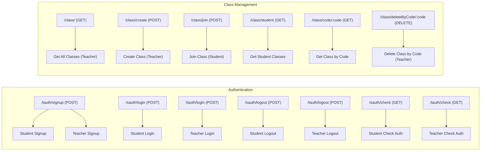
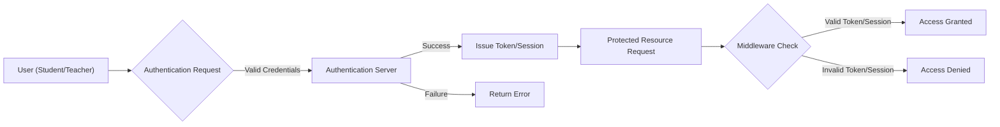

# API Endpoints

This document describes the REST API endpoints available on the Acgc server. The API is organized around resources representing authentication, classes, and user management.

## Authentication Endpoints

These endpoints handle user registration, login, logout, and session verification for both students and teachers.

### Student Authentication

The student authentication routes are located in `Server/src/routes/sauth.route.js`.

*   **`POST /signup`**: Registers a new student account.
    [View on GitHub](https://github.com/gsgit123/Acgc/blob/main/Server/src/routes/sauth.route.js)

    ```javascript
    router.post("/signup",signup)
    ```

    This route uses the `signup` controller function to create a new student user in the database. The request body should include necessary user details like username, password, and email.
*   **`POST /login`**: Logs in an existing student account.
    [View on GitHub](https://github.com/gsgit123/Acgc/blob/main/Server/src/routes/sauth.route.js)

    ```javascript
    router.post("/login",login)
    ```

    This route authenticates the student using provided credentials (usually username/email and password) through the `login` controller. On successful authentication, a session is created.
*   **`POST /logout`**: Logs out the current student session.
    [View on GitHub](https://github.com/gsgit123/Acgc/blob/main/Server/src/routes/sauth.route.js)

    ```javascript
    router.post("/logout",logout)
    ```

    The `logout` controller function invalidates the current session, effectively logging the student out.
*   **`GET /check`**: Checks the authentication status of the current student session.
    [View on GitHub](https://github.com/gsgit123/Acgc/blob/main/Server/src/routes/sauth.route.js)

    ```javascript
    router.get("/check",protectSRoute,checkAuth);
    ```

    This route, protected by the `protectSRoute` middleware, verifies if the student is currently authenticated. The `checkAuth` controller function returns user information if the session is valid.

### Teacher Authentication

The teacher authentication routes are located in `Server/src/routes/tauth.route.js`. These routes mirror the functionality of the student authentication routes but are tailored for teacher accounts.

*   **`POST /signup`**: Registers a new teacher account.
    [View on GitHub](https://github.com/gsgit123/Acgc/blob/main/Server/src/routes/tauth.route.js)

    ```javascript
    router.post("/signup",signup)
    ```

    Similar to the student signup, this creates a new teacher user via the `signup` controller.
*   **`POST /login`**: Logs in an existing teacher account.
    [View on GitHub](https://github.com/gsgit123/Acgc/blob/main/Server/src/routes/tauth.route.js)

    ```javascript
    router.post("/login",login)
    ```

    Authenticates a teacher using the provided credentials via the `login` controller.
*   **`POST /logout`**: Logs out the current teacher session.
    [View on GitHub](https://github.com/gsgit123/Acgc/blob/main/Server/src/routes/tauth.route.js)

    ```javascript
    router.post("/logout",logout)
    ```

    Invalidates the teacher's session using the `logout` controller.
*   **`GET /check`**: Checks the authentication status of the current teacher session.
    [View on GitHub](https://github.com/gsgit123/Acgc/blob/main/Server/src/routes/tauth.route.js)

    ```javascript
    router.get("/check",protectTRoute,checkAuth);
    ```

    Protected by `protectTRoute`, it uses `checkAuth` to verify the teacher's session.

## Class Management Endpoints

These endpoints, defined in `Server/src/routes/class.route.js`, allow teachers to create and manage classes, and students to join them.

*   **`GET /`**: Retrieves all classes (Teacher only).
    [View on GitHub](https://github.com/gsgit123/Acgc/blob/main/Server/src/routes/class.route.js)

    ```javascript
    router.get("/",protectTRoute,getClass)
    ```

    This endpoint, protected by `protectTRoute` middleware, fetches all available classes using the `getClass` controller function. Only teachers have access to this endpoint.
*   **`POST /create`**: Creates a new class (Teacher only).
    [View on GitHub](https://github.com/gsgit123/Acgc/blob/main/Server/src/routes/class.route.js)

    ```javascript
    router.post("/create",protectTRoute,createClass);
    ```

    Teachers can create new classes by sending a POST request to this endpoint. The `createClass` controller handles the creation logic. This route is protected by `protectTRoute` to ensure only authenticated teachers can create classes.
*   **`POST /join`**: Allows a student to join a class.
    [View on GitHub](https://github.com/gsgit123/Acgc/blob/main/Server/src/routes/class.route.js)

    ```javascript
    router.post("/join",protectSRoute,joinClass);
    ```

    Students use this endpoint to join a class using a class code. The `joinClass` controller handles adding the student to the class. This route is protected by `protectSRoute` to ensure only authenticated students can join classes.
*   **`GET /student`**: Retrieves classes a student is enrolled in.
    [View on GitHub](https://github.com/gsgit123/Acgc/blob/main/Server/src/routes/class.route.js)

    ```javascript
    router.get("/student", protectSRoute, getStudentClasses);
    ```

    This endpoint retrieves a list of classes that the currently logged-in student is enrolled in. The `getStudentClasses` controller handles fetching the relevant classes.
*   **`GET /code/:code`**: Retrieves a class by its code.
    [View on GitHub](https://github.com/gsgit123/Acgc/blob/main/Server/src/routes/class.route.js)

    ```javascript
    router.get('/code/:code',getClassByCode);
    ```

    This endpoint fetches class information based on the provided class code. The `getClassByCode` controller function handles the retrieval.
*   **`DELETE /deleteByCode/:code`**: Deletes a class by its code.
     [View on GitHub](https://github.com/gsgit123/Acgc/blob/main/Server/src/routes/class.route.js)

    ```javascript
    router.delete('/deleteByCode/:code', deleteClass)
    ```

    Teachers can delete a class using its unique code through this endpoint. The `deleteClass` controller function manages the deletion process.





## Key Integration Points

*   **Authentication Flow:** Both teachers and students have separate signup and login endpoints. The `protectSRoute` and `protectTRoute` middleware ensure that only authenticated users can access certain routes. The authentication status is checked using the `/check` endpoint, which is useful for maintaining session state on the client-side.
*   **Class Management Flow:** Teachers can create and manage classes using the `/create` and `/deleteByCode/:code` endpoints, while students can join classes using the `/join` endpoint. The `/student` endpoint allows students to retrieve a list of classes they are enrolled in. The `/code/:code` endpoint allows retrieval of class details by class code.
*   **Middleware Usage:**  The `protectSRoute` and `protectTRoute` middlewares are crucial for securing the API. They verify the user's authentication status before allowing access to sensitive endpoints. This prevents unauthorized access to class data and ensures that only teachers can create and manage classes.





These endpoints and their corresponding controllers and middleware form the core of the Acgc application's API. The use of separate authentication routes for teachers and students allows for fine-grained control over access to resources, while the class management endpoints provide the functionality for teachers to create and manage classes, and for students to join them.