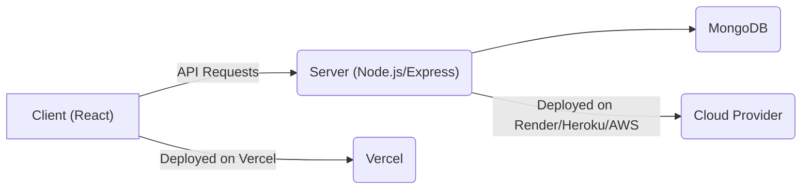

# Deployment and Configuration

This document explains how to deploy and configure the Acgc application for different environments. It covers the client-side (React) and server-side (Node.js/Express) setup, focusing on key configuration files and deployment strategies.

## Client-Side Deployment (React)

The client-side application is built with React and uses Vite as a build tool. Vercel is recommended for deployment due to its ease of integration and automatic deployments.

### Vercel Configuration

The `Client/vercel.json` file configures URL rewrites for the client-side application on Vercel. This ensures that all requests are routed to the root `index.html` file, allowing React Router to handle client-side routing.

```json title="Client/vercel.json"
{
  "rewrites": [
    { "source": "/(.*)", "destination": "/" }
  ]
}
```

[View on GitHub](https://github.com/gsgit123/Acgc/blob/main/Client/vercel.json)

### Client-Side Dependencies and Scripts

The `Client/package.json` file lists the dependencies and scripts required for the client-side application. Key dependencies include `react`, `react-dom`, `react-router-dom`, `axios`, and UI libraries like `lucide-react`, `framer-motion` and `daisyui`. The scripts define commands for development, building, linting, and previewing the application.

```json title="Client/package.json"
{
  "name": "client",
  "private": true,
  "version": "0.0.0",
  "type": "module",
  "scripts": {
    "dev": "vite",
    "build": "vite build",
    "lint": "eslint .",
    "preview": "vite preview"
  },
  "dependencies": {
    "axios": "^1.9.0",
    "framer-motion": "^12.18.1",
    "lucide-react": "^0.503.0",
    "react": "^18.3.1",
    "react-dom": "^18.3.1",
    "react-hot-toast": "^2.5.2",
    "react-router-dom": "^7.5.2",
    "recharts": "^2.15.3",
    "zustand": "^5.0.3"
  },
  "devDependencies": {
    "@eslint/js": "^9.17.0",
    "@types/react": "^18.3.17",
    "@types/react-dom": "^18.3.5",
    "@vitejs/plugin-react": "^4.3.4",
    "autoprefixer": "^10.4.21",
    "daisyui": "^5.0.28",
    "eslint": "^9.17.0",
    "eslint-plugin-react": "^7.37.2",
    "eslint-plugin-react-hooks": "^5.0.0",
    "eslint-plugin-react-refresh": "^0.4.16",
    "globals": "^15.13.0",
    "postcss": "^8.5.3",
    "tailwindcss": "^3.4.17",
    "vite": "^6.0.3"
  }
}
```

[View on GitHub](https://github.com/gsgit123/Acgc/blob/main/Client/package.json)

To deploy the client, run the following commands:

```bash
cd Client
npm install
npm run build
```

Then, deploy the `dist` folder to Vercel.

## Server-Side Deployment (Node.js/Express)

The server-side application is built with Node.js and Express. It uses MongoDB for data storage.

### Server-Side Dependencies and Scripts

The `Server/package.json` file lists the dependencies and scripts required for the server-side application. Key dependencies include `express`, `mongoose`, `cors`, `dotenv`, and `jsonwebtoken`. The scripts define commands for development (using `nodemon`) and production (using `node`).

```json title="Server/package.json"
{
  "name": "server",
  "version": "1.0.0",
  "description": "",
  "main": "index.js",
  "scripts": {
    "dev": "nodemon index.js",
    "start": "node index.js"
  },
  "keywords": [],
  "author": "",
  "license": "ISC",
  "type": "module",
  "dependencies": {
    "acgc": "file:..",
    "bcryptjs": "^3.0.2",
    "cookie-parser": "^1.4.7",
    "cors": "^2.8.5",
    "dotenv": "^16.5.0",
    "express": "^5.1.0",
    "jsonwebtoken": "^9.0.2",
    "mongoose": "^8.13.2",
    "path-to-regexp": "^8.2.0"
  },
  "devDependencies": {
    "nodemon": "^3.1.10"
  }
}
```

[View on GitHub](https://github.com/gsgit123/Acgc/blob/main/Server/package.json)

### Environment Variables

The server-side application uses environment variables for configuration. These variables should be set in a `.env` file or through the hosting environment. Example:

```plaintext title=".env (Example)"
PORT=5000
MONGODB_URI=mongodb://localhost:27017/acgc
JWT_SECRET=your-secret-key
```

To start the server:
```bash
cd Server
npm install
npm run dev # or npm start for production
```

### CORS Configuration
The server uses `cors` middleware to handle Cross-Origin Resource Sharing. Ensure that the `origin` option is configured correctly to allow requests from the client-side application.

```javascript title="Server/index.js (Example)"
import cors from 'cors';
const app = express();
app.use(cors({
  origin: 'http://localhost:5173', // Replace with your client's URL or '*' for any origin during development.  In production, be specific!
  credentials: true, // Important for sending cookies
}));
```

[View on GitHub](https://github.com/gsgit123/Acgc/blob/main/Server/index.js)

### Mongoose Configuration

The server uses Mongoose to connect to the MongoDB database. The connection URI should be configured in the `.env` file.

```javascript title="Server/index.js (Example)"
import mongoose from 'mongoose';
import dotenv from 'dotenv';

dotenv.config();

mongoose.connect(process.env.MONGODB_URI)
  .then(() => console.log('Connected to MongoDB'))
  .catch(err => console.error('MongoDB connection error:', err));
```

[View on GitHub](https://github.com/gsgit123/Acgc/blob/main/Server/index.js)

## Deployment Diagram





## Key Integration Points

*   **API Endpoint Configuration:** Ensure that the client-side application is configured to use the correct API endpoints for the server-side application.
*   **Authentication and Authorization:** Implement robust authentication and authorization mechanisms to protect sensitive data.
*   **Database Connection:** Configure the server-side application to connect to the MongoDB database using the correct credentials.
*   **CORS:** Configure CORS to allow cross-origin requests from the client-side application.

## Best Practices

*   **Use Environment Variables:** Store sensitive configuration information in environment variables.
*   **Secure API Endpoints:** Protect API endpoints with authentication and authorization.
*   **Monitor Application Performance:** Use monitoring tools to track application performance and identify potential issues.
*   **Regularly Update Dependencies:** Keep dependencies up-to-date to benefit from bug fixes and security patches.
```