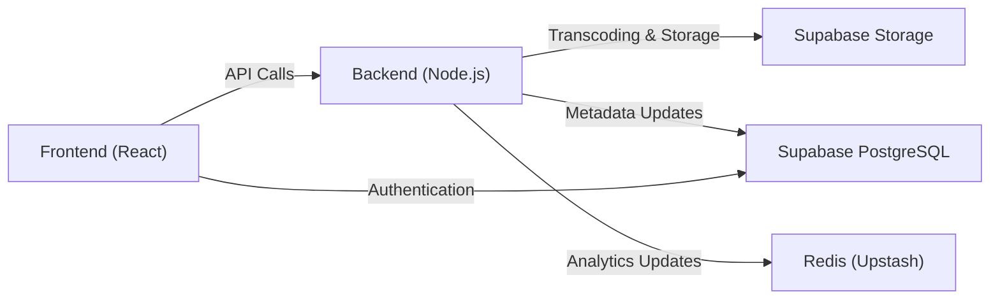
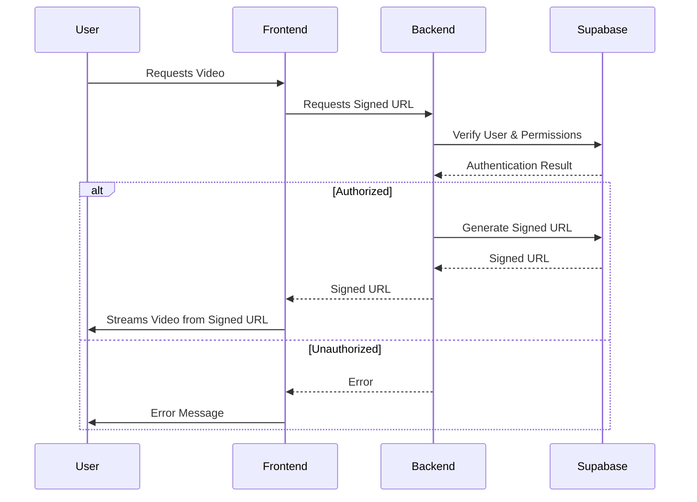

# System Overview

Privio is a comprehensive platform designed for securely uploading, transcoding, and streaming private video content. It integrates user authentication, automated transcoding, secure HLS streaming, advanced sharing, and real-time analytics. The application's architecture is decoupled, separating the frontend from the resource-intensive backend.

## Key Features

*   **Secure User Authentication:** Implemented using Google OAuth and Supabase Auth.
*   **Automated Transcoding Pipeline:** Videos are automatically transcoded to HLS with multiple resolutions upon upload using FFMpeg.
*   **Secure HLS Streaming:** Private video content is served via temporary, secure signed URLs, ensuring only authorized users can access the content.
*   **Advanced Sharing:** Enables the generation of expirable, user-specific share links for private videos.
*   **Real-Time Analytics:** Tracks viewer counts and last-viewed timestamps in real-time using Redis.

## Tech Stack

| Technology    | Description                                                              |
| :------------ | :----------------------------------------------------------------------- |
| Frontend      | Next.js (App Router), React, Tailwind CSS                                |
| Backend       | Node.js, Express, FFMpeg                                                |
| Database      | Supabase (PostgreSQL, Storage, Auth)                                     |
| Real-Time     | Redis (Upstash)                                                          |
| Deployment    | Vercel (Frontend), Render (Backend)                                     |

## Architecture Diagram





## Local Setup

The `README.md` provides instructions for setting up the Privio application locally:

```bash
git clone https://github.com/gsgit123/privio.git
cd privio
npm install
```

[View on GitHub](https://github.com/gsgit123/privio/blob/main/README.md)

This involves cloning the repository, installing dependencies, and setting up environment variables in a `.env.local` file.

## Environment Variables Setup

The `.env.local` file is crucial for configuring the application with the necessary credentials for Supabase, Render, and Upstash. This file is not committed to the repository for security reasons. An example of how to set up the Supabase URL and key:

```bash
NEXT_PUBLIC_SUPABASE_URL=YOUR_SUPABASE_URL
NEXT_PUBLIC_SUPABASE_ANON_KEY=YOUR_SUPABASE_ANON_KEY
```

[View on GitHub](https://github.com/gsgit123/privio/blob/main/README.md)

## Next.js Image Configuration

The `next.config.ts` file configures the Next.js application, including allowed image domains for optimized image delivery. This is important for loading images from Supabase storage.

```typescript
/** @type {import('next').NextConfig} */
const nextConfig = {
  images: {
    remotePatterns: [
      {
        protocol: "https",
        hostname: "buwnkiickwuswzqdirrn.supabase.co",
        pathname: "/storage/v1/object/public/**",
      },
    ],
  },
};

module.exports = nextConfig;
```

[View on GitHub](https://github.com/gsgit123/privio/blob/main/next.config.ts)

This configuration allows images from the specified Supabase storage URL to be optimized and served by Next.js.

## Package Dependencies

The `package.json` file lists the project's dependencies and scripts. Key dependencies include Next.js, React, Supabase libraries, and Upstash Redis.

```json
{
  "name": "privio",
  "version": "0.1.0",
  "private": true,
  "scripts": {
    "dev": "next dev --turbopack",
    "build": "next build --turbopack",
    "start": "next start",
    "lint": "eslint"
  },
  "dependencies": {
    "@supabase/auth-helpers-nextjs": "^0.10.0",
    "@supabase/ssr": "^0.7.0",
    "@supabase/supabase-js": "^2.57.0",
    "@upstash/redis": "^1.35.3",
    "hls.js": "^1.6.11",
    "ioredis": "^5.7.0",
    "lucide-react": "^0.544.0",
    "next": "15.5.0",
    "react": "19.1.0",
    "react-dom": "19.1.0",
    "react-tsparticles": "^2.12.2",
    "swr": "^2.3.6",
    "tsparticles-slim": "^2.12.0",
    "uuid": "^11.1.0"
  },
  "devDependencies": {
    "@eslint/eslintrc": "^3",
    "@tailwindcss/postcss": "^4",
    "@types/node": "^20",
    "@types/react": "^19",
    "@types/react-dom": "^19",
    "eslint": "^9",
    "eslint-config-next": "15.5.0",
    "tailwindcss": "^4",
    "typescript": "^5"
  }
}
```

[View on GitHub](https://github.com/gsgit123/privio/blob/main/package.json)

The scripts define common tasks such as development, building, starting, and linting the application.

## Real-time Analytics with Redis

Privio utilizes Upstash Redis for real-time analytics, tracking viewer counts and last-viewed timestamps. An example of how you might increment a view count with Redis using the `@upstash/redis` package:

```typescript
import { Redis } from "@upstash/redis";

const redis = new Redis({
  url: process.env.UPSTASH_REDIS_REST_URL || "",
  token: process.env.UPSTASH_REDIS_REST_TOKEN || "",
});

async function incrementViewCount(videoId: string) {
  await redis.incr(`video:${videoId}:views`);
}
```

This snippet demonstrates incrementing a view count for a specific video using the Redis `incr` command.

## Secure HLS Streaming Flow





## Key Integration Points

*   **Supabase Integration:** Supabase is used for authentication, database storage (PostgreSQL), and object storage. The `@supabase/supabase-js` library is used for interacting with Supabase services. Best practices include implementing row-level security (RLS) policies to ensure data privacy and security.
*   **Upstash Redis Integration:** Upstash Redis is used for real-time analytics.  The `@upstash/redis` library provides a simple interface for interacting with Redis.  Consider using Redis Streams for more complex analytics use cases.
*   **FFmpeg Transcoding:** FFmpeg handles the video transcoding process. Ensure the backend environment has FFmpeg installed and configured correctly. Consider using a dedicated transcoding service for production deployments.
*   **HLS.js:** The frontend utilizes `hls.js` to handle the playback of HLS streams, ensuring compatibility across different browsers and devices.

## Authentication Flow

The application uses Google OAuth for user authentication, managed by Supabase Auth. Here’s an example of how you might sign in with Google using the `@supabase/auth-helpers-nextjs` library:

```typescript
import { useSupabaseClient } from '@supabase/auth-helpers-react'

const LoginPage = () => {
  const supabase = useSupabaseClient()

  const handleSignIn = async () => {
    await supabase.auth.signInWithOAuth({
      provider: 'google',
    })
  }

  return (
    <button onClick={handleSignIn}>
      Sign in with Google
    </button>
  )
}

export default LoginPage
```

This code snippet shows how to initiate the Google OAuth flow using Supabase Auth. The `useSupabaseClient` hook provides access to the Supabase client, which is used to call the `signInWithOAuth` method.

## Secure Signed URL Generation

The backend is responsible for generating secure, temporary signed URLs for accessing private video content stored in Supabase Storage. This ensures that only authorized users with a valid signed URL can stream the video.  Here's a conceptual example (implementation details may vary):

```javascript
// Backend (Node.js)
import { createClient } from '@supabase/supabase-js';

const supabase = createClient(process.env.NEXT_PUBLIC_SUPABASE_URL, process.env.NEXT_PUBLIC_SUPABASE_ANON_KEY);

async function generateSignedUrl(bucket: string, path: string, expiry: number = 60) { // expiry in seconds
  const { data, error } = await supabase.storage
    .from(bucket)
    .createSignedUrl(path, expiry);

  if (error) {
    console.error("Error creating signed URL:", error);
    return null;
  }

  return data.signedUrl;
}
```

This function creates a signed URL with a specified expiry time, providing secure access to the video file.
```