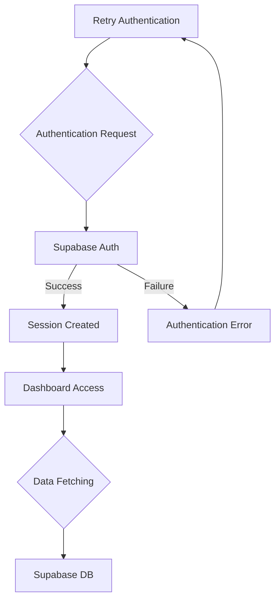
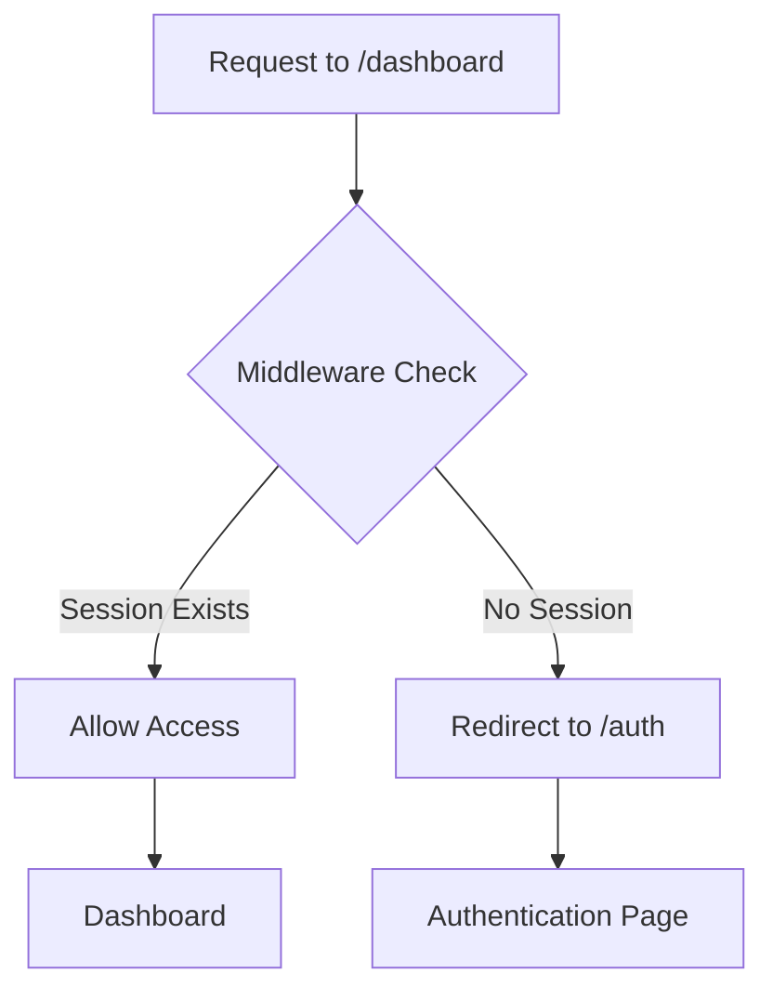

# Authentication and Authorization

This document details the authentication and authorization mechanisms used within the Privio application. Privio uses Supabase for authentication and implements middleware to protect routes, ensuring only authenticated users can access certain parts of the application.

## Authentication Flow

Privio utilizes Supabase's authentication system, providing a secure and straightforward way for users to sign in and manage their accounts.

- **Sign-in/Sign-up:** Users can sign in or sign up via Supabase's pre-built UI components, or through custom implementations using Supabase's client libraries.
- **Session Management:** Upon successful authentication, Supabase manages user sessions using cookies.
- **Route Protection:** Middleware is implemented to protect specific routes, redirecting unauthenticated users to the authentication page.

## Authorization Mechanisms

Authorization in Privio is primarily role-based, with distinctions between authenticated users and unauthenticated visitors. The application's middleware verifies user sessions before granting access to protected routes.

## Key Components

- `auth/callback/page.tsx`: Handles the dashboard and video library logic, requiring user authentication.
- `lib/middleware.ts`: Implements route protection, checking for a valid user session before allowing access to the dashboard.
- `lib/server.ts`: Provides a server-side Supabase client for secure data fetching.

## Code Snippets

### 1. Dashboard Component (`auth/callback/page.tsx`)

```typescript filename="auth/callback/page.tsx"
"use client";

import { supabase } from "@/lib/client";
import { useEffect, useState } from "react";
import { useRouter } from "next/navigation";
import Link from "next/link";
import { type User } from "@supabase/supabase-js";

export default function Dashboard() {
  const router = useRouter();
  const [user, setUser] = useState<User | null>(null);

  useEffect(() => {
    const getUserAndVideos = async () => {
      const { data: { user } } = await supabase.auth.getUser();
      if (!user) {
        router.push("/");
      } else {
        setUser(user);
      }
    };
    getUserAndVideos();
  }, [router]);

  // ... rest of the component
}
```

This snippet from the `Dashboard` component demonstrates how the application checks for a user session. It uses `supabase.auth.getUser()` to retrieve the current user. If no user is found, the user is redirected to the `/auth` page.

[View on GitHub](https://github.com/gsgit123/privio/blob/main/auth/callback/page.tsx)

### 2. Middleware for Route Protection (`lib/middleware.ts`)

```typescript filename="lib/middleware.ts"
// middleware.ts
import { NextResponse } from "next/server";
import type { NextRequest } from "next/server";
import { createServerClient } from "@supabase/ssr";

export async function middleware(req: NextRequest) {
  const res = NextResponse.next();

  const supabase = createServerClient(
    process.env.NEXT_PUBLIC_SUPABASE_URL!,
    process.env.NEXT_PUBLIC_SUPABASE_ANON_KEY!,
    {
      cookies: {
        get(name) {
          return req.cookies.get(name)?.value;
        },
        set(name, value, options) {
          res.cookies.set({ name, value, ...options });
        },
        remove(name, options) {
          res.cookies.set({ name, value: "", ...options });
        },
      },
    }
  );

  const {
    data: { session },
  } = await supabase.auth.getSession();

  // Protect /dashboard route
  if (req.nextUrl.pathname.startsWith("/dashboard") && !session) {
    return NextResponse.redirect(new URL("/auth", req.url));
  }

  return res;
}
export const config = {
  matcher: [
    '/dashboard', // Protects the main dashboard page
    '/dashboard/:path*', // Protects all sub-pages
  ],
};
```

This code snippet shows the middleware implementation that protects the `/dashboard` route. It creates a Supabase server client to get the session and checks if the session exists. If not, it redirects the user to the `/auth` page.

[View on GitHub](https://github.com/gsgit123/privio/blob/main/lib/middleware.ts)

### 3. Server-Side Supabase Client (`lib/server.ts`)

```typescript filename="lib/server.ts"
// lib/server.ts
import { createServerClient } from "@supabase/ssr";
import { cookies } from "next/headers";

export const supabaseServer = async() => {
  const cookieStore = await cookies();

  return createServerClient(
    process.env.NEXT_PUBLIC_SUPABASE_URL!,
    process.env.NEXT_PUBLIC_SUPABASE_ANON_KEY!,
    {
      cookies: {
        get(name: string) {
          return cookieStore.get(name)?.value;
        },
      },
    }
  );
};
```

This code defines a server-side Supabase client, `supabaseServer`, which is used to interact with the Supabase database in a secure environment.  It retrieves cookies from the `next/headers` API to maintain session context.

[View on GitHub](https://github.com/gsgit123/privio/blob/main/lib/server.ts)

### 4. Fetching User Videos (`auth/callback/page.tsx`)

```typescript filename="auth/callback/page.tsx"
useEffect(() => {
  const getUserAndVideos = async () => {
    const { data: { user } } = await supabase.auth.getUser();
    if (!user) {
      router.push("/");
    } else {
      setUser(user);
      const { data: userVideos, error } = await supabase
        .from("videos")
        .select("id, title, status, thumbnail_path")
        .eq("uploader", user.id)
        .order("created_at", { ascending: false });

      if (error) {
        console.error("Error fetching videos:", error);
      } else if (userVideos) {
        setVideos(userVideos);
      }
      setLoading(false);
    }
  };
  getUserAndVideos();
}, [router]);
```

This snippet demonstrates how user-specific videos are fetched from the Supabase database. The `uploader` field in the `videos` table is matched against the user's ID to retrieve only the videos uploaded by the current user.

[View on GitHub](https://github.com/gsgit123/privio/blob/main/auth/callback/page.tsx)

### 5. Sign Out Functionality (`auth/callback/page.tsx`)

```typescript filename="auth/callback/page.tsx"
const signOut = async () => {
  await supabase.auth.signOut();
  router.push("/");
  router.refresh();
};
```

The `signOut` function handles the user's sign-out process. It calls `supabase.auth.signOut()` to clear the user's session and then redirects them to the home page.  `router.refresh()` is called to revalidate the server components.

[View on GitHub](https://github.com/gsgit123/privio/blob/main/auth/callback/page.tsx)

### 6. Get Thumbnail URL Function (`auth/callback/page.tsx`)

```typescript filename="auth/callback/page.tsx"
const getThumbnailUrl = (path: string | null) => {
  if (!path) return null;
  const { data } = supabase.storage.from('thumbnails').getPublicUrl(path);
  return data.publicUrl;
};
```

This function retrieves the public URL for a video thumbnail stored in Supabase storage. It takes the path to the thumbnail and uses `supabase.storage.from('thumbnails').getPublicUrl(path)` to generate a publicly accessible URL.

[View on GitHub](https://github.com/gsgit123/privio/blob/main/auth/callback/page.tsx)

## Authentication Flow Diagram





This diagram illustrates the authentication flow in Privio. The user initiates an authentication request, which is handled by Supabase Auth. Upon successful authentication, a session is created, allowing the user to access the dashboard and fetch data.

## Authorization Process Diagram





This diagram visualizes the authorization process implemented in the middleware. When a user attempts to access the `/dashboard` route, the middleware checks for an existing session. If a session exists, access is granted; otherwise, the user is redirected to the authentication page.

## Key Integration Points

- **Supabase Authentication:** Privio relies heavily on Supabase for user authentication and session management.
- **Middleware Protection:** The middleware ensures that only authenticated users can access protected routes, enhancing security.
- **Server-Side Data Fetching:** The server-side Supabase client allows for secure data fetching, minimizing the risk of exposing sensitive information to the client.

By implementing these authentication and authorization mechanisms, Privio ensures a secure and user-friendly experience.
```