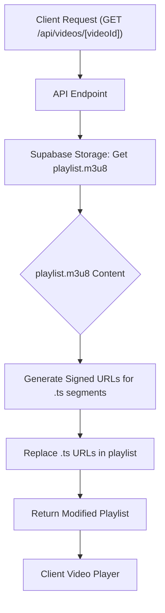
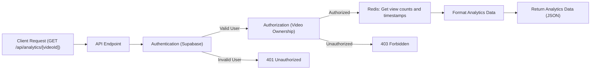

# API Endpoints

This document describes the API endpoints and their functionalities within the privio application, focusing on video management and analytics. These endpoints are designed to handle video uploads, retrieval, and view tracking, enabling a comprehensive video platform experience.

## Video Upload (/app/api/upload/route.ts)

The `/api/upload` endpoint handles the uploading of video files. It receives the video file, title, description, and user ID via a `POST` request.  Upon successful upload to Supabase storage, the endpoint triggers a transcoding service to process the video for optimal streaming.

```typescript
// File: app/api/upload/route.ts
import { NextResponse } from "next/server";
import { createClient } from "@supabase/supabase-js";
import { v4 as uuidv4 } from "uuid";

const supabase = createClient(
    process.env.NEXT_PUBLIC_SUPABASE_URL!,
    process.env.SUPABASE_SERVICE_ROLE_KEY!
);

export async function POST(req: Request) {
    try {
        const formData = await req.formData();
        const file = formData.get("file") as File;
        const title = formData.get("title") as string;
        const description = formData.get("description") as string;
        const userId = formData.get("userId") as string;

        if (!file) {
            return NextResponse.json({ error: "No file provided" }, { status: 400 });
        }
        const videoId = uuidv4();
        const filePath = `${videoId}.mp4`;

        const { error: uploadError } = await supabase.storage.from("raw_uploads").upload(filePath, file, {
            cacheControl: "3600",
            upsert: false
        })
        if (uploadError) {
            console.error("Upload error:", uploadError.message);
            return NextResponse.json({ error: "Failed to upload file" }, { status: 500 });
        }

        const { error: dbError } = await supabase.from("videos").insert([
            {
                id: videoId,
                title,
                description,
                uploader: userId,
                status: "uploaded",
                raw_path:filePath,
            }
        ]);
        if (dbError) {
            console.error("DB error:", dbError.message);
            return NextResponse.json({ error: "Failed to save video metadata" }, { status: 500 });
        }

        fetch(process.env.RENDER_TRANSCODE_URL!, {
            method: 'POST',
            headers: {
                'Content-Type': 'application/json',
            },
            body: JSON.stringify({ videoId: videoId }),
        }).catch(error => {
            console.error('Failed to trigger transcoding service:', error);
        });
        return NextResponse.json({ message: "Upload successful", videoId }, { status: 200 });

    } catch (e: unknown) {
    if (e instanceof Error) {
        console.log(e.message);
        return NextResponse.json({ error: e.message }, { status: 500 });
    }
    return NextResponse.json({ error: 'An unknown error occurred' }, { status: 500 });
}
}
```

[View on GitHub](https://github.com/gsgit123/privio/blob/main/app/api/upload/route.ts)

Key aspects:

-   **Supabase Integration:**  Utilizes Supabase storage for storing the raw video file and Supabase database for storing video metadata.
-   **UUID Generation:** Uses `uuidv4()` to generate a unique video ID, ensuring no conflicts in storage or database.
-   **Error Handling:** Robust error handling to catch upload and database insertion errors, returning appropriate HTTP status codes.
-   **Transcoding Trigger:** Triggers an external transcoding service to process the uploaded video into different resolutions and formats for optimal playback.

## Video Streaming (/app/api/videos/[videoId]/route.ts)

The `/api/videos/[videoId]` endpoint is responsible for serving the video playlist.  It retrieves the manifest file (playlist.m3u8) and generates signed URLs for the video segments (.ts files), allowing secure streaming.

```typescript
// File: app/api/videos/[videoId]/route.ts
import { NextResponse, NextRequest } from "next/server";
import { createClient } from "@supabase/supabase-js";

export const dynamic = 'force-dynamic';

// Initialize Supabase admin client
const supaBaseAdmin = createClient(
  process.env.NEXT_PUBLIC_SUPABASE_URL!,
  process.env.SUPABASE_SERVICE_ROLE_KEY!
);

// eslint-disable-next-line @typescript-eslint/no-explicit-any
export async function GET(req: NextRequest, context: any) {
  // Cast params at runtime
  const { videoId } = context.params as { videoId: string };

  if (!videoId) {
    return new NextResponse('Missing videoId', { status: 400 });
  }

  const bucketName = 'hls';
  const folderPath = `${videoId}`;
  const manifestPath = `${folderPath}/playlist.m3u8`;

  const { data: playlistData, error: playlistError } = await supaBaseAdmin
    .storage
    .from(bucketName)
    .download(manifestPath);

  if (playlistError || !playlistData) {
    console.error("Error downloading playlist:", playlistError);
    return new NextResponse('Failed to download playlist', { status: 404 });
  }

  let playlistText = await playlistData.text();
  const tsFileNames = playlistText.split('\n').filter((line) => line.endsWith('.ts'));
  const tsFilePaths = tsFileNames.map(name => `${folderPath}/${name}`);

  if (tsFileNames.length === 0) {
    console.error("No .ts files found in playlist");
    return new NextResponse('No .ts files found in playlist', { status: 404 });
  }

  const { data: signedUrlsData, error: signError } = await supaBaseAdmin
    .storage
    .from(bucketName)
    .createSignedUrls(tsFilePaths, 3600);

  if (signError || !signedUrlsData) {
    console.error('Error signing URLs:', signError);
    return new NextResponse('Could not sign segment URLs', { status: 500 });
  }

  // Replace .ts filenames in playlist with signed URLs
  for (const signedUrl of signedUrlsData) {
    if(!signedUrl.path)continue;
    const fileName = signedUrl.path.split('/').pop();
    if (fileName) {
      playlistText = playlistText.replace(fileName, signedUrl.signedUrl);
    }
  }

  return new NextResponse(playlistText, {
    status: 200,
    headers: {
      'Content-Type': 'application/vnd.apple.mpegurl'
    }
  });
}
```

[View on GitHub](https://github.com/gsgit123/privio/blob/main/app/api/videos/%5BvideoId%5D/route.ts)

Key aspects:

-   **Dynamic Route:**  Uses a dynamic route parameter `[videoId]` to identify the requested video.
-   **HLS Streaming:**  Downloads the `playlist.m3u8` manifest file from Supabase storage, which describes the video segments.
-   **Signed URLs:** Generates signed URLs for each `.ts` video segment using Supabase storage's `createSignedUrls` function, providing temporary access to the video content.
-   **Playlist Manipulation:**  Replaces the original `.ts` file names in the playlist with the signed URLs, ensuring secure streaming.





## View Tracking (/app/api/views/route.ts)

The `/api/views` endpoint tracks video views.  On a `POST` request, it increments the view count for a specified video by leveraging Upstash Redis to store view data associated with the user.

```typescript
// File: app/api/views/route.ts
import { NextResponse } from 'next/server';
import { createClient } from '@supabase/supabase-js';
import { Redis } from '@upstash/redis';

export const dynamic = 'force-dynamic';

const redis = new Redis({
  url: process.env.UPSTASH_REDIS_REST_URL!,
  token: process.env.UPSTASH_REDIS_REST_TOKEN!,
});


export async function POST(req:Request){
    const {videoId}=await req.json();


    const authHeader = req.headers.get('Authorization');
    const accessToken = authHeader?.split(' ')[1];

    if (!accessToken) {
        return new NextResponse('Unauthorized', { status: 401 });
    }

    const supabase = createClient(
        process.env.NEXT_PUBLIC_SUPABASE_URL!,
        process.env.NEXT_PUBLIC_SUPABASE_ANON_KEY!
    );

    const { data: { user } } = await supabase.auth.getUser(accessToken);
    if (!user) {
        return new NextResponse('Unauthorized', { status: 401 });
    }

    if (!videoId) {
        return new NextResponse('videoId is required', { status: 400 });
    }

    console.log(user);

    const timestamp = Date.now();

    const userViewCountKey=`views:count:${videoId}`;
    const lastViewTimestampKey =`views:lastView:${videoId}`;

    const multi =redis.multi();
    multi.hincrby(userViewCountKey, user.email!, 1);
    multi.zadd(lastViewTimestampKey, { score: timestamp, member: user.email! })
    await multi.exec();


    return NextResponse.json({ success:true,message: 'View count incremented' });

    
}
```

[View on GitHub](https://github.com/gsgit123/privio/blob/main/app/api/views/route.ts)

Key aspects:

-   **Authentication:** Verifies user authenticity using the access token provided in the `Authorization` header.
-   **Upstash Redis Integration:** Uses Upstash Redis for fast and efficient view counting and storing the timestamp of the last view.
-   **Atomic Operations:**  Utilizes Redis's `multi` command to perform atomic increment and update operations.
-   **User Identification:** Uses the user's email to track views per user.

```plaintext
UPSTASH_REDIS_REST_URL=YOUR_UPSTASH_REDIS_REST_URL
UPSTASH_REDIS_REST_TOKEN=YOUR_UPSTASH_REDIS_REST_TOKEN
```

## Analytics (/app/api/analytics/[videoId]/route.ts)

The `/api/analytics/[videoId]` endpoint provides video analytics data. It fetches view counts and last viewed timestamps from Upstash Redis and formats the data for analysis. It requires authentication and authorization to ensure that only the video uploader can access the analytics data.

```typescript
// File: app/api/analytics/[videoId]/route.ts
import { NextRequest, NextResponse } from "next/server";
import { createClient } from "@supabase/supabase-js";
import { Redis } from "@upstash/redis";

export const dynamic = "force-dynamic";

const redis = new Redis({
  url: process.env.UPSTASH_REDIS_REST_URL!,
  token: process.env.UPSTASH_REDIS_REST_TOKEN!,
});

// eslint-disable-next-line @typescript-eslint/no-explicit-any
export async function GET(req: NextRequest, context: any) {
  // cast params to the expected type
  const { videoId } = context.params as { videoId: string };

  const authHeader = req.headers.get("Authorization");
  const accessToken = authHeader?.split(" ")[1];
  if (!accessToken) return new NextResponse("Unauthorized", { status: 401 });

  const supabase = createClient(
    process.env.NEXT_PUBLIC_SUPABASE_URL!,
    process.env.NEXT_PUBLIC_SUPABASE_ANON_KEY!,
    {
      global: {
        headers: { Authorization: `Bearer ${accessToken}` },
      },
    }
  );

  const { data: { user } } = await supabase.auth.getUser(accessToken);
  if (!user) return new NextResponse("Unauthorized", { status: 401 });

  const { data: video } = await supabase
    .from("videos")
    .select("id")
    .eq("id", videoId)
    .eq("uploader", user.id)
    .single();

  if (!video) return new NextResponse("Forbidden", { status: 403 });

  const userViewCountKey = `views:count:${videoId}`;
  const lastViewTimestampKey = `views:lastView:${videoId}`;

  const userViewCounts = await redis.hgetall(userViewCountKey);

  const analyticsData: { viewer: string; totalViews: number; lastViewed: string }[] = [];

  if (userViewCounts) {
    for (const [email, count] of Object.entries(userViewCounts)) {
      const lastViewScore = await redis.zscore(lastViewTimestampKey, email);
      analyticsData.push({
        viewer: email,
        totalViews: Number(count),
        lastViewed: lastViewScore ? new Date(Number(lastViewScore)).toLocaleString() : "N/A",
      });
    }
  }

  analyticsData.sort(
    (a, b) => new Date(b.lastViewed).getTime() - new Date(a.lastViewed).getTime()
  );

  return NextResponse.json({ analytics: analyticsData });
}
```

[View on GitHub](https://github.com/gsgit123/privio/blob/main/app/api/analytics/%5BvideoId%5D/route.ts)

Key aspects:

-   **Authentication and Authorization:** Requires a valid access token for authentication and checks if the user is the uploader of the video for authorization.
-   **Redis Data Aggregation:** Retrieves view counts and last viewed timestamps from Upstash Redis using hash (`hgetall`) and sorted set (`zscore`) operations.
-   **Data Formatting:** Formats the raw Redis data into a structured analytics data object for easy consumption.
-   **Sorting:** Sorts the analytics data by the last viewed timestamp to display the most recent viewers first.





## Key Integration Points

-   **Supabase:** Supabase is used for authentication, database storage (video metadata), and object storage (raw videos and HLS segments). This tightly integrates with Next.js API routes, providing a scalable backend.
-   **Upstash Redis:**  Upstash Redis provides a low-latency, serverless database for storing video view counts and last viewed timestamps, which are critical for real-time analytics.
-   **HLS Streaming:**  The application utilizes HTTP Live Streaming (HLS) to deliver video content, enabling adaptive bitrate streaming for various devices and network conditions.
-   **Transcoding Service:**  An external transcoding service converts uploaded videos into HLS format, generating the necessary `.m3u8` and `.ts` files for streaming.

### Best Practices

-   **Environment Variables:** Store sensitive information like API keys and database credentials in environment variables. This enhances security and makes it easier to manage different environments (development, staging, production).
-   **Authentication and Authorization:**  Implement robust authentication and authorization mechanisms to protect API endpoints and ensure that only authorized users can access sensitive data.
-   **Error Handling:** Implement comprehensive error handling to gracefully handle exceptions and provide informative error messages to the client.
-   **Asynchronous Operations:**  Use asynchronous operations (async/await) to prevent blocking the main thread and ensure that the application remains responsive.
-   **Data Validation:**  Validate user input to prevent data inconsistencies and potential security vulnerabilities.
```